### Run OpenSearch with SQL Plugin via Gradle

Source: https://github.com/opensearch-project/sql/blob/main/DEVELOPER_GUIDE.rst

Provides a Gradle command to quickly start an OpenSearch instance with the SQL plugin installed, useful for rapid testing without full manual setup.

```sh
./gradlew :opensearch-sql-plugin:run
```

--------------------------------

### Example OpenSearch Development Workspace Layout

Source: https://github.com/opensearch-project/sql/blob/main/DEVELOPER_GUIDE.rst

Demonstrates a typical directory structure after setting up OpenSearch, OpenSearch Dashboards, and the SQL plugin source code, showing the relative paths of the components.

```sh
mkdir opensearch
cd opensearch
ls -la
total 32
drwxr-xr-x  7 user group^users 4096 Nov 21 12:59 .
drwxr-xr-x 19 user group^users 4096 Nov 21 09:44 ..
drwxr-xr-x 10 user group^users 4096 Nov  8 12:16 opensearch
drwxr-xr-x 14 user group^users 4096 Nov  8 12:14 opensearch-dashboards
drwxr-xr-x 16 user group^users 4096 Nov 15 10:59 sql
```

--------------------------------

### Verify Java Development Kit (JDK) Installation

Source: https://github.com/opensearch-project/sql/blob/main/DEVELOPER_GUIDE.rst

Demonstrates how to check the JAVA_HOME environment variable and the installed Java version from the command line to ensure compatibility with OpenSearch build requirements (JDK 11, 14, or 17).

```sh
echo $JAVA_HOME
/Library/Java/JavaVirtualMachines/adoptopenjdk-11.jdk/Contents/Home

java -version
openjdk version "11.0.1" 2018-10-16
OpenJDK Runtime Environment 18.9 (build 11.0.1+13)
OpenJDK 64-Bit Server VM 18.9 (build 11.0.1+13, mixed mode)
```

--------------------------------

### Sample OpenSearch SQL Integration Test Class

Source: https://github.com/opensearch-project/sql/blob/main/DEVELOPER_GUIDE.rst

A Java code example demonstrating a basic integration test class for the OpenSearch SQL project. It shows how to extend `SQLIntegTestCase`, initialize by loading a predefined test index, and execute a SQL query against it with an assertion.

```Java
public class XXXIT extends SQLIntegTestCase {
   
       @Override
       protected void init() throws Exception {
           loadIndex(Index.ACCOUNT);
       }
   
       @Override
       public void testXXX() {
           JSONObject response = executeQuery("SELECT ...");
           Assert.assertEquals(6, getTotalHits(response));
       }
   }
```

--------------------------------

### Basic Usage Examples for OpenSearch PPL Lookup Command

Source: https://github.com/opensearch-project/sql/blob/main/docs/user/ppl/cmd/lookup.rst

Provides several examples demonstrating the basic usage of the `LOOKUP` command in OpenSearch PPL. These examples show how to perform lookups with single or multiple mapping fields, use aliases for source mapping fields, and apply `REPLACE` or `APPEND` strategies with specific output fields.

```PPL
source = table1 | lookup table2 id
source = table1 | lookup table2 id, name
source = table1 | lookup table2 id as cid, name
source = table1 | lookup table2 id as cid, name replace dept as department
source = table1 | lookup table2 id as cid, name replace dept as department, city as location
source = table1 | lookup table2 id as cid, name append dept as department
source = table1 | lookup table2 id as cid, name append dept as department, city as location
```

--------------------------------

### Sample OpenSearch SQL Reference Manual Doc Test

Source: https://github.com/opensearch-project/sql/blob/main/DEVELOPER_GUIDE.rst

A Java code snippet illustrating a test class used for generating reference manual documentation. It demonstrates the use of `@DocTestConfig` to link to a template and test data, and `@Section` to define documentation sections with titles, descriptions, and examples.

```Java
@DocTestConfig(template = "interfaces/protocol.rst", testData = {"accounts.json"})
public class ProtocolIT extends DocTest {
   
       @Section(1)
       public void test() {
           section(
               title("A New Section"),
               description(
                   "Describe what is the use of new functionality."
               ),
               example(
```

--------------------------------

### Calcite Logical and Physical Plan Example

Source: https://github.com/opensearch-project/sql/blob/main/docs/user/ppl/cmd/explain.rst

An example of Calcite's logical and physical execution plans, illustrating the query optimization steps and data processing flow within OpenSearch SQL for a specific query.

```Calcite Logical Plan
LogicalAggregate(group=[{1}], count()=[COUNT()]): rowcount = 2.5, cumulative cost = {127.8125 rows, 201.0 cpu, 0.0 io}, id = 74
        LogicalFilter(condition=[SEARCH($1, Sarg['England', 'USA':CHAR(7)]:CHAR(7))]): rowcount = 25.0, cumulative cost = {125.0 rows, 201.0 cpu, 0.0 io}, id = 73
          CalciteLogicalIndexScan(table=[[OpenSearch, state_country]]): rowcount = 100.0, cumulative cost = {100.0 rows, 101.0 cpu, 0.0 io}, id = 72
```

```Calcite Physical Plan
EnumerableCalc(expr#0..1=[{inputs}], count()=[$t1], country=[$t0]): rowcount = 100.0, cumulative cost = {200.0 rows, 501.0 cpu, 0.0 io}, id = 138
      CalciteEnumerableIndexScan(table=[[OpenSearch, state_country]], PushDownContext=[[FILTER->SEARCH($1, Sarg['England', 'USA':CHAR(7)]:CHAR(7)), AGGREGATION->rel#125:LogicalAggregate.NONE.[](input=RelSubset#115,group={1},count()=COUNT())], OpenSearchRequestBuilder(sourceBuilder={\"from\":0,\"size\":0,\"timeout\":\"1m\",\"query\":{\"terms\":{\"country\":[\"England\",\"USA\"],\"boost\":1.0}},\"sort\":[{\"_doc\":{\"order\":\"asc\"}}],\"aggregations\":{\"composite_buckets\":{\"composite\":{\"size\":1000,\"sources\":[{\"country\":{\"terms\":{\"field\":\"country\",\"missing_bucket\":true,\"missing_order\":\"first\",\"order\":\"asc\"}}}]}},\"aggregations\":{\"count()\":{\"value_count\":{\"field\":\"_index\"}}}}}}, requestedTotalSize=2147483647, pageSize=null, startFrom=0)]): rowcount = 100.0, cumulative cost = {100.0 rows, 101.0 cpu, 0.0 io}, id = 133
```

--------------------------------

### Sample S3Glue DataSource Configurations

Source: https://github.com/opensearch-project/sql/blob/main/docs/user/ppl/admin/connectors/s3glue_connector.rst

Examples demonstrating how to configure an S3Glue data source, showing setups for basic authentication and AWS SigV4 authentication with OpenSearch as the index store. These configurations define the connector's name, type, properties, and result index.

```JSON
[
    {
        "name" : "my_glue",
        "connector": "s3glue",
        "properties" : {
                "glue.auth.type": "iam_role",
                "glue.auth.role_arn": "role_arn",
                "glue.indexstore.opensearch.uri": "http://localhost:9200",
                "glue.indexstore.opensearch.auth" :"basicauth",
                "glue.indexstore.opensearch.auth.username" :"username",
                "glue.indexstore.opensearch.auth.password" :"password"
        },
        "resultIndex": "query_execution_result"
    }
]
```

```JSON
[
    {
        "name" : "my_glue",
        "connector": "s3glue",
        "properties" : {
                "glue.auth.type": "iam_role",
                "glue.auth.role_arn": "role_arn",
                "glue.indexstore.opensearch.uri": "http://adsasdf.amazonopensearch.com:9200",
                "glue.indexstore.opensearch.auth" :"awssigv4",
                "glue.indexstore.opensearch.auth.region" :"us-east-1"
        },
        "resultIndex": "query_execution_result"
    }
]
```

--------------------------------

### PPL Example: Fetch All Index Metadata

Source: https://github.com/opensearch-project/sql/blob/main/docs/user/ppl/cmd/describe.rst

Demonstrates how to use the `describe` command to fetch all metadata for the 'accounts' index in OpenSearch PPL, showing the command and its detailed tabular output.

```PPL
os> describe accounts;
fetched rows / total rows = 11/11
+----------------+-------------+------------+----------------+-----------+-----------+-------------+---------------+----------------+----------------+----------+---------+------------+---------------+------------------+-------------------+------------------+-------------+---------------+--------------+-------------+------------------+------------------+--------------------+
| TABLE_CAT      | TABLE_SCHEM | TABLE_NAME | COLUMN_NAME    | DATA_TYPE | TYPE_NAME | COLUMN_SIZE | BUFFER_LENGTH | DECIMAL_DIGITS | NUM_PREC_RADIX | NULLABLE | REMARKS | COLUMN_DEF | SQL_DATA_TYPE | SQL_DATETIME_SUB | CHAR_OCTET_LENGTH | ORDINAL_POSITION | IS_NULLABLE | SCOPE_CATALOG | SCOPE_SCHEMA | SCOPE_TABLE | SOURCE_DATA_TYPE | IS_AUTOINCREMENT | IS_GENERATEDCOLUMN |
|----------------+-------------+------------+----------------+-----------+-----------+-------------+---------------+----------------+----------------+----------+---------+------------+---------------+------------------+-------------------+------------------+-------------+---------------+--------------+-------------+------------------+------------------+--------------------|
| docTestCluster | null        | accounts   | account_number | null      | bigint    | null        | null          | null           | 10             | 2        | null    | null       | null          | null             | null              | 0                |             | null          | null         | null        | null             | NO               |                    |
| docTestCluster | null        | accounts   | firstname      | null      | string    | null        | null          | null           | 10             | 2        | null    | null       | null          | null             | null              | 1                |             | null          | null         | null        | null             | NO               |                    |
| docTestCluster | null        | accounts   | address        | null      | string    | null        | null          | null           | 10             | 2        | null    | null       | null          | null             | null              | 2                |             | null          | null         | null        | null             | NO               |                    |
| docTestCluster | null        | accounts   | balance        | null      | bigint    | null        | null          | null           | 10             | 2        | null    | null       | null          | null             | null              | 3                |             | null          | null         | null        | null             | NO               |                    |
| docTestCluster | null        | accounts   | gender         | null      | string    | null        | null          | null           | 10             | 2        | null    | null       | null          | null             | null              | 4                |             | null          | null         | null        | null             | NO               |                    |
| docTestCluster | null        | accounts   | city           | null      | string    | null        | null          | null           | 10             | 2        | null    | null       | null          | null             | null              | 5                |             | null          | null         | null        | null             | NO               |                    |
| docTestCluster | null        | accounts   | employer       | null      | string    | null        | null          | null           | 10             | 2        | null    | null       | null          | null             | null              | 6                |             | null          | null         | null        | null             | NO               |                    |
| docTestCluster | null        | accounts   | state          | null      | string    | null        | null          | null           | 10             | 2        | null    | null       | null          | null             | null              | 7                |             | null          | null         | null        | null             | NO               |                    |
```

--------------------------------

### SQL Query with LIMIT and OFFSET for Paging

Source: https://github.com/opensearch-project/sql/blob/main/docs/user/dql/basics.rst

Demonstrates how to use the `LIMIT` and `OFFSET` clauses in an OpenSearch SQL query to paginate results. This example selects `age` from the `accounts` table, orders by `age`, limits the result set to 2 rows, and offsets the start by 1 row, effectively retrieving the second and third oldest ages.

```SQL
SELECT age FROM accounts ORDER BY age LIMIT 2 OFFSET 1
```

--------------------------------

### SQL Aggregate Window Functions with PARTITION BY and ORDER BY

Source: https://github.com/opensearch-project/sql/blob/main/integ-test/src/test/resources/correctness/queries/window.txt

Examples of aggregate window functions (`COUNT()`, `SUM()`, `AVG()`, `MAX()`, `MIN()`) using both `PARTITION BY` and `ORDER BY` clauses. This computes aggregates within defined groups (partitions) and in a specific order within each group.

```SQL
SELECT `user`, COUNT(day_of_week_i) OVER (PARTITION BY `user` ORDER BY order_id) AS cnt FROM opensearch_dashboards_sample_data_ecommerce
SELECT `user`, SUM(day_of_week_i) OVER (PARTITION BY `user` ORDER BY order_id) AS num FROM opensearch_dashboards_sample_data_ecommerce
SELECT `user`, AVG(day_of_week_i) OVER (PARTITION BY `user` ORDER BY order_id) AS num FROM opensearch_dashboards_sample_data_ecommerce
SELECT `user`, MAX(day_of_week_i) OVER (PARTITION BY `user` ORDER BY order_id) AS num FROM opensearch_dashboards_sample_data_ecommerce
SELECT `user`, MIN(day_of_week_i) OVER (PARTITION BY `user` ORDER BY order_id) AS num FROM opensearch_dashboards_sample_data_ecommerce
```

--------------------------------

### SQL TO_DAYS Example

Source: https://github.com/opensearch-project/sql/blob/main/docs/user/dql/functions.rst

Example demonstrating how to use TO_DAYS to get the day number for a specific date literal in OpenSearch SQL.

```SQL
os> SELECT TO_DAYS(DATE '2008-10-07')
fetched rows / total rows = 1/1
+----------------------------+
| TO_DAYS(DATE '2008-10-07') |
|----------------------------|
| 733687                     |
+----------------------------+
```

--------------------------------

### Order and Limit Query Results in OpenSearch SQL

Source: https://github.com/opensearch-project/sql/blob/main/integ-test/src/test/resources/correctness/queries/select.txt

Demonstrates how to sort query results using ORDER BY and control the number of returned rows using LIMIT and OFFSET. Includes examples of LIMIT with a single value, LIMIT with OFFSET, and the comma-separated LIMIT syntax.

```SQL
SELECT AvgTicketPrice, Carrier FROM opensearch_dashboards_sample_data_flights ORDER BY AvgTicketPrice LIMIT 10
```

```SQL
SELECT AvgTicketPrice FROM opensearch_dashboards_sample_data_flights ORDER BY AvgTicketPrice LIMIT 100
```

```SQL
SELECT AvgTicketPrice FROM opensearch_dashboards_sample_data_flights ORDER BY AvgTicketPrice LIMIT 0
```

```SQL
SELECT AvgTicketPrice FROM opensearch_dashboards_sample_data_flights ORDER BY AvgTicketPrice LIMIT 10 OFFSET 5
```

```SQL
SELECT AvgTicketPrice FROM opensearch_dashboards_sample_data_flights ORDER BY AvgTicketPrice LIMIT 10 OFFSET 100
```

```SQL
SELECT AvgTicketPrice FROM opensearch_dashboards_sample_data_flights ORDER BY AvgTicketPrice LIMIT 1000 OFFSET 100
```

```SQL
SELECT abs(AvgTicketPrice) FROM opensearch_dashboards_sample_data_flights ORDER BY abs(AvgTicketPrice) LIMIT 10, 10
```

```SQL
SELECT AvgTicketPrice - 1 FROM opensearch_dashboards_sample_data_flights ORDER BY AvgTicketPrice LIMIT 10, 10
```

--------------------------------

### Configure Prometheus Data Source with No Authentication

Source: https://github.com/opensearch-project/sql/blob/main/docs/user/ppl/admin/connectors/prometheus_connector.rst

Example JSON configuration for connecting to a Prometheus instance without requiring any authentication. This setup is suitable for Prometheus instances accessible without credentials.

```JSON
[
    {
        "name" : "my_prometheus",
        "connector": "prometheus",
        "properties" : {
            "prometheus.uri" : "http://localhost:9090"
        }
    }
]
```

--------------------------------

### SQL Query with WILDCARD_QUERY Function

Source: https://github.com/opensearch-project/sql/blob/main/docs/user/dql/functions.rst

Illustrates the use of the wildcard_query() function in OpenSearch SQL to perform a wildcard search. This example searches the 'Body' field for text starting with 'test wildcard'.

```SQL
os> select Body from wildcard where wildcard_query(Body, 'test wildcard*');
```

--------------------------------

### OpenSearch SQL: Examples of match_bool_prefix Function Usage

Source: https://github.com/opensearch-project/sql/blob/main/docs/user/dql/functions.rst

Provides examples demonstrating the `match_bool_prefix` function in OpenSearch SQL. It shows how to use the function with default parameters and how to customize optional parameters like `minimum_should_match` to refine search results based on partial matches.

```SQL
os> SELECT firstname, address FROM accounts WHERE match_bool_prefix(address, 'Bristol Stre');
```

```SQL
os> SELECT firstname, address FROM accounts WHERE match_bool_prefix(address, 'Bristol Street', minimum_should_match=2);
```

--------------------------------

### OpenSearch SQL Reference Manual Generation Steps

Source: https://github.com/opensearch-project/sql/blob/main/DEVELOPER_GUIDE.rst

Outlines the process for generating reference manual documents for OpenSearch SQL. This involves adding new templates, creating specialized integration test classes with `@DocTestConfig` annotations, and running the Gradle build to generate the documentation.

```APIDOC
1. Add a new template to src/test/resources/doctest/templates.
2. Add a new test class as below with @DocTestConfig annotation specifying template and test data used.
3. Run ./gradlew build to generate the actual documents into docs/user folder.
```

--------------------------------

### OpenSearch SQL Local Deployment Steps

Source: https://github.com/opensearch-project/sql/blob/main/DEVELOPER_GUIDE.rst

Details the manual steps required to deploy local changes to an OpenSearch cluster. This involves re-assembling the plugin JAR, replacing the existing JAR in the workspace, and restarting the OpenSearch cluster for the changes to take effect.

```APIDOC
1. Re-assemble to generate plugin jar file with your changes.
2. Replace the jar file with the new one in your workspace.
3. Restart OpenSearch cluster to take it effect.
```

--------------------------------

### SUBSTRING Function in OpenSearch SQL

Source: https://github.com/opensearch-project/sql/blob/main/docs/user/ppl/functions/string.rst

Documentation and examples for the SUBSTRING function, which extracts a portion of a string based on a starting position and optional length. If no length is provided, it returns the rest of the string from the start.

```APIDOC
Usage: substring(str, start) or substring(str, start, length) returns substring using start and length. With no length, entire string from start is returned.

Argument type: STRING, INTEGER, INTEGER

Return type: STRING

Synonyms: SUBSTR
```

```SQL
os> source=people | eval `SUBSTRING('helloworld', 5)` = SUBSTRING('helloworld', 5), `SUBSTRING('helloworld', 5, 3)` = SUBSTRING('helloworld', 5, 3) | fields `SUBSTRING('helloworld', 5)`, `SUBSTRING('helloworld', 5, 3)`
```

--------------------------------

### OpenSearch SQL: Examples of match_phrase_prefix Function Usage

Source: https://github.com/opensearch-project/sql/blob/main/docs/user/dql/functions.rst

Illustrates the usage of the `match_phrase_prefix` function in OpenSearch SQL. It provides an example for using the function with default parameters, demonstrating its ability to match phrases with a prefix.

```SQL
os> SELECT author, title FROM books WHERE match_phrase_prefix(author, 'Alexander Mil');
```

--------------------------------

### Clone OpenSearch SQL Repository and Create New Branch

Source: https://github.com/opensearch-project/sql/blob/main/DEVELOPER_GUIDE.rst

Instructions for cloning a forked GitHub repository and creating a new development branch for bug fixes or feature enhancements.

```sh
git clone git@github.com:<your_account>/sql.git
git checkout -b <branch_name>
```

--------------------------------

### Execute PPL Query and Get Successful JDBC Response

Source: https://github.com/opensearch-project/sql/blob/main/docs/user/ppl/interfaces/protocol.rst

This example demonstrates how to send a PPL query to the OpenSearch PPL endpoint using `curl` and receive a successful response in JDBC format, including schema and data rows. The JDBC format is the default and provides well-structured results.

```sh
curl -sS -H 'Content-Type: application/json' \
-X POST localhost:9200/_plugins/_ppl \
-d '{"query" : "source=accounts | fields firstname, lastname"}'
```

```json
{
  "schema": [
    {
      "name": "firstname",
      "type": "string"
    },
    {
      "name": "lastname",
      "type": "string"
    }
  ],
  "datarows": [
    [
      "Amber",
      "Duke"
    ],
    [
      "Hattie",
      "Bond"
    ],
    [
      "Nanette",
      "Bates"
    ],
    [
      "Dale",
      "Adams"
    ]
  ],
  "total": 4,
  "size": 4
}
```

--------------------------------

### General Usage Examples for Eventstats Command in PPL

Source: https://github.com/opensearch-project/sql/blob/main/docs/user/ppl/cmd/eventstats.rst

Provides various examples of the `eventstats` command in PPL, demonstrating its flexibility for calculating aggregates like average, count, min, and max, with and without grouping.

```PPL
source = table | eventstats avg(a)
source = table | where a < 50 | eventstats count(c)
source = table | eventstats min(c), max(c) by b
source = table | eventstats count(c) as count_by by b | where count_by > 1000
```

--------------------------------

### OpenSearch SQL UTC_TIME Example

Source: https://github.com/opensearch-project/sql/blob/main/docs/user/ppl/functions/datetime.rst

Example demonstrating how to retrieve the current UTC time using UTC_TIME.

```OpenSearch SQL
os> source=people | eval `UTC_TIME()` = UTC_TIME() | fields `UTC_TIME()`
```

--------------------------------

### POSITION Function in OpenSearch SQL

Source: https://github.com/opensearch-project/sql/blob/main/docs/user/ppl/functions/string.rst

Documentation and examples for the POSITION function, which returns the starting position of the first occurrence of a substring within a string. It returns 0 if the substring is not found and NULL if any argument is NULL.

```APIDOC
Usage: The syntax POSITION(substr IN str) returns the position of the first occurrence of substring substr in string str. Returns 0 if substr is not in str. Returns NULL if any argument is NULL.

Argument type: STRING, STRING

Return type INTEGER

(STRING IN STRING) -> INTEGER
```

```SQL
os> source=people | eval `POSITION('world' IN 'helloworld')` = POSITION('world' IN 'helloworld'), `POSITION('invalid' IN 'helloworld')`= POSITION('invalid' IN 'helloworld')  | fields `POSITION('world' IN 'helloworld')`, `POSITION('invalid' IN 'helloworld')`
fetched rows / total rows = 1/1
+-----------------------------------+
| POSITION('world' IN 'helloworld') |
|-----------------------------------|
| 6                                 |
+-----------------------------------+
+-------------------------------------+
| POSITION('invalid' IN 'helloworld') |
|-------------------------------------|
| 0                                   |
+-------------------------------------+
```

--------------------------------

### Calculate Count and Retrieve Email List by Gender and Age Span in PPL

Source: https://github.com/opensearch-project/sql/blob/main/docs/user/ppl/cmd/stats.rst

Extends grouping by gender and age span to also retrieve a limited list of associated values for each group using the `take` function. This example calculates the count and gets a list of at most 5 emails per group, useful for sampling or displaying representative data.

```PPL
os> source=accounts | stats count() as cnt, take(email, 5) by span(age, 5) as age_span, gender
```

--------------------------------

### OpenSearch SQL TO_SECONDS Examples

Source: https://github.com/opensearch-project/sql/blob/main/docs/user/ppl/functions/datetime.rst

Examples demonstrating TO_SECONDS conversion for both date and long integer formats.

```OpenSearch SQL
os> source=people | eval `TO_SECONDS(DATE('2008-10-07'))` = TO_SECONDS(DATE('2008-10-07')) | eval `TO_SECONDS(950228)` = TO_SECONDS(950228) | fields `TO_SECONDS(DATE('2008-10-07'))`, `TO_SECONDS(950228)`
```

--------------------------------

### SQL UTC_DATE Example

Source: https://github.com/opensearch-project/sql/blob/main/docs/user/dql/functions.rst

Example demonstrating how to retrieve the current UTC date using the UTC_DATE function in OpenSearch SQL.

```SQL
os> SELECT UTC_DATE()
```

--------------------------------

### OpenSearch SQL Integration Test Guidelines

Source: https://github.com/opensearch-project/sql/blob/main/DEVELOPER_GUIDE.rst

Outlines key considerations for writing integration tests within the OpenSearch SQL project. This includes leveraging the in-memory OpenSearch test framework, accessing plugin functionality via REST client, and utilizing the homemade comparison test framework for automated assertions.

```APIDOC
- OpenSearch test framework is in use so an in-memory cluster will spin up for each test class.
- You can only access the plugin and verify the correctness of your functionality via REST client externally.
- Our homemade comparison test framework is used heavily to compare with other databases without need of assertion written manually. More details can be found in `Testing <./dev/Testing.md>`_.
```

--------------------------------

### SQL TO_SECONDS Examples

Source: https://github.com/opensearch-project/sql/blob/main/docs/user/dql/functions.rst

Examples demonstrating how to use TO_SECONDS with both DATE and LONG arguments, highlighting the conversion to seconds since year 0, in OpenSearch SQL.

```SQL
os> SELECT TO_SECONDS(DATE '2008-10-07'), TO_SECONDS(950228)
fetched rows / total rows = 1/1
+-------------------------------+
| TO_SECONDS(DATE '2008-10-07') | TO_SECONDS(950228) |
|-------------------------------+
| 63390556800                   | 62961148800        |
+-------------------------------+
```

--------------------------------

### OpenSearch SQL: Get Current UTC Timestamp

Source: https://github.com/opensearch-project/sql/blob/main/docs/user/ppl/functions/datetime.rst

Demonstrates how to use the `UTC_TIMESTAMP()` function in OpenSearch SQL to retrieve and display the current UTC timestamp. The example shows the query and its output.

```OpenSearch SQL
> source=people | eval `UTC_TIMESTAMP()` = UTC_TIMESTAMP() | fields `UTC_TIMESTAMP()`
fetched rows / total rows = 1/1
+---------------------+
| UTC_TIMESTAMP()     |
|---------------------|
| 2022-10-03 17:54:28 |
+---------------------+
```

--------------------------------

### Validating Operator Usage with Compatible Field Types in SQL

Source: https://github.com/opensearch-project/sql/blob/main/docs/dev/query-semantic-analysis.md

This example explains how the analyzer ensures operators are used with compatible data types, preventing logical errors and guiding users to use appropriate types for their operations.

```HTTP
POST _plugins/_sql
{
  "query": "SELECT * FROM accounts WHERE lastname IS FALSE"
}
```

```JSON
{
  "error": {
    "reason": "Invalid SQL query",
    "details": "Operator [IS] cannot work with [TEXT, BOOLEAN]. Usage: Please use compatible types from each side.",
    "type": "SemanticAnalysisException"
  },
  "status": 400
}
```

--------------------------------

### Example SQL Queries from Sanity Integration Tests

Source: https://github.com/opensearch-project/sql/blob/main/docs/dev/testing-comparison-test.md

These are example SQL queries used within the `sanity_integration_tests.txt` file for OpenSearch SQL comparison tests. They demonstrate various SQL features such as selecting specific columns, aliasing, aggregation with `GROUP BY`, and filtering aggregated results using `HAVING` clauses.

```SQL
SELECT AvgTicketPrice, Cancelled, Carrier, FlightDelayMin, timestamp FROM opensearch_dashboards_sample_data_flights
SELECT AvgTicketPrice AS avg, Cancelled AS cancel, Carrier AS carrier, FlightDelayMin AS delay, timestamp AS ts FROM opensearch_dashboards_sample_data_flights
SELECT Carrier, AVG(FlightDelayMin) FROM opensearch_dashboards_sample_data_flights GROUP BY Carrier
SELECT Carrier, AVG(FlightDelayMin) FROM opensearch_dashboards_sample_data_flights GROUP BY Carrier HAVING AVG(FlightDelayMin) > 5
SELECT YEAR(timestamp) FROM opensearch_dashboards_sample_data_flights
```

--------------------------------

### OpenSearch SQL UTC_DATE Example

Source: https://github.com/opensearch-project/sql/blob/main/docs/user/ppl/functions/datetime.rst

Example demonstrating how to retrieve the current UTC date using UTC_DATE.

```OpenSearch SQL
os> source=people | eval `UTC_DATE()` = UTC_DATE() | fields `UTC_DATE()`
```

--------------------------------

### Calculate Sum of Average Ticket Price in OpenSearch SQL

Source: https://github.com/opensearch-project/sql/blob/main/integ-test/src/test/resources/correctness/queries/aggregation.txt

This query calculates the total sum of 'AvgTicketPrice' for all records in the 'opensearch_dashboards_sample_data_flights' dataset. It uses the SUM() aggregate function to get the cumulative total.

```SQL
SELECT SUM(AvgTicketPrice) FROM opensearch_dashboards_sample_data_flights
```

--------------------------------

### Doctest Failure Output Example

Source: https://github.com/opensearch-project/sql/blob/main/docs/dev/testing-doctest.md

This snippet illustrates the console output generated by doctest when an embedded example fails. It clearly indicates the file, line number, the failed example, the expected output, and the actual output received, aiding in debugging documentation errors.

```Text
File "./example.txt", line 14, in example.txt
Failed example:
    factorial(6)
Expected:
    120
Got:
    720
```

--------------------------------

### Apache 2.0 License Header for Source Files

Source: https://github.com/opensearch-project/sql/blob/main/DEVELOPER_GUIDE.rst

Provides the standard Apache 2.0 license header that must be added to all new source code files in the project, ensuring compliance with the project's licensing terms.

```text
/*
 * Licensed under the Apache License, Version 2.0 (the "License").
 * You may not use this file except in compliance with the License.
 * A copy of the License is located at
 *
 *    http://www.apache.org/licenses/LICENSE-2.0
 *
 * or in the "license" file accompanying this file. This file is distributed
 * on an "AS IS" BASIS, WITHOUT WARRANTIES OR CONDITIONS OF ANY KIND, either
 * express or implied. See the License for the specific language governing
 * permissions and limitations under the License.
 */
```

--------------------------------

### Run OpenSearch SQL/PPL Microbenchmarks with Gradle

Source: https://github.com/opensearch-project/sql/blob/main/benchmarks/README.md

Execute the entire microbenchmark suite from the project root directory using the Gradle wrapper. This command builds and runs all defined benchmarks, printing their results to the console.

```Shell
./gradlew :benchmarks:jmh
```

--------------------------------

### Querying Multiple Indices with Wildcards in OpenSearch SQL

Source: https://github.com/opensearch-project/sql/blob/main/docs/user/general/identifiers.rst

This example demonstrates how to query multiple indices by using a wildcard character ('*') in the index name. This pattern matches all indices starting with 'acc', allowing for flexible data retrieval across related datasets.

```SQL
os> SELECT count(*) as cnt FROM acc*;
```

--------------------------------

### Automated Local Deployment Command for OpenSearch SQL (macOS)

Source: https://github.com/opensearch-project/sql/blob/main/DEVELOPER_GUIDE.rst

Provides a single, all-in-one shell command for macOS to automate the local deployment of OpenSearch SQL changes. This command handles assembling the plugin, copying the new JAR, killing any running OpenSearch processes, and restarting OpenSearch.

```Shell
./gradlew assemble && {echo y | cp -f build/distributions/opensearch-sql-1*0.jar <OpenSearch_home>/plugins/opensearch-sql} && {kill $(ps aux | awk '/[O]pensearch/ {print $2}'); sleep 3; nohup <OpenSearch_home>/bin/opensearch > ~/Temp/opensearch.log 2>&1 &}
```

--------------------------------

### OpenSearch SQL: Examples of match_phrase Function Usage

Source: https://github.com/opensearch-project/sql/blob/main/docs/user/dql/functions.rst

Illustrates the usage of the `match_phrase` function in OpenSearch SQL with various examples. It shows how to use default parameters, set custom values for optional parameters like `slop`, and demonstrates the alternative syntax along with the use of synonyms `matchphrase` and `matchphrasequery`.

```SQL
os> SELECT author, title FROM books WHERE match_phrase(author, 'Alexander Milne');
```

```SQL
os> SELECT author, title FROM books WHERE match_phrase(author, 'Alan Milne', slop = 2);
```

```SQL
os> SELECT firstname FROM accounts WHERE firstname = match_phrase('Hattie');
```

```SQL
os> SELECT firstname FROM accounts WHERE firstname = matchphrase('Hattie');
```

--------------------------------

### PPL Syntax for Showing Datasources

Source: https://github.com/opensearch-project/sql/blob/main/docs/user/ppl/cmd/showdatasources.rst

Illustrates the basic syntax for the 'show datasources' command in PPL, which is used to list all configured datasources.

```PPL
show datasources
```

--------------------------------

### Example Doctest Failure Report

Source: https://github.com/opensearch-project/sql/blob/main/docs/dev/testing-doctest.md

This snippet displays a console output from a doctest run, showing a failure for `explain.rst`. It highlights the `Failed example` section, detailing the `curl` command executed, the `Expected` JSON output, and the `Got` JSON output, indicating a discrepancy in the `size` field of the query explanation.

```Console
> Task :doctest:doctest
/Users/szhongna/Desktop/Projects/sql/doctest/docs/dql/basics.rst
Doctest: basics.rst ... ok
/Users/szhongna/Desktop/Projects/sql/doctest/docs/dql/explain.rst
Doctest: explain.rst ... FAIL

======================================================================
FAIL: /Users/szhongna/Desktop/Projects/sql/doctest/docs/dql/explain.rst
Doctest: explain.rst

----------------------------------------------------------------------
File "/Users/szhongna/Desktop/Projects/sql/doctest/docs/dql/explain.rst", line 6, in explain.rst
Failed example:
    pretty_print(sh("""curl -sS -H 'Content-Type: application/json' \
    -X POST localhost:9200/_plugins/_sql/_explain \
    -d '{"query" : "SELECT firstname, lastname FROM accounts WHERE age > 20"}'
    """).stdout.decode("utf-8"))
Expected:
    {
      "from": 0,
      "size": 200,
      "query": {
       
       ... 
       
       }
    }
Got:
    {
      "from": 0,
      "size": 10,
      "query": {
      
        ... 
      
      }
    }


----------------------------------------------------------------------
Ran 2 tests in 2.963s

FAILED (failures=1)

> Task :doctest:doctest FAILED

FAILURE: Build failed with an exception.
```

--------------------------------

### Explain PPL Query in v3 Engine (Calcite Enabled)

Source: https://github.com/opensearch-project/sql/blob/main/docs/user/ppl/cmd/explain.rst

Illustrates the `explain` command's behavior when the Calcite engine is enabled (plugins.calcite.enabled=true). The output includes both the logical and physical plans generated by the v3 engine, along with pushdown information.

```PPL
PPL> explain source=state_country | where country = 'USA' OR country = 'England' | stats count() by country
```

```JSON
{
  "calcite": {
    "logical": "LogicalProject(count()=[$1], country=[$0])\n      LogicalAggregate(group=[{1}], count()=[COUNT()])\n        LogicalFilter(condition=[SEARCH($1, Sarg['England', 'USA':CHAR(7)]:CHAR(7))])\n          CalciteLogicalIndexScan(table=[[OpenSearch, state_country]])\n    ",
    "physical": "EnumerableCalc(expr#0..1=[{inputs}], count()=[$t1], country=[$t0])\n      CalciteEnumerableIndexScan(table=[[OpenSearch, state_country]], PushDownContext=[[FILTER->SEARCH($1, Sarg['England', 'USA':CHAR(7)]:CHAR(7)), AGGREGATION->rel#53:LogicalAggregate.NONE.[](input=RelSubset#43,group={1},count()=COUNT())], OpenSearchRequestBuilder(sourceBuilder={\"from\":0,\"size\":0,\"timeout\":\"1m\",\"query\":{\"terms\":{\"country\":[\"England\",\"USA\"],\"boost\":1.0}},\"sort\":[{\"_doc\":{\"order\":\"asc\"}}],\"aggregations\":{\"composite_buckets\":{\"composite\":{\"size\":1000,\"sources\":[{\"country\":{\"terms\":{\"field\":\"country\",\"missing_bucket\":true,\"missing_order\":\"first\",\"order\":\"asc\"}}}]},\"aggregations\":{\"count()\":{\"value_count\":{\"field\":\"_index\"}}}}}}, requestedTotalSize=2147483647, pageSize=null, startFrom=0)])\n    "
  }
}
```

--------------------------------

### SQL Date Function Examples

Source: https://github.com/opensearch-project/sql/blob/main/docs/user/dql/expressions.rst

An example showing the use of a date function, `dayofmonth()`, to extract the day of the month from a given date string.

```SQL
SELECT dayofmonth(DATE '2020-07-07');
```

--------------------------------

### Translate PPL Query to Calcite Logical Plan (Simple Format)

Source: https://github.com/opensearch-project/sql/blob/main/docs/user/interfaces/endpoint.rst

This example demonstrates translating a PPL query using the _explain endpoint with the Calcite engine and the format=simple parameter. This provides a high-level, simplified view of the logical query plan, omitting detailed expressions.

```sh
curl -H 'Content-Type: application/json' -X POST localhost:9200/_plugins/_sql/_explain?format=simple -d '{
  "query" : "source = state_country | where country = \'USA\' OR country = \'England\' | stats count() by country"
}'
```

```json
{
  "calcite": {
    "logical": "LogicalProject\n      LogicalAggregate\n        LogicalFilter\n          CalciteLogicalIndexScan\n    "
  }
}
```

--------------------------------

### OpenSearch SQL TO_DAYS Example

Source: https://github.com/opensearch-project/sql/blob/main/docs/user/ppl/functions/datetime.rst

Example showing how to use TO_DAYS to convert a date string to its corresponding day number.

```OpenSearch SQL
os> source=people | eval `TO_DAYS(DATE('2008-10-07'))` = TO_DAYS(DATE('2008-10-07')) | fields `TO_DAYS(DATE('2008-10-07'))`
```

--------------------------------

### PPL Query Example: Search, Filter, and Project Data

Source: https://github.com/opensearch-project/sql/blob/main/docs/user/ppl/cmd/syntax.rst

Illustrates the fundamental structure of an OpenSearch PPL query. It begins by specifying the `accounts` index as the data source using the `search` command, then filters results where `age` is greater than 18 using `where`, and finally projects `firstname` and `lastname` fields using `fields`. This demonstrates the typical flow of data processing commands.

```PPL
search source=accounts
| where age > 18
| fields firstname, lastname
```

--------------------------------

### OpenSearch SQL: Get Weekday Index with WEEKDAY Function

Source: https://github.com/opensearch-project/sql/blob/main/docs/user/ppl/functions/datetime.rst

Provides an example of using the `WEEKDAY()` function in OpenSearch SQL to retrieve the weekday index for specific dates. It demonstrates how the function returns 0 for Monday, 1 for Tuesday, and so on, up to 6 for Sunday.

```OpenSearch SQL
os> source=people | eval `weekday(DATE('2020-08-26'))` = weekday(DATE('2020-08-26')) | eval `weekday(DATE('2020-08-27'))` = weekday(DATE('2020-08-27')) | fields `weekday(DATE('2020-08-26'))`, `weekday(DATE('2020-08-27'))`
fetched rows / total rows = 1/1
+-----------------------------+-----------------------------+
| weekday(DATE('2020-08-26')) | weekday(DATE('2020-08-27')) |
|-----------------------------+-----------------------------|
| 2                           | 3                           |
+-----------------------------+-----------------------------+
```

--------------------------------

### Troubleshoot OpenSearch Integration Test Failures

Source: https://github.com/opensearch-project/sql/blob/main/DEVELOPER_GUIDE.rst

Provides a series of shell commands to diagnose and resolve common issues where Gradle builds fail or timeout due to hung OpenSearch integration test processes. It includes commands to check and kill Gradle daemons or OpenSearch processes, and to clean and rebuild the project.

```Shell
#Check if multiple Gradle daemons started by different JDK.
#Kill unnecessary ones and restart if necessary.
ps aux | grep -i gradle
./gradlew stop
./gradlew start

#Check if OpenSearch integTest process hung there. Kill it if so.
ps aux | grep -i opensearch

#Clean and rebuild
./gradlew clean
./gradlew build
```

--------------------------------

### Applying and Checking Code Style with Spotless

Source: https://github.com/opensearch-project/sql/blob/main/DEVELOPER_GUIDE.rst

Commands to check and automatically apply code formatting rules using the Spotless Gradle plugin. This ensures adherence to the project's Java code style guidelines, including Google Java Format, line length, import order, and Javadoc conventions.

```Shell
./gradlew spotlessCheck
```

```Shell
./gradlew spotlessApply
```

```Shell
./gradlew server:spotlessCheck
```

--------------------------------

### Count Non-Null Average Ticket Prices in OpenSearch SQL

Source: https://github.com/opensearch-project/sql/blob/main/integ-test/src/test/resources/correctness/queries/aggregation.txt

This query calculates the total number of non-null average ticket prices from the 'opensearch_dashboards_sample_data_flights' dataset. It uses the COUNT() aggregate function to get a count of records for a specific column, excluding NULL values.

```SQL
SELECT COUNT(AvgTicketPrice) FROM opensearch_dashboards_sample_data_flights
```

--------------------------------

### OpenSearch DSL Query Example with Source Filtering

Source: https://github.com/opensearch-project/sql/blob/main/docs/user/beyond/fulltext.rst

An example of an OpenSearch DSL query, likely an 'explain' output, demonstrating a boolean query structure with a nested query component and explicit `_source` filtering to include 'firstname' and 'lastname' fields.

```JSON
{
	                  "prefix_length" : 0,
	                  "max_expansions" : 50,
	                  "zero_terms_query" : "NONE",
	                  "auto_generate_synonyms_phrase_query" : true,
	                  "fuzzy_transpositions" : true,
	                  "boost" : 1.0
	                }
	              }
	            ],
	            "adjust_pure_negative" : true,
	            "boost" : 1.0
	          }
	        }
	      ],
	      "adjust_pure_negative" : true,
	      "boost" : 1.0
	    }
	  },
	  "_source" : {
	    "includes" : [
	      "firstname",
	      "lastname"
	    ],
	    "excludes" : [ ]
	  }
	}
```

--------------------------------

### Abstract Query Plan Examples for Paged and Non-Paged Requests

Source: https://github.com/opensearch-project/sql/blob/main/docs/dev/Pagination-v2.md

Compares the abstract query plans for non-paged, initial query, and subsequent query requests, highlighting the introduction of `Paginate` and `FetchCursor` nodes for pagination.

```Mermaid
stateDiagram-v2
  state "Non Paged Request" as NonPaged {
    state "QueryPlan" as QueryPlanNP
    state "Project" as ProjectNP
    state "Limit" as LimitNP
    state "Filter" as FilterNP
    state "Aggregation" as AggregationNP
    state "Relation" as RelationNP

    QueryPlanNP --> ProjectNP
    ProjectNP --> LimitNP
    LimitNP --> FilterNP
    FilterNP --> AggregationNP
    AggregationNP --> RelationNP
  }

  state "Initial Query Request" as Paged {
    state "QueryPlan" as QueryPlanIP
    state "Project" as ProjectIP
    state "Limit" as LimitIP
    state "Filter" as FilterIP
    state "Aggregation" as AggregationIP
    state "Relation" as RelationIP

    Paginate --> QueryPlanIP
    QueryPlanIP --> ProjectIP
    ProjectIP --> LimitIP
    LimitIP --> FilterIP
    FilterIP --> AggregationIP
    AggregationIP --> RelationIP
  }

  state "Subsequent Query Request" As Sub {
    FetchCursor
  }
```

--------------------------------

### OpenSearch PPL Lookup Example: Replacing Field Values

Source: https://github.com/opensearch-project/sql/blob/main/docs/user/ppl/cmd/lookup.rst

This example demonstrates how to use the `LOOKUP` command with the `REPLACE` strategy. It performs a lookup on the `worker` index using `work_information` to replace the `department` field based on a `uid` to `id` mapping. The result shows the `department` field updated with values from the lookup index.

```shell
curl -H 'Content-Type: application/json' -X POST localhost:9200/_plugins/_ppl -d '{
  "query" : """
  source = worker
  | LOOKUP work_information uid AS id REPLACE department
  | fields id, name, occupation, country, salary, department
  """
}'
```

```json
{
  "schema": [
    {
      "name": "id",
      "type": "integer"
    },
    {
      "name": "name",
      "type": "string"
    },
    {
      "name": "occupation",
      "type": "string"
    },
    {
      "name": "country",
      "type": "string"
    },
    {
      "name": "salary",
      "type": "integer"
    },
    {
      "name": "department",
      "type": "string"
    }
  ],
  "datarows": [
    [
      1000,
      "Jake",
      "Engineer",
      "England",
      100000,
      "IT"
    ],
    [
      1001,
      "Hello",
      "Artist",
      "USA",
      70000,
      null
    ],
    [
      1002,
      "John",
      "Doctor",
      "Canada",
      120000,
      "DATA"
    ],
    [
      1003,
      "David",
      "Doctor",
      null,
      120000,
      "HR"
    ],
    [
      1004,
      "David",
      null,
      "Canada",
      0,
      null
    ],
    [
      1005,
      "Jane",
      "Scientist",
      "Canada",
      90000,
      "DATA"
    ]
  ],
  "total": 6,
  "size": 6
}
```

--------------------------------

### Calculate Distinct Count of Field Values in PPL

Source: https://github.com/opensearch-project/sql/blob/main/docs/user/ppl/cmd/stats.rst

Demonstrates how to use `DISTINCT_COUNT` (or `DC`) function in PPL to get the count of unique values for a field. This example calculates both the total count and the distinct count of the 'gender' field across all accounts, illustrating the difference between `COUNT` and `DISTINCT_COUNT`.

```PPL
os> source=accounts | stats count(gender), distinct_count(gender);
```

--------------------------------

### OpenSearch SQL Unit Test Guidelines

Source: https://github.com/opensearch-project/sql/blob/main/DEVELOPER_GUIDE.rst

Provides best practices for writing unit tests for the OpenSearch SQL project, emphasizing proper test class placement for package-level access and ensuring tests target the correct abstraction with mocked dependencies to avoid becoming integration tests.

```APIDOC
- Put your test class in the same package in src/test/java so you can access and test package-level method.
- Make sure you are testing against the right abstraction with dependencies mocked. For example a bad practice is to create many classes by OpenSearchActionFactory class and write test cases on very high level. This makes it more like an integration test.
```

--------------------------------

### SQL Arithmetic Function Examples

Source: https://github.com/opensearch-project/sql/blob/main/docs/user/dql/expressions.rst

Examples demonstrating the use of arithmetic functions like `abs()` to calculate the absolute value of numbers, including nested function calls.

```SQL
SELECT abs(-1.234), abs(-1 * abs(-5));
```

--------------------------------

### Explain PPL Query in v2 Engine (Calcite Disabled)

Source: https://github.com/opensearch-project/sql/blob/main/docs/user/ppl/cmd/explain.rst

Demonstrates how to use the `explain` command when the Calcite engine is disabled (plugins.calcite.enabled=false). The output shows the physical plan of the v2 engine and pushdown information in JSON format.

```PPL
PPL> explain source=state_country | where country = 'USA' OR country = 'England' | stats count() by country
```

```JSON
{
  "root": {
    "name": "ProjectOperator",
    "description": {
      "fields": "[count(), country]"
    },
    "children": [
      {
        "name": "OpenSearchIndexScan",
        "description": {
          "request": "OpenSearchQueryRequest(indexName=state_country, sourceBuilder={\"from\":0,\"size\":10000,\"timeout\":\"1m\",\"query\":{\"bool\":{\"should\":[{\"term\":{\"country\":{\"value\":\"USA\",\"boost\":1.0}}},{\"term\":{\"country\":{\"value\":\"England\",\"boost\":1.0}}}],\"adjust_pure_negative\":true,\"boost\":1.0}},\"sort\":[{\"_doc\":{\"order\":\"asc\"}}],\"aggregations\":{\"composite_buckets\":{\"composite\":{\"size\":1000,\"sources\":[{\"country\":{\"terms\":{\"field\":\"country\",\"missing_bucket\":true,\"missing_order\":\"first\",\"order\":\"asc\"}}}]},\"aggregations\":{\"count()\":{\"value_count\":{\"field\":\"_index\"}}}}}}, needClean=true, searchDone=false, pitId=null, cursorKeepAlive=null, searchAfter=null, searchResponse=null)"
        },
        "children": []
      }
    ]
  }
}
```

--------------------------------

### Explain PPL Query with Simple Mode (Calcite Enabled)

Source: https://github.com/opensearch-project/sql/blob/main/docs/user/ppl/cmd/explain.rst

Demonstrates using the `explain` command with the 'simple' mode when Calcite is enabled. This mode provides a concise logical plan tree without detailed attributes, useful for a high-level overview.

```PPL
PPL> explain simple source=state_country | where country = 'USA' OR country = 'England' | stats count() by country
```

```JSON
{
  "calcite": {
    "logical": "LogicalProject\n      LogicalAggregate\n        LogicalFilter\n          CalciteLogicalIndexScan\n    "
  }
}
```

--------------------------------

### OpenSearch SQL: Fetch Results at a Specific Offset

Source: https://github.com/opensearch-project/sql/blob/main/docs/user/dql/basics.rst

Demonstrates using `LIMIT` with an offset to implement basic pagination. The first argument specifies the offset, and the second specifies the limit. `ORDER BY` is crucial for consistent pagination. The example includes the JSON request body for the SQL query and its corresponding OpenSearch Explain output.

```JSON
{
  "query" : """
		SELECT account_number
		FROM accounts
		ORDER BY account_number LIMIT 1, 1
		"""
}
```

```JSON
{
  "from" : 1,
  "size" : 1,
  "_source" : {
    "includes" : [
      "account_number"
    ],
    "excludes" : [ ]
  },
  "sort" : [
    {
      "account_number" : {
        "order" : "asc"
      }
    }
  ]
}
```

--------------------------------

### OpenSearch SQL UNIX_TIMESTAMP Examples

Source: https://github.com/opensearch-project/sql/blob/main/docs/user/ppl/functions/datetime.rst

Examples showing how to convert a double value and a timestamp string to Unix timestamps using UNIX_TIMESTAMP.

```OpenSearch SQL
os> source=people | eval `UNIX_TIMESTAMP(double)` = UNIX_TIMESTAMP(20771122143845), `UNIX_TIMESTAMP(timestamp)` = UNIX_TIMESTAMP(TIMESTAMP('1996-11-15 17:05:42')) | fields `UNIX_TIMESTAMP(double)`, `UNIX_TIMESTAMP(timestamp)`
```

--------------------------------

### OpenSearch SQL TIMESTAMPDIFF Examples

Source: https://github.com/opensearch-project/sql/blob/main/docs/user/ppl/functions/datetime.rst

Examples demonstrating the use of TIMESTAMPDIFF to calculate differences in years between dates and seconds between times.

```OpenSearch SQL
os> source=people | eval `TIMESTAMPDIFF(YEAR, '1997-01-01 00:00:00', '2001-03-06 00:00:00')` = TIMESTAMPDIFF(YEAR, '1997-01-01 00:00:00', '2001-03-06 00:00:00') | eval `TIMESTAMPDIFF(SECOND, time('00:00:23'), time('00:00:00'))` = TIMESTAMPDIFF(SECOND, time('00:00:23'), time('00:00:00')) | fields `TIMESTAMPDIFF(YEAR, '1997-01-01 00:00:00', '2001-03-06 00:00:00')`, `TIMESTAMPDIFF(SECOND, time('00:00:23'), time('00:00:00'))`
```

--------------------------------

### Explain PPL Query Execution Plan

Source: https://github.com/opensearch-project/sql/blob/main/docs/user/ppl/interfaces/endpoint.rst

Illustrates how to send an HTTP POST request to the `_plugins/_ppl/_explain` endpoint to understand the execution plan of a PPL query. This endpoint is useful for troubleshooting and gaining insight into how the query is executed by the engine, showing push-down optimizations.

```sh
sh$ curl -sS -H 'Content-Type: application/json' \
 -X POST localhost:9200/_plugins/_ppl/_explain \
 -d '{"query" : "source=accounts | where age > 10 | stats avg(age)"}'
{
  "root": {
    "name": "ProjectOperator",
    "description": {
      "fields": "[avg(age)]"
    },
    "children": [
      {
        "name": "OpenSearchIndexScan",
        "description": {
          "request": "OpenSearchQueryRequest(indexName=accounts, sourceBuilder={\"from\":0,\"size\":0,\"timeout\":\"1m\",\"query\":{\"range\":{\"age\":{\"from\":10,\"to\":null,\"include_lower\":false,\"include_upper\":true,\"boost\":1.0}}},\"sort\":[{\"_doc\":{\"order\":\"asc\"}}],\"aggregations\":{\"avg(age)\":{\"avg\":{\"field\":\"age\"}}}}, searchDone=false)"
        },
        "children": []
      }
    ]
  }
}
```

--------------------------------

### OpenSearch SQL Query Test Cases Checklist

Source: https://github.com/opensearch-project/sql/blob/main/DEVELOPER_GUIDE.rst

A comprehensive checklist outlining important test cases for OpenSearch SQL queries, categorized by functionality such as SQL functions, basic queries, aliases, complex queries, other statements (SHOW, DESCRIBE), explain plans, and various response formats.

```APIDOC
- Functions
  - SQL functions
  - Special OpenSearch functions
- Basic Query
  - SELECT-FROM-WHERE
  - GROUP BY & HAVING
  - ORDER BY
- Alias
  - Table alias
  - Field alias
- Complex Query
  - Subquery: IN/EXISTS
  - JOIN: INNER/LEFT OUTER.
  - Nested field query
  - Multi-query: UNION/MINUS
- Other Statements
  - SHOW
  - DESCRIBE
- Explain
  - DSL for simple query
  - Execution plan for complex query like JOIN
- Response format
  - Default
  - JDBC: You could set up DbVisualizer or other GUI.
  - CSV
  - Raw
```

--------------------------------

### Execute Basic and Complex SQL Queries in OpenSearch

Source: https://github.com/opensearch-project/sql/blob/main/docs/presentations/20201116-sql-demo.md

Demonstrates fundamental SQL operations including SELECT, FROM, WHERE, GROUP BY, HAVING, ORDER BY, and LIMIT. Also shows an example of a JOIN operation between two tables to combine data.

```SQL
SELECT Carrier, AVG(FlightDelayMin)
FROM kibana_sample_data_flights
WHERE OriginWeather = 'Sunny'
GROUP BY Carrier
HAVING AVG(FlightDelayMin) > 40
ORDER BY Carrier
LIMIT 3

SELECT f1.FlightNum, f2.Carrier
FROM kibana_sample_data_flights f1
JOIN kibana_sample_data_flights f2
  ON f1.FlightNum = f2.FlightNum
WHERE f1.OriginWeather = 'Sunny'
```

--------------------------------

### OpenSearch SQL: Examples of ADDTIME Function Usage

Source: https://github.com/opensearch-project/sql/blob/main/docs/user/dql/functions.rst

Illustrates various applications of the `ADDTIME` function in OpenSearch SQL. Examples demonstrate adding different combinations of DATE, TIME, and TIMESTAMP values, showcasing how the function performs date and time arithmetic and handles implicit date/time components.

```SQL
SELECT ADDTIME(DATE('2008-12-12'), DATE('2008-11-15')) AS `'2008-12-12' + 0 `;
SELECT ADDTIME(TIME('23:59:59'), DATE('2004-01-01')) AS `'23:59:59' + 0`;
SELECT ADDTIME(DATE('2004-01-01'), TIME('23:59:59')) AS `'2004-01-01' + '23:59:59'`;
SELECT ADDTIME(TIME('10:20:30'), TIME('00:05:42')) AS `'10:20:30' + '00:05:42'`;
SELECT ADDTIME(TIMESTAMP('2007-02-28 10:20:30'), TIMESTAMP('2002-03-04 20:40:50')) AS `'2007-02-28 10:20:30' + '20:40:50'`;
```

--------------------------------

### OpenSearch PPL Lookup Example: Appending Field Values

Source: https://github.com/opensearch-project/sql/blob/main/docs/user/ppl/cmd/lookup.rst

This example demonstrates how to use the `LOOKUP` command with the `APPEND` strategy. It performs a lookup on the `worker` index using `work_information` to append values to the `department` field based on a `uid` to `id` mapping, only if the `department` field is currently missing.

```shell
curl -H 'Content-Type: application/json' -X POST localhost:9200/_plugins/_ppl -d '{

```

--------------------------------

### SUBSTRING Function in OpenSearch SQL

Source: https://github.com/opensearch-project/sql/blob/main/docs/user/dql/functions.rst

The SUBSTRING function extracts a substring from a string using a start position and an optional length. If no length is provided, the entire string from the start position is returned. It takes a STRING, an INTEGER (start), and an optional INTEGER (length) argument, returning a STRING. It has a synonym: SUBSTR.

```SQL
os> SELECT SUBSTRING('helloworld', 5), SUBSTRING('helloworld', 5, 3)
fetched rows / total rows = 1/1
+----------------------------+-------------------------------+
| SUBSTRING('helloworld', 5) | SUBSTRING('helloworld', 5, 3) |
|----------------------------+-------------------------------|
| oworld                     | owo                           |
+----------------------------+-------------------------------+

```

--------------------------------

### Utilize Ranking Window Functions in OpenSearch SQL

Source: https://github.com/opensearch-project/sql/blob/main/docs/presentations/20201116-sql-demo.md

An example of using a ranking window function (RANK() OVER) with PARTITION BY and ORDER BY clauses. This demonstrates the extensibility of the SQL engine to support advanced analytical functions.

```SQL
SELECT
    Carrier, FlightDelayMin,
    RANK() OVER(
    PARTITION BY Carrier
    ORDER BY FlightDelayMin DESC
    ) AS rnk
FROM kibana_sample_data_flights
WHERE FlightDelayMin > 0
```

--------------------------------

### OpenSearch SQL PPL Join Command Syntax Examples

Source: https://github.com/opensearch-project/sql/blob/main/docs/user/ppl/cmd/join.rst

Illustrates various `join` types and alias usage within OpenSearch SQL PPL queries, including `inner`, `left`, `right`, `full`, `cross`, `left semi`, `left anti` joins, and joins with subqueries.

```PPL
source = table1 | inner join left = l right = r on l.a = r.a table2 | fields l.a, r.a, b, c
source = table1 | left join left = l right = r on l.a = r.a table2 | fields l.a, r.a, b, c
source = table1 | right join left = l right = r on l.a = r.a table2 | fields l.a, r.a, b, c
source = table1 | full left = l right = r on l.a = r.a table2 | fields l.a, r.a, b, c
source = table1 | cross join left = l right = r table2
source = table1 | left semi join left = l right = r on l.a = r.a table2
source = table1 | left anti join left = l right = r on l.a = r.a table2
source = table1 | join left = l right = r [ source = table2 | where d > 10 | head 5 ]
source = table1 | inner join on table1.a = table2.a table2 | fields table1.a, table2.a, table1.b, table1.c
source = table1 | inner join on a = c table2 | fields a, b, c, d
source = table1 as t1 | join left = l right = r on l.a = r.a table2 as t2 | fields l.a, r.a
source = table1 as t1 | join left = l right = r on l.a = r.a table2 as t2 | fields t1.a, t2.a
source = table1 | join left = l right = r on l.a = r.a [ source = table2 ] as s | fields l.a, s.a
```

--------------------------------

### Demonstrate New SQL Query Planner in OpenSearch

Source: https://github.com/opensearch-project/sql/blob/main/docs/presentations/20201116-sql-demo.md

Shows a simple SQL query that can be used to observe the behavior and optimizations introduced by the new query planner in the OpenSearch SQL engine.

```SQL
SELECT Carrier, AVG(FlightDelayMin)
FROM kibana_sample_data_flights
WHERE OriginWeather = 'Sunny' 
GROUP BY Carrier
```

--------------------------------

### PPL Example: Extract Default Log Patterns from Message Field

Source: https://github.com/opensearch-project/sql/blob/main/docs/user/ppl/cmd/patterns.rst

Shows how to apply the `patterns` command with `SIMPLE_PATTERN` to extract default log patterns (alphanumeric characters) from the `message` field in `apache` logs. This example highlights its use for simplifying raw log data for analysis.

```PPL
os> source=apache | patterns message SIMPLE_PATTERN | fields message, patterns_field ;
```

--------------------------------

### Handle Null Values in OpenSearch SQL Order By

Source: https://github.com/opensearch-project/sql/blob/main/integ-test/src/test/resources/correctness/queries/orderby.txt

These examples show how to control the placement of `NULL` values when sorting. `NULLS FIRST` places nulls at the beginning of the sorted set, while `NULLS LAST` places them at the end, regardless of `ASC` or `DESC` order.

```SQL
SELECT FlightNum, DistanceMiles FROM opensearch_dashboards_sample_data_flights ORDER BY DistanceMiles NULLS FIRST
```

```SQL
SELECT FlightNum, DistanceMiles FROM opensearch_dashboards_sample_data_flights ORDER BY DistanceMiles NULLS LAST
```

```SQL
SELECT FlightNum, DistanceMiles FROM opensearch_dashboards_sample_data_flights ORDER BY DistanceMiles ASC NULLS LAST
```

```SQL
SELECT FlightNum, DistanceMiles FROM opensearch_dashboards_sample_data_flights ORDER BY DistanceMiles DESC NULLS FIRST
```

--------------------------------

### Global Ranking of Data using SQL Window Functions

Source: https://github.com/opensearch-project/sql/blob/main/integ-test/src/test/resources/correctness/queries/window.txt

These SQL queries show how to apply `ROW_NUMBER()`, `RANK()`, and `DENSE_RANK()` window functions across the entire dataset without partitioning, using a global order defined by `customer_gender` and `user`. This assigns a single sequence of ranks to all rows.

```SQL
SELECT customer_gender, `user`, ROW_NUMBER() OVER (ORDER BY customer_gender, `user`) AS num FROM opensearch_dashboards_sample_data_ecommerce
```

```SQL
SELECT customer_gender, `user`, RANK() OVER (ORDER BY customer_gender, `user`) AS num FROM opensearch_dashboards_sample_data_ecommerce
```

```SQL
SELECT customer_gender, `user`, DENSE_RANK() OVER (ORDER BY customer_gender, `user`) AS num FROM opensearch_dashboards_sample_data_ecommerce
```

--------------------------------

### Apply Mathematical Functions in OpenSearch SQL

Source: https://github.com/opensearch-project/sql/blob/main/integ-test/src/test/resources/correctness/sanity_integration_tests.txt

Provides examples of applying various mathematical functions like `LOG`, `SQRT`, `CEIL`, `FLOOR`, and trigonometric functions on numeric fields within OpenSearch SQL queries. These functions are useful for data transformation and numerical analysis.

```SQL
SELECT LOG(AvgTicketPrice) FROM opensearch_dashboards_sample_data_flights
```

```SQL
SELECT LOG2(AvgTicketPrice) FROM opensearch_dashboards_sample_data_flights
```

```SQL
SELECT LOG10(AvgTicketPrice) FROM opensearch_dashboards_sample_data_flights
```

```SQL
SELECT LN(AvgTicketPrice) FROM opensearch_dashboards_sample_data_flights
```

```SQL
SELECT SQRT(DistanceMiles) FROM opensearch_dashboards_sample_data_flights
```

```SQL
SELECT CBRT(DistanceMiles) FROM opensearch_dashboards_sample_data_flights
```

```SQL
SELECT CEIL(FlightTimeMin) FROM opensearch_dashboards_sample_data_flights
```

```SQL
SELECT FLOOR(FlightTimeMin) FROM opensearch_dashboards_sample_data_flights
```

```SQL
SELECT SIN(AvgTicketPrice) FROM opensearch_dashboards_sample_data_flights
```

```SQL
SELECT COS(AvgTicketPrice) FROM opensearch_dashboards_sample_data_flights
```

```SQL
SELECT TAN(AvgTicketPrice) FROM opensearch_dashboards_sample_data_flights
```

```SQL
SELECT ASIN(AvgTicketPrice) FROM opensearch_dashboards_sample_data_flights
```

```SQL
SELECT ACOS(AvgTicketPrice) FROM opensearch_dashboards_sample_data_flights
```

```SQL
SELECT ATAN(AvgTicketPrice) FROM opensearch_dashboards_sample_data_flights
```

--------------------------------

### SQL Statistical Window Functions with ORDER BY

Source: https://github.com/opensearch-project/sql/blob/main/integ-test/src/test/resources/correctness/queries/window.txt

Demonstrates statistical window functions (`STDDEV_POP()`, `STDDEV_SAMP()`, `VAR_POP()`, `VAR_SAMP()`) with an `ORDER BY` clause. These calculate running statistical values based on the specified order within the window.

```SQL
SELECT FlightDelayMin, AvgTicketPrice, STDDEV_POP(AvgTicketPrice) OVER (ORDER BY FlightDelayMin) AS num FROM opensearch_dashboards_sample_data_flights ORDER BY FlightDelayMin
SELECT FlightDelayMin, AvgTicketPrice, STDDEV_SAMP(AvgTicketPrice) OVER (ORDER BY FlightDelayMin) AS num FROM opensearch_dashboards_sample_data_flights ORDER BY FlightDelayMin
SELECT FlightDelayMin, AvgTicketPrice, VAR_POP(AvgTicketPrice) OVER (ORDER BY FlightDelayMin) AS num FROM opensearch_dashboards_sample_data_flights ORDER BY FlightDelayMin
SELECT FlightDelayMin, AvgTicketPrice, VAR_SAMP(AvgTicketPrice) OVER (ORDER BY FlightDelayMin) AS num FROM opensearch_dashboards_sample_data_flights ORDER BY FlightDelayMin
```

--------------------------------

### Send Prepared SQL Query with Parameters to OpenSearch SQL Plugin

Source: https://github.com/opensearch-project/sql/blob/main/docs/user/interfaces/protocol.rst

This example illustrates how to use `parameters` in a POST request to provide actual values for a prepared SQL query. It shows a query with a placeholder `?` for the `age` field, and how to define its type and value in the `parameters` array. The 'Explain' output reveals the resulting OpenSearch DSL query with the parameter applied.

```sh
curl -H 'Content-Type: application/json' -X POST localhost:9200/_plugins/_sql -d '{
  "query" : "SELECT * FROM accounts WHERE age = ?",
  "parameters" : [
    {
      "type" : "integer",
      "value" : 30
    }
  ]
}'
```

```json
{
  "from" : 0,
  "size" : 200,
  "query" : {
    "bool" : {
      "filter" : [
        {
          "bool" : {
            "must" : [
              {
                "term" : {
                  "age" : {
                    "value" : 30,
                    "boost" : 1.0
                  }
                }
              }
            ],
            "adjust_pure_negative" : true,
            "boost" : 1.0
          }
        }
      ],
      "adjust_pure_negative" : true,
      "boost" : 1.0
    }
  }
}
```

--------------------------------

### SQL TIMESTAMPDIFF Examples

Source: https://github.com/opensearch-project/sql/blob/main/docs/user/dql/functions.rst

Examples demonstrating how to use TIMESTAMPDIFF to calculate differences in years between dates and seconds between times, including negative results, in OpenSearch SQL.

```SQL
os> SELECT TIMESTAMPDIFF(YEAR, '1997-01-01 00:00:00', '2001-03-06 00:00:00'), TIMESTAMPDIFF(SECOND, time('00:00:23'), time('00:00:00'))
fetched rows / total rows = 1/1
+-------------------------------------------------------------------+-----------------------------------------------------------+
| TIMESTAMPDIFF(YEAR, '1997-01-01 00:00:00', '2001-03-06 00:00:00') | TIMESTAMPDIFF(SECOND, time('00:00:23'), time('00:00:00')) |
|-------------------------------------------------------------------+-----------------------------------------------------------|
| 4                                                                 | -23                                                       |
+-------------------------------------------------------------------+-----------------------------------------------------------+
```

--------------------------------

### Select Distinct or All Values in OpenSearch SQL

Source: https://github.com/opensearch-project/sql/blob/main/integ-test/src/test/resources/correctness/queries/select.txt

Explains the use of DISTINCT to retrieve unique values from one or more columns and ALL to explicitly include all values (default behavior). Examples include using functions within the DISTINCT clause.

```SQL
SELECT ALL OriginWeather FROM opensearch_dashboards_sample_data_flights
```

```SQL
SELECT DISTINCT OriginWeather FROM opensearch_dashboards_sample_data_flights
```

```SQL
SELECT DISTINCT OriginWeather, FlightDelay FROM opensearch_dashboards_sample_data_flights
```

```SQL
SELECT DISTINCT SUBSTRING(OriginWeather, 1, 1) AS origin FROM opensearch_dashboards_sample_data_flights
```

```SQL
SELECT DISTINCT SUBSTRING(OriginWeather, 1, 1) AS origin, FlightDelay FROM opensearch_dashboards_sample_data_flights
```

--------------------------------

### Example of Doctest Usage in a Text File

Source: https://github.com/opensearch-project/sql/blob/main/docs/dev/testing-doctest.md

This snippet demonstrates how doctest interprets interactive Python examples embedded within a reStructuredText file. It shows a simple import and function call, illustrating the format doctest expects for verification.

```Python
This is an example text file in reStructuredText format.  First import
``factorial`` from the ``example`` module:

    **>>> from example import factorial**

Now use it:

    **>>> factorial(6)
    120**
```

--------------------------------

### Rank Data by Multiple Partition Keys using SQL Window Functions

Source: https://github.com/opensearch-project/sql/blob/main/integ-test/src/test/resources/correctness/queries/window.txt

These SQL queries demonstrate the use of `ROW_NUMBER()`, `RANK()`, and `DENSE_RANK()` window functions with multiple partition keys (`customer_gender`, `user`) and ordering by `customer_id`. This allows for more granular ranking within sub-groups of the data.

```SQL
SELECT customer_gender, `user`, customer_id, ROW_NUMBER() OVER (PARTITION BY customer_gender, `user` ORDER BY customer_id) AS num FROM opensearch_dashboards_sample_data_ecommerce
```

```SQL
SELECT customer_gender, `user`, customer_id, RANK() OVER (PARTITION BY customer_gender, `user` ORDER BY customer_id) AS num FROM opensearch_dashboards_sample_data_ecommerce
```

```SQL
SELECT customer_gender, `user`, customer_id, DENSE_RANK() OVER (PARTITION BY customer_gender, `user` ORDER BY customer_id) AS num FROM opensearch_dashboards_sample_data_ecommerce
```

--------------------------------

### OpenSearch SQL: Cast to String Example

Source: https://github.com/opensearch-project/sql/blob/main/docs/user/ppl/functions/conversion.rst

Demonstrates how to use the `CAST` function in OpenSearch SQL to convert boolean, integer, and date values into their string representations. This example shows the syntax and the resulting string output for each conversion.

```OpenSearch SQL
os> source=people | eval `cbool` = CAST(true as string), `cint` = CAST(1 as string), `cdate` = CAST(CAST('2012-08-07' as date) as string) | fields `cbool`, `cint`, `cdate`
fetched rows / total rows = 1/1
+-------+------+------------+
| cbool | cint | cdate      |
|-------+------+------------|
| true  | 1    | 2012-08-07 |
+-------+------+------------+
```

--------------------------------

### Get First N Results with PPL head Command

Source: https://github.com/opensearch-project/sql/blob/main/docs/user/ppl/cmd/head.rst

Illustrates using the `head` command with a specified size to retrieve the first N results (e.g., 3) from the `accounts` index, focusing on `firstname` and `age` fields.

```PPL
source=accounts | fields firstname, age | head 3;
```

--------------------------------

### OpenSearch Index Mapping Example

Source: https://github.com/opensearch-project/sql/blob/main/docs/dev/query-semantic-analysis.md

This JSON snippet defines the mapping for an 'accounts' index in OpenSearch, illustrating various field types such as integer, keyword, date, text, nested, and object. This mapping serves as the basis for the semantic analysis examples.

```JSON
"mappings": {
  "account": {
    "properties": {
      "age": {
        "type": "integer"
      },
      "city": {
        "type": "keyword"
      },
      "birthday": {
        "type": "date"
      },
      "employer": {
        "type": "text",
        "fields": {
          "keyword": {
            "type": "keyword",
            "ignore_above": 256
          }
        }
      },
      "projects": {
        "type": "nested",
        "properties": {
          "members": {
            "type": "nested",
            "properties": {
              "name": {
                "type": "text"
              }
            }
          },
          "active": {
            "type": "boolean"
          }
        }
      },
      "manager": {
        "properties": {
          "name": {
            "type": "text"
          }
        }
      }
    }
  }
}
```

--------------------------------

### SQL Ranking Window Functions with ORDER BY

Source: https://github.com/opensearch-project/sql/blob/main/integ-test/src/test/resources/correctness/queries/window.txt

Examples of `ROW_NUMBER()`, `RANK()`, and `DENSE_RANK()` SQL window functions to assign ranks or sequential numbers to rows within a result set. These functions order the data by specified columns (ascending or descending) to determine the ranking.

```SQL
SELECT DistanceMiles, ROW_NUMBER() OVER (ORDER BY DistanceMiles) AS num FROM opensearch_dashboards_sample_data_flights
SELECT DistanceMiles, RANK() OVER (ORDER BY DistanceMiles) AS rnk FROM opensearch_dashboards_sample_data_flights
SELECT DistanceMiles, DENSE_RANK() OVER (ORDER BY DistanceMiles) AS rnk FROM opensearch_dashboards_sample_data_flights
SELECT DistanceMiles, ROW_NUMBER() OVER (ORDER BY DistanceMiles DESC) AS num FROM opensearch_dashboards_sample_data_flights
SELECT DistanceMiles, RANK() OVER (ORDER BY DistanceMiles DESC) AS rnk FROM opensearch_dashboards_sample_data_flights
SELECT DistanceMiles, DENSE_RANK() OVER (ORDER BY DistanceMiles DESC) AS rnk FROM opensearch_dashboards_sample_data_flights
SELECT `user`, RANK() OVER (ORDER BY `user`) AS rnk FROM opensearch_dashboards_sample_data_ecommerce
SELECT `user`, DENSE_RANK() OVER (ORDER BY `user`) AS rnk FROM opensearch_dashboards_sample_data_ecommerce
SELECT `user`, RANK() OVER (ORDER BY `user` DESC) AS rnk FROM opensearch_dashboards_sample_data_ecommerce
SELECT `user`, DENSE_RANK() OVER (ORDER BY `user` DESC) AS rnk FROM opensearch_dashboards_sample_data_ecommerce
```

--------------------------------

### SQL Statistical Window Functions over Entire Result Set

Source: https://github.com/opensearch-project/sql/blob/main/integ-test/src/test/resources/correctness/queries/window.txt

Examples of statistical window functions (`STDDEV_POP()`, `STDDEV_SAMP()`, `VAR_POP()`, `VAR_SAMP()`) applied over the entire result set. These functions calculate population or sample standard deviation and variance for a column across all rows.

```SQL
SELECT AvgTicketPrice, STDDEV_POP(AvgTicketPrice) OVER () AS num FROM opensearch_dashboards_sample_data_flights
SELECT AvgTicketPrice, STDDEV_SAMP(AvgTicketPrice) OVER () AS num FROM opensearch_dashboards_sample_data_flights
SELECT AvgTicketPrice, VAR_POP(AvgTicketPrice) OVER () AS num FROM opensearch_dashboards_sample_data_flights
SELECT AvgTicketPrice, VAR_SAMP(AvgTicketPrice) OVER () AS num FROM opensearch_dashboards_sample_data_flights
```

--------------------------------

### Run Gradle Task for Specific Module

Source: https://github.com/opensearch-project/sql/blob/main/DEVELOPER_GUIDE.rst

Explains how to execute a Gradle task for a particular module within the OpenSearch SQL project. For instance, to build only the core module, you would use the provided command.

```Shell
./gradlew :<module_name>:task
```

--------------------------------

### OpenSearch SQL: Examples of CONVERT_TZ Function Usage

Source: https://github.com/opensearch-project/sql/blob/main/docs/user/dql/functions.rst

Demonstrates the `CONVERT_TZ` function in OpenSearch SQL for converting timestamps between different timezones. Examples include conversions using both standard timezone offsets and named timezones, illustrating successful timestamp transformations.

```SQL
SELECT CONVERT_TZ('2008-12-25 05:30:00', '+00:00', 'America/Los_Angeles');
SELECT CONVERT_TZ("2010-10-10 10:10:10", "+01:00", "-10:00");
SELECT CONVERT_TZ("2010-10-10 10:10:10", "+01:00", "+14:00");
```

--------------------------------

### OpenSearch SQL InSubquery Usage Examples

Source: https://github.com/opensearch-project/sql/blob/main/docs/user/ppl/cmd/subquery.rst

Provides a collection of examples demonstrating the practical application of `InSubquery` in OpenSearch SQL. This includes single and multi-field comparisons, `NOT IN` conditions, search filtering, nested subqueries, and integration with `JOIN` clauses.

```OpenSearch SQL
source = outer | where a in [ source = inner | fields b ]
source = outer | where (a) in [ source = inner | fields b ]
source = outer | where (a,b,c) in [ source = inner | fields d,e,f ]
source = outer | where a not in [ source = inner | fields b ]
source = outer | where (a) not in [ source = inner | fields b ]
source = outer | where (a,b,c) not in [ source = inner | fields d,e,f ]
source = outer a in [ source = inner | fields b ] // search filtering with subquery
source = outer a not in [ source = inner | fields b ] // search filtering with subquery)
source = outer | where a in [ source = inner1 | where b not in [ source = inner2 | fields c ] | fields b ] // nested
source = table1 | inner join left = l right = r on l.a = r.a AND r.a in [ source = inner | fields d ] | fields l.a, r.a, b, c //as join filter
```

--------------------------------

### Defining SQL Query Endpoint or Test Case

Source: https://github.com/opensearch-project/sql/blob/main/DEVELOPER_GUIDE.rst

This snippet demonstrates how to define a component, likely an API endpoint or a test case, by associating a descriptive text with a SQL `SELECT` statement. It utilizes `description` and `post` methods, suggesting a Domain-Specific Language (DSL) or a builder pattern for configuring operations that involve SQL queries within the OpenSearch SQL project context.

```Java/DSL
description("Describe what is the use case of this example to show"),
                   post("SELECT ...")
               )
           );
       }
   }
```

--------------------------------

### Explain PPL Query with Cost Mode (Calcite Enabled)

Source: https://github.com/opensearch-project/sql/blob/main/docs/user/ppl/cmd/explain.rst

Shows how to use the `explain` command with the 'cost' mode when Calcite is enabled. This mode extends the standard explanation with plan cost attributes, providing insights into query performance.

```PPL
PPL> explain cost source=state_country | where country = 'USA' OR country = 'England' | stats count() by country
```

```JSON
{
  "calcite": {
    "logical": "LogicalProject(count()=[$1], country=[$0]): rowcount = 2.5, cumulative cost = {130.3125 rows, 206.0 cpu, 0.0 io}, id = 75\n"
  }
}
```

--------------------------------

### Translate PPL Query to Calcite Logical/Physical Plan (Standard Format)

Source: https://github.com/opensearch-project/sql/blob/main/docs/user/interfaces/endpoint.rst

This example demonstrates translating a PPL (Piped Processing Language) query using the _explain endpoint with the Calcite engine enabled. It outputs both the logical and physical query plans in the default standard format, providing detailed execution insights.

```sh
curl -H 'Content-Type: application/json' -X POST localhost:9200/_plugins/_sql/_explain -d '{
  "query" : "source = state_country | where country = \'USA\' OR country = \'England\' | stats count() by country"
}'
```

```json
{
  "calcite": {
    "logical": "LogicalProject(count()=[$1], country=[$0])\n      LogicalAggregate(group=[{1}], count()=[COUNT()])\n        LogicalFilter(condition=[SEARCH($1, Sarg['England', 'USA':CHAR(7)]:CHAR(7))])\n          CalciteLogicalIndexScan(table=[[OpenSearch, state_country]])\n    ",
    "physical": "EnumerableCalc(expr#0..1=[{inputs}], count()=[$t1], country=[$t0])\n      CalciteEnumerableIndexScan(table=[[OpenSearch, state_country]], PushDownContext=[[FILTER->SEARCH($1, Sarg['England', 'USA':CHAR(7)]:CHAR(7)), AGGREGATION->rel#57:LogicalAggregate.NONE.[](input=RelSubset#47,group={1},count()=COUNT())], OpenSearchRequestBuilder(sourceBuilder={\"from\":0,\"size\":0,\"timeout\":\"1m\",\"query\":{\"terms\":{\"country\":[\"England\",\"USA\"],\"boost\":1.0}},\"sort\":[{\"_doc\":{\"order\":\"asc\"}}],\"aggregations\":{\"composite_buckets\":{\"composite\":{\"size\":1000,\"sources\":[{\"country\":{\"terms\":{\"field\":\"country\",\"missing_bucket\":true,\"missing_order\":\"first\",\"order\":\"asc\"}}}]},\"aggregations\":{\"count()\":{\"value_count\":{\"field\":\"_index\"}}}}}}, requestedTotalSize=2147483647, pageSize=null, startFrom=0)])\n    "
  }
}
```

--------------------------------

### eventstats COUNT Function Example

Source: https://github.com/opensearch-project/sql/blob/main/docs/user/ppl/cmd/eventstats.rst

Demonstrates the usage of the `COUNT` aggregation function with `eventstats`. This example calculates the total count of rows in the `accounts` dataset and appends it as a new `count()` field to each original event, showing that all original events are retained with the added statistic.

```PPL
PPL> source=accounts | eventstats count();
fetched rows / total rows = 4/4
+----------------+-----------+----------------------+---------+--------+--------+----------+-------+-----+-----------------------+----------+---------+
| account_number | firstname | address              | balance | gender | city   | employer | state | age | email                 | lastname | count() |
|----------------+-----------+----------------------+---------+--------+--------+----------+-------+-----+-----------------------+----------+---------|
| 1              | Amber     | 880 Holmes Lane      | 39225   | M      | Brogan | Pyrami   | IL    | 32  | amberduke@pyrami.com  | Duke     | 4       |
| 6              | Hattie    | 671 Bristol Street   | 5686    | M      | Dante  | Netagy   | TN    | 36  | hattiebond@netagy.com | Bond     | 4       |
| 13             | Nanette   | 789 Madison Street   | 32838   | F      | Nogal  | Quility  | VA    | 28  | null                  | Bates    | 4       |
| 18             | Dale      | 467 Hutchinson Court | 4180    | M      | Orick  | null     | MD    | 33  | daleadams@boink.com   | Adams    | 4       |
```

--------------------------------

### Common Gradle Build and Test Tasks

Source: https://github.com/opensearch-project/sql/blob/main/DEVELOPER_GUIDE.rst

A comprehensive list of common Gradle tasks used for building, compiling, testing, and generating artifacts for the OpenSearch SQL plugin. These tasks facilitate various stages of the development workflow, from generating JAR files to running different types of tests.

```Shell
./gradlew assemble
```

```Shell
./gradlew generateGrammarSource
```

```Shell
./gradlew compileJava
```

```Shell
./gradlew test
```

```Shell
./gradlew :integ-test:integTest
```

```Shell
./gradlew :integ-test:yamlRestTest
```

```Shell
./gradlew :doctest:doctest
```

```Shell
./gradlew build
```

```Shell
./gradlew pitest
```

--------------------------------

### Nested Type Casting in OpenSearch SQL

Source: https://github.com/opensearch-project/sql/blob/main/integ-test/src/test/resources/correctness/expressions/cast.txt

An example of nested CAST operations, where a value is first cast to one type (string) and then to another (integer). This illustrates complex type conversion scenarios.

```SQL
cast(cast(1 as string) as int) castCombine
```

--------------------------------

### Example SQL Query for Nested Objects

Source: https://github.com/opensearch-project/sql/blob/main/docs/dev/sql-nested-function-where-clause.md

An example SQL query demonstrating the use of the `nested` function to query fields within nested objects, including complex boolean logic.

```SQL
SELECT *  FROM nested_objects WHERE nested(message, message.info = 'a' OR message.info = 'b' AND message.dayOfWeek > 4);
```

--------------------------------

### Order Results by Multiple Columns in OpenSearch SQL

Source: https://github.com/opensearch-project/sql/blob/main/integ-test/src/test/resources/correctness/queries/orderby.txt

These examples illustrate sorting query results by multiple columns (`FlightNum`, `AvgTicketPrice`) with different combinations of ascending and descending orders. The order of columns in the `ORDER BY` clause determines the primary and secondary sort keys.

```SQL
SELECT FlightNum, AvgTicketPrice FROM opensearch_dashboards_sample_data_flights ORDER BY FlightNum, AvgTicketPrice
```

```SQL
SELECT FlightNum, AvgTicketPrice FROM opensearch_dashboards_sample_data_flights ORDER BY FlightNum DESC, AvgTicketPrice
```

```SQL
SELECT FlightNum, AvgTicketPrice FROM opensearch_dashboards_sample_data_flights ORDER BY FlightNum, AvgTicketPrice DESC
```

```SQL
SELECT FlightNum, AvgTicketPrice FROM opensearch_dashboards_sample_data_flights ORDER BY FlightNum DESC, AvgTicketPrice DESC
```

--------------------------------

### Translate PPL Query to Calcite Logical Plan (Extended Format)

Source: https://github.com/opensearch-project/sql/blob/main/docs/user/interfaces/endpoint.rst

This example shows translating a PPL query using the _explain endpoint with the Calcite engine and the format=extended parameter. This format provides a more detailed logical query plan, including expressions and conditions.

```sh
curl -H 'Content-Type: application/json' -X POST localhost:9200/_plugins/_sql/_explain?format=extended -d '{
  "query" : "source = state_country | where country = \'USA\' OR country = \'England\' | stats count() by country"
}'
```

```json
{
  "calcite": {
    "logical": "LogicalProject(count()=[$1], country=[$0])\n      LogicalAggregate(group=[{1}], count()=[COUNT()])\n        LogicalFilter(condition=[SEARCH($1, Sarg['England', 'USA':CHAR(7)]:CHAR(7))])\n          CalciteLogicalIndexScan(table=[[OpenSearch, state_country]])\n    "
  }
}
```

--------------------------------

### Filter Data Using WHERE Clause in OpenSearch SQL

Source: https://github.com/opensearch-project/sql/blob/main/integ-test/src/test/resources/correctness/sanity_integration_tests.txt

Examples of applying conditional filtering using the `WHERE` clause with various operators (e.g., `<=`, `AND`, `>`, `LIKE`) to narrow down results based on specific criteria. This allows users to retrieve only the data that meets certain conditions.

```SQL
SELECT AvgTicketPrice, Carrier FROM opensearch_dashboards_sample_data_flights WHERE AvgTicketPrice <= 500
```

```SQL
SELECT AvgTicketPrice, Carrier FROM opensearch_dashboards_sample_data_flights WHERE AvgTicketPrice <= 500 AND Cancelled = False
```

```SQL
SELECT AvgTicketPrice, Carrier FROM opensearch_dashboards_sample_data_flights WHERE timestamp > '2019-12-23 10:00:00'
```

```SQL
SELECT AvgTicketPrice, Carrier FROM opensearch_dashboards_sample_data_flights WHERE opensearch_dashboards_sample_data_flights.Carrier LIKE 'Wind'
```

--------------------------------

### Read Datasource (GET API)

Source: https://github.com/opensearch-project/sql/blob/main/docs/user/ppl/admin/datasources.rst

This API call shows how to retrieve the configuration details of a specific datasource by its name using a GET request. The datasource name is appended to the `_plugins/_query/_datasources` endpoint. Note that sensitive authentication information will not be included in the API's response for security reasons.

```APIDOC
GET https://localhost:9200/_plugins/_query/_datasources/my_prometheus
content-type: application/json
Authorization: Basic {{username}} {{password}}
```

--------------------------------

### Filter Aggregate with Grouping and Ordering in OpenSearch SQL

Source: https://github.com/opensearch-project/sql/blob/main/integ-test/src/test/resources/correctness/queries/filter.txt

This example extends the use of the FILTER clause by grouping the results by 'Origin' and then ordering them. The FILTER clause still applies to the aggregation, while GROUP BY and ORDER BY apply to the overall result set.

```SQL
SELECT AVG(AvgTicketPrice) FILTER(WHERE Carrier = 'OpenSearch Dashboards Airlines') AS filtered FROM opensearch_dashboards_sample_data_flights GROUP BY Origin ORDER BY Origin
```

--------------------------------

### OpenSearch SQL ExistsSubquery Usage Examples

Source: https://github.com/opensearch-project/sql/blob/main/docs/user/ppl/cmd/subquery.rst

Illustrates various scenarios for using `ExistsSubquery` in OpenSearch SQL. Examples cover correlated and uncorrelated existence checks, `NOT EXISTS` conditions, search filtering, the use of table aliases, and nested `ExistsSubquery` patterns.

```OpenSearch SQL
// Assumptions: `a`, `b` are fields of table outer, `c`, `d` are fields of table inner,  `e`, `f` are fields of table nested
source = outer | where exists [ source = inner | where a = c ]
source = outer | where not exists [ source = inner | where a = c ]
source = outer | where exists [ source = inner | where a = c and b = d ]
source = outer | where not exists [ source = inner | where a = c and b = d ]
source = outer exists [ source = inner | where a = c ] // search filtering with subquery
source = outer not exists [ source = inner | where a = c ] //search filtering with subquery
source = table as t1 exists [ source = table as t2 | where t1.a = t2.a ] //table alias is useful in exists subquery
source = outer | where exists [ source = inner1 | where a = c and exists [ source = nested | where c = e ] ] //nested
source = outer | where exists [ source = inner1 | where a = c | where exists [ source = nested | where c = e ] ] //nested
source = outer | where exists [ source = inner | where c > 10 ] //uncorrelated exists
source = outer | where not exists [ source = inner | where c > 10 ] //uncorrelated exists
source = outer | where exists [ source = inner ] | eval l = "nonEmpty" | fields l //special uncorrelated exists
```

--------------------------------

### Execute SQL Query with Pagination (cURL)

Source: https://github.com/opensearch-project/sql/blob/main/docs/user/interfaces/endpoint.rst

Example cURL command to execute an OpenSearch SQL query with a specified `fetch_size` for paginated results, demonstrating how to request a subset of data.

```cURL
curl -H 'Content-Type: application/json' -X POST localhost:9200/_plugins/_sql -d '{
	  "fetch_size" : 5,
	  "query" : "SELECT firstname, lastname FROM accounts WHERE age > 20 ORDER BY state ASC"
	}'
```

--------------------------------

### OpenSearch API Calls for 'employees' Index Mapping and Bulk Data Ingestion

Source: https://github.com/opensearch-project/sql/blob/main/docs/presentations/20201116-sql-demo.md

This snippet provides the necessary OpenSearch API calls to set up the `employees` index and populate it with sample data. It includes a `PUT` request to define the index mapping with specific field types and a `POST` request for bulk ingestion of multiple employee documents. This prepares the data required for demonstrating the OpenSearch SQL plugin.

```OpenSearch API
PUT employees
{
  "mappings": {
    "properties": {
      "id": {
        "type": "long"
      },
      "name": {
        "type": "text",
        "fields": {
          "keyword": {
            "type": "keyword",
            "ignore_above": 256
          }
        }
      },
      "projects": {
        "type": "nested",
        "properties": {
          "name": {
            "type": "text",
            "fields": {
              "keyword": {
                "type": "keyword"
              }
            },
            "fielddata": true
          },
          "started_year": {
            "type": "long"
          }
        }
      },
      "title": {
        "type": "text",
        "fields": {
          "keyword": {
            "type": "keyword",
            "ignore_above": 256
          }
        }
      }
    }
  }
}
```

```OpenSearch API
POST employees/_bulk
{"index":{"_id":"1"}}
{"id":3,"name":"Bob Smith","title":null,"projects":[{"name":"AWS Redshift Spectrum querying","started_year":1990},{"name":"AWS Redshift security","started_year":1999},{"name":"AWS Aurora security","started_year":2015}]}
{"index":{"_id":"2"}}
{"id":4,"name":"Susan Smith","title":"Dev Mgr","projects":[]}
{"index":{"_id":"3"}}
{"id":6,"name":"Jane Smith","title":"Software Eng 2","projects":[{"name":"AWS Redshift security","started_year":1998},{"name":"AWS Hello security","started_year":2015,"address":[{"city":"Dallas","state":"TX"}]}]}
```

--------------------------------

### Implicit Type Casting in OpenSearch SQL Comparisons

Source: https://github.com/opensearch-project/sql/blob/main/integ-test/src/test/resources/correctness/expressions/cast.txt

Examples showing how OpenSearch SQL handles implicit type casting during comparison operations involving different temporal data types. This highlights how values are converted to a common type for evaluation.

```SQL
CAST('2021-06-17 00:00:00' AS TIMESTAMP) = '2021-06-17 00:00:00' as implicitCast
'2021-06-18' < CAST('2021-06-17' AS DATE) as implicitCast
'10:20:00' <= CAST('11:00:00' AS TIME) as implicitCast
```

--------------------------------

### OpenSearch SQL: Cast to Date/Time/Timestamp Example

Source: https://github.com/opensearch-project/sql/blob/main/docs/user/ppl/functions/conversion.rst

Provides examples of converting string literals into `DATE`, `TIME`, and `TIMESTAMP` data types using the `CAST` function in OpenSearch SQL. It demonstrates the correct format for string inputs to achieve successful conversions.

```OpenSearch SQL
os> source=people | eval `cdate` = CAST('2012-08-07' as date), `ctime` = CAST('01:01:01' as time), `ctimestamp` = CAST('2012-08-07 01:01:01' as timestamp) | fields `cdate`, `ctime`, `ctimestamp`
fetched rows / total rows = 1/1
+------------+----------+---------------------+
| cdate      | ctime    | ctimestamp          |
|------------+----------+---------------------|
| 2012-08-07 | 01:01:01 | 2012-08-07 01:01:01 |
+------------+----------+---------------------+
```

--------------------------------

### Docker Compose Configuration for OpenSearch Demo Cluster

Source: https://github.com/opensearch-project/sql/blob/main/docs/presentations/20201116-sql-demo.md

This YAML file defines a Docker Compose setup for a local OpenSearch and Kibana cluster. It configures two services, `odfe-node1` (OpenSearch) and `kibana`, setting up their images, ports, environment variables, and network. This allows users to quickly spin up a demo environment for the OpenSearch SQL plugin.

```YAML
version: '3'
services:
  odfe-node1:
    image: amazon/opendistro-for-elasticsearch:1.11.0
    container_name: odfe-node1
    environment:
      - cluster.name=odfe-cluster
      - discovery.type=single-node
      - "ES_JAVA_OPTS=-Xms1024m -Xmx1024m" # minimum and maximum Java heap size, recommend setting both to 50% of system RAM
    ports:
      - 9200:9200
      - 9600:9600 # required for Performance Analyzer
    networks:
      - odfe-net
  kibana:
    image: amazon/opendistro-for-elasticsearch-kibana:1.11.0
    container_name: odfe-kibana
    ports:
      - 5601:5601
    expose:
      - "5601"
    environment:
      ELASTICSEARCH_URL: https://odfe-node1:9200
      ELASTICSEARCH_HOSTS: https://odfe-node1:9200
    networks:
      - odfe-net

networks:
  odfe-net:
```

--------------------------------

### OpenSearch SQL: Format Date with DATE_FORMAT Examples

Source: https://github.com/opensearch-project/sql/blob/main/docs/user/ppl/functions/datetime.rst

Examples demonstrating the DATE_FORMAT function in OpenSearch SQL. It shows how to format a timestamp to extract time with microseconds and how to format a timestamp into a custom 'Year-Month-DayOfWeek Time' string using various specifiers.

```SQL
os> source=people | eval `DATE_FORMAT('1998-01-31 13:14:15.012345', '%T.%f')` = DATE_FORMAT('1998-01-31 13:14:15.012345', '%T.%f'), `DATE_FORMAT(TIMESTAMP('1998-01-31 13:14:15.012345'), '%Y-%b-%D %r')` = DATE_FORMAT(TIMESTAMP('1998-01-31 13:14:15.012345'), '%Y-%b-%D %r') | fields `DATE_FORMAT('1998-01-31 13:14:15.012345', '%T.%f')`, `DATE_FORMAT(TIMESTAMP('1998-01-31 13:14:15.012345'), '%Y-%b-%D %r')`
```

--------------------------------

### Select Columns and Perform Arithmetic in OpenSearch SQL

Source: https://github.com/opensearch-project/sql/blob/main/integ-test/src/test/resources/correctness/queries/select.txt

Demonstrates how to select specific columns, use backticks for column names, and perform basic arithmetic operations or apply functions directly within the SELECT clause of an OpenSearch SQL query.

```SQL
SELECT 1 + 2 FROM opensearch_dashboards_sample_data_flights
```

```SQL
SELECT Cancelled, AvgTicketPrice, FlightDelayMin, Carrier, timestamp FROM opensearch_dashboards_sample_data_flights
```

```SQL
SELECT `Cancelled`, `AvgTicketPrice` FROM opensearch_dashboards_sample_data_flights
```

```SQL
SELECT ABS(DistanceMiles), (FlightDelayMin * 2) - 3 FROM opensearch_dashboards_sample_data_flights
```

```SQL
SELECT abs(DistanceMiles), Abs(FlightDelayMin) FROM opensearch_dashboards_sample_data_flights
```

--------------------------------

### Sample S3Glue Data Source SQL Queries

Source: https://github.com/opensearch-project/sql/blob/main/docs/user/ppl/admin/connectors/s3glue_connector.rst

Examples of SQL queries that can be executed against an S3Glue data source, including select, create covering index, and create skipping index operations. These queries are designed to work with async query APIs.

```SQL
select * from mys3.default.http_logs limit 1
```

```SQL
create index clientip_year on my_glue.default.http_logs (clientip, year) WITH (auto_refresh=true)
```

```SQL
create skipping index on mys3.default.http_logs (status VALUE_SET)
```

--------------------------------

### PPL Example for ISEMPTY Function Usage

Source: https://github.com/opensearch-project/sql/blob/main/docs/user/ppl/functions/condition.rst

Illustrates how to use the `isempty` function in a PPL query, demonstrating its behavior with both null and empty string values by evaluating fields and displaying results.

```PPL
PPL> source=accounts | eval temp = ifnull(employer, '   ') | eval `isempty(employer)` = isempty(employer), `isempty(temp)` = isempty(temp) | fields `isempty(temp)`, temp, `isempty(employer)`, employer
fetched rows / total rows = 4/4
+---------------+---------+-------------------+----------+
| isempty(temp) | temp    | isempty(employer) | employer |
|---------------+---------+-------------------+----------|
| False         | Pyrami  | False             | Pyrami   |
| False         | Netagy  | False             | Netagy   |
| False         | Quility | False             | Quility  |
| False         |         | True              | null     |
+---------------+---------+-------------------+----------+
```

--------------------------------

### OpenSearch SQL Simple CASE Expression

Source: https://github.com/opensearch-project/sql/blob/main/docs/user/dql/functions.rst

Demonstrates the use of the simple `CASE` expression in OpenSearch SQL, where an input expression is compared against multiple `WHEN` clauses. Includes examples with direct values and function results.

```SQL
SELECT
  CASE 1
    WHEN 1 THEN 'One'
  END AS simple_case,
  CASE ABS(-2)
    WHEN 1 THEN 'One'
    WHEN 2 THEN 'Absolute two'
  END AS func_case_value,
  CASE ABS(-3)
    WHEN 1 THEN 'One'
    ELSE TRIM(' Absolute three ')
  END AS func_result;
```

--------------------------------

### SQL LOCATE Function Usage

Source: https://github.com/opensearch-project/sql/blob/main/integ-test/src/test/resources/correctness/expressions/text_functions.txt

The LOCATE function finds the starting position of the first occurrence of a substring within a string. An optional third argument allows specifying the position from which to start the search. It returns 0 if the substring is not found.

```SQL
LOCATE('world', 'helloworld') as column
LOCATE('world', 'hello') as column
LOCATE('world', 'helloworld', 7) as column
```

--------------------------------

### Demonstrate Push Project Into OpenSearch Query DSL

Source: https://github.com/opensearch-project/sql/blob/main/docs/user/optimization/optimization.rst

This example shows how the projection list (selected fields) is pushed down into the OpenSearch Query DSL for source filtering. The SQL query selects only the 'age' field, and the optimized plan reflects this by including 'age' in the '_source' includes list of the OpenSearch query request.

```sh
sh$ curl -sS -H 'Content-Type: application/json' \
... -X POST localhost:9200/_plugins/_sql/_explain \
... -d '{\"query\" : \"SELECT age FROM accounts\"}'
```

```json
{
  "root": {
    "name": "ProjectOperator",
    "description": {
      "fields": "[age]"
    },
    "children": [
      {
        "name": "OpenSearchIndexScan",
        "description": {
          "request": "OpenSearchQueryRequest(indexName=accounts, sourceBuilder={\"from\":0,\"size\":10000,\"timeout\":\"1m\",\"_source\":{\"includes\":[\"age\"],\"excludes\":[]}}), searchDone=false)"
        },
        "children": []
      }
    ]
  }
}
```

--------------------------------

### Examples of OpenSearch SQL Qualified Name Resolution

Source: https://github.com/opensearch-project/sql/blob/main/docs/user/general/identifiers.rst

Illustrates various scenarios of qualified name resolution in OpenSearch SQL, showing how datasource, schema, and table names are derived based on configured datasources and supported schemas. Each example details the resolution outcome for datasourceName, schemaName, and tableName.

```Text
my_prometheus.default.http_requests_total

datasourceName = my_prometheus [Is in the list of datasources configured].
schemaName = default [Is in the list of schemas supported].
tableName = http_requests_total.
```

```Text
logs.12.13.1

datasourceName = @opensearch [Resolves to default @opensearch connector since [my_prometheus] is the only dataSource configured.]
schemaName = default [No supported schema found, so default to `default`].
tableName = logs.12.13.1.
```

```Text
my_prometheus.http_requests_total

datasourceName = my_prometheus [Is in the list of datasources configured].
schemaName = default [No supported schema found, so default to `default`].
tableName = http_requests_total.
```

```Text
prometheus.http_requests_total

datasourceName = @opensearch [Resolves to default @opensearch connector since [my_prometheus] is the only datasource configured.]
schemaName = default [No supported schema found, so default to `default`].
tableName = prometheus.http_requests_total.
```

```Text
prometheus.default.http_requests_total.1.2.3

datasourceName = @opensearch [Resolves to default @opensearch connector since [my_prometheus] is the only dataSource configured.]
schemaName = default [No supported schema found, so default to `default`].
tableName = prometheus.default.http_requests_total.1.2.3.
```

--------------------------------

### SQL/PPL Type Precedence: Numeric Coercion Example

Source: https://github.com/opensearch-project/sql/blob/main/docs/dev/query-type-conversion.md

This conceptual example illustrates how the SQL/PPL compiler resolves an expression involving numeric types with different precision, demonstrating implicit conversion (coercion) to a common wider type during compilation.

```SQL/PPL (Conceptual)
Compiling time:
 Expression: 1 = 1.0
 Unresolved signature: equal(INT, DOUBLE)
 Resovled signature: equal(DOUBLE, DOUBLE) , distance=1
 Function builder: returns equal(DOUBLE, DOUBLE) impl
```

--------------------------------

### Rare command with Calcite enabled in PPL

Source: https://github.com/opensearch-project/sql/blob/main/docs/user/ppl/cmd/rare.rst

This example illustrates the behavior of the `rare` command when `plugins.calcite.enabled` is true, showing how it returns counts alongside the least common values.

```PPL
PPL> source=accounts | rare gender;
```

--------------------------------

### Get First 10 Results with PPL head Command

Source: https://github.com/opensearch-project/sql/blob/main/docs/user/ppl/cmd/head.rst

Demonstrates how to use the `head` command to retrieve the first 10 results from the `accounts` index, selecting `firstname` and `age` fields. This uses the default size of 10.

```PPL
source=accounts | fields firstname, age | head;
```

--------------------------------

### Rank Data by Customer Gender using SQL Window Functions

Source: https://github.com/opensearch-project/sql/blob/main/integ-test/src/test/resources/correctness/queries/window.txt

These SQL queries illustrate how to apply `ROW_NUMBER()`, `RANK()`, and `DENSE_RANK()` window functions to assign ranks to rows within partitions defined by `customer_gender`, ordered by `user`. Each function provides a different ranking behavior, handling ties uniquely.

```SQL
SELECT customer_gender, `user`, ROW_NUMBER() OVER (PARTITION BY customer_gender ORDER BY `user`) AS num FROM opensearch_dashboards_sample_data_ecommerce
```

```SQL
SELECT customer_gender, `user`, RANK() OVER (PARTITION BY customer_gender ORDER BY `user`) AS num FROM opensearch_dashboards_sample_data_ecommerce
```

```SQL
SELECT customer_gender, `user`, DENSE_RANK() OVER (PARTITION BY customer_gender ORDER BY `user`) AS num FROM opensearch_dashboards_sample_data_ecommerce
```

--------------------------------

### Perform Joins Across Multiple Indices in OpenSearch SQL

Source: https://github.com/opensearch-project/sql/blob/main/integ-test/src/test/resources/correctness/sanity_integration_tests.txt

Examples of performing `INNER JOIN` and `LEFT JOIN` operations between different OpenSearch indices (treated as tables) based on a common column. These joins are essential for combining related data from multiple sources into a single result set.

```SQL
SELECT AvgTicketPrice AS AvgTicketPrice, DestCountry AS DestCountry FROM opensearch_dashboards_sample_data_ecommerce e JOIN opensearch_dashboards_sample_data_flights f ON (e.day_of_week_i = f.dayOfWeek) LIMIT 1000
```

```SQL
SELECT AvgTicketPrice AS AvgTicketPrice, DestCountry AS DestCountry FROM opensearch_dashboards_sample_data_ecommerce e LEFT JOIN opensearch_dashboards_sample_data_flights f ON (e.day_of_week_i = f.dayOfWeek) LIMIT 1000
```

--------------------------------

### Create Datasource (POST API)

Source: https://github.com/opensearch-project/sql/blob/main/docs/user/ppl/admin/datasources.rst

This API call demonstrates how to create a new datasource configuration using a POST request to the `_plugins/_query/_datasources` endpoint. It requires a JSON body defining the datasource's name, connector, properties, and allowed roles. Authorization is handled via Basic authentication for secure OpenSearch domains.

```APIDOC
POST https://localhost:9200/_plugins/_query/_datasources
content-type: application/json
Authorization: Basic {{username}} {{password}}

{
    "name" : "my_prometheus",
    "connector": "prometheus",
    "properties" : {
        "prometheus.uri" : "http://localhost:8080",
        "prometheus.auth.type" : "basicauth",
        "prometheus.auth.username" : "admin",
        "prometheus.auth.password" : "admin"
    },
    "allowedRoles" : ["prometheus_access"]
}
```

--------------------------------

### SQL CASE Statement Examples

Source: https://github.com/opensearch-project/sql/blob/main/integ-test/src/test/resources/correctness/expressions/conditionals.txt

Demonstrates various forms of the SQL CASE statement, including simple CASE, searched CASE, and usage with ELSE and NULL values. It shows how to apply conditional logic within SQL queries.

```SQL
CASE 1 WHEN 1 THEN 'One' END AS cases
```

```SQL
CASE 2 WHEN 1 THEN 'One' WHEN 2 THEN 'Two' END AS cases
```

```SQL
CASE 3 WHEN 1 THEN 'One' WHEN 2 THEN 'Two' ELSE 'More than two' END AS cases
```

```SQL
CASE WHEN 'test' = 'test' THEN 'Test' END AS cases
```

```SQL
CASE WHEN 'test' = 'hello world' THEN 'Hello' WHEN 1.0 = 1.0 THEN 'One' END AS cases
```

```SQL
CASE WHEN 'test' = 'hello world' THEN 'Hello' WHEN 1.0 = 2.0 THEN 'One' ELSE 'Others' END AS cases
```

```SQL
CASE ABS(-1) WHEN 1 THEN 'Absolute one' END AS cases
```

```SQL
CASE ABS(2 * -1) WHEN 1 THEN 'Absolute one' WHEN 2 THEN 'Absolute two' END AS cases
```

```SQL
CASE ABS(-3) WHEN 1 THEN 'Absolute one' WHEN 2 THEN 'Absolute two' ELSE TRIM(' Other ') END AS cases
```

```SQL
CASE WHEN TRIM('test ') = TRIM(' test') THEN 'Test' END AS cases
```

```SQL
CASE WHEN 'test' = 'hello world' THEN 'Hello' WHEN ABS(1.0) = ABS(-1.0) THEN 'One' END AS cases
```

```SQL
CASE WHEN 'test' = 'hello world' THEN 'Hello' WHEN 1.0 = 2.0 THEN 'One' ELSE TRIM(' Others ') END AS cases
```

```SQL
CASE 1 WHEN 1 THEN 'One' ELSE NULL END AS cases
```

```SQL
CASE 1 WHEN 1 THEN 'One' WHEN 2 THEN 'Two' ELSE NULL END AS cases
```

```SQL
CASE 2 WHEN 1 THEN NULL WHEN 2 THEN 'Two' ELSE NULL END AS cases
```

--------------------------------

### OpenSearch PPL: Fetch All Documents from an Index

Source: https://github.com/opensearch-project/sql/blob/main/docs/user/ppl/cmd/search.rst

This example demonstrates how to retrieve all documents from a specified index using the `source` command in OpenSearch PPL. It fetches all data from the 'accounts' index, showing a simple query without any filtering conditions.

```PPL
os> source=accounts;
```

--------------------------------

### SQL Subquery with Aliased Column Selection

Source: https://github.com/opensearch-project/sql/blob/main/integ-test/src/test/resources/correctness/queries/subqueries.txt

Similar to the previous query, this example selects all columns from the `opensearch_dashboards_sample_data_flights` table and aliases the result as `f`. The outer query explicitly uses the alias `f` to select the `Origin` column, demonstrating aliased column access.

```SQL
SELECT f.Origin FROM (SELECT * FROM opensearch_dashboards_sample_data_flights) AS f
```

--------------------------------

### Example: Initial Paged SQL Query Request

Source: https://github.com/opensearch-project/sql/blob/main/docs/dev/Pagination-v2.md

Demonstrates sending an initial SQL query to the `_plugins/_sql` endpoint with a `fetch_size` parameter to enable pagination. The `query` field contains the DQL statement, and `fetch_size` specifies the number of rows per page. This parameter is ignored for DML statements.

```json
POST /_plugins/_sql
{
    "query" : "...",
    "fetch_size": N
}
```

--------------------------------

### Demonstrate LTRIM Function in OpenSearch SQL

Source: https://github.com/opensearch-project/sql/blob/main/docs/user/ppl/functions/string.rst

An example showing the usage of the LTRIM function to remove leading spaces from a string in OpenSearch SQL. Note: The example's second column header 'LTRIM('hello   ')' might be a typo in the source, as LTRIM typically affects leading spaces.

```SQL
os> source=people | eval `LTRIM('   hello')` = LTRIM('   hello'), `LTRIM('hello   ')` = LTRIM('hello   ') | fields `LTRIM('   hello')`, `LTRIM('hello   ')`
fetched rows / total rows = 1/1
+-------------------+
| LTRIM('   hello') |
|-------------------|
| hello             |
+-------------------+
+-------------------+
| LTRIM('hello   ') |
|-------------------|
| hello             |
+-------------------+
```

--------------------------------

### Get First N Results After Offset M with PPL head Command

Source: https://github.com/opensearch-project/sql/blob/main/docs/user/ppl/cmd/head.rst

Shows how to use the `head` command with both size and offset parameters to retrieve N results after skipping M initial results from the `accounts` index, selecting `firstname` and `age` fields.

```PPL
source=accounts | fields firstname, age | head 3 from 1;
```

--------------------------------

### SQL Aggregate Window Functions with ORDER BY

Source: https://github.com/opensearch-project/sql/blob/main/integ-test/src/test/resources/correctness/queries/window.txt

Illustrates the use of aggregate functions (`COUNT()`, `SUM()`, `AVG()`, `MAX()`, `MIN()`) as window functions with an `ORDER BY` clause. This calculates a running aggregate value based on the specified order within the window frame.

```SQL
SELECT FlightDelayMin, DistanceMiles, SUM(DistanceMiles) OVER (ORDER BY FlightDelayMin) AS num FROM opensearch_dashboards_sample_data_flights
SELECT FlightDelayMin, DistanceMiles, AVG(DistanceMiles) OVER (ORDER BY FlightDelayMin) AS num FROM opensearch_dashboards_sample_data_flights
SELECT FlightDelayMin, DistanceMiles, MAX(DistanceMiles) OVER (ORDER BY FlightDelayMin) AS num FROM opensearch_dashboards_sample_data_flights
SELECT FlightDelayMin, DistanceMiles, MIN(DistanceMiles) OVER (ORDER BY FlightDelayMin) AS num FROM opensearch_dashboards_sample_data_flights
SELECT `user`, COUNT(day_of_week_i) OVER (ORDER BY `user`) AS cnt FROM opensearch_dashboards_sample_data_ecommerce
SELECT `user`, SUM(day_of_week_i) OVER (ORDER BY `user`) AS num FROM opensearch_dashboards_sample_data_ecommerce
SELECT `user`, AVG(day_of_week_i) OVER (ORDER BY `user`) AS num FROM opensearch_dashboards_sample_data_ecommerce
SELECT `user`, MAX(day_of_week_i) OVER (ORDER BY `user`) AS num FROM opensearch_dashboards_sample_data_ecommerce
SELECT `user`, MIN(day_of_week_i) OVER (ORDER BY `user`) AS num FROM opensearch_dashboards_sample_data_ecommerce
```

--------------------------------

### Demonstrate Filter Push Down Under Sort in OpenSearch PPL

Source: https://github.com/opensearch-project/sql/blob/main/docs/user/optimization/optimization.rst

This example illustrates how the Filter operator is pushed down under the Sort operator for optimization. The PPL query sorts by 'age' and then filters, but the optimized plan shows the filter applied directly in the OpenSearch query request before sorting.

```sh
sh$ curl -sS -H 'Content-Type: application/json' \
... -X POST localhost:9200/_plugins/_ppl/_explain \
... -d '{\"query\" : \"source=accounts | sort age | where age < 20 | fields age\"}'
```

```json
{
  "root": {
    "name": "ProjectOperator",
    "description": {
      "fields": "[age]"
    },
    "children": [
      {
        "name": "OpenSearchIndexScan",
        "description": {
          "request": "OpenSearchQueryRequest(indexName=accounts, sourceBuilder={\"from\":0,\"size\":10000,\"timeout\":\"1m\",\"query\":{\"range\":{\"age\":{\"from\":null,\"to\":20,\"include_lower\":true,\"include_upper\":false,\"boost\":1.0}}},\"_source\":{\"includes\":[\"age\"],\"excludes\":[]},\"sort\":[{\"age\":{\"order\":\"asc\",\"missing\":\"_first\"}}]}), searchDone=false)"
        },
        "children": []
      }
    ]
  }
}
```

--------------------------------

### Appending Values to JSON Arrays with json_append

Source: https://github.com/opensearch-project/sql/blob/main/docs/user/ppl/functions/json.rst

Examples demonstrating the `json_append` function in OpenSearch SQL. It shows how to append values to existing JSON arrays and the behavior when appending different data types. Note: One example uses `json_set` in the query but demonstrates append behavior.

```SQL
source=json_test | eval jsonAppend = json_set('{"a": [{"b": 1}]}', 'a', 3) | head 1 | fields jsonAppend
```

```SQL
source=json_test | eval jsonAppend = json_append('{"a": [{"b": 1}, {"b": 2}]}', 'a{0}.b', 3, 'a{1}.b', 4) | head 1 | fields jsonAppend
```

```SQL
source=json_test | eval jsonAppend = json_append('{"a": [{"b": 1}]}', 'a', '[1,2]', 'a{1}.b', 4) | head 1 | fields jsonAppend
```

--------------------------------

### Doctest Module Project Structure

Source: https://github.com/opensearch-project/sql/blob/main/docs/dev/testing-doctest.md

This snippet outlines the directory structure of the `doctest` module within the OpenSearch SQL project. It shows key components like the `bin` directory for executables, `bootstrap.sh` for environment setup, `docs` for documentation files, and `test_data`.

```Text
doctest
├── bin
│   └── test-docs
├── bootstrap.sh
├── build.gradle
├── docs
│   └── dql
│       ├── basics.rst
│       └── explain.rst
├── requirements.txt
├── test_data
│   └── accounts.json
└── test_docs.py
```

--------------------------------

### Translate SQL Query to OpenSearch DSL using Explain Endpoint

Source: https://github.com/opensearch-project/sql/blob/main/docs/user/interfaces/endpoint.rst

This example illustrates how to use the _explain endpoint to translate an SQL query into its equivalent OpenSearch Domain Specific Language (DSL) in JSON format. The generated DSL can be directly used for execution against OpenSearch.

```sh
curl -H 'Content-Type: application/json' -X POST localhost:9200/_plugins/_sql/_explain -d '{
  "query" : "SELECT firstname, lastname FROM accounts WHERE age > 20"
}'
```

```json
{
  "from" : 0,
  "size" : 200,
  "query" : {
    "bool" : {
      "filter" : [
        {
          "bool" : {
            "must" : [
              {
                "range" : {
                  "age" : {
                    "from" : 20,
                    "to" : null,
                    "include_lower" : false,
                    "include_upper" : true,
                    "boost" : 1.0
                  }
                }
              }
            ],
            "adjust_pure_negative" : true,
            "boost" : 1.0
          }
        }
      ],
      "adjust_pure_negative" : true,
      "boost" : 1.0
    }
  },
  "_source" : {
    "includes" : [
      "firstname",
      "lastname"
    ],
    "excludes" : [ ]
  }
}
```

--------------------------------

### Git Commit Signed-off-by Line Example

Source: https://github.com/opensearch-project/sql/blob/main/CONTRIBUTING.md

An example of the `Signed-off-by` line required in every Git commit message for contributions to OpenSearch. This line, typically added using `git commit -s`, signifies the contributor's agreement to the Developer Certificate of Origin.

```Git
Signed-off-by: Jane Smith <jane.smith@email.com>
```

--------------------------------

### Sample Glue DataSource Configuration

Source: https://github.com/opensearch-project/sql/blob/main/docs/user/ppl/admin/connectors/security_lake_connector.rst

This JSON snippet provides an example configuration for an OpenSearch Security Lake Glue data source. It specifies the connector type, IAM role for authentication, OpenSearch URI for index storage, AWS SigV4 authentication details, and a session tag for Lake Formation.

```JSON
[
    {
        "name" : "my_sl",
        "connector": "security_lake",
        "properties" : {
                "glue.auth.type": "iam_role",
                "glue.auth.role_arn": "role_arn",
                "glue.indexstore.opensearch.uri": "http://adsasdf.amazonopensearch.com:9200",
                "glue.indexstore.opensearch.auth" :"awssigv4",
                "glue.indexstore.opensearch.auth.region" :"us-east-1",
                "glue.lakeformation.session_tag": "sesson_tag"
        },
        "resultIndex": "query_execution_result"
    }
]
```

--------------------------------

### OpenSearch SQL: Add Interval to Date with DATE_ADD Examples

Source: https://github.com/opensearch-project/sql/blob/main/docs/user/ppl/functions/datetime.rst

Example demonstrating the DATE_ADD function in OpenSearch SQL. It shows how to add hours to a date and days to a timestamp, illustrating the function's flexibility with different time units and data types.

```SQL
os> source=people | eval `'2020-08-26' + 1h` = DATE_ADD(DATE('2020-08-26'), INTERVAL 1 HOUR), `ts '2020-08-26 01:01:01' + 1d` = DATE_ADD(TIMESTAMP('2020-08-26 01:01:01'), INTERVAL 1 DAY) | fields `'2020-08-26' + 1h`, `ts '2020-08-26 01:01:01' + 1d`
```

--------------------------------

### Fetch table metadata for Prometheus data source using PPL

Source: https://github.com/opensearch-project/sql/blob/main/docs/user/ppl/cmd/describe.rst

This example shows how to retrieve detailed table information for a specific metric, 'prometheus_http_requests_total', within a 'my_prometheus' data source using the PPL 'describe' command.

```PPL
os> describe my_prometheus.prometheus_http_requests_total;
```

--------------------------------

### Calcite Extended Explain Output for PPL Query

Source: https://github.com/opensearch-project/sql/blob/main/docs/user/ppl/cmd/explain.rst

The comprehensive output from `explain extended` for a PPL query, including the logical plan, physical plan, and the generated Java code (extended plan) that Calcite uses for execution. This provides deep insight into query optimization and execution.

```Calcite Logical Plan
LogicalProject(count()=[$1], country=[$0])
      LogicalAggregate(group=[{1}], count()=[COUNT()])
        LogicalFilter(condition=[SEARCH($1, Sarg['England', 'USA':CHAR(7)]:CHAR(7))])
          CalciteLogicalIndexScan(table=[[OpenSearch, state_country]])
```

```Calcite Physical Plan
EnumerableCalc(expr#0..1=[{inputs}], count()=[$t1], country=[$t0])
      CalciteEnumerableIndexScan(table=[[OpenSearch, state_country]], PushDownContext=[[FILTER->SEARCH($1, Sarg['England', 'USA':CHAR(7)]:CHAR(7)), AGGREGATION->rel#193:LogicalAggregate.NONE.[](input=RelSubset#183,group={1},count()=COUNT())], OpenSearchRequestBuilder(sourceBuilder={\"from\":0,\"size\":0,\"timeout\":\"1m\",\"query\":{\"terms\":{\"country\":[\"England\",\"USA\"],\"boost\":1.0}},\"sort\":[{\"_doc\":{\"order\":\"asc\"}}],\"aggregations\":{\"composite_buckets\":{\"composite\":{\"size\":1000,\"sources\":[{\"country\":{\"terms\":{\"field\":\"country\",\"missing_bucket\":true,\"missing_order\":\"first\",\"order\":\"asc\"}}}]}},\"aggregations\":{\"count()\":{\"value_count\":{\"field\":\"_index\"}}}}}}, requestedTotalSize=2147483647, pageSize=null, startFrom=0)])
```

```Java
public org.apache.calcite.linq4j.Enumerable bind(final org.apache.calcite.DataContext root) {
      final org.opensearch.sql.opensearch.storage.scan.CalciteEnumerableIndexScan v1stashed = (org.opensearch.sql.opensearch.storage.scan.CalciteEnumerableIndexScan) root.get("v1stashed");
      final org.apache.calcite.linq4j.Enumerable _inputEnumerable = v1stashed.scan();
      return new org.apache.calcite.linq4j.AbstractEnumerable(){
          public org.apache.calcite.linq4j.Enumerator enumerator() {
            return new org.apache.calcite.linq4j.Enumerator(){
                public final org.apache.calcite.linq4j.Enumerator inputEnumerator = _inputEnumerable.enumerator();
                public void reset() {
                  inputEnumerator.reset();
                }

                public boolean moveNext() {
                  return inputEnumerator.moveNext();
                }

                public void close() {
                  inputEnumerator.close();
                }

                public Object current() {
                  final Object[] current = (Object[]) inputEnumerator.current();
                  final Object input_value = current[1];
                  final Object input_value0 = current[0];
                  return new Object[] {
                      input_value,
                      input_value0};
                }

              };
          }

        };
    }


    public Class getElementType() {
      return java.lang.Object[].class;
    }
```

--------------------------------

### Java JDBC Example for Cursor-based Pagination

Source: https://github.com/opensearch-project/sql/blob/main/docs/dev/opensearch-pagination.md

This Java code demonstrates how to enable and disable cursor support for pagination using `Statement.setFetchSize()`. A fetch size greater than 0 turns the cursor on, allowing for efficient fetching of results in batches. Setting the fetch size to 0 disables the cursor, falling back to default result fetching. The example shows executing queries and iterating through results, emphasizing the forward-only nature of the result set.

```Java
Statement stmt = conn.createStatement();

// Turn the cursor on
stmt.setFetchSize(20);
ResultSet rs = stmt.executeQuery("SELECT firstname, lastname FROM mytable");

while (rs.next())
{
    System.out.print("a row was returned.");
}

// Explicitly close the cursor
rs.close();

// Turn the cursor off. 
// A hint to fallback on default implementation to fetch max results where possible.
st.setFetchSize(0);
rs = st.executeQuery("SELECT * FROM mytable");
while (rs.next())
{
    System.out.print("many rows were returned.");
}
rs.close();

// Close the statement.
st.close();
```

--------------------------------

### Filter Documents with Comparison Operators in OpenSearch SQL

Source: https://github.com/opensearch-project/sql/blob/main/docs/user/dql/basics.rst

Demonstrates filtering documents using basic comparison operators (`=`, `<>`, `>`, `>=`, `<`, `<=`, `IN`, `BETWEEN`) within the `WHERE` clause. This example specifically filters by `account_number = 1`.

```SQL
POST /_plugins/_sql
{
  "query" : """
		SELECT account_number
		FROM accounts
		WHERE account_number = 1
		"""
}
```

```JSON
{
  "from" : 0,
  "size" : 200,
  "query" : {
    "bool" : {
      "filter" : [
        {
          "bool" : {
            "must" : [
              {
                "term" : {
                  "account_number" : {
                    "value" : 1,
                    "boost" : 1.0
                  }
                }
              }
            ],
            "adjust_pure_negative" : true,
            "boost" : 1.0
          }
        }
      ],
      "adjust_pure_negative" : true,
      "boost" : 1.0
    }
  },
  "_source" : {
    "includes" : [
      "account_number"
    ],
    "excludes" : [ ]
  }
}
```

--------------------------------

### SQL Subquery with Outer Filtering (Implicit Alias)

Source: https://github.com/opensearch-project/sql/blob/main/integ-test/src/test/resources/correctness/queries/subqueries.txt

Similar to the previous query, this example filters in the outer query. It shows that the alias `price` from the subquery can be used directly in the `WHERE` clause of the outer query without explicitly referencing the subquery's alias `f`.

```SQL
SELECT origin FROM (SELECT Origin AS origin, AvgTicketPrice AS price FROM opensearch_dashboards_sample_data_flights) AS f WHERE price > 100
```

--------------------------------

### Filter Data Using WHERE Clause in OpenSearch SQL

Source: https://github.com/opensearch-project/sql/blob/main/integ-test/src/test/resources/correctness/queries/select.txt

Shows various ways to filter data using the WHERE clause in OpenSearch SQL, including comparison operators, logical operators (AND, OR, NOT), arithmetic expressions, and functions within the condition. Examples include using qualified names and backticks.

```SQL
SELECT opensearch_dashboards_sample_data_flights.AvgTicketPrice FROM opensearch_dashboards_sample_data_flights WHERE opensearch_dashboards_sample_data_flights.AvgTicketPrice <= 500
```

```SQL
SELECT `opensearch_dashboards_sample_data_flights`.`AvgTicketPrice` FROM opensearch_dashboards_sample_data_flights WHERE `opensearch_dashboards_sample_data_flights`.`AvgTicketPrice` <= 500
```

```SQL
SELECT `flights`.`AvgTicketPrice`, `Carrier` FROM opensearch_dashboards_sample_data_flights AS flights WHERE `flights`.`AvgTicketPrice` <= 500
```

```SQL
SELECT AvgTicketPrice, Carrier FROM opensearch_dashboards_sample_data_flights WHERE AvgTicketPrice <= 500
```

```SQL
SELECT AvgTicketPrice, Carrier FROM opensearch_dashboards_sample_data_flights WHERE NOT AvgTicketPrice <= 500
```

```SQL
SELECT AvgTicketPrice, Carrier FROM opensearch_dashboards_sample_data_flights WHERE AvgTicketPrice <= 500 AND FlightDelayMin = 0
```

```SQL
SELECT AvgTicketPrice, Carrier FROM opensearch_dashboards_sample_data_flights WHERE AvgTicketPrice <= 500 OR FlightDelayMin = 0
```

```SQL
SELECT AvgTicketPrice, Carrier FROM opensearch_dashboards_sample_data_flights WHERE AvgTicketPrice + 100 <= 500
```

```SQL
SELECT AvgTicketPrice, Carrier FROM opensearch_dashboards_sample_data_flights WHERE ABS(AvgTicketPrice * -2) > 1000
```

--------------------------------

### Multiple Filtered Aggregates and Global WHERE in OpenSearch SQL

Source: https://github.com/opensearch-project/sql/blob/main/integ-test/src/test/resources/correctness/queries/filter.txt

This advanced example combines multiple FILTER clauses on different conditions with a global WHERE clause. It calculates an unfiltered average, and two different filtered averages based on carrier, all for flights where the destination weather is 'Sunny'.

```SQL
SELECT AVG(AvgTicketPrice) AS unfiltered, AVG(AvgTicketPrice) FILTER(WHERE Carrier = 'OpenSearch Dashboards Airlines') AS filtered1, AVG(AvgTicketPrice) FILTER(WHERE Carrier = 'OpenSearch-Air') AS filtered2 FROM opensearch_dashboards_sample_data_flights WHERE DestWeather = 'Sunny'
```

--------------------------------

### Select Columns with Aliases in OpenSearch SQL

Source: https://github.com/opensearch-project/sql/blob/main/integ-test/src/test/resources/correctness/sanity_integration_tests.txt

Illustrates how to use aliases for column names in SQL queries to make output more readable and concise. This includes aliasing columns directly using `AS` and using table aliases for brevity when referencing columns from a specific table.

```SQL
SELECT AvgTicketPrice AS avg, Cancelled AS cancel, Carrier AS carrier, FlightDelayMin AS delay, timestamp AS ts FROM opensearch_dashboards_sample_data_flights
```

```SQL
SELECT f.AvgTicketPrice AS avg, f.Cancelled AS cancel, f.Carrier AS carrier, f.FlightDelayMin AS delay, timestamp AS ts FROM opensearch_dashboards_sample_data_flights f
```

--------------------------------

### SQL Aggregate Window Functions over Entire Result Set

Source: https://github.com/opensearch-project/sql/blob/main/integ-test/src/test/resources/correctness/queries/window.txt

Demonstrates applying aggregate functions like `COUNT()`, `SUM()`, `AVG()`, `MAX()`, and `MIN()` as window functions over the entire query result set. This provides a single aggregate value for all rows, repeated for each row.

```SQL
SELECT DistanceMiles, COUNT(DistanceMiles) OVER () AS num FROM opensearch_dashboards_sample_data_flights
SELECT DistanceMiles, SUM(DistanceMiles) OVER () AS num FROM opensearch_dashboards_sample_data_flights
SELECT DistanceMiles, AVG(DistanceMiles) OVER () AS num FROM opensearch_dashboards_sample_data_flights
SELECT DistanceMiles, MAX(DistanceMiles) OVER () AS num FROM opensearch_dashboards_sample_data_flights
SELECT DistanceMiles, MIN(DistanceMiles) OVER () AS num FROM opensearch_dashboards_sample_data_flights
```

--------------------------------

### SQL Examples for String Literals and Escaping

Source: https://github.com/opensearch-project/sql/blob/main/docs/user/general/datatypes.rst

This example demonstrates various ways to define string literals in OpenSearch SQL, using both single and double quotes. It also illustrates how to escape quote characters within a string using either a backslash or by doubling the quote character.

```sql
SELECT 'hello', "world", '"hello"', "'world'", '''hello''', """world""", 'I\'m', 'I''m', "I\"m"
```

--------------------------------

### Configure Prometheus Data Source with Basic Authentication

Source: https://github.com/opensearch-project/sql/blob/main/docs/user/ppl/admin/connectors/prometheus_connector.rst

Example JSON configuration for connecting to a Prometheus instance using basic authentication. This method requires a username and password for secure access to the Prometheus instance.

```JSON
[
    {
        "name" : "my_prometheus",
        "connector": "prometheus",
        "properties" : {
            "prometheus.uri" : "http://localhost:9090",
            "prometheus.auth.type" : "basicauth",
            "prometheus.auth.username" : "admin",
            "prometheus.auth.password" : "admin"
        }
    }
]
```

--------------------------------

### Order and Limit Query Results in OpenSearch SQL

Source: https://github.com/opensearch-project/sql/blob/main/integ-test/src/test/resources/correctness/sanity_integration_tests.txt

Illustrates how to sort query results using the `ORDER BY` clause in ascending or descending order and restrict the number of returned rows using the `LIMIT` clause. These clauses are vital for controlling the presentation and volume of query output.

```SQL
SELECT AvgTicketPrice, Carrier FROM opensearch_dashboards_sample_data_flights WHERE AvgTicketPrice <= 500 ORDER BY FlightDelayMin LIMIT 5
```

```SQL
SELECT AvgTicketPrice, Carrier FROM opensearch_dashboards_sample_data_flights WHERE AvgTicketPrice <= 500 ORDER BY DestAirportID LIMIT 5
```

--------------------------------

### Group and Order by Aggregate Sum

Source: https://github.com/opensearch-project/sql/blob/main/integ-test/src/test/resources/correctness/bugfixes/123.txt

Groups flight data by `OriginWeather` and calculates the average flight time for each weather condition. The resulting groups are then ordered by the sum of `FlightTimeMin` for each group, showcasing common aggregation and ordering patterns in OpenSearch SQL.

```SQL
SELECT OriginWeather, AVG(FlightTimeMin) FROM opensearch_dashboards_sample_data_flights GROUP BY OriginWeather ORDER BY SUM(FlightTimeMin)
```

--------------------------------

### Aggregate Data with GROUP BY and HAVING in OpenSearch SQL

Source: https://github.com/opensearch-project/sql/blob/main/integ-test/src/test/resources/correctness/sanity_integration_tests.txt

Demonstrates how to group data using the `GROUP BY` clause and apply aggregate functions (e.g., `AVG`, `MAX`) to summarize data. It also shows filtering grouped results using the `HAVING` clause, which applies conditions to aggregate values.

```SQL
SELECT Carrier, AVG(FlightDelayMin) FROM opensearch_dashboards_sample_data_flights GROUP BY Carrier
```

```SQL
SELECT Carrier, AVG(FlightDelayMin) FROM opensearch_dashboards_sample_data_flights GROUP BY 1
```

```SQL
SELECT Carrier, AVG(FlightDelayMin) FROM opensearch_dashboards_sample_data_flights WHERE FlightDelay = True GROUP BY Carrier
```

```SQL
SELECT Carrier, AVG(FlightDelayMin) FROM opensearch_dashboards_sample_data_flights GROUP BY Carrier HAVING AVG(FlightTimeMin) > 100
```

```SQL
SELECT Carrier, MAX(FlightDelayMin) FROM opensearch_dashboards_sample_data_flights GROUP BY Carrier HAVING AVG(FlightTimeMin) > 100
```

```SQL
SELECT Carrier, AVG(FlightDelayMin) FROM opensearch_dashboards_sample_data_flights GROUP BY Carrier ORDER BY Carrier LIMIT 2
```

--------------------------------

### Demonstrate Filter Merge Into OpenSearch Query DSL

Source: https://github.com/opensearch-project/sql/blob/main/docs/user/optimization/optimization.rst

This example demonstrates how the Filter operator is merged directly into the OpenSearch Query DSL. The SQL query filters by 'age', and the optimized plan shows this filter translated into a 'range' query within the OpenSearch query request.

```sh
sh$ curl -sS -H 'Content-Type: application/json' \
... -X POST localhost:9200/_plugins/_sql/_explain \
... -d '{\"query\" : \"SELECT age FROM accounts WHERE age > 30\"}'
```

```json
{
  "root": {
    "name": "ProjectOperator",
    "description": {
      "fields": "[age]"
    },
    "children": [
      {
        "name": "OpenSearchIndexScan",
        "description": {
          "request": "OpenSearchQueryRequest(indexName=accounts, sourceBuilder={\"from\":0,\"size\":10000,\"timeout\":\"1m\",\"query\":{\"range\":{\"age\":{\"from\":30,\"to\":null,\"include_lower\":false,\"include_upper\":true,\"boost\":1.0}}},\"_source\":{\"includes\":[\"age\"],\"excludes\":[]},\"sort\":[{\"_doc\":{\"order\":\"asc\"}}]}), searchDone=false)"
        },
        "children": []
      }
    ]
  }
}
```

--------------------------------

### Run OpenSearch SQL Comparison Test with Specific Query Set

Source: https://github.com/opensearch-project/sql/blob/main/docs/dev/testing-comparison-test.md

This Gradle command executes the comparison integration tests for the OpenSearch SQL project. It allows specifying a custom set of SQL queries for testing by using the `-Dqueries` system property, pointing to a file containing the desired queries.

```Shell
./gradlew :integ-test:comparisonTest -Dqueries=sanity_integration_tests.txt
```

--------------------------------

### Sample OpenSearch Nested Document Dataset

Source: https://github.com/opensearch-project/sql/blob/main/docs/dev/sql-nested-function-where-clause.md

Example documents to be indexed into OpenSearch, demonstrating the structure for the 'message.info' nested field.

```json
{"index":{"_id":"1"}}
{"message":{"info":"a"}}
{"index":{"_id":"2"}}
{"message":{"info":"c"}}
```

--------------------------------

### OpenSearch SQL: Selecting All Fields from an Index

Source: https://github.com/opensearch-project/sql/blob/main/docs/user/dql/basics.rst

Demonstrates how to use the `SELECT *` clause to retrieve all fields from an OpenSearch index, along with the corresponding OpenSearch SQL API call and its explanation output.

```JSON
POST /_plugins/_sql
{
  \"query\" : \"SELECT * FROM accounts\"
}
```

```JSON
{
  \"from\" : 0,
  \"size\" : 200
}
```

--------------------------------

### Demonstrating Index Mapping Verification Exception in OpenSearch SQL Plugin

Source: https://github.com/opensearch-project/sql/blob/main/docs/user/dql/troubleshooting.rst

Shows an example of a `VerificationException` that occurs when using multiple indices with non-identical mappings in an OpenSearch SQL query, indicating an internal backend problem.

```JSON
{
  "error": {
    "reason": "There was internal problem at backend",
    "details": "When using multiple indices, the mappings must be identical.",
    "type": "VerificationException"
  },
  "status": 503
}
```

--------------------------------

### SQL TIMESTAMPADD Function Examples

Source: https://github.com/opensearch-project/sql/blob/main/docs/user/dql/functions.rst

Demonstrates adding and subtracting time intervals (DAY, QUARTER) from a given timestamp using the TIMESTAMPADD function in OpenSearch SQL, showing the resulting date/time values.

```SQL
TIMESTAMPADD(DAY, 17, '2000-01-01 00:00:00') | TIMESTAMPADD(QUARTER, -1, '2000-01-01 00:00:00')
----------------------------------------------+--------------------------------------------------
2000-01-18 00:00:00                          | 1999-10-01 00:00:00
```

--------------------------------

### OpenSearch PPL Struct Data Type Mapping Example

Source: https://github.com/opensearch-project/sql/blob/main/docs/user/ppl/general/datatypes.rst

Illustrates the mapping for a people index in OpenSearch, demonstrating the structure of Query Struct Data Types. It includes examples of deep nested object fields, object fields with array values, and nested fields, corresponding to OpenSearch's Object field type.

```JSON
{
  "mappings": {
    "properties": {
      "city": {
        "properties": {
          "name": {
            "type": "keyword"
          },
          "location": {
            "properties": {
              "latitude": {
                "type": "double"
              }
            }
          }
        }
      },
      "account": {
        "properties": {
          "id": {
            "type": "keyword"
          }
        }
      },
      "projects": {
        "type": "nested",
        "properties": {
          "name": {
```

--------------------------------

### Multi-Column Sort with Functions

Source: https://github.com/opensearch-project/sql/blob/main/integ-test/src/test/resources/correctness/bugfixes/123.txt

Shows how to sort results by multiple columns, applying `SUBSTRING()` to one field and `LOWER()` to another for a combined sort order in OpenSearch SQL. This allows for complex, multi-level sorting criteria.

```SQL
SELECT Origin, FlightNum FROM opensearch_dashboards_sample_data_flights ORDER BY SUBSTRING(Origin, 3, 3), LOWER(FlightNum)
```

--------------------------------

### OpenSearch SQL: CONVERT_TZ Error Handling Examples

Source: https://github.com/opensearch-project/sql/blob/main/docs/user/dql/functions.rst

Showcases how the `CONVERT_TZ` function in OpenSearch SQL handles invalid inputs, such as malformed timestamps or out-of-range timezone strings. These examples demonstrate scenarios where the function returns `null`, emphasizing the importance of correct input formats and valid timezone ranges.

```SQL
SELECT CONVERT_TZ("test", "+01:00", "-10:00");
SELECT CONVERT_TZ("2010-10-10 10:10:10", "test", "-10:00");
SELECT CONVERT_TZ("2010-10-10 10:10:10", "+01:00", "+14:01");
```

--------------------------------

### Group Documents by Field Values using GROUP BY

Source: https://github.com/opensearch-project/sql/blob/main/docs/user/dql/basics.rst

Shows how to use the `GROUP BY` clause to group documents with identical field values into buckets, often preceding aggregation functions. This example groups documents by `age`.

```SQL
POST /_plugins/_sql
{
  "query" : """
		SELECT age
		FROM accounts
		GROUP BY age
		"""
}
```

```JSON
{
  "from" : 0,
  "size" : 0,
  "_source" : {
    "includes" : [
      "age"
    ],
    "excludes" : [ ]
  },
  "stored_fields" : "age",
  "aggregations" : {
    "age" : {
      "terms" : {
        "field" : "age",
        "size" : 200,
        "min_doc_count" : 1,
        "shard_min_doc_count" : 0,
        "show_term_doc_count_error" : false,
        "order" : [
          {
            "_count" : "desc"
          },
          {
            "_key" : "asc"
          }
        ]
      }
    }
  }
}
```

--------------------------------

### Show All Indices Information using SQL

Source: https://github.com/opensearch-project/sql/blob/main/docs/user/dql/metadata.rst

Demonstrates how to list all indices in the cluster by using the SHOW TABLES statement with a '%' wildcard pattern, returning comprehensive metadata for all available indices.

```SQL
os> SHOW TABLES LIKE '%'
fetched rows / total rows = 15/15
+----------------+-------------+------------------+------------+---------+----------+------------+-----------+---------------------------+----------------+
| TABLE_CAT      | TABLE_SCHEM | TABLE_NAME       | TABLE_TYPE | REMARKS | TYPE_CAT | TYPE_SCHEM | TYPE_NAME | SELF_REFERENCING_COL_NAME | REF_GENERATION |
|----------------+-------------+------------------+------------+---------+----------+------------+-----------+---------------------------+----------------|
| docTestCluster | null        | .ql-datasources  | BASE TABLE | null    | null     | null       | null      | null                      | null           |
| docTestCluster | null        | account2         | BASE TABLE | null    | null     | null       | null      | null                      | null           |
| docTestCluster | null        | accounts         | BASE TABLE | null    | null     | null       | null      | null                      | null           |
| docTestCluster | null        | apache           | BASE TABLE | null    | null     | null       | null      | null                      | null           |
| docTestCluster | null        | books            | BASE TABLE | null    | null     | null       | null      | null                      | null           |
| docTestCluster | null        | json_test        | BASE TABLE | null    | null     | null       | null      | null                      | null           |
| docTestCluster | null        | nested           | BASE TABLE | null    | null     | null       | null      | null                      | null           |
| docTestCluster | null        | nyc_taxi         | BASE TABLE | null    | null     | null       | null      | null                      | null           |
| docTestCluster | null        | occupation       | BASE TABLE | null    | null     | null       | null      | null                      | null           |
| docTestCluster | null        | people           | BASE TABLE | null    | null     | null       | null      | null                      | null           |
| docTestCluster | null        | state_country    | BASE TABLE | null    | null     | null       | null      | null                      | null           |
| docTestCluster | null        | weblogs          | BASE TABLE | null    | null     | null       | null      | null                      | null           |
| docTestCluster | null        | wildcard         | BASE TABLE | null    | null     | null       | null      | null                      | null           |
| docTestCluster | null        | work_information | BASE TABLE | null    | null     | null       | null      | null                      | null           |
| docTestCluster | null        | worker           | BASE TABLE | null    | null     | null       | null      | null                      | null           |
+----------------+-------------+------------------+------------+---------+----------+------------+-----------+---------------------------+----------------+
```

--------------------------------

### REVERSE Function in OpenSearch SQL

Source: https://github.com/opensearch-project/sql/blob/main/docs/user/ppl/functions/string.rst

Documentation and examples for the REVERSE function, which returns the input string with its characters in reverse order.

```APIDOC
Usage: REVERSE(str) returns reversed string of the string supplied as an argument.

Argument type: STRING

Return type: STRING
```

```SQL
os> source=people | eval `REVERSE('abcde')` = REVERSE('abcde') | fields `REVERSE('abcde')`
fetched rows / total rows = 1/1
+------------------+
| REVERSE('abcde') |
|------------------|
| edcba            |
+------------------+
```

--------------------------------

### Combine Ranking and Aggregation with SQL Window Functions

Source: https://github.com/opensearch-project/sql/blob/main/integ-test/src/test/resources/correctness/queries/window.txt

These SQL queries demonstrate combining aggregate functions (`SUM`, `AVG`) with ranking window functions (`ROW_NUMBER`, `RANK`, `DENSE_RANK`) and `GROUP BY` clauses. This allows for calculating aggregates per group while simultaneously assigning ranks based on specific criteria within those groups.

```SQL
SELECT customer_gender, `user`, SUM(total_quantity), ROW_NUMBER() OVER (PARTITION BY customer_gender ORDER BY `user`) AS num FROM opensearch_dashboards_sample_data_ecommerce GROUP BY customer_gender, `user`
```

```SQL
SELECT customer_gender, `user`, AVG(total_quantity), RANK() OVER (PARTITION BY customer_gender ORDER BY `user`) AS num FROM opensearch_dashboards_sample_data_ecommerce GROUP BY customer_gender, `user`
```

```SQL
SELECT customer_gender, `user`, DENSE_RANK() OVER (PARTITION BY customer_gender ORDER BY `user`) AS num FROM opensearch_dashboards_sample_data_ecommerce GROUP BY customer_gender, `user`
```

--------------------------------

### Running Specific Integration Tests

Source: https://github.com/opensearch-project/sql/blob/main/DEVELOPER_GUIDE.rst

Command to execute a specific integration test class or set of classes using the -Dtests.class system property. This allows developers to target and run individual tests, significantly reducing the time required for testing during development.

```Shell
./gradlew :integ-test:integTest -Dtests.class="*QueryIT"
```

--------------------------------

### OpenSearch SQL ScalarSubquery Usage Examples

Source: https://github.com/opensearch-project/sql/blob/main/docs/user/ppl/cmd/subquery.rst

Presents diverse examples of `ScalarSubquery` usage in OpenSearch SQL. This includes uncorrelated subqueries within `SELECT` and `WHERE` clauses, search filters, and correlated subqueries applied in `SELECT` and `WHERE` clauses for more complex data manipulation.

```OpenSearch SQL
//Uncorrelated scalar subquery in Select
source = outer | eval m = [ source = inner | stats max(c) ] | fields m, a
source = outer | eval m = [ source = inner | stats max(c) ] + b | fields m, a

//Uncorrelated scalar subquery in Where**
source = outer | where a > [ source = inner | stats min(c) ] | fields a

//Uncorrelated scalar subquery in Search filter
source = outer a > [ source = inner | stats min(c) ] | fields a

//Correlated scalar subquery in Select
source = outer | eval m = [ source = inner | where outer.b = inner.d | stats max(c) ] | fields m, a
source = outer | eval m = [ source = inner | where b = d | stats max(c) ] | fields m, a
source = outer | eval m = [ source = inner | where outer.b > inner.d | stats max(c) ] | fields m, a

//Correlated scalar subquery in Where
source = outer | where a = [ source = inner | where outer.b = inner.d | stats max(c) ]
source = outer | where a = [ source = inner | where b = d | stats max(c) ]
source = outer | where [ source = inner | where outer.b = inner.d OR inner.d = 1 | stats count() ] > 0 | fields a

//Correlated scalar subquery in Search filter
source = outer a = [ source = inner | where b = d | stats max(c) ]
```

--------------------------------

### Execute OpenSearch SQL Comparison Test and View Output

Source: https://github.com/opensearch-project/sql/blob/main/docs/dev/testing-comparison-test.md

Run the `comparisonTest` suite using the `gradlew` command. The output details the databases used (internal OpenSearch, SQLite, H2), the schemas for `opensearch_dashboards_sample_data_flights` and `opensearch_dashboards_sample_data_ecommerce` datasets, and provides sample data rows for verification.

```console
$ ./gradlew :integ-test:comparisonTest

    [2020-01-06T11:37:57,437][INFO ][c.a.o.s.c.CorrectnessIT  ] [performComparisonTest] Starting comparison test
    =================================
    Tested Database  : (Use internal OpenSearch in workspace)
    Other Databases  :
     SQLite = jdbc:sqlite::memory:
     H2 = jdbc:h2:mem:test;DB_CLOSE_DELAY=-1
    Test data set(s) :
    Test data set :
     Table name: opensearch_dashboards_sample_data_flights
     Schema: {
      "mappings": {
        "properties": {
          "AvgTicketPrice": {
            "type": "float"
          },
          "Cancelled": {
            "type": "boolean"
          },
          "Carrier": {
            "type": "keyword"
          },
          ...
        }
      }
    }

     Data rows (first 5 in 21):
     [FlightNum, Origin, FlightDelay, DistanceMiles, FlightTimeMin, OriginWeather, dayOfWeek, AvgTicketPrice, Carrier, FlightDelayMin, OriginRegion, FlightDelayType, DestAirportID, Dest, FlightTimeHour, Cancelled, DistanceKilometers, OriginCityName, DestWeather, OriginCountry, DestCountry, DestRegion, OriginAirportID, DestCityName, timestamp]
     [RGXY9H5, Chubu Centrair International Airport, false, 1619.970725161303, 124.1471507959044, Heavy Fog, 0, 626.1297405910661, OpenSearch Dashboards Airlines, 0, SE-BD, No Delay, CAN, Guangzhou Baiyun International Airport, 2.06911917993174, true, 2607.0901667139924, Tokoname, Clear, JP, CN, SE-BD, NGO, Guangzhou, 2019-12-23T11:19:32]
     [WOPNZEP, Munich Airport, true, 198.57903689856937, 34.9738738474057, Sunny, 0, 681.9911763989377, OpenSearch Dashboards Airlines, 15, DE-BY, Carrier Delay, VE05, Venice Marco Polo Airport, 0.5828978974567617, false, 319.58198155849124, Munich, Cloudy, DE, IT, IT-34, MUC, Venice, 2019-12-23T12:32:26]
     [G9J5O2V, Frankfurt am Main Airport, false, 4857.154739888458, 651.402736475921, Clear, 0, 868.0507463122127, OpenSearch Dashboards Airlines, 0, DE-HE, No Delay, XIY, Xi'an Xianyang International Airport, 10.856712274598683, false, 7816.832837711051, Frankfurt am Main, Thunder & Lightning, DE, CN, SE-BD, FRA, Xi'an, 2019-12-23T03:48:33]
     [HM80A5V, Itami Airport, false, 5862.6666599206, 555.0027890084269, Heavy Fog, 0, 765.0413127727119, Logstash Airways, 0, SE-BD, No Delay, TV01, Treviso-Sant'Angelo Airport, 9.250046483473783, true, 9435.047413143258, Osaka, Clear, JP, IT, IT-34, ITM, Treviso, 2019-12-23T19:50:48]

    Test data set :
     Table name: opensearch_dashboards_sample_data_ecommerce
     Schema: {
      "mappings": {
        "properties": {
          "category": {
            "type": "text",
            "fields": {
              "keyword": {
                "type": "keyword"
              }
            }
          },
          "currency": {
            "type": "keyword"
          },
          "customer_birth_date": {
            "type": "date"
          },
          ...
        }
      }
    }
     Data rows (first 5 in 21):
     [customer_first_name, customer_phone, type, manufacturer, customer_full_name, order_date, customer_last_name, day_of_week_i, total_quantity, currency, taxless_total_price, total_unique_products, category, customer_id, sku, order_id, user, customer_gender, email, day_of_week, taxful_total_price]
     [Irwin, , order, [Elitelligence, Microlutions], Irwin Mcdonald, 2019-12-19T23:21:07+00:00, Mcdonald, 3, 2, EUR, 26.98, 2, [Men's Clothing], 14, [ZO0564605646, ZO0117401174], 551689, irwin, MALE, irwin@mcdonald-family.zzz, Thursday, 26.98]
     [Wilhemina St., , order, [Spherecords Maternity, Oceanavigations], Wilhemina St. Washington, 2019-12-19T08:03:50+00:00, Washington, 3, 2, EUR, 72.98, 2, [Women's Clothing], 17, [ZO0705107051, ZO0270302703], 550817, wilhemina, FEMALE, wilhemina st.@washington-family.zzz, Thursday, 72.98]
     [Kamal, , order, [Elitelligence, Oceanavigations], Kamal Foster, 2019-12-19T08:47:02+00:00, Foster, 3, 2, EUR, 45.98, 2, [Men's Clothing], 39, [ZO0532905329, ZO0277802778], 550864, kamal, MALE, kamal@foster-family.zzz, Thursday, 45.98]
     [Diane, , order, [Tigress Enterprises, Low Tide Media], Diane Turner, 2019-12-22T13:45:07+00:00, Turner, 6, 2, EUR, 107.94, 2, [Women's Clothing, Women's Shoes], 22, [ZO0059900599, ZO0381103811], 555222, diane, FEMALE, diane@turner-family.zzz, Sunday, 107.94]

    Test query set   : SQL queries (first 5 in 215):
```

--------------------------------

### Aggregate Data with COUNT in OpenSearch SQL

Source: https://github.com/opensearch-project/sql/blob/main/integ-test/src/test/resources/correctness/queries/select.txt

Illustrates how to use the COUNT(*) aggregate function to count the total number of rows in a table, optionally assigning an alias to the result.

```SQL
SELECT COUNT(*) AS count FROM opensearch_dashboards_sample_data_flights
```

--------------------------------

### Fetch metadata with condition and filter using PPL

Source: https://github.com/opensearch-project/sql/blob/main/docs/user/ppl/cmd/describe.rst

This example demonstrates how to retrieve specific columns from the 'accounts' index by applying a type filter. It fetches columns identified as 'bigint' (long) using the PPL 'describe' command.

```PPL
os> describe accounts | where TYPE_NAME="bigint" | fields COLUMN_NAME;
```

--------------------------------

### Using NULL Predicates in OpenSearch SQL Queries

Source: https://github.com/opensearch-project/sql/blob/main/integ-test/src/test/resources/correctness/bugfixes/690.txt

These SQL queries illustrate different applications of the `IS NULL` and `IS NOT NULL` predicates within OpenSearch. They show how to evaluate conditions where a value is explicitly NULL or not NULL, and how these predicates behave when combined with logical operators.

```SQL
SELECT FlightNum, Origin FROM opensearch_dashboards_sample_data_flights WHERE NULL IS NULL
```

```SQL
SELECT FlightNum, Origin FROM opensearch_dashboards_sample_data_flights WHERE NULL IS NOT NULL
```

```SQL
SELECT FlightNum, Origin FROM opensearch_dashboards_sample_data_flights WHERE NULL IS NULL AND NULL IS NULL
```

```SQL
SELECT FlightNum, Origin FROM opensearch_dashboards_sample_data_flights WHERE NULL IS NULL OR NULL IS NULL
```

--------------------------------

### Retrieve Current Time with CURTIME() in OpenSearch SQL

Source: https://github.com/opensearch-project/sql/blob/main/docs/user/ppl/functions/datetime.rst

Example demonstrating how to use the `CURTIME()` function in OpenSearch SQL to fetch and display the current system time.

```SQL
> source=people | eval `value_1` = CURTIME(), `value_2` = CURTIME() | fields `value_1`, `value_2`
fetched rows / total rows = 1/1
+----------+----------+
| value_1  | value_2  |
|----------+----------|
| 15:39:05 | 15:39:05 |
+----------+----------+
```

--------------------------------

### Find Substring Position with LOCATE in OpenSearch SQL

Source: https://github.com/opensearch-project/sql/blob/main/docs/user/ppl/functions/string.rst

The LOCATE function returns the starting position of the first occurrence of a substring within a string. An optional 'start' position can be specified for the search. If the substring is not found, it returns 0. If any argument is NULL, the function returns NULL. It takes STRING, STRING[, INTEGER] and returns an INTEGER.

```OpenSearch SQL
os> source=people | eval `LOCATE('world', 'helloworld')` = LOCATE('world', 'helloworld'), `LOCATE('invalid', 'helloworld')` = LOCATE('invalid', 'helloworld'), `LOCATE('world', 'helloworld', 6)` = LOCATE('world', 'helloworld', 6) | fields `LOCATE('world', 'helloworld')`, `LOCATE('invalid', 'helloworld')`, `LOCATE('world', 'helloworld', 6)`
```

--------------------------------

### SQL Query with HIGHLIGHT Function

Source: https://github.com/opensearch-project/sql/blob/main/docs/user/dql/functions.rst

Demonstrates how to use the highlight() function in OpenSearch SQL to retrieve highlighted search results. This example highlights the 'title' field for books matching 'Pooh House'.

```SQL
os> select highlight(title) from books where query_string(['title'], 'Pooh House');
```

--------------------------------

### Sync Forked GitHub Repository with Upstream Main

Source: https://github.com/opensearch-project/sql/blob/main/DEVELOPER_GUIDE.rst

Commands to fetch and merge the latest changes from the upstream 'main' branch into your local 'main' branch, and then merge 'main' into your feature branch to keep the forked repository updated.

```sh
git fetch upstream
git checkout main
git merge upstream/main

git checkout <branch_name>
git merge main
```

--------------------------------

### OpenSearch SQL stats with VAR_POP() Aggregation

Source: https://github.com/opensearch-project/sql/blob/main/docs/user/ppl/cmd/stats.rst

Shows an example of using the `VAR_POP()` aggregation function with the `stats` command to calculate the population variance of a field.

```OpenSearch SQL
source=accounts | stats var_pop(age);
```

--------------------------------

### OpenSearch SQL Arithmetic Expressions Example

Source: https://github.com/opensearch-project/sql/blob/main/docs/user/dql/expressions.rst

Demonstrates basic arithmetic operations including addition, subtraction, modulo, multiplication, and division in OpenSearch SQL queries, showing how to combine them in a single SELECT statement.

```SQL
SELECT 1 + 2, (9 - 1) % 3, 2 * 4 / 3;
```

--------------------------------

### Explain Command Syntax Reference

Source: https://github.com/opensearch-project/sql/blob/main/docs/user/ppl/cmd/explain.rst

Defines the syntax for the `explain` command, including its optional modes and the mandatory PPL query statement. Each mode provides different levels of detail for the query plan.

```APIDOC
explain <mode> queryStatement

* mode: optional. There are 4 explain modes: "simple", "standard", "cost", "extended". If mode is not provided, "standard" will be set by default.
 * standard: The default mode. Display logical and physical plan with pushdown information (DSL).
 * simple: Display the logical plan tree without attributes. Only works with Calcite.
 * cost: Display the standard information plus plan cost attributes. Only works with Calcite.
 * extended: Display the standard information plus generated code. Only works with Calcite.
* queryStatement: mandatory. A PPL query to explain.
```

--------------------------------

### Perform Pattern Matching with LIKE in OpenSearch SQL

Source: https://github.com/opensearch-project/sql/blob/main/integ-test/src/test/resources/correctness/queries/select.txt

Demonstrates how to use the LIKE operator for pattern matching in the WHERE clause. The underscore '_' matches any single character, and the percent sign '%' matches any sequence of zero or more characters.

```SQL
SELECT AvgTicketPrice, Carrier FROM opensearch_dashboards_sample_data_flights WHERE Carrier LIKE 'JetBeat_'
```

```SQL
SELECT AvgTicketPrice, Carrier FROM opensearch_dashboards_sample_data_flights WHERE Carrier LIKE '%Air%'
```

--------------------------------

### Group and Order by Different Aggregates

Source: https://github.com/opensearch-project/sql/blob/main/integ-test/src/test/resources/correctness/bugfixes/123.txt

Groups flight data by `FlightDelay` status and finds the minimum flight time within each delay category. The groups are then ordered by the maximum flight time within each category, demonstrating flexible aggregation and ordering in OpenSearch SQL.

```SQL
SELECT FlightDelay, MIN(FlightTimeMin) FROM opensearch_dashboards_sample_data_flights GROUP BY FlightDelay ORDER BY MAX(FlightTimeMin)
```

--------------------------------

### Demonstrating SyntaxCheckException in OpenSearch SQL Plugin

Source: https://github.com/opensearch-project/sql/blob/main/docs/user/dql/troubleshooting.rst

Illustrates a `SyntaxCheckException` caused by an invalid PPL query with an unmatched parenthesis, showing both the problematic query and the resulting error response from the OpenSearch SQL plugin.

```JSON
POST /_plugins/_ppl
{
  "query" : "SOURCE = test_index | where a > 0)"
}
```

```JSON
{
  "error": {
    "reason": "Invalid Query",
    "details": "[)] is not a valid term at this part of the query: '..._index | where a > 0)' <-- HERE. extraneous input ')' expecting <EOF>",
    "type": "SyntaxCheckException"
  },
  "status": 400
}
```

--------------------------------

### Aggregating over time: Maximum over one-day period

Source: https://github.com/opensearch-project/sql/blob/main/docs/dev/datasource-prometheus.md

Get the maximum for each series over a one-day period:

```PromQL
max_over_time(process_resident_memory_bytes[1d])
```

```PPL
source = promcatalog.`process_resident_memory_bytes` | eval k = `max_over_time`(@value, 1d)
```

--------------------------------

### Group and Order Results in OpenSearch SQL

Source: https://github.com/opensearch-project/sql/blob/main/integ-test/src/test/resources/correctness/queries/orderby.txt

These queries demonstrate combining `GROUP BY` with `ORDER BY` clauses. Results are first grouped by specified columns (e.g., `OriginCountry` or `FlightDelay`, `OriginWeather`) and then the grouped results are sorted based on the `ORDER BY` criteria.

```SQL
SELECT OriginCountry FROM opensearch_dashboards_sample_data_flights GROUP BY OriginCountry ORDER BY OriginCountry
```

```SQL
SELECT OriginCountry FROM opensearch_dashboards_sample_data_flights GROUP BY OriginCountry ORDER BY OriginCountry DESC
```

```SQL
SELECT FlightDelay, OriginWeather FROM opensearch_dashboards_sample_data_flights GROUP BY FlightDelay, OriginWeather ORDER BY FlightDelay, OriginWeather
```

```SQL
SELECT FlightDelay, OriginWeather FROM opensearch_dashboards_sample_data_flights GROUP BY FlightDelay, OriginWeather ORDER BY FlightDelay DESC, OriginWeather
```

```SQL
SELECT FlightDelay, OriginWeather FROM opensearch_dashboards_sample_data_flights GROUP BY FlightDelay, OriginWeather ORDER BY FlightDelay, OriginWeather DESC
```

```SQL
SELECT FlightDelay, OriginWeather FROM opensearch_dashboards_sample_data_flights GROUP BY FlightDelay, OriginWeather ORDER BY FlightDelay DESC, OriginWeather DESC
```

--------------------------------

### Advanced Null Handling with Multi-Column Order By in OpenSearch SQL

Source: https://github.com/opensearch-project/sql/blob/main/integ-test/src/test/resources/correctness/queries/orderby.txt

These queries demonstrate complex sorting scenarios involving multiple columns and explicit `NULLS FIRST` or `NULLS LAST` clauses. This allows precise control over the ordering of null values for each individual sort key.

```SQL
SELECT FlightNum, DistanceMiles, FlightDelay FROM opensearch_dashboards_sample_data_flights ORDER BY DistanceMiles, FlightDelay NULLS FIRST
```

```SQL
SELECT FlightNum, DistanceMiles, FlightDelay FROM opensearch_dashboards_sample_data_flights ORDER BY DistanceMiles, FlightDelay NULLS LAST
```

```SQL
SELECT FlightNum, DistanceMiles, FlightDelay FROM opensearch_dashboards_sample_data_flights ORDER BY DistanceMiles, FlightDelay ASC NULLS LAST
```

```SQL
SELECT FlightNum, DistanceMiles, FlightDelay FROM opensearch_dashboards_sample_data_flights ORDER BY DistanceMiles, FlightDelay DESC NULLS FIRST
```

```SQL
SELECT FlightNum, DistanceMiles, FlightDelay FROM opensearch_dashboards_sample_data_flights ORDER BY DistanceMiles NULLS LAST, FlightDelay NULLS FIRST
```

```SQL
SELECT FlightNum, DistanceMiles, FlightDelay FROM opensearch_dashboards_sample_data_flights ORDER BY DistanceMiles NULLS FIRST, FlightDelay NULLS LAST
```

```SQL
SELECT FlightNum, DistanceMiles, FlightDelay FROM opensearch_dashboards_sample_data_flights ORDER BY DistanceMiles DESC NULLS FIRST, FlightDelay ASC NULLS LAST
```

```SQL
SELECT FlightNum, DistanceMiles, FlightDelay FROM opensearch_dashboards_sample_data_flights ORDER BY DistanceMiles ASC NULLS LAST, FlightDelay DESC NULLS FIRST
```

--------------------------------

### SQL SELECT Statement Execution Order

Source: https://github.com/opensearch-project/sql/blob/main/integ-test/src/test/resources/doctest/templates/dql/basics.rst

This snippet illustrates the actual processing order of clauses within a SQL `SELECT` statement, which differs from their written sequence. The execution flow starts with `FROM`, followed by `WHERE`, `GROUP BY`, `HAVING`, `SELECT`, `ORDER BY`, and finally `LIMIT`.

```SQL
FROM index
 WHERE predicates
  GROUP BY expressions
   HAVING predicates
    SELECT expressions
     ORDER BY expressions
      LIMIT size
```

--------------------------------

### Sample Security Lake Datasource Queries

Source: https://github.com/opensearch-project/sql/blob/main/docs/user/ppl/admin/connectors/security_lake_connector.rst

These SQL queries demonstrate how to interact with a Security Lake data source. The first query is a basic select statement, and the second shows how to create a covering index for improved query performance. These queries are designed to work with async query APIs.

```SQL
select * from mysl.amazon_security_lake_glue_db_eu_west_1.amazon_security_lake_table_eu_west_1_vpc_flow_2_0 limit 1
```

```SQL
create index srcip_time on mysl.amazon_security_lake_glue_db_eu_west_1.amazon_security_lake_table_eu_west_1_vpc_flow_2_0 (src_endpoint.ip, time) WITH (auto_refresh=true)
```

--------------------------------

### Configure JVM for Remote Debugging OpenSearch

Source: https://github.com/opensearch-project/sql/blob/main/DEVELOPER_GUIDE.rst

Specifies the JVM argument to enable remote debugging for OpenSearch, allowing an IDE debugger to connect to the OpenSearch instance on port 5005. This configuration should be added to the jvm.options file.

```text
-agentlib:jdwp=transport=dt_socket,server=y,suspend=n,address=5005
```

--------------------------------

### Paginated SQL Query Result Set

Source: https://github.com/opensearch-project/sql/blob/main/docs/user/interfaces/endpoint.rst

Example JSON response for a paginated SQL query, including schema, cursor for subsequent requests, total hits, and a subset of data rows.

```JSON
{
      "schema": [
        {
          "name": "firstname",
          "type": "text"
        },
        {
          "name": "lastname",
          "type": "text"
        }
      ],
      "cursor": "d:eyJhIjp7fSwicyI6IkRYRjFaWEo1UVc1a1JtVjBZMmdCQUFBQUFBQUFBQU1XZWpkdFRFRkZUMlpTZEZkeFdsWnJkRlZoYnpaeVVRPT0iLCJjIjpbeyJuYW1lIjoiZmlyc3RuYW1lIiwidHlwZSI6InRleHQifSx7Im5hbWUiOiJsYXN0bmFtZSIsInR5cGUiOiJ0ZXh0In1dLCJmIjo1LCJpIjoiYWNjb3VudHMiLCJsIjo5NTF9",
      "total": 956,
      "datarows": [
        [
          "Cherry",
          "Carey"
        ],
        [
          "Lindsey",
          "Hawkins"
        ],
        [
          "Sargent",
          "Powers"
        ],
        [
          "Campos",
          "Olsen"
        ],
        [
          "Savannah",
          "Kirby"
        ]
      ],
      "size": 5,
      "status": 200
    }
```

--------------------------------

### Setting Values in JSON with json_set

Source: https://github.com/opensearch-project/sql/blob/main/docs/user/ppl/functions/json.rst

Examples demonstrating the `json_set` function in OpenSearch SQL. It shows how to update single and multiple values within a JSON string using specified paths.

```SQL
source=json_test | eval jsonSet = json_set('{"a": [{"b": 1}]}', 'a{0}.b', 3) | head 1 | fields jsonSet
```

```SQL
source=json_test | eval jsonSet = json_set('{"a": [{"b": 1}, {"b": 2}]}', 'a{0}.b', 3, 'a{1}.b', 4) | head 1 | fields jsonSet
```

--------------------------------

### OpenSearch DSL Explain Output for Aggregation

Source: https://github.com/opensearch-project/sql/blob/main/docs/user/dql/basics.rst

An example of the OpenSearch Domain Specific Language (DSL) output generated by a SQL query involving aggregation and ordering. This JSON structure details how the SQL query is translated into underlying search operations.

```JSON
{
  "from" : 0,
  "size" : 0,
  "_source" : {
    "includes" : [
      "num"
    ],
    "excludes" : [ ]
  },
  "stored_fields" : "num",
  "aggregations" : {
    "num" : {
      "terms" : {
        "field" : "num",
        "size" : 200,
        "min_doc_count" : 1,
        "shard_min_doc_count" : 0,
        "show_term_doc_count_error" : false,
        "order" : [
          {
            "_count" : "desc"
          },
          {
            "_key" : "asc"
          }
        ]
      }
    }
  }
}
```

--------------------------------

### Query Data in CSV Format with OpenSearch SQL

Source: https://github.com/opensearch-project/sql/blob/main/docs/user/interfaces/protocol.rst

Demonstrates how to query data from OpenSearch using the SQL plugin and receive the results in CSV format. This example shows a basic SELECT query on 'userdata' index.

```curl
>> curl -H 'Content-Type: application/json' -X POST localhost:9200/_plugins/_sql?format=csv -d '{
  "query" : "SELECT firstname, lastname, address FROM userdata"
}'

Result set::

    '+firstname,'=lastname,address
    'Hattie,'@Bond,"671 Bristol Street, Dente, TN"
```

--------------------------------

### SQL REGEXP Operator

Source: https://github.com/opensearch-project/sql/blob/main/docs/user/dql/expressions.rst

Shows the `REGEXP` operator for regular expression pattern matching on string values. It provides examples of a successful match and a failed match.

```SQL
SELECT 'Hello!' REGEXP '.*', 'a' REGEXP 'b';
```

--------------------------------

### OpenSearch SQL multi_match Basic Query Example

Source: https://github.com/opensearch-project/sql/blob/main/docs/user/ppl/functions/relevance.rst

Demonstrates a basic usage of the `multi_match` function in OpenSearch SQL, querying the 'books' source for 'Pooh House' in the 'title' field and displaying the id, title, and author.

```OpenSearch SQL
os> source=books | where multi_match(['title'], 'Pooh House') | fields id, title, author;
fetched rows / total rows = 2/2
+----+--------------------------+----------------------+
| id | title                    | author               |
|----+--------------------------+----------------------|
| 1  | The House at Pooh Corner | Alan Alexander Milne |
| 2  | Winnie-the-Pooh          | Alan Alexander Milne |
+----+--------------------------+----------------------+
```

--------------------------------

### OpenSearch SQL simple_query_string Basic Query Example

Source: https://github.com/opensearch-project/sql/blob/main/docs/user/ppl/functions/relevance.rst

Demonstrates a basic usage of the `simple_query_string` function in OpenSearch SQL, querying the 'books' source for 'Pooh House' in the 'title' field and displaying the id, title, and author.

```OpenSearch SQL
os> source=books | where simple_query_string(['title'], 'Pooh House') | fields id, title, author;
fetched rows / total rows = 2/2
+----+--------------------------+----------------------+
| id | title                    | author               |
|----+--------------------------+----------------------|
| 1  | The House at Pooh Corner | Alan Alexander Milne |
| 2  | Winnie-the-Pooh          | Alan Alexander Milne |
+----+--------------------------+----------------------+
```

--------------------------------

### Apply Column and Table Aliases in OpenSearch SQL Queries

Source: https://github.com/opensearch-project/sql/blob/main/integ-test/src/test/resources/correctness/queries/select.txt

Illustrates the use of the AS keyword and implicit aliases for both columns and tables to simplify query readability and manage qualified names in OpenSearch SQL. Backticks can also be used for aliased names.

```SQL
SELECT Cancelled AS Cancel, AvgTicketPrice AS ATP FROM opensearch_dashboards_sample_data_flights
```

```SQL
SELECT Cancelled AS `Cancel` FROM opensearch_dashboards_sample_data_flights
```

```SQL
SELECT opensearch_dashboards_sample_data_flights.AvgTicketPrice FROM opensearch_dashboards_sample_data_flights
```

```SQL
SELECT flights.AvgTicketPrice, Carrier FROM opensearch_dashboards_sample_data_flights flights
```

```SQL
SELECT flights.AvgTicketPrice, Carrier FROM opensearch_dashboards_sample_data_flights AS flights
```

```SQL
SELECT opensearch_dashboards_sample_data_flights.AvgTicketPrice AS price FROM opensearch_dashboards_sample_data_flights WHERE opensearch_dashboards_sample_data_flights.AvgTicketPrice > 500
```

```SQL
SELECT flights.AvgTicketPrice AS price, Carrier AS car FROM opensearch_dashboards_sample_data_flights AS flights WHERE flights.AvgTicketPrice > 500
```

--------------------------------

### RTRIM Function in OpenSearch SQL

Source: https://github.com/opensearch-project/sql/blob/main/docs/user/ppl/functions/string.rst

Documentation and examples for the RTRIM function, used to remove trailing space characters from a string.

```APIDOC
Usage: rtrim(str) trims trailing space characters from the string.

Argument type: STRING

Return type: STRING
```

```SQL
os> source=people | eval `RTRIM('   hello')` = RTRIM('   hello'), `RTRIM('hello   ')` = RTRIM('hello   ') | fields `RTRIM('   hello')`, `RTRIM('hello   ')`
fetched rows / total rows = 1/1
+-------------------+
| RTRIM('   hello') |
|-------------------|
| hello             |
+-------------------+
+-------------------+
| RTRIM('hello   ') |
|-------------------|
| hello             |
+-------------------+
```

--------------------------------

### Get String Length in Bytes (LENGTH)

Source: https://github.com/opensearch-project/sql/blob/main/docs/user/dql/functions.rst

Returns the length of a string, measured in bytes.

```APIDOC
LENGTH:
  Description: Returns length of string measured in bytes.
  Usage: length(str)
  Argument type: STRING
  Return type: INTEGER
```

```SQL
SELECT LENGTH('helloworld')
```

--------------------------------

### Find least common values in a field using PPL

Source: https://github.com/opensearch-project/sql/blob/main/docs/user/ppl/cmd/rare.rst

This example demonstrates how to find the least common values for a specific field (gender) across all accounts using the `rare` command in PPL.

```PPL
os> source=accounts | rare gender;
```

--------------------------------

### SQL UNIX_TIMESTAMP with Timestamp Literal

Source: https://github.com/opensearch-project/sql/blob/main/docs/user/dql/functions.rst

Example demonstrating how to convert a TIMESTAMP literal to its corresponding Unix timestamp using UNIX_TIMESTAMP in OpenSearch SQL.

```SQL
os> select UNIX_TIMESTAMP(TIMESTAMP('1996-11-15 17:05:42'))
fetched rows / total rows = 1/1
+--------------------------------------------------+
| UNIX_TIMESTAMP(TIMESTAMP('1996-11-15 17:05:42')) |
|--------------------------------------------------|
| 848077542.0                                      |
+--------------------------------------------------+
```

--------------------------------

### Retrieve Current Date with CURDATE() in OpenSearch SQL

Source: https://github.com/opensearch-project/sql/blob/main/docs/user/ppl/functions/datetime.rst

Example demonstrating how to use the `CURDATE()` function in OpenSearch SQL to fetch and display the current system date.

```SQL
> source=people | eval `CURDATE()` = CURDATE() | fields `CURDATE()`
fetched rows / total rows = 1/1
+------------+
| CURDATE()  |
|------------|
| 2022-08-02 |
+------------+
```

--------------------------------

### Convert Seconds to Time (SEC_TO_TIME) Example

Source: https://github.com/opensearch-project/sql/blob/main/docs/user/ppl/functions/datetime.rst

Demonstrates the output of the SEC_TO_TIME function, which converts a given number of seconds into a time format (HH:MM:SS.mmm).

```SQL
SELECT SEC_TO_TIME(3601), SEC_TO_TIME(1234.123);
```

--------------------------------

### Retrieve Current Timestamp with CURRENT_TIMESTAMP() in OpenSearch SQL

Source: https://github.com/opensearch-project/sql/blob/main/docs/user/ppl/functions/datetime.rst

Example demonstrating the use of `CURRENT_TIMESTAMP()` in OpenSearch SQL, which is functionally identical to `NOW()` for retrieving the current timestamp.

```SQL
> source=people | eval `CURRENT_TIMESTAMP()` = CURRENT_TIMESTAMP() | fields `CURRENT_TIMESTAMP()`
fetched rows / total rows = 1/1
+-----------------------+
| CURRENT_TIMESTAMP()   |
|-----------------------|
| 2022-08-02 15:54:19   |
+-----------------------+
```

--------------------------------

### OpenSearch PPL: `top` Command with Calcite Enabled

Source: https://github.com/opensearch-project/sql/blob/main/docs/user/ppl/cmd/top.rst

Demonstrates the behavior of the `top` command when `plugins.calcite.enabled` is true, showing the inclusion of a `count` field in the output.

```OpenSearch PPL
PPL> source=accounts | top gender;
```

--------------------------------

### SQL Subquery to Select All from Table and Alias

Source: https://github.com/opensearch-project/sql/blob/main/integ-test/src/test/resources/correctness/queries/subqueries.txt

This query demonstrates a basic subquery where all columns are selected from the `opensearch_dashboards_sample_data_flights` table, and the result is aliased as `f`. The outer query then selects the `Origin` column from this aliased subquery.

```SQL
SELECT Origin FROM (SELECT * FROM opensearch_dashboards_sample_data_flights) AS f
```

--------------------------------

### SQL BETWEEN Operator

Source: https://github.com/opensearch-project/sql/blob/main/docs/user/dql/expressions.rst

Provides examples of the `BETWEEN` operator for checking if a value falls within a specified range (inclusive), and `NOT BETWEEN` for checking if it falls outside the range.

```SQL
SELECT
  1 BETWEEN 1 AND 3,
  4 BETWEEN 1 AND 3,
  4 NOT BETWEEN 1 AND 3;
```

--------------------------------

### Group by Identifier in OpenSearch SQL

Source: https://github.com/opensearch-project/sql/blob/main/docs/user/dql/aggregations.rst

Demonstrates grouping by an identifier (column name) using the GROUP BY clause in OpenSearch SQL. This example calculates the sum of ages for each gender.

```SQL
os> SELECT gender, sum(age) FROM accounts GROUP BY gender;
```

--------------------------------

### PPL Syntax for Describe Command

Source: https://github.com/opensearch-project/sql/blob/main/docs/user/ppl/cmd/describe.rst

Defines the syntax for using the `describe` command in OpenSearch PPL. It includes optional parameters for data source and schema, and a mandatory table name.

```PPL
describe <dataSource>.<schema>.<tablename>
```

--------------------------------

### Configure OpenSearch PPL Query Memory Limit

Source: https://github.com/opensearch-project/sql/blob/main/docs/user/ppl/admin/settings.rst

Demonstrates how to set a heap memory usage limit for the PPL query engine using the `plugins.query.memory_limit` setting. This example sets the limit to `80%` persistently, terminating queries that exceed it.

```sh
curl -sS -H 'Content-Type: application/json' \
-X PUT localhost:9200/_plugins/_query/settings \
-d '{"persistent" : {"plugins.query.memory_limit" : "80%"}}'
{
  "acknowledged": true,
  "persistent": {
    "plugins": {
      "query": {
        "memory_limit": "80%"
      }
    }
  },
  "transient": {}
}
```

--------------------------------

### Calculate Sine in OpenSearch SQL

Source: https://github.com/opensearch-project/sql/blob/main/integ-test/src/test/resources/correctness/expressions/mathematical_functions.txt

Demonstrates the `sin()` function, which returns the sine of an angle specified in radians. Examples include common angles.

```SQL
sin(0)
sin(1.57)
sin(-1.57)
```

--------------------------------

### Example SQL Queries for OpenSearch SQL Plugin Testing

Source: https://github.com/opensearch-project/sql/blob/main/docs/dev/testing-comparison-test.md

This collection of SQL queries serves as test cases for the OpenSearch SQL plugin. It demonstrates various functionalities, including selecting a constant alias, using the `substring` function, and aggregating different numerical and boolean fields (e.g., `SUM(FlightDelayMin)`, `SUM(DistanceMiles)`).

```sql
SELECT 1 AS `empty` FROM `opensearch_dashboards_sample_data_flights`
SELECT substring(OriginWeather, 1, 2) AS OriginWeather FROM opensearch_dashboards_sample_data_flights
SELECT SUM(FlightDelayMin) AS sum_FlightDelayMin_ok FROM opensearch_dashboards_sample_data_flights
SELECT SUM(FlightDelay) AS sum_FlightDelay_ok FROM opensearch_dashboards_sample_data_flights
SELECT SUM(DistanceMiles) AS sum_DistanceMiles_ok FROM opensearch_dashboards_sample_data_flights
```

--------------------------------

### OpenSearch PPL: `top` Command Syntax and Parameters

Source: https://github.com/opensearch-project/sql/blob/main/docs/user/ppl/cmd/top.rst

Defines the syntax and available options for the `top` command in OpenSearch PPL, including parameters like N, field-list, by-clause, and top-options, along with their types and default values.

```APIDOC
top [N] <field-list> [by-clause]
top [N] <field-list> [top-options] [by-clause] (available from 3.1.0+)

Parameters:
  N:
    Type: Integer
    Description: Number of results to return. Default: 10.
  field-list:
    Type: Comma-delimited list of field names
    Description: Mandatory. List of field names to find common values for.
  by-clause:
    Type: One or more fields
    Description: Optional. Fields to group the results by.
  top-options:
    Type: Options object
    Description: Optional. Options for the top command. Supported syntax is [countfield=<string>] [showcount=<bool>].
    Options:
      showcount:
        Type: Boolean
        Description: Optional. Whether to create a field in output that represents a count of the tuple of values. Default: true.
      countfield:
        Type: String
        Description: Optional. The name of the field that contains count. Default: 'count'.
```

--------------------------------

### Retrieve Current Time with CURRENT_TIME() in OpenSearch SQL

Source: https://github.com/opensearch-project/sql/blob/main/docs/user/ppl/functions/datetime.rst

Example demonstrating the use of `CURRENT_TIME()` in OpenSearch SQL, which is functionally identical to `CURTIME()` for retrieving the current time.

```SQL
> source=people | eval `CURRENT_TIME()` = CURRENT_TIME() | fields `CURRENT_TIME()`
fetched rows / total rows = 1/1
+------------------+
| CURRENT_TIME()   |
|------------------|
| 15:39:05         |
+------------------+
```

--------------------------------

### Deleting Values from JSON with json_delete

Source: https://github.com/opensearch-project/sql/blob/main/docs/user/ppl/functions/json.rst

Examples demonstrating the `json_delete` function in OpenSearch SQL. It shows how to delete a single element, multiple elements, and the behavior when a path does not find a value.

```SQL
source=json_test | eval delete = json_delete('{"a": [{"b": 1}, {"b": 2}]}', 'a{0}.b') | head 1 | fields delete
```

```SQL
source=json_test | eval delete = json_delete('{"a": [{"b": 1}, {"b": 2}]}', 'a{0}.b', 'a{1}.b') | head 1 | fields delete
```

```SQL
source=json_test | eval delete = json_delete('{"a": [{"b": 1}, {"b": 2}]}', 'a{2}.b') | head 1 | fields delete
```

--------------------------------

### RIGHT Function in OpenSearch SQL

Source: https://github.com/opensearch-project/sql/blob/main/docs/user/ppl/functions/string.rst

Documentation and examples for the RIGHT function, which extracts a specified number of characters from the right side of a string. Returns NULL if any argument is NULL.

```APIDOC
Usage: right(str, len) returns the rightmost len characters from the string str, or NULL if any argument is NULL.

Argument type: STRING, INTEGER

Return type: STRING
```

```SQL
os> source=people | eval `RIGHT('helloworld', 5)` = RIGHT('helloworld', 5), `RIGHT('HELLOWORLD', 0)` = RIGHT('HELLOWORLD', 0) | fields `RIGHT('helloworld', 5)`, `RIGHT('HELLOWORLD', 0)`
fetched rows / total rows = 1/1
+------------------------+------------------------+
| RIGHT('helloworld', 5) | RIGHT('HELLOWORLD', 0) |
|------------------------+------------------------|
| world                  |                        |
+------------------------+------------------------+
```

--------------------------------

### PPL Syntax for Querying information_schema.tables

Source: https://github.com/opensearch-project/sql/blob/main/docs/user/ppl/cmd/information_schema.rst

Provides the basic PPL syntax for accessing table metadata through the information_schema within a specified datasource. This command initiates a query against the metadata tables.

```PPL
source = datasource.information_schema.tables;
```

--------------------------------

### Rename a single field using PPL

Source: https://github.com/opensearch-project/sql/blob/main/docs/user/ppl/cmd/rename.rst

This example demonstrates how to rename a single field in the search result using the `rename` command in OpenSearch PPL. The `account_number` field is renamed to `an`.

```PPL
os> source=accounts | rename account_number as an | fields an;
```

--------------------------------

### Execute PPL Query via cURL in Bash

Source: https://github.com/opensearch-project/sql/blob/main/docs/dev/testing-doctest.md

This example illustrates how to execute a PPL (Piped Processing Language) query against an OpenSearch instance using the `curl` command in a bash shell. It sends a POST request with a JSON payload containing a PPL `search` query and displays the expected JSON response format.

```bash
sh$ curl -XPOST "localhost:9200/_plugins/_ppl/" 
          -H 'Content-Type: application/json' 
          -d'{  "query": "search source=opensearch_dashboards_sample_data_flights OriginCountry = "IT" 
          DestiContry = "US" | fields FlightNum, DestCountry, OriginCountry "}'
   
    {
      {
        "FlightNum": "ADGH12",
        "OriginCountry": "IT",
        "DestCountry": "US"
      },
      {
        "FlightNum": "IRMW49",
        "OriginCountry": "IT",
        "DestCountry": "US"
      },
      ...
    }
```

--------------------------------

### COUNT Aggregation Function in OpenSearch SQL

Source: https://github.com/opensearch-project/sql/blob/main/docs/user/dql/aggregations.rst

Provides an example of using the COUNT aggregate function in OpenSearch SQL. This query counts the number of accounts for each gender, illustrating the use of COUNT(*).

```SQL
os> SELECT gender, count(*) as countV FROM accounts GROUP BY gender;
```

--------------------------------

### Calculate Cosine in OpenSearch SQL

Source: https://github.com/opensearch-project/sql/blob/main/integ-test/src/test/resources/correctness/expressions/mathematical_functions.txt

Shows the `cos()` function, which returns the cosine of an angle specified in radians. Examples include common angles.

```SQL
cos(0)
cos(1.57)
cos(-1.57)
```

--------------------------------

### Group by Expression in OpenSearch SQL

Source: https://github.com/opensearch-project/sql/blob/main/docs/user/dql/aggregations.rst

Shows how to group by an expression using the GROUP BY clause in OpenSearch SQL. This example calculates the sum of ages for accounts grouped by the absolute value of their account numbers.

```SQL
os> SELECT abs(account_number), sum(age) FROM accounts GROUP BY abs(account_number);
```

--------------------------------

### Using Expression as Argument of Aggregation in OpenSearch SQL

Source: https://github.com/opensearch-project/sql/blob/main/docs/user/dql/aggregations.rst

Demonstrates using an expression as an argument to an aggregate function (SUM) in OpenSearch SQL. This example calculates the sum of double the ages for each gender.

```SQL
os> SELECT gender, sum(age * 2) as sum2 FROM accounts GROUP BY gender;
```

--------------------------------

### Sample SQL Queries for OpenSearch Dashboards Flight Data

Source: https://github.com/opensearch-project/sql/blob/main/docs/dev/testing-comparison-test.md

These SQL queries demonstrate basic data retrieval and aggregation operations on the `opensearch_dashboards_sample_data_flights` dataset. Examples include substring extraction, sum aggregation for various metrics, and year extraction from timestamps, showcasing common analytical patterns.

```SQL
SELECT SUBSTRING(`opensearch_dashboards_sample_data_flights`.`OriginWeather`, 1, 1024) AS `OriginWeather` FROM `opensearch_dashboards_sample_data_flights` GROUP BY 1
SELECT SUM(`opensearch_dashboards_sample_data_flights`.`FlightDelayMin`) AS `sum_Offset_ok` FROM `opensearch_dashboards_sample_data_flights` GROUP BY 1
SELECT SUM(`opensearch_dashboards_sample_data_flights`.`FlightDelay`) AS `sum_FlightDelay_ok` FROM `opensearch_dashboards_sample_data_flights` GROUP BY 1
SELECT SUM(`opensearch_dashboards_sample_data_flights`.`DistanceMiles`) AS `sum_DistanceMiles_ok` FROM `opensearch_dashboards_sample_data_flights` GROUP BY 1
SELECT YEAR(`opensearch_dashboards_sample_data_flights`.`timestamp`) AS `yr_timestamp_ok` FROM `opensearch_dashboards_sample_data_flights` GROUP BY 1
```

--------------------------------

### Find least common values grouped by a field using PPL

Source: https://github.com/opensearch-project/sql/blob/main/docs/user/ppl/cmd/rare.rst

This example shows how to find the least common age values for accounts, grouped by gender, using the `rare` command with a `by` clause in PPL.

```PPL
os> source=accounts | rare age by gender;
```

--------------------------------

### Retrieve Current Date with CURRENT_DATE() in OpenSearch SQL

Source: https://github.com/opensearch-project/sql/blob/main/docs/user/ppl/functions/datetime.rst

Example demonstrating the use of `CURRENT_DATE()` in OpenSearch SQL, which is functionally identical to `CURDATE()` for retrieving the current date.

```SQL
> source=people | eval `CURRENT_DATE()` = CURRENT_DATE() | fields `CURRENT_DATE()`
fetched rows / total rows = 1/1
+------------------+
| CURRENT_DATE()   |
|------------------|
| 2022-08-02       |
+------------------+
```

--------------------------------

### SQL Subquery with Inner and Outer Limit and Offset

Source: https://github.com/opensearch-project/sql/blob/main/integ-test/src/test/resources/correctness/queries/subqueries.txt

This query demonstrates using `LIMIT` in both the inner subquery and the outer query, along with `ORDER BY`. The inner query limits to the first 10 results, and the outer query then orders and applies a further limit with an offset.

```SQL
SELECT price FROM (SELECT AvgTicketPrice AS price FROM opensearch_dashboards_sample_data_flights LIMIT 10) AS flights ORDER BY price LIMIT 5, 5
```

--------------------------------

### REPLACE Function in OpenSearch SQL

Source: https://github.com/opensearch-project/sql/blob/main/docs/user/ppl/functions/string.rst

Documentation and examples for the REPLACE function, which returns a string with all occurrences of a specified substring replaced by a new string. If any argument is NULL, the function returns NULL.

```APIDOC
Usage: replace(str, substr, newstr) returns a string with all occurrences of substr replaced by newstr in str. If any argument is NULL, the function returns NULL.
```

```SQL
os> source=people | eval `REPLACE('helloworld', 'world', 'universe')` = REPLACE('helloworld', 'world', 'universe'), `REPLACE('helloworld', 'invalid', 'universe')` = REPLACE('helloworld', 'invalid', 'universe') | fields `REPLACE('helloworld', 'world', 'universe')`, `REPLACE('helloworld', 'invalid', 'universe')`
fetched rows / total rows = 1/1
+--------------------------------------------+----------------------------------------------+
| REPLACE('helloworld', 'world', 'universe') | REPLACE('helloworld', 'invalid', 'universe') |
|--------------------------------------------+----------------------------------------------|
| hellouniverse                              | helloworld                                   |
+--------------------------------------------+----------------------------------------------+
```

--------------------------------

### Retrieve OpenSearch PPL Node Statistics

Source: https://github.com/opensearch-project/sql/blob/main/docs/user/ppl/admin/monitoring.rst

Example of using `curl` to query the `_plugins/_ppl/stats` endpoint to retrieve current node-level statistics for the PPL plugin. The response includes various metrics such as total PPL requests and counts of failed requests.

```sh
curl -H 'Content-Type: application/json' -X GET localhost:9200/_plugins/_ppl/stats
```

```JSON
{
  "ppl_request_total": 10,
  "ppl_request_count": 2,
  "ppl_failed_request_count_syserr": 0,
  "ppl_failed_request_count_cuserr": 0,
  ...
}
```

--------------------------------

### Get Current Date with CURDATE() in OpenSearch SQL

Source: https://github.com/opensearch-project/sql/blob/main/docs/user/dql/functions.rst

Returns the current date as a 'YYYY-MM-DD' value. CURDATE() executes at the time of statement execution, similar to SYSDATE().

```SQL
> SELECT CURDATE();
    fetched rows / total rows = 1/1
    +------------+
    | CURDATE()  |
    |------------|
    | 2022-08-02 |
    +------------+
```

```APIDOC
CURDATE()
  Return type: DATE
  Specification: CURDATE() -> DATE
```

--------------------------------

### PPL Query Examples for Prometheus Time Series Selection

Source: https://github.com/opensearch-project/sql/blob/main/docs/dev/datasource-prometheus.md

Illustrates how to translate common PromQL queries into PPL for selecting time series data from Prometheus. It demonstrates mapping PromQL syntax for basic selection, time range filtering, and label-based filtering to PPL equivalents.

```APIDOC
PromQL\tPPL\tRemarks\nnode_cpu_seconds_total\tsource = promcatalog.\`node_cpu_seconds_total\`\t \nnode_cpu_seconds_total[5m]\tsource = promcatalog.\`node_cpu_seconds_total\` | where endtime = now() and starttime = now()-5m\t we can either use \`startime and endtime\` ? or \`@timestamp < now() and @timstamp >now() - 5m\`  \nnode_cpu_seconds_total{cpu=\"0\",mode=\"idle\"}\tsource  = promcatalog.\`node_cpu_seconds_total\` | where  cpu = '0' and mode = 'idle'\tThis again got the same limitations as first query. Where should we stop the result set.\t\nprocess_resident_memory_bytes offset 1d\tsource = promcatalog.\`process_resident_memory_bytes\` | where starttime = now()-1d and endtime = 1d\t
```

--------------------------------

### SQL Query for Aggregated Flight Data

Source: https://github.com/opensearch-project/sql/blob/main/integ-test/src/test/resources/correctness/bugfixes/375.txt

This SQL query demonstrates how to select and rename aggregated data from the `opensearch_dashboards_sample_data_flights` dataset. It calculates the total count of flights and the sum of average ticket prices.

```SQL
SELECT flights.TEMP1 AS a, flights.TEMP2 AS b FROM (SELECT COUNT(*) AS TEMP1, SUM(AvgTicketPrice) AS TEMP2 FROM opensearch_dashboards_sample_data_flights) flights
```

--------------------------------

### Adjust OpenSearch PPL Query Result Size Limit

Source: https://github.com/opensearch-project/sql/blob/main/docs/user/ppl/admin/settings.rst

Shows how to change the maximum number of rows fetched from PPL execution results using the `plugins.query.size_limit` setting. This example updates the limit to `1000` persistently.

```sh
curl -sS -H 'Content-Type: application/json' \
-X PUT localhost:9200/_plugins/_query/settings \
-d '{"persistent" : {"plugins.query.size_limit" : "1000"}}'
{
  "acknowledged": true,
  "persistent": {
    "plugins": {
      "query": {
        "size_limit": "1000"
      }
    }
  },
  "transient": {}
}
```

--------------------------------

### Rename multiple fields using PPL

Source: https://github.com/opensearch-project/sql/blob/main/docs/user/ppl/cmd/rename.rst

This example illustrates how to rename multiple fields simultaneously using the `rename` command in OpenSearch PPL. Both `account_number` and `employer` fields are renamed to `an` and `emp` respectively.

```PPL
os> source=accounts | rename account_number as an, employer as emp | fields an, emp;
```

--------------------------------

### Get Current UTC Date in OpenSearch SQL

Source: https://github.com/opensearch-project/sql/blob/main/docs/user/dql/functions.rst

Demonstrates how to retrieve the current Coordinated Universal Time (UTC) date using the `UTC_DATE()` function in OpenSearch SQL.

```SQL
SELECT UTC_DATE();
```

--------------------------------

### Convert DATETIME with Timezone Conversion in OpenSearch SQL

Source: https://github.com/opensearch-project/sql/blob/main/docs/user/dql/functions.rst

This example demonstrates converting a DATETIME string from a -10:00 timezone to a +10:00 timezone using the DATETIME function in OpenSearch SQL.

```SQL
os> SELECT DATETIME('2004-02-28 23:00:00-10:00', '+10:00')
```

--------------------------------

### Verify OpenSearch SQL Plugin Disabled State

Source: https://github.com/opensearch-project/sql/blob/main/docs/user/admin/settings.rst

This example shows the error response received when attempting to execute a SQL query after the `plugins.sql.enabled` setting has been set to `false`, confirming the plugin is disabled.

```sh
curl -H 'Content-Type: application/json' -X POST localhost:9200/_plugins/_sql -d '{
  "query" : "SELECT * FROM accounts"
}'
```

```json
{
  "error" : {
    "reason" : "Invalid SQL query",
    "details" : "Either plugins.sql.enabled or rest.action.multi.allow_explicit_index setting is false",
    "type" : "SQLFeatureDisabledException"
  },
  "status" : 400
}
```

--------------------------------

### Calculate Population Standard Deviation and Variance using SQL Window Functions

Source: https://github.com/opensearch-project/sql/blob/main/integ-test/src/test/resources/correctness/queries/window.txt

These SQL queries demonstrate the use of `STDDEV_POP` and `VAR_POP` window functions to calculate the population standard deviation and variance, respectively. The `OVER` clause with `PARTITION BY` and `ORDER BY` defines the window for the calculation, segmenting data by user and ordering by order ID.

```SQL
SELECT `user`, STDDEV_POP(day_of_week_i) OVER (PARTITION BY `user` ORDER BY order_id) AS num FROM opensearch_dashboards_sample_data_ecommerce ORDER BY `user`
```

```SQL
SELECT `user`, VAR_POP(day_of_week_i) OVER (PARTITION BY `user` ORDER BY order_id) AS num FROM opensearch_dashboards_sample_data_ecommerce ORDER BY `user`
```

--------------------------------

### Window Function General Syntax in OpenSearch SQL

Source: https://github.com/opensearch-project/sql/blob/main/docs/user/dql/window.rst

This snippet illustrates the general syntax for defining a window function, including the optional PARTITION BY and ORDER BY clauses which define the window frame.

```SQL
function_name (expression [, expression...])
OVER (
  PARTITION BY expression [, expression...]
  ORDER BY expression [ASC | DESC] [NULLS {FIRST | LAST}] [, ...]
)
```

--------------------------------

### SQL Query for Flight Origin and Price Grouping

Source: https://github.com/opensearch-project/sql/blob/main/integ-test/src/test/resources/correctness/bugfixes/375.txt

This SQL query selects flight origin data, grouping it by origin and average ticket price from the `opensearch_dashboards_sample_data_flights` dataset. It renames the origin column for output.

```SQL
SELECT flights.origin AS a FROM (SELECT Origin AS origin, AvgTicketPrice AS price FROM opensearch_dashboards_sample_data_flights GROUP BY origin, price) flights
```

--------------------------------

### Specify custom count field with rare command in PPL

Source: https://github.com/opensearch-project/sql/blob/main/docs/user/ppl/cmd/rare.rst

This example demonstrates how to use the `countfield` option with the `rare` command to specify a custom name for the count field in the output when Calcite is enabled.

```PPL
PPL> source=accounts | rare countfield='cnt' gender;
```

--------------------------------

### Get Euler's Number (E) in OpenSearch SQL

Source: https://github.com/opensearch-project/sql/blob/main/docs/user/ppl/functions/math.rst

Returns the mathematical constant Euler's number (e). This function takes no arguments and returns a DOUBLE.

```OpenSearch SQL
os> source=people | eval `E()` = E() | fields `E()`
```

```APIDOC
Function: E()
Description: returns the Euler's number
Return type: DOUBLE
```

--------------------------------

### Add Intervals with DATE_ADD in OpenSearch SQL

Source: https://github.com/opensearch-project/sql/blob/main/docs/user/dql/functions.rst

This example demonstrates how to use the DATE_ADD function to add time intervals (hours, days) to both DATE and TIMESTAMP values in OpenSearch SQL.

```SQL
os> SELECT DATE_ADD(DATE('2020-08-26'), INTERVAL 1 HOUR) AS `'2020-08-26' + 1h`, DATE_ADD(TIMESTAMP('2020-08-26 01:01:01'), INTERVAL 1 DAY) as `ts '2020-08-26 01:01:01' + 1d`
```

--------------------------------

### Applying Expression Over Aggregation in OpenSearch SQL

Source: https://github.com/opensearch-project/sql/blob/main/docs/user/dql/aggregations.rst

Illustrates applying an arithmetic expression (multiplication) to the result of an aggregate function (SUM) in OpenSearch SQL. This example calculates double the sum of ages for each gender.

```SQL
os> SELECT gender, sum(age) * 2 as sum2 FROM accounts GROUP BY gender;
```

--------------------------------

### Assign Row Numbers with ROW_NUMBER in OpenSearch SQL

Source: https://github.com/opensearch-project/sql/blob/main/docs/user/dql/window.rst

Demonstrates the `ROW_NUMBER()` window function, which assigns a unique, sequential number to each row within its partition. The example partitions by `gender` and orders by `balance`.

```OpenSearch SQL
os> SELECT gender, balance, ROW_NUMBER() OVER(PARTITION BY gender ORDER BY balance) AS num FROM accounts;
```

--------------------------------

### Running Doctest with Gradle Commands

Source: https://github.com/opensearch-project/sql/blob/main/docs/dev/testing-doctest.md

This snippet provides the Gradle commands used to execute doctests within the OpenSearch project. Users can run doctests as part of the full project build or specifically run only the doctest suite, with a note about ensuring no OpenSearch instance is running on the default port.

```Shell
./gradlew build
```

```Shell
./gradlew doctest
```

--------------------------------

### Calculate Total Event Count (COUNT) in OpenSearch PPL

Source: https://github.com/opensearch-project/sql/blob/main/docs/user/ppl/cmd/stats.rst

This example demonstrates how to use the `count()` aggregate function to determine the total number of events or records in a dataset, such as the 'accounts' source.

```OpenSearch PPL
os> source=accounts | stats count();
```

--------------------------------

### Combine Conditions using OR Operator in OpenSearch SQL

Source: https://github.com/opensearch-project/sql/blob/main/docs/user/ppl/functions/expressions.rst

Shows the application of the `OR` logical operator in OpenSearch SQL to combine multiple conditions in a `WHERE` clause. This example retrieves accounts where the age is either 32 or 33.

```SQL
os> source=accounts | where age = 32 OR age = 33 | fields age ;
fetched rows / total rows = 2/2
+-----+
| age |
|-----|
| 32  |
| 33  |
+-----+
```

--------------------------------

### Query Data from a Configured Prometheus Catalog using PPL

Source: https://github.com/opensearch-project/sql/blob/main/docs/dev/datasource-prometheus.md

Example PPL query demonstrating how to retrieve and aggregate data from a specific Prometheus catalog named 'prometheus_1'. The 'source' command is extended to reference the catalog and a 'table' (e.g., 'total_cpu_usage') defined within that catalog.

```PPL
source = prometheus_1.total_cpu_usage | stats avg(@value) by region
```

--------------------------------

### SQL Subquery for Single Aggregate Value

Source: https://github.com/opensearch-project/sql/blob/main/integ-test/src/test/resources/correctness/queries/subqueries.txt

This query calculates the average `AvgTicketPrice` within the subquery and aliases it as `avg_price`. The outer query then simply selects this single aggregated value.

```SQL
SELECT avg_price FROM (SELECT AVG(AvgTicketPrice) AS avg_price FROM opensearch_dashboards_sample_data_flights) AS flights
```

--------------------------------

### Logical Plan Optimizer and Table Push Down Rules

Source: https://github.com/opensearch-project/sql/blob/main/docs/dev/query-optimizer-improvement.md

This diagram illustrates how `LogicalPlanOptimizer` in the core module applies various push-down optimization rules. It shows the interaction between the optimizer, rule classes like `CreateTableScanBuilder` and `CreatePagingTableScanBuilder`, and the `TableScanPushDown` rules that delegate to `TableScanBuilder` methods.

```APIDOC
classDiagram
  class LogicalPlanOptimizer {
    +create()$ LogicalPlanOptimizer
    +optimize(LogicalPlan) LogicalPlan
    -internalOptimize(LogicalPlan) LogicalPlan
  }
  class CreateTableScanBuilder {
    +apply(LogicalRelation, Captures) LogicalPlan
    -pattern() Pattern~LogicalRelation~
  }
  class CreatePagingTableScanBuilder {
    +apply(LogicalPaginate, Captures) LogicalPlan
    -pattern() Pattern~LogicalRelation~
    -findLogicalRelation(LogicalPaginate) boolean
  }
  class Table {
    +TableScanBuilder createScanBuilder()
  }
  class TableScanPushDown~T~ {
    +Rule~T~ PUSH_DOWN_FILTER$
    +Rule~T~ PUSH_DOWN_AGGREGATION$
    +Rule~T~ PUSH_DOWN_SORT$
    +Rule~T~ PUSH_DOWN_LIMIT$
    +Rule~T~ PUSH_DOWN_PROJECT$
    +Rule~T~ PUSH_DOWN_HIGHLIGHT$
    +Rule~T~ PUSH_DOWN_NESTED$
    +apply(T, Captures) LogicalPlan
    +pattern() Pattern~T~
  }
  class TableScanBuilder {
    +pushDownFilter(LogicalFilter) boolean
    +pushDownAggregation(LogicalAggregation) boolean
    +pushDownSort(LogicalSort) boolean
    +pushDownLimit(LogicalLimit) boolean
    +pushDownProject(LogicalProject) boolean
    +pushDownHighlight(LogicalHighlight) boolean
    +pushDownNested(LogicalNested) boolean
  }
  TableScanPushDown~T~ -- TableScanBuilder
  LogicalPlanOptimizer ..> CreateTableScanBuilder : creates
  LogicalPlanOptimizer ..> CreatePagingTableScanBuilder : creates
  CreateTableScanBuilder ..> Table
  CreatePagingTableScanBuilder ..> Table
  LogicalPlanOptimizer ..* TableScanPushDown~T~
  Table ..> TableScanBuilder : creates
```

--------------------------------

### Select Specific Columns from Flights Data

Source: https://github.com/opensearch-project/sql/blob/main/integ-test/src/test/resources/correctness/sanity_integration_tests.txt

Demonstrates a basic SQL SELECT statement to retrieve specific columns from the `opensearch_dashboards_sample_data_flights` index. This query is fundamental for data retrieval, allowing users to select relevant fields for analysis.

```SQL
SELECT AvgTicketPrice, Cancelled, Carrier, FlightDelayMin, timestamp FROM opensearch_dashboards_sample_data_flights
```

--------------------------------

### OpenSearch SQL: Order by Nulls First using IS NOT NULL

Source: https://github.com/opensearch-project/sql/blob/main/docs/user/dql/basics.rst

Demonstrates how to sort documents with missing fields first by using the `IS NOT NULL` predicate in the `ORDER BY` clause. This evaluates nulls to false (0), placing them before non-nulls. The example includes the JSON request body for the SQL query and its corresponding OpenSearch Explain output.

```JSON
{
  "query" : """
		SELECT employer
		FROM accounts
		ORDER BY employer IS NOT NULL
		"""
}
```

```JSON
{
  "from" : 0,
  "size" : 200,
  "_source" : {
    "includes" : [
      "employer"
    ],
    "excludes" : [ ]
  },
  "sort" : [
    {
      "employer.keyword" : {
        "order" : "asc",
        "missing" : "_first"
      }
    }
  ]
}
```

--------------------------------

### Examples of nested() function in OpenSearch SQL

Source: https://github.com/opensearch-project/sql/blob/main/docs/user/dql/functions.rst

Illustrates various usages of the `nested()` function in OpenSearch SQL, including selecting specific nested fields, using wildcard fields, and applying the function in WHERE and ORDER BY clauses.

```SQL
os> SELECT nested(message.info, message) FROM nested;
```

```SQL
os> SELECT nested(message.*) FROM nested;
```

```SQL
os> SELECT nested(message.info, message) FROM nested WHERE nested(message.info, message) = 'b';
```

```SQL
os> SELECT nested(message.info, message) FROM nested ORDER BY nested(message.info, message) DESC;
```

--------------------------------

### Bootstrap Script for Doctest Virtual Environment

Source: https://github.com/opensearch-project/sql/blob/main/docs/dev/testing-doctest.md

This snippet shows the content of `bootstrap.sh`, a shell script responsible for setting up the virtual environment required for the Python doctest module. This script ensures the necessary Python dependencies are isolated and available for testing.

```Shell
bootstrap.sh   set up virtual environment for python module
```

--------------------------------

### Filter Documents by Condition in PPL

Source: https://github.com/opensearch-project/sql/blob/main/docs/user/ppl/cmd/where.rst

This example illustrates filtering documents from the `accounts` index using the `where` command. It demonstrates combining multiple conditions with `or` to retrieve documents where `account_number` is 1 or `gender` is 'F', and then selecting specific fields.

```PPL
os> source=accounts | where account_number=1 or gender="F" | fields account_number, gender;
```

--------------------------------

### OpenSearch PPL TPC-H Query 22 Example

Source: https://github.com/opensearch-project/sql/blob/main/docs/user/ppl/cmd/subquery.rst

A PPL query for TPC-H Q22, showcasing a subquery used as the main data source (aliased as `custsale`) and another nested subquery for calculating average account balance. This query filters customers based on phone prefix and account balance, demonstrating complex data manipulation.

```cURL
curl -H 'Content-Type: application/json' -X POST localhost:9200/_plugins/_ppl -d '{
	  "query" : """
          source = [
            source = customer
              | where substring(c_phone, 1, 2) in ('13', '31', '23', '29', '30', '18', '17')
                and c_acctbal > [
                    source = customer
                    | where c_acctbal > 0.00
                      and substring(c_phone, 1, 2) in ('13', '31', '23', '29', '30', '18', '17')
                    | stats avg(c_acctbal)
                  ]
                and not exists [
                    source = orders
                    | where o_custkey = c_custkey
                  ]
              | eval cntrycode = substring(c_phone, 1, 2)
              | fields cntrycode, c_acctbal
            ] as custsale
          | stats count() as numcust, sum(c_acctbal) as totacctbal by cntrycode
          | sort cntrycode
	  """
	}'
```

--------------------------------

### Calculate Rates of Increase for Counters

Source: https://github.com/opensearch-project/sql/blob/main/docs/dev/datasource-prometheus.md

Demonstrates how to calculate the rate of increase for counter metrics using both PromQL and PPL, including `rate`, `irate`, and `increase` functions over specified time ranges. The PPL examples show the equivalent `eval` command with the respective functions.

```PromQL
rate(demo_api_request_duration_seconds_count[5m])
```

```PPL
source = promcatalog.`demo_api_request_duration_seconds_count` | eval x = rate(@value, 5m)
```

```PromQL
irate(demo_api_request_duration_seconds_count[1m])
```

```PPL
source = promcatalog.`demo_api_request_duration_seconds_count` | eval x = irate(@value, 5m)
```

```PromQL
increase(demo_api_request_duration_seconds_count[1h])
```

```PPL
source = promcatalog.`demo_api_request_duration_seconds_count` | eval x = increase(@value, 5m)
```

--------------------------------

### OpenSearch PPL Lookup Command Syntax and Parameters

Source: https://github.com/opensearch-project/sql/blob/main/docs/user/ppl/cmd/lookup.rst

This section details the syntax for the `LOOKUP` command in OpenSearch PPL, outlining all mandatory and optional parameters. It describes how to specify the lookup index, mapping fields (both lookup and source), input fields from the lookup index, output field aliases, and the output strategies (`REPLACE` or `APPEND`).

```APIDOC
LOOKUP <lookupIndex> (<lookupMappingField> [AS <sourceMappingField>])... [(REPLACE | APPEND) (<inputField> [AS <outputField>])...]

* lookupIndex: mandatory. The name of lookup index (dimension table).
* lookupMappingField: mandatory. A mapping key in <lookupIndex>, analogy to a join key from right table. You can specify multiple <lookupMappingField> with comma-delimited.
* sourceMappingField: optional. A mapping key from source (left side), analogy to a join key from left side. If you don't specify any <sourceMappingField>, its default value is <lookupMappingField>.
* inputField: optional. A field in <lookupIndex> where matched values are applied to result output. You can specify multiple <inputField> with comma-delimited. If you don't specify any <inputField>, all fields expect <lookupMappingField> from <lookupIndex> where matched values are applied to result output.
* outputField: optional. A field of output. You can specify zero or multiple <outputField>. If you specify <outputField> with an existing field name in source query, its values will be replaced or appended by matched values from <inputField>. If the field specified in <outputField> is a new field, in REPLACE strategy, an extended new field will be applied to the results, but fail in APPEND strategy.
* REPLACE | APPEND: optional. The output strategies. Default is REPLACE. If you specify REPLACE, matched values in <lookupIndex> field overwrite the values in result. If you specify APPEND, matched values in <lookupIndex> field only append to the missing values in result.
```

--------------------------------

### Filter Data using Basic Predicate Operators in OpenSearch SQL

Source: https://github.com/opensearch-project/sql/blob/main/docs/user/ppl/functions/expressions.rst

Illustrates the use of a basic comparison operator (`>`) in an OpenSearch SQL `WHERE` clause to filter records. This example retrieves accounts where the `age` is greater than 33.

```SQL
os> source=accounts | where age > 33 | fields age ;
fetched rows / total rows = 1/1
+-----+
| age |
|-----|
| 36  |
+-----+
```

--------------------------------

### Get Current Time with CURTIME() in OpenSearch SQL

Source: https://github.com/opensearch-project/sql/blob/main/docs/user/dql/functions.rst

Returns the current time as a 'hh:mm:ss' value. CURTIME() returns the time at which the statement began to execute, similar to NOW().

```SQL
> SELECT CURTIME() as value_1, CURTIME()  as value_2;
    fetched rows / total rows = 1/1
    +----------+----------+
    | value_1  | value_2  |
    |----------+----------|
    | 15:39:05 | 15:39:05 |
    +----------+----------+
```

```APIDOC
CURTIME()
  Return type: TIME
  Specification: CURTIME() -> TIME
```

--------------------------------

### OpenSearch SQL stats with MAX() Aggregation

Source: https://github.com/opensearch-project/sql/blob/main/docs/user/ppl/cmd/stats.rst

Provides an example of using the `MAX()` aggregation function with the `stats` command to find the maximum value of a field. `MAX()` ignores NULL and MISSING values.

```OpenSearch SQL
source=accounts | stats max(age);
```

--------------------------------

### PPL fillnull: Replace Nulls with Different Values per Field

Source: https://github.com/opensearch-project/sql/blob/main/docs/user/ppl/cmd/fillnull.rst

Demonstrates the `fillnull using` syntax, allowing different replacement values for nulls in specific fields. In this example, `email` nulls are replaced with '<not found>', and `employer` nulls with '<no employer>', providing granular control over null handling.

```PPL
os> source=accounts | fields email, employer | fillnull using email = '<not found>', employer = '<no employer>';
```

--------------------------------

### SQL Subquery with Function in Select and Group By

Source: https://github.com/opensearch-project/sql/blob/main/integ-test/src/test/resources/correctness/queries/subqueries.txt

This query applies the `ABS` function to `AvgTicketPrice` in both the `SELECT` and `GROUP BY` clauses. The inner subquery simply selects `AvgTicketPrice`, and the outer query then processes it.

```SQL
SELECT ABS(AvgTicketPrice) FROM (SELECT AvgTicketPrice FROM opensearch_dashboards_sample_data_flights) AS flights GROUP BY ABS(AvgTicketPrice)
```

--------------------------------

### SQL Subquery with Aggregation and Ordering by Different Aggregate

Source: https://github.com/opensearch-project/sql/blob/main/integ-test/src/test/resources/correctness/queries/subqueries.txt

This query demonstrates selecting an aggregated minimum price while ordering the results by the maximum price. The inner subquery provides the base data, and the outer query performs the aggregation and ordering.

```SQL
SELECT Origin, MIN(AvgTicketPrice) FROM (SELECT * FROM opensearch_dashboards_sample_data_flights) AS flights GROUP BY Origin ORDER BY MAX(AvgTicketPrice)
```

--------------------------------

### Filter and Order Flight Data with SQL

Source: https://github.com/opensearch-project/sql/blob/main/integ-test/src/test/resources/correctness/bugfixes/3121.txt

This SQL query selects flight origin and destination from the `opensearch_dashboards_sample_data_flights` table. It first filters for average ticket prices greater than 100, then applies a second filter for prices less than 1000, and finally orders the results by average ticket price, limiting to 30 entries.

```SQL
SELECT Origin, Dest FROM (SELECT * FROM opensearch_dashboards_sample_data_flights WHERE AvgTicketPrice > 100 GROUP BY Origin, Dest, AvgTicketPrice) AS flights WHERE AvgTicketPrice < 1000 ORDER BY AvgTicketPrice LIMIT 30
```

--------------------------------

### Get Current UTC Time in OpenSearch SQL

Source: https://github.com/opensearch-project/sql/blob/main/docs/user/dql/functions.rst

Returns the current UTC time as a value in 'hh:mm:ss'. The return type is TIME. This function takes no arguments.

```SQL
SELECT UTC_TIME();
```

--------------------------------

### Define Prometheus Catalog Configuration

Source: https://github.com/opensearch-project/sql/blob/main/docs/dev/datasource-prometheus.md

Example JSON configuration for defining a Prometheus catalog, including its name, connector type, URI, and basic authentication details. This structure allows OpenSearch to connect to different instances of a similar data store.

```JSON
[
    {
        "name" : "prometheus_1",
        "connector": "prometheus", 
        "uri" : "http://localhost:9090",
        "authentication" : {
            "type" : "basicauth",
            "username" : "admin",
            "password" : "admin"
        }
    }
]
```

--------------------------------

### SQL Subquery with Inner Grouping and Aliasing

Source: https://github.com/opensearch-project/sql/blob/main/integ-test/src/test/resources/correctness/queries/subqueries.txt

This query performs a `GROUP BY` operation within the subquery on aliased columns `origin` and `price`. The outer query then selects these grouped and aliased columns.

```SQL
SELECT origin, price FROM (SELECT Origin AS origin, AvgTicketPrice AS price FROM opensearch_dashboards_sample_data_flights GROUP BY origin, price) AS f
```

--------------------------------

### Define PPL Access Permission Using Rest API

Source: https://github.com/opensearch-project/sql/blob/main/docs/user/ppl/admin/security.rst

This example illustrates how to create a new action group named 'ppl_access' that encapsulates the 'cluster:admin/opensearch/ppl' permission. This action group can then be granted to existing roles, simplifying permission management for PPL plugin access.

```sh
PUT _plugins/_security/api/actiongroups/ppl_access
{
  "allowed_actions": [
    "cluster:admin/opensearch/ppl"
  ]
}
```

--------------------------------

### Sort by Lowercase Field Value

Source: https://github.com/opensearch-project/sql/blob/main/integ-test/src/test/resources/correctness/bugfixes/123.txt

Demonstrates sorting results by the lowercase value of a field, both in ascending and descending order, using the `LOWER()` function in OpenSearch SQL. This ensures case-insensitive sorting.

```SQL
SELECT Origin FROM opensearch_dashboards_sample_data_flights ORDER BY LOWER(Origin)
```

```SQL
SELECT Origin FROM opensearch_dashboards_sample_data_flights ORDER BY LOWER(Origin) DESC
```

--------------------------------

### Retrieve OpenSearch SQL Async Query Result

Source: https://github.com/opensearch-project/sql/blob/main/docs/user/interfaces/asyncqueryinterface.rst

Demonstrates how to make a GET request to check the status or retrieve the results of a previously submitted asynchronous query using its 'queryId'.

```curl
curl --location --request GET 'http://localhost:9200/_plugins/_async_query/00fd796ut1a7eg0q' \
--header 'Content-Type: application/json'
```

--------------------------------

### Get Current Timestamp with NOW() SQL Function

Source: https://github.com/opensearch-project/sql/blob/main/docs/user/dql/functions.rst

The NOW() function returns the current date and time as a TIMESTAMP. It can be used to retrieve the exact moment a query is executed, useful for logging or timestamping data.

```SQL
SELECT NOW() as value_1, NOW() as value_2;
```

--------------------------------

### Calculate Multiple Aggregates by Group with Eventstats in PPL

Source: https://github.com/opensearch-project/sql/blob/main/docs/user/ppl/cmd/eventstats.rst

An example demonstrating how to use `eventstats` in PPL to calculate the average age, sum of age, and total count of events, grouped by gender, across accounts data.

```PPL
source=accounts | eventstats avg(age), sum(age), count() by gender;
```

--------------------------------

### OpenSearch PPL: Dedup with Empty/Null Field Handling

Source: https://github.com/opensearch-project/sql/blob/main/docs/user/ppl/cmd/dedup.rst

This example shows how the `dedup` command handles documents with empty or null values in the specified field, demonstrating both keeping (using `keepempty=true`) and ignoring such documents by default.

```OpenSearch PPL
os> source=accounts | dedup email keepempty=true | fields account_number, email;
```

```OpenSearch PPL
os> source=accounts | dedup email | fields account_number, email;
```

--------------------------------

### Calculate Average of a Field (AVG) in OpenSearch PPL

Source: https://github.com/opensearch-project/sql/blob/main/docs/user/ppl/cmd/stats.rst

This example illustrates how to compute the average value of a specific numeric field, such as 'age', across all records in the 'accounts' dataset using the `avg()` function.

```OpenSearch PPL
os> source=accounts | stats avg(age);
```

--------------------------------

### head Command Syntax and Parameters

Source: https://github.com/opensearch-project/sql/blob/main/docs/user/ppl/cmd/head.rst

Defines the syntax for the `head` command, including optional size and offset parameters, along with their default values and descriptions.

```APIDOC
head command:
  Syntax: head [<size>] [from <offset>]
  Parameters:
    <size>:
      Type: optional integer
      Description: number of results to return. Default: 10
    <offset>:
      Type: integer
      Description: number of results to skip. Default: 0
```

--------------------------------

### Send SQL Query with Filter to OpenSearch SQL Plugin

Source: https://github.com/opensearch-project/sql/blob/main/docs/user/interfaces/protocol.rst

This example demonstrates how to send an SQL query to the OpenSearch SQL plugin via a POST request, including a `filter` object to apply additional OpenSearch DSL conditions directly to the query, such as a range filter on the 'balance' field. The accompanying 'Explain' output shows the resulting OpenSearch DSL query that OpenSearch executes.

```sh
curl -H 'Content-Type: application/json' -X POST localhost:9200/_plugins/_sql -d '{
  "query" : "SELECT firstname, lastname, balance FROM accounts",
  "filter" : {
    "range" : {
      "balance" : {
        "lt" : 10000
      }
    }
  }
}'
```

```json
{
  "from" : 0,
  "size" : 200,
  "query" : {
    "bool" : {
      "filter" : [
        {
          "bool" : {
            "filter" : [
              {
                "range" : {
                  "balance" : {
                    "from" : null,
                    "to" : 10000,
                    "include_lower" : true,
                    "include_upper" : false,
                    "boost" : 1.0
                  }
                }
              }
            ],
            "adjust_pure_negative" : true,
            "boost" : 1.0
          }
        }
      ],
      "adjust_pure_negative" : true,
      "boost" : 1.0
    }
  },
  "_source" : {
    "includes" : [
      "firstname",
      "lastname",
      "balance"
    ],
    "excludes" : [ ]
  }
}
```

--------------------------------

### OpenSearch Query Processing Flow with Calcite

Source: https://github.com/opensearch-project/sql/blob/main/docs/dev/intro-v3-architecture.md

Illustrates the data flow for both PPL and SQL queries when processed by the integrated Apache Calcite engine within OpenSearch, detailing the transformation steps from initial parsing to execution via OpenSearch API.

```Flow Diagram
PPL -> ANTLR -> AST -> RelNode(Calcite) -> EnumerableRel(Calcite) -> OpenSearchEnumerableRel -> OpenSearch API
SQL -> ANTLR -> AST -> RelNode(Calcite) -> EnumerableRel(Calcite)-> OpenSearchEnumerableRel -> OpenSearch API
```

--------------------------------

### SQL CAST Function Examples

Source: https://github.com/opensearch-project/sql/blob/main/docs/user/dql/functions.rst

Demonstrates various type conversions using the SQL CAST function, including casting to string, number, date, time, timestamp, and chained casts. It highlights how different data types can be converted.

```SQL
SELECT cast(true as string) as cbool, cast(1 as string) as cint, cast(DATE '2012-08-07' as string) as cdate
```

```SQL
SELECT cast(true as int) as cbool, cast('1' as integer) as cstring
```

```SQL
SELECT cast('2012-08-07' as date) as cdate, cast('01:01:01' as time) as ctime, cast('2012-08-07 01:01:01' as timestamp) as ctimestamp
```

```SQL
SELECT cast(cast(true as string) as boolean) as cbool
```

--------------------------------

### Using Aggregation in SELECT Clause in OpenSearch SQL

Source: https://github.com/opensearch-project/sql/blob/main/docs/user/dql/aggregations.rst

Demonstrates the basic usage of an aggregate function (SUM) directly within the SELECT clause, combined with a GROUP BY clause. This example calculates the sum of ages for each gender.

```SQL
os> SELECT gender, sum(age) FROM accounts GROUP BY gender;
```

--------------------------------

### SQL Query with SCORE Function and Boost

Source: https://github.com/opensearch-project/sql/blob/main/docs/user/dql/functions.rst

Illustrates the use of the SCORE() function in OpenSearch SQL to calculate and boost the relevance score of documents. This example applies a boost of 2.0 to the score for books matching 'Pooh House'.

```SQL
os> select id, title, author, _score from books where score(query('title:Pooh House', default_operator='AND'), 2.0);
```

--------------------------------

### Execute SQL Query using OpenSearch SQL CLI

Source: https://github.com/opensearch-project/sql/blob/main/docs/dev/testing-doctest.md

This snippet demonstrates how to execute a SQL query using the `opensearchsql` command-line interface. It shows a `SELECT` statement to retrieve `firstname` and `lastname` from the `accounts` table, along with the formatted output of fetched rows.

```SQL
opensearchsql> SELECT firstname, lastname FROM accounts;
fetched rows / total rows = 4/4
+-------------+------------+
| firstname   | lastname   |
|-------------+------------|
| Amber       | Duke       |
| Hattie      | Bond       |
| Nanette     | Bates      |
| Dale        | Adams      |
+-------------+------------+
```

--------------------------------

### Find Minimum Average Ticket Price in OpenSearch SQL

Source: https://github.com/opensearch-project/sql/blob/main/integ-test/src/test/resources/correctness/queries/aggregation.txt

This query retrieves the lowest 'AvgTicketPrice' value from the 'opensearch_dashboards_sample_data_flights' dataset. It uses the MIN() aggregate function to find the smallest value.

```SQL
SELECT MIN(AvgTicketPrice) FROM opensearch_dashboards_sample_data_flights
```

--------------------------------

### SQL Subquery to Select All from Subquery Result

Source: https://github.com/opensearch-project/sql/blob/main/integ-test/src/test/resources/correctness/queries/subqueries.txt

This query shows selecting all columns (`*`) from the result of a subquery. The inner subquery selects only the `Origin` column, and the outer query then selects all columns available from this subquery's output.

```SQL
SELECT * FROM (SELECT Origin FROM opensearch_dashboards_sample_data_flights) AS flights
```

--------------------------------

### SQL UNIX_TIMESTAMP with Long Argument

Source: https://github.com/opensearch-project/sql/blob/main/docs/user/dql/functions.rst

Example demonstrating how to convert a long integer representing a date/time (e.g., YYYYMMDDhhmmss format) to its corresponding Unix timestamp using UNIX_TIMESTAMP in OpenSearch SQL.

```SQL
os> select UNIX_TIMESTAMP(20771122143845)
fetched rows / total rows = 1/1
+--------------------------------+
| UNIX_TIMESTAMP(20771122143845) |
|--------------------------------|
| 3404817525.0                   |
+--------------------------------+
```

--------------------------------

### Calculate Running Average with AVG Window Function (SQL)

Source: https://github.com/opensearch-project/sql/blob/main/docs/user/dql/window.rst

Provides an example of using the AVG aggregate window function to compute the running average of balances within each gender partition, ordered by balance. The average is cumulative within the partition.

```SQL
SELECT
  gender, balance,
  AVG(balance) OVER(
    PARTITION BY gender ORDER BY balance
) AS cnt
FROM accounts;
```

--------------------------------

### SQL Syntax for Metadata Queries

Source: https://github.com/opensearch-project/sql/blob/main/docs/user/dql/metadata.rst

Provides the general syntax for SHOW and DESCRIBE statements used to query index metadata, supporting SQL-style wildcards where '_' matches any single character and '%' matches any sequence of characters.

```SQL
SHOW TABLES LIKE "<pattern>"

DESCRIBE TABLES LIKE "<pattern>" [COLUMNS LIKE "<pattern>"]
```

--------------------------------

### Calculate Natural Logarithm in OpenSearch SQL

Source: https://github.com/opensearch-project/sql/blob/main/integ-test/src/test/resources/correctness/expressions/mathematical_functions.txt

Provides examples of the `log()` function, which computes the natural logarithm (base `e`) of a number. It can be used with decimal values and nested calls.

```SQL
log(2)
log(2.1)
log(log(2))
```

--------------------------------

### Using Field Aliases in OpenSearch SQL Queries

Source: https://github.com/opensearch-project/sql/blob/main/docs/user/dql/basics.rst

Illustrates how to use the AS keyword to assign shorter, more readable aliases to fields in OpenSearch SQL queries, simplifying the result set.

```JSON
POST /_plugins/_sql\n{\n  \"query\" : \"SELECT account_number AS num FROM accounts\"\n}
```

```JSON
{\n  \"from\" : 0,\n  \"size\" : 200,\n  \"_source\" : {\n    \"includes\" : [\n      \"account_number\"\n    ],\n    \"excludes\" : [ ]\n  }\n}
```

```text
+---+\n|num|\n+===+\n|  1|\n+---+\n|  6|\n+---+\n| 13|\n+---+\n| 18|\n+---+
```

--------------------------------

### Utilize String Functions in OpenSearch SQL

Source: https://github.com/opensearch-project/sql/blob/main/integ-test/src/test/resources/correctness/sanity_integration_tests.txt

Demonstrates common string manipulation functions such as `LEFT`, `RIGHT`, `LENGTH`, `ASCII`, `TRIM`, `LOWER`, `UPPER`, and `SUBSTRING` on text fields in OpenSearch SQL. These functions are essential for cleaning, formatting, and extracting parts of string data.

```SQL
SELECT LEFT(Origin, 3) FROM opensearch_dashboards_sample_data_flights
```

```SQL
SELECT RIGHT(Origin, 3) FROM opensearch_dashboards_sample_data_flights
```

```SQL
SELECT LENGTH(Origin) FROM opensearch_dashboards_sample_data_flights
```

```SQL
SELECT ASCII(Origin) FROM opensearch_dashboards_sample_data_flights
```

```SQL
SELECT TRIM(Origin) FROM opensearch_dashboards_sample_data_flights
```

```SQL
SELECT LOWER(Origin) FROM opensearch_dashboards_sample_data_flights
```

```SQL
SELECT UPPER(Origin) FROM opensearch_dashboards_sample_data_flights
```

```SQL
SELECT SUBSTRING(Origin, 1, 5) FROM opensearch_dashboards_sample_data_flights
```

--------------------------------

### Create New Field with Grok in PPL

Source: https://github.com/opensearch-project/sql/blob/main/docs/user/ppl/cmd/grok.rst

Demonstrates how to use the `grok` command to extract a new field, `host`, from the `email` field using a grok pattern. This example shows how `host` will be the host name found after `@` in the `email` field. Parsing a null field will result in an empty string for the new field.

```PPL
os> source=accounts | grok email '.+@%{HOSTNAME:host}' | fields email, host ;
fetched rows / total rows = 4/4
+-----------------------+------------+
| email                 | host       |
|-----------------------+------------|
| amberduke@pyrami.com  | pyrami.com |
| hattiebond@netagy.com | netagy.com |
| null                  |            |
| daleadams@boink.com   | boink.com  |
+-----------------------+------------+
```

--------------------------------

### Paginate Buckets with OpenSearch Composite Aggregation

Source: https://github.com/opensearch-project/sql/blob/main/docs/dev/opensearch-pagination.md

This example demonstrates how to use OpenSearch's Composite Aggregation to paginate through grouped results. The initial query specifies a 'size' for the number of buckets to fetch and defines 'sources' for the composite key. The response includes an 'after_key' which can be used in subsequent requests to retrieve the next set of buckets, enabling efficient pagination of all terms.

```Shell
# initial query
curl -X GET "localhost:9200/_search?pretty" -H 'Content-Type: application/json' -d'
{
    "aggs" : {
        "my_buckets": {
            "composite" : {
                "size": 2, <-----fetch_size
                "sources" : [
                    { "date": { "date_histogram": { "field": "timestamp", "calendar_interval": "1d" } } },
                    { "product": { "terms": {"field": "product" } } }

                ]
            }
        }
    }
}
'

# Response
{
    ...
    "aggregations": {
        "my_buckets": {
            "after_key": {
                "date": 1494288000000,
                "product": "mad max"

            },
            "buckets": [
                {
                    "key": {
                        "date": 1494201600000,
                        "product": "rocky"
                    },
                    "doc_count": 1
                },
                {
                    "key": {
                        "date": 1494288000000,
                        "product": "mad max"
                    },
                    "doc_count": 2
                }
            ]
        }
    }
}
```

--------------------------------

### Train RCF Model for Non-time-series Anomaly Detection in PPL

Source: https://github.com/opensearch-project/sql/blob/main/docs/user/ppl/cmd/ml.rst

This example trains an RCF model using PPL to detect anomalies in non-time-series taxi ridership data, filtering for a value of 10844.0.

```PPL
os> source=nyc_taxi | fields value | ml action='train' algorithm='rcf' | where value=10844.0
```

--------------------------------

### Query Data in Visualization (Viz) Format (Compact JSON)

Source: https://github.com/opensearch-project/sql/blob/main/docs/user/interfaces/protocol.rst

Explains how to use the 'viz' format for Observability visualizations, which structures data in columns for PPL. The response is formatted as compact JSON by default.

```curl
>> curl -H 'Content-Type: application/json -X POST localhost:9200/_plugins/_ppl?format=viz' -d '{
  "query": "source=accounts"
}'

Result set::

    {"data":{"account_number":[1,6,13,18],"firstname":["Amber","Hattie","Nanette","Dale"],"address":["880 Holmes Lane","671 Bristol Street","789 Madison Street","467 Hutchinson Court"],"balance":[39225,5686,32838,4180],"gender":["M","M","F","M"],"city":["Brogan","Dante","Nogal","Orick"],"employer":["Pyrami","Netagy","Quility",null],"state":["IL","TN","VA","MD"],"age":[32,36,28,33],"email":["amberduke@pyrami.com","hattiebond@netagy.com","nanettebates@quility.com","daleadams@boink.com"],"lastname":["Duke","Bond","Bates","Adams"]},"fields":[{"name":"account_number","type":"long"},{"name":"firstname","type":"text"},{"name":"address","type":"text"},{"name":"balance","type":"long"},{"name":"gender","type":"text"},{"name":"city":"text"},{"name":"employer":"text"},{"name":"state":"text"},{"name":"age":"long"},{"name":"email":"text"},{"name":"lastname":"text"}],"size":4,"status":200}
```

--------------------------------

### Use DATETIME Without Timezone Conversion in OpenSearch SQL

Source: https://github.com/opensearch-project/sql/blob/main/docs/user/dql/functions.rst

This example illustrates that the DATETIME function performs no timezone conversion when only a single datetime argument is provided without a target timezone.

```SQL
os> SELECT DATETIME('2008-02-10 02:00:00')
```

--------------------------------

### Handle Invalid Date with Timezone in OpenSearch SQL

Source: https://github.com/opensearch-project/sql/blob/main/docs/user/dql/functions.rst

This example demonstrates that the DATETIME function returns null when an invalid date (e.g., February 30th) is provided, even with a valid timezone.

```SQL
os> SELECT DATETIME('2008-02-30 02:00:00', '-00:00')
```

--------------------------------

### Order Results by AvgTicketPrice in Ascending Order (SQL)

Source: https://github.com/opensearch-project/sql/blob/main/integ-test/src/test/resources/correctness/bugfixes/852.txt

This snippet demonstrates how to sort query results by the 'AvgTicketPrice' column in ascending order using OpenSearch SQL. It includes variations in casing for the 'ASC' keyword to show its case-insensitivity.

```SQL
SELECT AvgTicketPrice FROM opensearch_dashboards_sample_data_flights ORDER BY AvgTicketPrice ASC
```

```SQL
SELECT AvgTicketPrice FROM opensearch_dashboards_sample_data_flights ORDER BY AvgTicketPrice asc
```

```SQL
SELECT AvgTicketPrice FROM opensearch_dashboards_sample_data_flights ORDER BY AvgTicketPrice AsC
```

--------------------------------

### Handle Invalid Timezone Range with DATETIME in OpenSearch SQL

Source: https://github.com/opensearch-project/sql/blob/main/docs/user/dql/functions.rst

This example shows how the DATETIME function handles a timezone outside the valid range (-13:59 to +14:00), resulting in a null value.

```SQL
os> SELECT DATETIME('2008-01-01 02:00:00', '-14:00')
```

--------------------------------

### Unsupported Features with Fallback to Old SQL Engine

Source: https://github.com/opensearch-project/sql/blob/main/docs/dev/intro-v2-engine.md

Lists features that are not supported by the new SQL Engine V2 and will trigger a fallback to the old engine. Queries using these features will not benefit from the new engine's enhancements.

```APIDOC
Features triggering fallback to old engine:
  - Cursor: Queries using `fetch_size` parameter.
  - JSON response format: The old format used to return OpenSearch DSL is replaced by the new engine's default JSON format.
  - Nested field query: Including support for nested field queries.
  - JOINs: All types of JOIN queries.
  - OpenSearch functions: Fulltext search, metric, and bucket functions.
```

--------------------------------

### Perform Basic SQL Aggregate Functions in OpenSearch

Source: https://github.com/opensearch-project/sql/blob/main/integ-test/src/test/resources/correctness/queries/groupby.txt

Demonstrates common SQL aggregate functions (COUNT, SUM, AVG, MIN, MAX) on the 'opensearch_dashboards_sample_data_flights' dataset without any filtering or grouping. Includes examples of aliasing aggregate results.

```SQL
SELECT COUNT(*) FROM opensearch_dashboards_sample_data_flights
```

```SQL
SELECT COUNT(1) FROM opensearch_dashboards_sample_data_flights
```

```SQL
SELECT COUNT('hello') FROM opensearch_dashboards_sample_data_flights
```

```SQL
SELECT SUM(FlightDelayMin) FROM opensearch_dashboards_sample_data_flights
```

```SQL
SELECT AVG(FlightDelayMin) FROM opensearch_dashboards_sample_data_flights
```

```SQL
SELECT MIN(FlightDelayMin) FROM opensearch_dashboards_sample_data_flights
```

```SQL
SELECT MAX(FlightDelayMin) FROM opensearch_dashboards_sample_data_flights
```

```SQL
SELECT count(*), Avg(FlightDelayMin), sUm(FlightDelayMin) FROM opensearch_dashboards_sample_data_flights
```

```SQL
SELECT COUNT(*) AS cnt, AVG(FlightDelayMin) AS a, SUM(FlightDelayMin) AS s FROM opensearch_dashboards_sample_data_flights
```

--------------------------------

### Querying with Regular Identifiers in OpenSearch SQL

Source: https://github.com/opensearch-project/sql/blob/main/docs/user/ppl/general/identifiers.rst

Demonstrates using regular identifiers for index and field names without quotes. This example queries the 'accounts' index and selects specific fields, showing the resulting data.

```OpenSearch SQL
os> source=accounts | fields account_number, firstname, lastname;
fetched rows / total rows = 4/4
+----------------+-----------+----------+
| account_number | firstname | lastname |
|----------------+-----------|----------|
| 1              | Amber     | Duke     |
| 6              | Hattie    | Bond     |
| 13             | Nanette   | Bates    |
| 18             | Dale      | Adams    |
+----------------+-----------+----------+
```

--------------------------------

### Find Substring Position (LOCATE)

Source: https://github.com/opensearch-project/sql/blob/main/docs/user/dql/functions.rst

Returns the position of the first occurrence of a substring within a string. An optional starting position can be specified. Returns 0 if the substring is not found, and NULL if any argument is NULL.

```APIDOC
LOCATE:
  Description: The first syntax LOCATE(substr, str) returns the position of the first occurrence of substring substr in string str. The second syntax LOCATE(substr, str, pos) returns the position of the first occurrence of substring substr in string str, starting at position pos. Returns 0 if substr is not in str. Returns NULL if any argument is NULL.
  Usage:
    - LOCATE(substr, str)
    - LOCATE(substr, str, pos)
  Argument type: STRING, STRING, INTEGER
  Return type map:
    - (STRING, STRING) -> INTEGER
    - (STRING, STRING, INTEGER) -> INTEGER
```

```SQL
SELECT LOCATE('world', 'helloworld'), LOCATE('world', 'helloworldworld', 7)
```

--------------------------------

### OpenSearch SQL: Applying CASE WHEN for Conditional Values

Source: https://github.com/opensearch-project/sql/blob/main/integ-test/src/test/resources/correctness/bugfixes/582.txt

These SQL snippets illustrate how to use the `CASE WHEN` statement in OpenSearch to conditionally select or transform data. Examples include returning specific values based on a condition, and handling multiple conditions within a single `CASE` expression.

```SQL
SELECT DISTINCT CASE WHEN Carrier = 'OpenSearch-Air' Then FlightDelayMin END AS delay FROM opensearch_dashboards_sample_data_flights
```

```SQL
SELECT DISTINCT CASE WHEN FlightDelay = true Then Carrier END AS name FROM opensearch_dashboards_sample_data_flights
```

```SQL
SELECT DISTINCT CASE WHEN FlightDelay = true Then Carrier WHEN FlightDelay = false THEN NULL END AS name FROM opensearch_dashboards_sample_data_flights
```

--------------------------------

### Update OpenSearch SQL Plugin Enabled Setting

Source: https://github.com/opensearch-project/sql/blob/main/docs/user/admin/settings.rst

This example demonstrates how to dynamically update the `plugins.sql.enabled` setting to disable the SQL plugin. This node-scoped setting defaults to `true` and can be changed without restarting the cluster.

```sh
curl -H 'Content-Type: application/json' -X PUT localhost:9200/_plugins/_query/settings -d '{
  "transient" : {
    "plugins.sql.enabled" : "false"
  }
}'
```

```json
{
  "acknowledged" : true,
  "persistent" : { },
  "transient" : {
    "plugins" : {
      "sql" : {
        "enabled" : "false"
      }
    }
  }
}
```

--------------------------------

### Train RCF Model for Time-series Anomaly Detection in PPL

Source: https://github.com/opensearch-project/sql/blob/main/docs/user/ppl/cmd/ml.rst

This example trains an RCF model using PPL to detect anomalies in time-series taxi ridership data, specifically filtering for a value of 10844.0.

```PPL
os> source=nyc_taxi | fields value, timestamp | ml action='train' algorithm='rcf' time_field='timestamp' | where value=10844.0
```

--------------------------------

### SQL Basic Arithmetic Operations

Source: https://github.com/opensearch-project/sql/blob/main/integ-test/src/test/resources/correctness/expressions/arithmetics.txt

Demonstrates fundamental arithmetic operations including addition, subtraction, multiplication, division, and modulo in SQL. These examples cover integer and floating-point numbers, as well as positive and negative operands.

```SQL
1 + 2
-1.0 + 1.234
10 - 5
1.2 - 3
5 * -6
-1 * 2.0
1 / 2
-4 / 2.0
5 % 2
-5 % 2
0 % 2
```

--------------------------------

### Join Event Data in PPL

Source: https://github.com/opensearch-project/sql/blob/main/docs/dev/datasource-prometheus.md

Provides examples of the proposed PPL grammar for joining event data tables. It shows syntax for joining on a single column name or on specific column equality conditions between left and right tables.

```PPL
source = lefttable | join righttable on columnName
```

```PPL
source = lefttable | join righttable on $left.leftColumn = $right.rightColumn
```

--------------------------------

### Get Current UTC Timestamp in OpenSearch SQL

Source: https://github.com/opensearch-project/sql/blob/main/docs/user/dql/functions.rst

Returns the current UTC timestamp as a value in 'YYYY-MM-DD hh:mm:ss'. The return type is TIMESTAMP. This function takes no arguments.

```SQL
SELECT UTC_TIMESTAMP();
```

--------------------------------

### OpenSearch SQL: Limit Result Set Size

Source: https://github.com/opensearch-project/sql/blob/main/docs/user/dql/basics.rst

Shows how to use the `LIMIT` clause to restrict the maximum number of documents returned by a query, preventing large data fetches. It's recommended to use `ORDER BY` with `LIMIT` for consistent results. The example includes the JSON request body for the SQL query and its corresponding OpenSearch Explain output.

```JSON
{
  "query" : """
		SELECT account_number
		FROM accounts
		ORDER BY account_number LIMIT 1
		"""
}
```

```JSON
{
  "from" : 0,
  "size" : 1,
  "_source" : {
    "includes" : [
      "account_number"
    ],
    "excludes" : [ ]
  },
  "sort" : [
    {
      "account_number" : {
        "order" : "asc"
      }
    }
  ]
}
```

--------------------------------

### PPL `match` as a Dedicated Command

Source: https://github.com/opensearch-project/sql/blob/main/docs/dev/opensearch-relevancy-search.md

Shows an alternative PPL syntax where `match` is defined as a standalone command, allowing for explicit specification of fields and query strings, and supporting different match types like `match_phrase`.

```PPL
search source=my_index | match field=message query="this is a test"
search source=my_index | match type=match_phrase field=message query="this is a test" | fields event, message, timestamp
```

--------------------------------

### SQL Query Object Tree for Nested Objects

Source: https://github.com/opensearch-project/sql/blob/main/docs/dev/sql-nested-function-where-clause.md

Illustrates the object tree structure built by the SQL plugin from an example query using the `nested` function, showing how arguments and logical operations are represented hierarchically.

```Mermaid
graph TB;
    A[Function: NESTED\n<hr>arguments]-->B1[ReferenceExpression:\nmessage]
    A-->B2[Function: OR\n<hr>arguments]
    B2-->C1[Function: =\n<hr>arguments]
    B2-->C2[Function: AND\n<hr>arguments]
    
    C1-->D1[ReferenceExpression:\nmessage.info]
    C1-->D2[LiteralExpression:\na]
    
    C2-->D3[Function: =\n<hr>arguments]
    C2-->D4[Function: >\n<hr>arguments]
    
    D3-->E1[ReferenceExpression:\nmessage.info]
    D3-->E2[LiteralExpression:\nb]
    D4-->E3[ReferenceExpression:\nmessage.dayOfWeek]
    D4-->E4[LiteralExpression:\n4]
```

--------------------------------

### Java Interface: ExecutionEngine for Physical Plan Execution

Source: https://github.com/opensearch-project/sql/blob/main/docs/dev/datasource-prometheus.md

Defines the `ExecutionEngine` interface, which is responsible for executing a compiled physical query plan. It takes a `PhysicalPlan` and a `ResponseListener` to handle the query results asynchronously.

```Java
public interface ExecutionEngine {

  /**
   * Execute physical plan and call back response listener.
   *
   * @param plan     executable physical plan
   * @param listener response listener
   */
  void execute(PhysicalPlan plan, ResponseListener<QueryResponse> listener);

}
```

--------------------------------

### Cast Values to Boolean in OpenSearch SQL

Source: https://github.com/opensearch-project/sql/blob/main/integ-test/src/test/resources/correctness/expressions/cast.txt

Demonstrates casting string and integer values to the boolean type. This is useful for converting truthy/falsy representations into actual boolean values for conditional logic.

```SQL
cast('true' as boolean) as castBool
cast(1 as boolean) as castBool
```

--------------------------------

### Handle PPL Query Error with JDBC Formatted Response

Source: https://github.com/opensearch-project/sql/blob/main/docs/user/ppl/interfaces/protocol.rst

This example shows how the PPL endpoint responds with an error message in JDBC format when an invalid query, such as referencing a non-existent index, is executed. The response includes a reason, details, and the error type.

```sh
curl -sS -H 'Content-Type: application/json' \
-X POST localhost:9200/_plugins/_ppl \
-d '{"query" : "source=unknown | fields firstname, lastname"}'
```

```json
{
  "error": {
    "reason": "Error occurred in OpenSearch engine: no such index [unknown]",
    "details": "[unknown] IndexNotFoundException[no such index [unknown]]\nFor more details, please send request for Json format to see the raw response from OpenSearch engine.",
    "type": "IndexNotFoundException"
  },
  "status": 404
}
```

--------------------------------

### Sort OpenSearch PPL results by a single field, returning all results

Source: https://github.com/opensearch-project/sql/blob/main/docs/user/ppl/cmd/sort.rst

Illustrates sorting all documents by the 'age' field in ascending order. This example is functionally identical to the basic single-field sort, emphasizing that the `sort` command applies to all search results.

```PPL
os> source=accounts | sort age | fields account_number, age;
```

--------------------------------

### Logical Query Plan: Initial Query Request with LogicalPaginate

Source: https://github.com/opensearch-project/sql/blob/main/docs/dev/Pagination-v2.md

This diagram illustrates the logical query plan structure for an initial paging request. It shows `LogicalPaginate` at the top, connected to `LogicalQueryPlan`, which then connects to `LogicalRelation`. `LogicalPaginate` includes a `pageSize` field, which is pushed down during optimization.

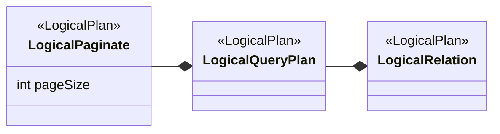

--------------------------------

### SQL Subquery with Inner and Outer Filtering

Source: https://github.com/opensearch-project/sql/blob/main/integ-test/src/test/resources/correctness/queries/subqueries.txt

This query combines filtering in both the inner subquery (`AvgTicketPrice > 100`) and the outer query (`price < 1000`). It demonstrates how to apply multiple layers of conditions using subqueries.

```SQL
SELECT origin FROM (SELECT Origin AS origin, AvgTicketPrice AS price FROM opensearch_dashboards_sample_data_flights WHERE AvgTicketPrice > 100) AS f WHERE price < 1000
```

--------------------------------

### Perform Cross-Cluster Search using PPL

Source: https://github.com/opensearch-project/sql/blob/main/docs/user/ppl/admin/cross_cluster_search.rst

This example shows how to execute a cross-cluster search query using the OpenSearch PPL (Pipe Processing Language). By specifying the remote cluster name and index name in the format `<cluster-name>:<index-name>` as the source, users can seamlessly query data residing in a remote cluster from their local cluster.

```PPL
os> source=my_remote_cluster:accounts;
fetched rows / total rows = 4/4
+----------------+-----------+----------------------+---------+--------+--------+----------+-------+-----+-----------------------+----------+
| account_number | firstname | address              | balance | gender | city   | employer | state | age | email                 | lastname |
|----------------+-----------+----------------------+---------+--------+--------+----------+-------+-----+-----------------------+----------|
| 1              | Amber     | 880 Holmes Lane      | 39225   | M      | Brogan | Pyrami   | IL    | 32  | amberduke@pyrami.com  | Duke     |
| 6              | Hattie    | 671 Bristol Street   | 5686    | M      | Dante  | Netagy   | TN    | 36  | hattiebond@netagy.com | Bond     |
| 13             | Nanette   | 789 Madison Street   | 32838   | F      | Nogal  | Quility  | VA    | 28  | null                  | Bates    |
| 18             | Dale       | 467 Hutchinson Court | 4180    | M      | Orick  | null     | MD    | 33  | daleadams@boink.com   | Adams    |
+----------------+-----------+----------------------+---------+--------+--------+----------+-------+-----+-----------------------+----------+
```

--------------------------------

### SQL Nested Subqueries with Multiple Filters

Source: https://github.com/opensearch-project/sql/blob/main/integ-test/src/test/resources/correctness/queries/subqueries.txt

This query demonstrates deeply nested subqueries, applying multiple filtering conditions at different levels. It filters flights originating from 'Zurich Airport', then by `AvgTicketPrice`, and finally by `OriginWeather`.

```SQL
SELECT Dest FROM (SELECT Dest, OriginWeather FROM (SELECT Dest, OriginWeather, AvgTicketPrice FROM (SELECT Dest, Origin, OriginWeather, AvgTicketPrice FROM opensearch_dashboards_sample_data_flights WHERE Origin = 'Zurich Airport') AS flights_data WHERE AvgTicketPrice < 10000) AS flights WHERE OriginWeather = 'Clear') AS f
```

--------------------------------

### Update ANTLR Grammar Files for async-query-core

Source: https://github.com/opensearch-project/sql/blob/main/async-query-core/README.md

This command updates the ANTLR grammar files used by the `async-query-core` library. It runs a Gradle task to download and overwrite grammar files from `opensearch-spark` and `Spark` repositories into the `src/main/antlr` directory. Ensure `build.gradle` is configured correctly for the `downloadG4Files` task.

```Shell
./gradlew async-query-core:downloadG4Files
```

--------------------------------

### Customize Simple Query String with Flags and Operator

Source: https://github.com/opensearch-project/sql/blob/main/docs/user/dql/functions.rst

This example shows how to use the `simple_query_string` function with optional parameters. It sets `flags` to 'ALL' and `default_operator` to 'AND' to refine the search for 'Pooh House' in the `title` field, ensuring all terms must be present.

```SQL
os> select id, title, author from books where simple_query_string(['title'], 'Pooh House', flags='ALL', default_operator='AND');
```

--------------------------------

### Find Maximum Average Ticket Price in OpenSearch SQL

Source: https://github.com/opensearch-project/sql/blob/main/integ-test/src/test/resources/correctness/queries/aggregation.txt

This query retrieves the highest 'AvgTicketPrice' value from the 'opensearch_dashboards_sample_data_flights' dataset. It uses the MAX() aggregate function to find the peak value.

```SQL
SELECT MAX(AvgTicketPrice) FROM opensearch_dashboards_sample_data_flights
```

--------------------------------

### Convert String to Date using DATE() in OpenSearch SQL

Source: https://github.com/opensearch-project/sql/blob/main/docs/user/ppl/functions/datetime.rst

Example demonstrating the `DATE()` function in OpenSearch SQL to convert a string literal representing a date into a date data type.

```text

```

--------------------------------

### Configure OpenSearch Query Engine Memory Limit

Source: https://github.com/opensearch-project/sql/blob/main/docs/user/admin/settings.rst

This example shows how to dynamically update the `plugins.query.memory_limit` setting, which sets the heap memory usage threshold for the query engine. Queries exceeding this limit will be terminated. This setting defaults to `85%`.

```sh
curl -H 'Content-Type: application/json' -X PUT localhost:9200/_plugins/_query/settings -d '{
  "transient" : {
    "plugins.query.memory_limit" : "80%"
  }
}'
```

```json
{
      "acknowledged": true,
      "persistent": {
        "plugins": {
          "query": {
            "memory_limit": "80%"
          }
        }
      },
      "transient": {}
    }
```

--------------------------------

### Find Earliest Timestamp in OpenSearch SQL

Source: https://github.com/opensearch-project/sql/blob/main/integ-test/src/test/resources/correctness/queries/aggregation.txt

This query identifies the oldest 'timestamp' value from the 'opensearch_dashboards_sample_data_flights' dataset. It uses the MIN() aggregate function on a timestamp field to find the earliest entry.

```SQL
SELECT MIN(timestamp) FROM opensearch_dashboards_sample_data_flights
```

--------------------------------

### Explain SQL Limit Operator Merging into OpenSearch Query DSL

Source: https://github.com/opensearch-project/sql/blob/main/docs/user/optimization/optimization.rst

Shows how a SQL LIMIT and OFFSET clause is optimized by merging into the OpenSearch Query DSL's from and size parameters within the OpenSearchIndexScan operator.

```shell
sh$ curl -sS -H 'Content-Type: application/json' \
... -X POST localhost:9200/_plugins/_sql/_explain \
... -d '{"query" : "SELECT age FROM accounts LIMIT 10 OFFSET 5"}'
```

```json
{
  "root": {
    "name": "ProjectOperator",
    "description": {
      "fields": "[age]"
    },
    "children": [
      {
        "name": "OpenSearchIndexScan",
        "description": {
          "request": "OpenSearchQueryRequest(indexName=accounts, sourceBuilder={\"from\":5,\"size\":10,\"timeout\":\"1m\",\"_source\":{\"includes\":[\"age\"],\"excludes\":[]}}, searchDone=false)"
        },
        "children": []
      }
    ]
  }
}
```

--------------------------------

### OpenSearch SQL Explain Plan for Subquery in FROM Clause

Source: https://github.com/opensearch-project/sql/blob/main/docs/user/dql/complex.rst

This JSON output is the explain plan for the SQL query using a subquery in the FROM clause. It details the underlying OpenSearch DSL query, showing how the WHERE age > 30 condition is translated into a range query and how _source fields are included.

```JSON
{
  "from" : 0,
  "size" : 200,
  "query" : {
    "bool" : {
      "filter" : [
        {
          "bool" : {
            "must" : [
              {
                "range" : {
                  "age" : {
                    "from" : 30,
                    "to" : null,
                    "include_lower" : false,
                    "include_upper" : true,
                    "boost" : 1.0
                  }
                }
              }
            ],
            "adjust_pure_negative" : true,
            "boost" : 1.0
          }
        }
      ],
      "adjust_pure_negative" : true,
      "boost" : 1.0
    }
  },
  "_source" : {
    "includes" : [
      "firstname",
      "lastname",
      "age"
    ],
    "excludes" : [ ]
  }
}
```

--------------------------------

### Preventing Invalid Index Joins in SQL

Source: https://github.com/opensearch-project/sql/blob/main/docs/dev/query-semantic-analysis.md

This example shows how the analyzer catches incorrect JOIN operations, specifically when attempting to join an index with a non-nested field, and suggests the correct usage pattern for joins.

```HTTP
POST _plugins/_sql
{
  "query": "SELECT * FROM accounts a, a.firstname"
}
```

```JSON
{
  "error": {
    "reason": "Invalid SQL query",
    "details": "Operator [JOIN] cannot work with [INDEX, TEXT]. Usage: Please join index with other index or its nested field.",
    "type": "SemanticAnalysisException"
  },
  "status": 400
}
```

--------------------------------

### Train RCF Model for Categorized Time-series Anomaly Detection in PPL

Source: https://github.com/opensearch-project/sql/blob/main/docs/user/ppl/cmd/ml.rst

This example trains an RCF model using PPL to detect anomalies in time-series taxi ridership data, independently for each category, and filters for specific values.

```PPL
os> source=nyc_taxi | fields category, value, timestamp | ml action='train' algorithm='rcf' time_field='timestamp' category_field='category' | where value=10844.0 or value=6526.0
```

--------------------------------

### Querying Multiple Specific Indices in OpenSearch SQL

Source: https://github.com/opensearch-project/sql/blob/main/docs/user/ppl/general/identifiers.rst

Shows how to query multiple specific indices by listing their names separated by commas. This example initiates a query to count documents across 'accounts' and 'account2' indices.

```OpenSearch SQL
os> source=accounts, account2 | stats count();
```

--------------------------------

### Python PhysicalPlan Base Class Definition

Source: https://github.com/opensearch-project/sql/blob/main/docs/dev/Pagination-v2.md

Shows a simplified Python base class `PhysicalPlan` with `open` and `close` methods that propagate calls to an `innerPlan`, illustrating a common pattern for chaining plan operations.

```python
class PhysicalPlan:
  def open:
    innerPlan.open()

  def close:
    innerPlan.close()
```

--------------------------------

### Count Non-Null Timestamps in OpenSearch SQL

Source: https://github.com/opensearch-project/sql/blob/main/integ-test/src/test/resources/correctness/queries/aggregation.txt

This query counts the total number of non-null timestamp values in the 'opensearch_dashboards_sample_data_flights' dataset. It demonstrates using the COUNT() aggregate function on a timestamp field.

```SQL
SELECT count(timestamp) from opensearch_dashboards_sample_data_flights
```

--------------------------------

### Order Results by AvgTicketPrice in Descending Order (SQL)

Source: https://github.com/opensearch-project/sql/blob/main/integ-test/src/test/resources/correctness/bugfixes/852.txt

This snippet demonstrates how to sort query results by the 'AvgTicketPrice' column in descending order using OpenSearch SQL. It includes variations in casing for the 'DESC' keyword to show its case-insensitivity.

```SQL
SELECT AvgTicketPrice FROM opensearch_dashboards_sample_data_flights ORDER BY AvgTicketPrice DESC
```

```SQL
SELECT AvgTicketPrice FROM opensearch_dashboards_sample_data_flights ORDER BY AvgTicketPrice desc
```

```SQL
SELECT AvgTicketPrice FROM opensearch_dashboards_sample_data_flights ORDER BY AvgTicketPrice DeSc
```

--------------------------------

### SQL Subquery with Outer Grouping on Aliased Columns

Source: https://github.com/opensearch-project/sql/blob/main/integ-test/src/test/resources/correctness/queries/subqueries.txt

This query demonstrates grouping in the outer query. The inner query aliases `Origin` as `origin` and `AvgTicketPrice` as `price`. The outer query then groups the results by these aliased columns.

```SQL
SELECT origin, price FROM (SELECT Origin AS origin, AvgTicketPrice AS price FROM opensearch_dashboards_sample_data_flights) AS f GROUP BY origin, price
```

--------------------------------

### Extract DATETIME from String with Embedded Timezone in OpenSearch SQL

Source: https://github.com/opensearch-project/sql/blob/main/docs/user/dql/functions.rst

This example demonstrates how DATETIME extracts the date and time from a string that includes an embedded timezone, returning the datetime object without the timezone.

```SQL
os> SELECT DATETIME('2008-02-10 02:00:00+04:00')
```

--------------------------------

### Perform Match Query with Field and Text Arguments in OpenSearch SQL

Source: https://github.com/opensearch-project/sql/blob/main/docs/user/beyond/fulltext.rst

Demonstrates how to use `MATCH_QUERY` or `MATCHQUERY` functions in OpenSearch SQL to perform a full-text search on a specific field (e.g., `address`) for a given text (e.g., 'Holmes'). The example includes the SQL query sent via a POST request and the corresponding OpenSearch `Explain` output showing the underlying `match` query structure.

```SQL
POST /_plugins/_sql
{
  "query" : """
		SELECT account_number, address
		FROM accounts
		WHERE MATCH_QUERY(address, 'Holmes')
		"""
}
```

```JSON
{
  "from" : 0,
  "size" : 200,
  "query" : {
    "bool" : {
      "filter" : [
        {
          "bool" : {
            "must" : [
              {
                "match" : {
                  "address" : {
                    "query" : "Holmes",
                    "operator" : "OR",
                    "prefix_length" : 0,
                    "max_expansions" : 50,
                    "fuzzy_transpositions" : true,
                    "lenient" : false,
                    "zero_terms_query" : "NONE",
                    "auto_generate_synonyms_phrase_query" : true,
                    "boost" : 1.0
                  }
                }
              }
            ],
            "adjust_pure_negative" : true,
            "boost" : 1.0
          }
        }
      ],
      "adjust_pure_negative" : true,
      "boost" : 1.0
    }
  },
  "_source" : {
    "includes" : [
      "account_number",
      "address"
    ],
    "excludes" : [ ]
  }
}
```

--------------------------------

### OpenSearch PPL: Create New Field with Parse Command

Source: https://github.com/opensearch-project/sql/blob/main/docs/user/ppl/cmd/parse.rst

Demonstrates how to use the `parse` command to extract a new field, `host`, from the `email` field using a regular expression. Shows that parsing a null field results in an empty string.

```PPL
os> source=accounts | parse email '.+@(?<host>.+)' | fields email, host ;
fetched rows / total rows = 4/4
+-----------------------+------------+
| email                 | host       |
|-----------------------+------------|
| amberduke@pyrami.com  | pyrami.com |
| hattiebond@netagy.com | netagy.com |
| null                  |            |
| daleadams@boink.com   | boink.com  |
+-----------------------+------------+
```

--------------------------------

### Get ASCII Value of Leftmost Character (ASCII)

Source: https://github.com/opensearch-project/sql/blob/main/docs/user/dql/functions.rst

Returns the numeric value of the leftmost character of a string. Returns 0 for an empty string and NULL for a NULL input. Works for 8-bit characters.

```APIDOC
ASCII:
  Description: Returns the numeric value of the leftmost character of the string str. Returns 0 if str is the empty string. Returns NULL if str is NULL. ASCII() works for 8-bit characters.
  Usage: ASCII(expr)
  Argument type: STRING
  Return type: INTEGER
```

```SQL
SELECT ASCII('hello')
```

--------------------------------

### Sort by Substring of Field Value

Source: https://github.com/opensearch-project/sql/blob/main/integ-test/src/test/resources/correctness/bugfixes/123.txt

Illustrates sorting results based on a specific substring of a field (e.g., characters 3-5), in both ascending and descending order, using the `SUBSTRING()` function in OpenSearch SQL. Useful for partial string sorting.

```SQL
SELECT Origin FROM opensearch_dashboards_sample_data_flights ORDER BY SUBSTRING(Origin, 3, 3)
```

```SQL
SELECT Origin FROM opensearch_dashboards_sample_data_flights ORDER BY SUBSTRING(Origin, 3, 3) DESC
```

--------------------------------

### OpenSearch SELECT Query Pagination Strategies

Source: https://github.com/opensearch-project/sql/blob/main/docs/dev/opensearch-pagination.md

This section details different API approaches for paginating results from simple SELECT queries in OpenSearch, including their efficiency, consistency, and resource implications. It covers the 'from' and 'size' parameters, the 'scroll' API, and the 'search_after' parameter, concluding with a recommendation for the 'scroll' API for consistent, stateless implementation.

```APIDOC
OpenSearch SELECT Query Pagination Strategies:

(A) From and Size:
  Description: Pagination using 'from' and 'size' parameters.
  Cons: Inefficient, cost prohibitive for deep pagination. Limited by 'index.max_result_window' (default 10,000).

(B) Scroll API:
  Description: Retrieves large numbers of results (or all results) from a single search request, similar to a database cursor.
  Pros: Returns all documents matching the initial search, ignoring subsequent changes.
  Cons: Keeps old segments alive, requiring more disk space and file handles. Not recommended for real-time user requests.

(C) Search After API:
  Description: Provides a live cursor, using results from the previous page to retrieve the next. Circumvents Scroll API's context costs.
  Cons: Stateless, resolved against the latest searcher version. Sort order may change due to index updates/deletes.

Conclusion: Scroll (B) is the recommended solution for consistency and stateless implementation on the plugin side, despite maintaining native context that eventually expires.
```

--------------------------------

### OpenSearch PPL: Dedup and Keep Multiple Duplicates

Source: https://github.com/opensearch-project/sql/blob/main/docs/user/ppl/cmd/dedup.rst

This example illustrates how to use the `dedup` command with an integer argument to retain a specified number of duplicate documents (e.g., 2) for each unique field combination.

```OpenSearch PPL
os> source=accounts | dedup 2 gender | fields account_number, gender;
```

--------------------------------

### Find Latest Timestamp in OpenSearch SQL

Source: https://github.com/opensearch-project/sql/blob/main/integ-test/src/test/resources/correctness/queries/aggregation.txt

This query identifies the most recent 'timestamp' value from the 'opensearch_dashboards_sample_data_flights' dataset. It uses the MAX() aggregate function on a timestamp field to find the latest entry.

```SQL
SELECT MAX(timestamp) FROM opensearch_dashboards_sample_data_flights
```

--------------------------------

### Count Timestamps in OpenSearch Sample Data

Source: https://github.com/opensearch-project/sql/blob/main/integ-test/src/test/resources/correctness/bugfixes/916.txt

This SQL query counts the number of entries in the 'timestamp' field from the 'opensearch_dashboards_sample_data_flights' index. It's a basic aggregation query used to determine the total count of records.

```SQL
SELECT COUNT(timestamp) FROM opensearch_dashboards_sample_data_flights
```

--------------------------------

### Calculate Average Ticket Price in OpenSearch SQL

Source: https://github.com/opensearch-project/sql/blob/main/integ-test/src/test/resources/correctness/queries/aggregation.txt

This query computes the average value of 'AvgTicketPrice' across all records in the 'opensearch_dashboards_sample_data_flights' dataset. It uses the AVG() aggregate function to determine the mean value.

```SQL
SELECT AVG(AvgTicketPrice) FROM opensearch_dashboards_sample_data_flights
```

--------------------------------

### OpenSearch SQL Multi-Layered Subquery

Source: https://github.com/opensearch-project/sql/blob/main/docs/user/dql/complex.rst

This example illustrates an OpenSearch SQL query with multiple nested subqueries. It first filters accounts by gender, then by age, and finally selects the lastname aliased as name from the filtered results.

```SQL
SELECT name FROM (
  SELECT lastname AS name, age FROM (
    SELECT * FROM accounts WHERE gender = 'M'
  ) AS accounts WHERE age < 35
) AS accounts
```

--------------------------------

### Extract Date and Time Components in OpenSearch SQL

Source: https://github.com/opensearch-project/sql/blob/main/integ-test/src/test/resources/correctness/sanity_integration_tests.txt

Shows how to use various date and time functions like `YEAR`, `MONTH`, `DAYOFMONTH`, `WEEK_OF_YEAR`, and `HOUR_OF_DAY` to extract specific components from timestamp fields. These functions are crucial for time-series analysis and reporting.

```SQL
SELECT YEAR(timestamp) FROM opensearch_dashboards_sample_data_flights
```

```SQL
SELECT MONTH(timestamp) FROM opensearch_dashboards_sample_data_flights
```

```SQL
SELECT DAYOFMONTH(timestamp) FROM opensearch_dashboards_sample_data_flights
```

```SQL
SELECT MONTH_OF_YEAR(timestamp) FROM opensearch_dashboards_sample_data_flights
```

```SQL
SELECT WEEK_OF_YEAR(timestamp) FROM opensearch_dashboards_sample_data_flights
```

```SQL
SELECT DAY_OF_YEAR(timestamp) FROM opensearch_dashboards_sample_data_flights
```

```SQL
SELECT DAY_OF_MONTH(timestamp) FROM opensearch_dashboards_sample_data_flights
```

```SQL
SELECT DAY_OF_WEEK(timestamp) FROM opensearch_dashboards_sample_data_flights
```

```SQL
SELECT HOUR_OF_DAY(timestamp) FROM opensearch_dashboards_sample_data_flights
```

```SQL
SELECT MINUTE_OF_DAY(timestamp) FROM opensearch_dashboards_sample_data_flights
```

```SQL
SELECT MINUTE_OF_HOUR(timestamp) FROM opensearch_dashboards_sample_data_flights
```

```SQL
SELECT SECOND_OF_MINUTE(timestamp) FROM opensearch_dashboards_sample_data_flights
```

--------------------------------

### Calculate Percentile of a Field in PPL

Source: https://github.com/opensearch-project/sql/blob/main/docs/user/ppl/cmd/stats.rst

Demonstrates how to calculate a specific percentile for a field across all data using PPL. This example calculates the 90th percentile of the 'age' field for all accounts, providing insight into the distribution of ages.

```PPL
os> source=accounts | stats percentile(age, 90);
```

--------------------------------

### OpenSearch SQL Searched CASE Expression

Source: https://github.com/opensearch-project/sql/blob/main/docs/user/dql/functions.rst

Illustrates the searched `CASE` expression in OpenSearch SQL, where each `WHEN` clause contains a boolean condition. Examples include single and multiple conditions, and cases without an `ELSE` clause.

```SQL
SELECT
  CASE
    WHEN 1 = 1 THEN 'One'
  END AS single_search,
  CASE
    WHEN 2 = 1 THEN 'One'
    WHEN 'hello' = 'hello' THEN 'Hello' END AS multi_searches,
  CASE
    WHEN 2 = 1 THEN 'One'
    WHEN 'hello' = 'world' THEN 'Hello'
  END AS no_else;
```

--------------------------------

### Configure Spark Execution Engine in opensearch.yml

Source: https://github.com/opensearch-project/sql/blob/main/docs/user/interfaces/asyncqueryinterface.rst

Example YAML configuration for setting up the Spark execution engine parameters in `opensearch.yml`. This configuration specifies the `applicationId`, `executionRoleARN`, `region`, and optional `sparkSubmitParameters` required for AWS EMRServerless integration. Users should be cautious when changing these parameters as it may affect previous job result retrieval.

```yaml
"plugins.query.executionengine.spark.config: '{\"applicationId\":\"xxxxx\",\"executionRoleARN\":\"arn:aws:iam::xxxxx:role/emr-job-execution-role\",\"region\":\"us-west-2\", \"sparkSubmitParameters\": \"--conf spark.dynamicAllocation.enabled=false\"}'"
```

--------------------------------

### Run OpenSearch SQL Comparison Test with Multiple Comparison Databases

Source: https://github.com/opensearch-project/sql/blob/main/docs/dev/testing-comparison-test.md

This Gradle command runs the OpenSearch SQL comparison integration test, enabling comprehensive cross-database validation. It allows specifying both the database under test via `-DdbUrl` and additional databases for result set comparison using the `-DotherDbUrls` argument.

```Shell
./gradlew :integ-test:comparisonTest -Dqueries=sanity_integration_tests.txt -DdbUrl=jdbc:sqlite::memory: -DotherDbUrls=Unknown=jdbc:h2:mem:test;DB_CLOSE_DELAY=-1
```

--------------------------------

### Detecting Field Name Typos in SQL Queries

Source: https://github.com/opensearch-project/sql/blob/main/docs/dev/query-semantic-analysis.md

This example demonstrates how the new semantic analyzer identifies and suggests corrections for misspelled field names in SQL queries, preventing execution errors and improving user experience.

```HTTP
POST _plugins/_sql
{
  "query": "SELECT balace FROM accounts"
}
```

```JSON
{
  "error": {
    "reason": "Invalid SQL query",
    "details": "Field [balace] cannot be found or used here. Did you mean [balance]?",
    "type": "SemanticAnalysisException"
  },
  "status": 400
}
```

--------------------------------

### OpenSearch SQL: Selecting Specific Fields from an Index

Source: https://github.com/opensearch-project/sql/blob/main/docs/user/dql/basics.rst

Illustrates how to specify particular field names in the `SELECT` clause to retrieve only necessary data from an OpenSearch index, including the API call and its explanation output.

```JSON
POST /_plugins/_sql
{
  \"query\" : \"SELECT firstname, lastname FROM accounts\"
}
```

```JSON
{
  \"from\" : 0,
  \"size\" : 200,
  \"_source\" : {
    \"includes\" : [
      \"firstname\",
      \"lastname\"
    ],
    \"excludes\" : [ ]
  }
}
```

--------------------------------

### OpenSearch PPL: Fetch Documents with Conditional Filtering

Source: https://github.com/opensearch-project/sql/blob/main/docs/user/ppl/cmd/search.rst

This example illustrates how to apply boolean conditions to filter documents when using the `source` command in OpenSearch PPL. It retrieves documents from the 'accounts' index where the 'account_number' is 1 or 'gender' is 'F', showcasing the use of logical operators.

```PPL
os> source=accounts account_number=1 or gender="F";
```

--------------------------------

### Querying Multiple Delimited Indices in OpenSearch SQL

Source: https://github.com/opensearch-project/sql/blob/main/docs/user/general/identifiers.rst

This example shows how to query multiple specific indices by delimiting their names with commas. It's important to note that no spaces are allowed between the index names when using this method.

```SQL
os> SELECT count(*) as cnt FROM `accounts,account2`;
```

--------------------------------

### Select and Group by Multiple Columns in OpenSearch SQL

Source: https://github.com/opensearch-project/sql/blob/main/integ-test/src/test/resources/correctness/bugfixes/717.txt

This SQL query selects 'FlightDelay' and 'Cancelled' columns and groups the results by the unique combinations of these two columns from the 'opensearch_dashboards_sample_data_flights' table. It helps in analyzing flight delay statuses in conjunction with cancellation status.

```SQL
SELECT FlightDelay, Cancelled FROM opensearch_dashboards_sample_data_flights GROUP BY FlightDelay, Cancelled
```

--------------------------------

### Calculate Maximum Value of a Field (MAX) in OpenSearch PPL

Source: https://github.com/opensearch-project/sql/blob/main/docs/user/ppl/cmd/stats.rst

This example demonstrates how to find the highest value of a specific numeric field, such as 'age', across all records in the 'accounts' dataset using the `max()` function.

```OpenSearch PPL
os> source=accounts | stats max(age);
```

--------------------------------

### Calculate Absolute Average Ticket Price in OpenSearch SQL

Source: https://github.com/opensearch-project/sql/blob/main/integ-test/src/test/resources/correctness/bugfixes/550.txt

This SQL query calculates the absolute value of the average ticket price from the `opensearch_dashboards_sample_data_flights` dataset. It then groups the results by the absolute average ticket price.

```SQL
SELECT ABS(`flights`.`AvgTicketPrice`) FROM (SELECT `AvgTicketPrice` FROM `opensearch_dashboards_sample_data_flights`) AS `flights` GROUP BY ABS(`flights`.`AvgTicketPrice`)
```

--------------------------------

### OpenSearch SQL Query Plan Serialization and Deserialization Round Trip

Source: https://github.com/opensearch-project/sql/blob/main/docs/dev/Pagination-v2.md

Illustrates the complete round trip of a Physical Query Plan through serialization and deserialization, enabling the SQL engine to recover its execution state for subsequent pages. It highlights that `ResourceMonitorPlan` is not serialized, and the process relies on Java object serialization API.

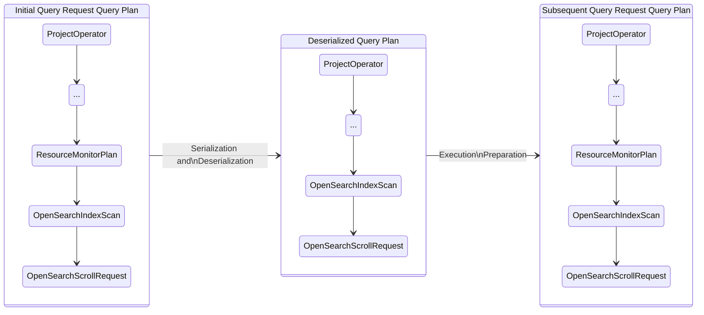

--------------------------------

### Clustering Iris Dataset with KMeans in PPL

Source: https://github.com/opensearch-project/sql/blob/main/docs/user/ppl/cmd/kmeans.rst

Demonstrates how to use the `kmeans` command in a PPL query to classify three Iris species based on their sepal and petal measurements. The example groups the data into 3 clusters.

```PPL
> source=iris_data | fields sepal_length_in_cm, sepal_width_in_cm, petal_length_in_cm, petal_width_in_cm | kmeans centroids=3
```

--------------------------------

### PPL Example: Extract Punctuations from Email Field

Source: https://github.com/opensearch-project/sql/blob/main/docs/user/ppl/cmd/patterns.rst

Illustrates using the `patterns` command with `SIMPLE_PATTERN` to extract punctuation characters from the `email` field in `accounts` data. The extracted patterns are stored in a new field named `patterns_field`, demonstrating how to create and populate this field.

```PPL
os> source=accounts | patterns email SIMPLE_PATTERN | fields email, patterns_field ;
```

--------------------------------

### OpenSearch SQL: Using match_phrase_prefix for Author Search

Source: https://github.com/opensearch-project/sql/blob/main/docs/user/dql/functions.rst

Demonstrates how to use the `match_phrase_prefix` function in OpenSearch SQL to search for authors with a specific phrase prefix, allowing for a specified slop (edit distance). The example queries the 'books' index for authors matching 'Alan Mil' with a slop of 2.

```SQL
os> SELECT author, title FROM books WHERE match_phrase_prefix(author, 'Alan Mil', slop = 2);
fetched rows / total rows = 2/2
+----------------------+--------------------------+
| author               | title                    |
|----------------------+--------------------------|
| Alan Alexander Milne | The House at Pooh Corner |
| Alan Alexander Milne | Winnie-the-Pooh          |
+----------------------+--------------------------+
```

--------------------------------

### Sample Result Set for Employees Nested Data

Source: https://github.com/opensearch-project/sql/blob/main/docs/user/beyond/partiql.rst

Illustrates a sample JSON result set from the 'employees_nested' index, showcasing the structure of documents including nested 'projects' arrays.

```JSON
{
	  "employees_nested" : [
	    {
	      "id" : 3,
	      "name" : "Bob Smith",
	      "title" : null,
	      "projects" : [
	        {
	          "name" : "AWS Redshift Spectrum querying",
	          "started_year" : 1990
	        },
	        {
	          "name" : "AWS Redshift security",
	          "started_year" : 1999
	        },
	        {
	          "name" : "AWS Aurora security",
	          "started_year" : 2015
	        }
	      ]
	    },
	    {
	      "id" : 4,
	      "name" : "Susan Smith",
	      "title" : "Dev Mgr",
	      "projects" : [ ]
	    },
	    {
	      "id" : 6,
	      "name" : "Jane Smith",
	      "title" : "Software Eng 2",
	      "projects" : [
	        {
	          "name" : "AWS Redshift security",
	          "started_year" : 1998
	        },
	        {
	          "name" : "AWS Hello security",
	          "started_year" : 2015,
	          "address" : [
	            {
	              "city" : "Dallas",
	              "state" : "TX"
	            }
	          ]
	        }
	      ]
	    }
	  ]
	}
```

--------------------------------

### Perform Match Phrase Query in OpenSearch SQL

Source: https://github.com/opensearch-project/sql/blob/main/docs/user/beyond/fulltext.rst

Illustrates the use of `MATCH_PHRASE` (or `MATCHPHRASE`, `MATCHPHRASEQUERY`) function in OpenSearch SQL to find exact phrase matches. Includes an example SQL query and its OpenSearch DSL 'explain' output, demonstrating how to search for a specific phrase within a field.

```SQL
POST /_plugins/_sql
{
  "query" : """
		SELECT account_number, address
		FROM accounts
		WHERE MATCH_PHRASE(address, '880 Holmes Lane')
		"""
}
```

```JSON
{
  "from" : 0,
  "size" : 200,
  "query" : {
    "bool" : {
      "filter" : [
        {
          "bool" : {
            "must" : [
              {
                "match_phrase" : {
                  "address" : {
                    "query" : "880 Holmes Lane",
                    "slop" : 0,
                    "zero_terms_query" : "NONE",
                    "boost" : 1.0
                  }
                }
              }
            ],
            "adjust_pure_negative" : true,
            "boost" : 1.0
          }
        }
      ],
      "adjust_pure_negative" : true,
      "boost" : 1.0
    }
  },
  "_source" : {
    "includes" : [
      "account_number",
      "address"
    ],
    "excludes" : [ ]
  }
}
```

--------------------------------

### Calculate Sample Variance of Ticket Price in OpenSearch SQL

Source: https://github.com/opensearch-project/sql/blob/main/integ-test/src/test/resources/correctness/queries/aggregation.txt

This query computes the sample variance of 'AvgTicketPrice' for all records in the 'opensearch_dashboards_sample_data_flights' dataset. It uses the VAR_SAMP() aggregate function, which is suitable when working with a sample of the population.

```SQL
SELECT VAR_SAMP(AvgTicketPrice) FROM opensearch_dashboards_sample_data_flights
```

--------------------------------

### Spark PPL Query Processing Flow (Short-term & Long-term)

Source: https://github.com/opensearch-project/sql/blob/main/docs/dev/intro-v3-architecture.md

Outlines the current (short-term) and proposed future (long-term) data processing pipelines for PPL queries executed on Spark, highlighting the role of Apache Calcite in the long-term architecture for translation to SparkSQL.

```Flow Diagram
Short-term: PPL -> ANTLR -> AST -> LogicalPlan(Spark) -> PhysicalPlan(Spark) -> tasks (Spark runtime)
Long-term: PPL -> ANTLR -> AST -> RelNode(Calcite) -> SparkSQL API -> tasks (Spark runtime)
```

--------------------------------

### Cast Values to Double in OpenSearch SQL

Source: https://github.com/opensearch-project/sql/blob/main/integ-test/src/test/resources/correctness/expressions/cast.txt

Illustrates casting strings, integers, and boolean values to the double-precision floating-point type in OpenSearch SQL. This is useful for numerical operations requiring decimal precision.

```SQL
cast('1' as double) as castDouble
cast(1 as double) as castDouble
cast(true as double) as castDouble
cast(false as double) as castDouble
```

--------------------------------

### Example Query Result with NULL and MISSING Values

Source: https://github.com/opensearch-project/sql/blob/main/docs/dev/query-null-missing-value.md

This JSON array illustrates the expected output format for a query result when NULL and MISSING values are included, showing how ExprNullValue() and ExprMissingValue() are represented.

```JSON
[
  {"age": ExprIntegerValue(1), "account_number": ExprIntegerValue(1)},
  {"age": ExprNullValue(), "account_number": ExprIntegerValue(2)},
  {"age": ExprMissingValue(), "account_number": ExprIntegerValue(3)}
]
```

--------------------------------

### PPL Query to Fetch All PROMETHEUS Datasources

Source: https://github.com/opensearch-project/sql/blob/main/docs/user/ppl/cmd/showdatasources.rst

Demonstrates how to filter datasources by 'CONNECTOR_TYPE' using a 'where' clause to retrieve only PROMETHEUS datasources.

```PPL
os> show datasources | where CONNECTOR_TYPE='PROMETHEUS';
```

--------------------------------

### Demonstrate Filter Merge Rule in OpenSearch PPL

Source: https://github.com/opensearch-project/sql/blob/main/docs/user/optimization/optimization.rst

This example shows how consecutive Filter operators are merged into a single Filter operator by the query engine. The PPL query applies two 'where' clauses on the 'age' field, which are optimized into a single range query in the OpenSearch Query DSL.

```sh
sh$ curl -sS -H 'Content-Type: application/json' \
... -X POST localhost:9200/_plugins/_ppl/_explain \
... -d '{\"query\" : \"source=accounts | where age > 10 | where age < 20 | fields age\"}'
```

```json
{
  "root": {
    "name": "ProjectOperator",
    "description": {
      "fields": "[age]"
    },
    "children": [
      {
        "name": "OpenSearchIndexScan",
        "description": {
          "request": "OpenSearchQueryRequest(indexName=accounts, sourceBuilder={\"from\":0,\"size\":10000,\"timeout\":\"1m\",\"query\":{\"bool\":{\"filter\":[{\"range\":{\"age\":{\"from\":null,\"to\":20,\"include_lower\":true,\"include_upper\":false,\"boost\":1.0}}},{\"range\":{\"age\":{\"from\":10,\"to\":null,\"include_lower\":false,\"include_upper\":true,\"boost\":1.0}}}],\"adjust_pure_negative\":true,\"boost\":1.0}},\"_source\":{\"includes\":[\"age\"],\"excludes\":[]},\"sort\":[{\"_doc\":{\"order\":\"asc\"}}]}), searchDone=false)"
        },
        "children": []
      }
    ]
  }
}
```

--------------------------------

### Get Year and Week from Date (YEARWEEK)

Source: https://github.com/opensearch-project/sql/blob/main/docs/user/dql/functions.rst

Returns the year and week for a given date as an integer. It accepts an optional mode argument, similar to the WEEK function. Useful for grouping or filtering data by week.

```APIDOC
YEARWEEK:
  Description: Returns the year and week for date as an integer. It accepts and optional mode arguments aligned with those available for the WEEK function.
  Usage: yearweek(date, [mode])
  Argument type: STRING/DATE/TIME/TIMESTAMP
  Return type: INTEGER
```

```SQL
SELECT YEARWEEK('2020-08-26'), YEARWEEK('2019-01-05', 0)
```

--------------------------------

### Calculate Grouped Max and Min Values (MAX, MIN by GROUP) in OpenSearch PPL

Source: https://github.com/opensearch-project/sql/blob/main/docs/user/ppl/cmd/stats.rst

This example illustrates how to determine both the maximum and minimum values of a field, 'age', grouped by another field, 'gender'. This provides the range of values for each distinct category.

```OpenSearch PPL
os> source=accounts | stats max(age), min(age) by gender;
```

--------------------------------

### Filter Documents by Missing or Existing Fields (IS NULL/IS NOT NULL)

Source: https://github.com/opensearch-project/sql/blob/main/docs/user/dql/basics.rst

Illustrates using `IS NULL` and `IS NOT NULL` in the `WHERE` clause to retrieve documents based on the presence or absence of a field. This example finds documents where the `employer` field is missing or explicitly `NULL`.

```SQL
POST /_plugins/_sql
{
  "query" : """
		SELECT account_number, employer
		FROM accounts
		WHERE employer IS NULL
		"""
}
```

```JSON
{
  "from" : 0,
  "size" : 200,
  "query" : {
    "bool" : {
      "filter" : [
        {
          "bool" : {
            "must" : [
              {
                "bool" : {
                  "must_not" : [
                    {
                      "exists" : {
                        "field" : "employer.keyword",
                        "boost" : 1.0
                      }
                    }
                  ],
                  "adjust_pure_negative" : true,
                  "boost" : 1.0
                }
              }
            ],
            "adjust_pure_negative" : true,
            "boost" : 1.0
          }
        }
      ],
      "adjust_pure_negative" : true,
      "boost" : 1.0
    }
  },
  "_source" : {
    "includes" : [
      "account_number",
      "employer"
    ],
    "excludes" : [ ]
  }
}
```

--------------------------------

### Calculate Multiple Aggregates by Group (AVG, SUM, COUNT) in OpenSearch PPL

Source: https://github.com/opensearch-project/sql/blob/main/docs/user/ppl/cmd/stats.rst

This example demonstrates performing multiple aggregate calculations—average, sum, and count—on a field, 'age', while grouping the results by 'gender'. This provides a comprehensive summary for each category.

```OpenSearch PPL
os> source=accounts | stats avg(age), sum(age), count() by gender;
```

--------------------------------

### Adjust OpenSearch Query Size Limit

Source: https://github.com/opensearch-project/sql/blob/main/docs/user/admin/settings.rst

This example demonstrates how to dynamically update the `plugins.query.size_limit` setting, which defines the default number of index documents fetched by the new query engine. This value defaults to `10000` and cannot exceed `index.max_result_window`.

```sh
curl -H 'Content-Type: application/json' -X PUT localhost:9200/_plugins/_query/settings -d '{
  "transient" : {
    "plugins.query.size_limit" : 500
  }
}'
```

```json
{
      "acknowledged" : true,
      "persistent" : { },
      "transient" : {
        "plugins" : {
          "query" : {
            "size_limit" : "500"
          }
        }
      }
    }
```

--------------------------------

### Handle Invalid Date Without Timezone in OpenSearch SQL

Source: https://github.com/opensearch-project/sql/blob/main/docs/user/dql/functions.rst

This example shows that the DATETIME function returns null when an invalid date (e.g., February 30th) is provided, even without a specified timezone.

```SQL
os> SELECT DATETIME('2008-02-30 02:00:00')
```

--------------------------------

### Run OpenSearch SQL Comparison Test with External OpenSearch Cluster

Source: https://github.com/opensearch-project/sql/blob/main/docs/dev/testing-comparison-test.md

This Gradle command configures the OpenSearch SQL comparison integration test to connect to an external OpenSearch cluster. By default, an internal OpenSearch instance is used, but the `-DesHost` argument allows specifying the host and port of an external cluster.

```Shell
./gradlew :integ-test:comparisonTest -DesHost=localhost:9200
```

--------------------------------

### Example Prometheus Datasource Definition

Source: https://github.com/opensearch-project/sql/blob/main/docs/user/ppl/admin/datasources.rst

This JSON object defines a Prometheus datasource, specifying its name, connector type, connection properties (URI, authentication), allowed OpenSearch roles for access, and its operational status. Fields like 'name', 'connector', and 'properties' are mandatory. The 'status' field, introduced in version 2.13, allows enabling or disabling the datasource, blocking new queries if disabled.

```JSON
{
    "name" : "my_prometheus",
    "connector": "prometheus",
    "properties" : {
        "prometheus.uri" : "http://localhost:8080",
        "prometheus.auth.type" : "basicauth",
        "prometheus.auth.username" : "admin",
        "prometheus.auth.password" : "admin"
    },
    "allowedRoles" : ["prometheus_access"],
    "status" : "ACTIVE|DISABLED"
}
```

--------------------------------

### OpenSearch PPL: Dedup Consecutive Duplicates

Source: https://github.com/opensearch-project/sql/blob/main/docs/user/ppl/cmd/dedup.rst

This example demonstrates using the `consecutive=true` option with the `dedup` command to remove only duplicate documents that appear consecutively in the search results, preserving non-consecutive duplicates.

```OpenSearch PPL
os> source=accounts | dedup gender consecutive=true | fields account_number, gender;
```

--------------------------------

### Filter Data using IN Operator in OpenSearch SQL

Source: https://github.com/opensearch-project/sql/blob/main/docs/user/ppl/functions/expressions.rst

Demonstrates how to use the `IN` operator in OpenSearch SQL to filter records where a field's value matches any value in a specified list. This example selects accounts with ages 32 or 33.

```SQL
os> source=accounts | where age in (32, 33) | fields age ;
fetched rows / total rows = 2/2
+-----+
| age |
|-----|
| 32  |
| 33  |
+-----+
```

--------------------------------

### Select and Group by Single Column in OpenSearch SQL

Source: https://github.com/opensearch-project/sql/blob/main/integ-test/src/test/resources/correctness/bugfixes/717.txt

This SQL query selects the 'FlightDelay' column and groups the results by the unique values of 'FlightDelay' from the 'opensearch_dashboards_sample_data_flights' table. It's useful for counting occurrences of each flight delay status.

```SQL
SELECT FlightDelay FROM opensearch_dashboards_sample_data_flights GROUP BY FlightDelay
```

--------------------------------

### OpenSearch PPL: Dedup by a Single Field

Source: https://github.com/opensearch-project/sql/blob/main/docs/user/ppl/cmd/dedup.rst

This example demonstrates how to use the `dedup` command to remove duplicate documents based on a single specified field, keeping only the first occurrence of each unique value.

```OpenSearch PPL
os> source=accounts | dedup gender | fields account_number, gender;
```

--------------------------------

### SQL Query for Grouping Data by Timestamp in OpenSearch

Source: https://github.com/opensearch-project/sql/blob/main/integ-test/src/test/resources/correctness/bugfixes/521.txt

This SQL query selects the 'timestamp' field from the 'opensearch_dashboards_sample_data_flights' index and groups the results by the 'timestamp' field. This is a fundamental operation for time-series analysis and aggregation within OpenSearch.

```SQL
SELECT timestamp FROM opensearch_dashboards_sample_data_flights GROUP BY timestamp
```

--------------------------------

### Generate Master Key for OpenSearch Datasource Encryption

Source: https://github.com/opensearch-project/sql/blob/main/docs/user/ppl/admin/datasources.rst

These scripts provide examples for generating a 24-character master key, which is a required configuration for encrypting datasource credentials in OpenSearch. The master key must be 16, 24, or 32 characters long.

```Bash
#!/bin/bash
# Generate a 24-character key
master_key=$(openssl rand -hex 12)
echo "Master Key: $master_key"
```

```Python
import random
import string

# Generate a 24-character random master key
master_key = ''.join(random.choices(string.ascii_letters + string.digits, k=24))

# Print the master key
print("Generated master key:", master_key)
```

--------------------------------

### Validating Type Compatibility Across Multi-Queries (UNION) in SQL

Source: https://github.com/opensearch-project/sql/blob/main/docs/dev/query-semantic-analysis.md

This example illustrates how the analyzer checks for type compatibility between result sets in multi-query operations like UNION ALL, ensuring consistent data types across combined queries.

```HTTP
POST _plugins/_sql
{
  "query": "SELECT balance FROM accounts UNION ALL SELECT city FROM accounts"
}
```

```JSON
{
  "error": {
    "reason": "Invalid SQL query",
    "details": "Operator [UNION] cannot work with [LONG, TEXT]. Usage: Please return field(s) of compatible type from each query.",
    "type": "SemanticAnalysisException"
  },
  "status": 400
}
```

--------------------------------

### Querying Multiple Indices with Wildcards in OpenSearch SQL

Source: https://github.com/opensearch-project/sql/blob/main/docs/user/ppl/general/identifiers.rst

Demonstrates how to query multiple indices using a wildcard pattern in the index name. This example counts documents across all indices matching 'acc*', showing the aggregated count.

```OpenSearch SQL
os> source=acc* | stats count();
fetched rows / total rows = 1/1
+---------+
| count() |
|---------|
| 5       |
+---------+
```

--------------------------------

### SQL Subquery with Nested Grouping and Aliasing

Source: https://github.com/opensearch-project/sql/blob/main/integ-test/src/test/resources/correctness/queries/subqueries.txt

This complex query shows nested grouping. The inner subquery groups by `origin`, `dest`, and `price`. The outer query then further groups the result by `origin` and `price` from the subquery's output.

```SQL
SELECT origin, price FROM (SELECT Origin AS origin, Dest AS dest, AvgTicketPrice AS price FROM opensearch_dashboards_sample_data_flights GROUP BY origin, dest, price) AS f GROUP BY origin, price
```

--------------------------------

### Logical Query Plan States for Different Request Types

Source: https://github.com/opensearch-project/sql/blob/main/docs/dev/Pagination-v2.md

This state diagram compares the logical query plan flow for non-paged, initial paged, and subsequent paged requests. It highlights the introduction of `LogicalPaginate` for initial requests and `FetchCursor` for subsequent requests, showing how the plan structure adapts.

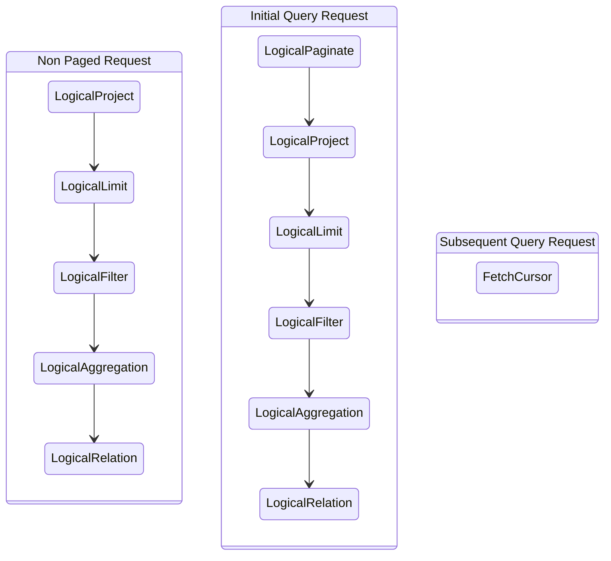

--------------------------------

### Demonstrating Case Sensitivity for Identifiers in OpenSearch SQL

Source: https://github.com/opensearch-project/sql/blob/main/docs/user/ppl/general/identifiers.rst

Explains that identifiers in OpenSearch SQL are case-sensitive. This example illustrates that attempting to query an index with incorrect casing, such as 'Accounts' instead of 'accounts', will result in an index not found exception.

```OpenSearch SQL
source=Accounts
```

--------------------------------

### Negate Conditions using NOT Operator in OpenSearch SQL

Source: https://github.com/opensearch-project/sql/blob/main/docs/user/ppl/functions/expressions.rst

Illustrates the use of the `NOT` logical operator in OpenSearch SQL to negate a condition. This example selects accounts where the age is not in the list (32, 33), effectively retrieving ages 36 and 28.

```SQL
os> source=accounts | where not age in (32, 33) | fields age ;
fetched rows / total rows = 2/2
+-----+
| age |
|-----|
| 36  |
| 28  |
+-----+
```

--------------------------------

### OpenSearch SQL: Basic multi_match Query with Fields and Query

Source: https://github.com/opensearch-project/sql/blob/main/docs/user/dql/functions.rst

Illustrates a basic usage of the `multi_match` function in OpenSearch SQL, specifying only the target fields and the query expression. This example searches for 'Pooh House' within the 'title' field of the 'books' index, demonstrating default parameter behavior.

```SQL
os> select id, title, author from books where multi_match(['title'], 'Pooh House');
fetched rows / total rows = 2/2
+----+--------------------------+----------------------+
| id | title                    | author               |
|----+--------------------------+----------------------|
| 1  | The House at Pooh Corner | Alan Alexander Milne |
| 2  | Winnie-the-Pooh          | Alan Alexander Milne |
+----+--------------------------+----------------------+
```

--------------------------------

### Example: Subsequent Paged SQL Query Request

Source: https://github.com/opensearch-project/sql/blob/main/docs/dev/Pagination-v2.md

Shows how to request the next page of results using the `cursor` ID obtained from a previous paged query response. This request only requires the `cursor` field in the body. The response format is identical to the initial response, unless it's the last page.

```json
POST /_plugins/_sql
{
  "cursor": "<cursor_id>"
}
```

--------------------------------

### DAY Function API Reference and Usage in OpenSearch SQL

Source: https://github.com/opensearch-project/sql/blob/main/docs/user/ppl/functions/datetime.rst

API documentation for the DAY function, which extracts the day of the month from a date. Includes argument types, return type, synonyms, and an example demonstrating its usage.

```APIDOC
DAY:
  Description: Extracts the day of the month for date, in the range 1 to 31.
  Usage: day(date)
  Argument type: STRING/DATE/TIMESTAMP
  Return type: INTEGER
  Synonyms: DAYOFMONTH, DAY_OF_MONTH
```

```SQL
os> source=people | eval `DAY(DATE('2020-08-26'))` = DAY(DATE('2020-08-26')) | fields `DAY(DATE('2020-08-26'))`
```

--------------------------------

### PPL Query: LOOKUP with Multiple Input Fields and Result

Source: https://github.com/opensearch-project/sql/blob/main/docs/user/ppl/cmd/lookup.rst

Illustrates a PPL `LOOKUP` command joining `worker` and `work_information` using both `uid` and `name` as join keys. This snippet includes the cURL command to execute the query and its corresponding JSON result set, showing the structure of the joined data.

```cURL
curl -H 'Content-Type: application/json' -X POST localhost:9200/_plugins/_ppl -d '{
  "query" : """
  source = worker
  | LOOKUP work_information uid AS id, name
  | fields id, name, occupation, country, salary, department
  """
}'
```

```JSON
{
      "schema": [
        {
          "name": "id",
          "type": "integer"
        },
        {
          "name": "name",
          "type": "string"
        },
        {
          "name": "country",
          "type": "string"
        },
        {
          "name": "salary",
          "type": "integer"
        },
        {
          "name": "department",
          "type": "string"
        },
        {
          "name": "occupation",
          "type": "string"
        }
      ],
      "datarows": [
        [
          1000,
          "Jake",
          "England",
          100000,
          "IT",
          "Engineer"
        ],
        [
          1001,
          "Hello",
          "USA",
          70000,
          null,
          null
        ],
        [
          1002,
          "John",
          "Canada",
          120000,
          "DATA",
          "Scientist"
        ],
        [
          1003,
          "David",
          null,
          120000,
          "HR",
          "Doctor"
        ],
        [
          1004,
          "David",
          "Canada",
          0,
          null,
          null
        ],
        [
          1005,
          "Jane",
          "Canada",
          90000,
          "DATA",
          "Engineer"
        ]
      ],
      "total": 6,
      "size": 6
    }
```

--------------------------------

### Explicit Type Conversion with CAST in OpenSearch SQL

Source: https://github.com/opensearch-project/sql/blob/main/docs/user/general/datatypes.rst

Demonstrates the use of the `CAST` function for explicit type conversion in OpenSearch SQL. This example shows how to convert a boolean value (`true`) to an integer type.

```SQL
os> SELECT
...  CAST(true AS INT),
```

--------------------------------

### Example: Initial Paged SQL Query Response

Source: https://github.com/opensearch-project/sql/blob/main/docs/dev/Pagination-v2.md

Illustrates the structure of the response received after an initial paged SQL query. It includes a `cursor` ID for fetching subsequent pages, `datarows` containing the current page's data, and `schema` information. The `cursor` ID changes with each request until the last page, where it is absent.

```json
{
  "cursor": "<cursor_id>",
  "datarows": [
    ...
  ],
  "schema" : [
    ...
  ]
}
```

--------------------------------

### Group by Ordinal Position in OpenSearch SQL

Source: https://github.com/opensearch-project/sql/blob/main/docs/user/dql/aggregations.rst

Illustrates grouping by the ordinal position of a selected column using the GROUP BY clause in OpenSearch SQL. This example calculates the sum of ages for each gender by grouping on the first selected column (gender).

```SQL
os> SELECT gender, sum(age) FROM accounts GROUP BY 1;
```

--------------------------------

### OpenSearch PPL TPC-H Query 20 Example

Source: https://github.com/opensearch-project/sql/blob/main/docs/user/ppl/cmd/subquery.rst

A complex PPL query for TPC-H Q20, demonstrating multiple levels of nested subqueries within `IN` and comparison clauses. This query filters suppliers based on part and lineitem conditions, showcasing advanced subquery capabilities.

```cURL
curl -H 'Content-Type: application/json' -X POST localhost:9200/_plugins/_ppl -d '{
	  "query" : """
           source = supplier
           | join ON s_nationkey = n_nationkey nation
           | where n_name = 'CANADA'
              and s_suppkey in [
                source = partsupp
                | where ps_partkey in [
                    source = part
                    | where like(p_name, 'forest%')
                    | fields p_partkey
                  ]
                  and ps_availqty > [
                    source = lineitem
                    | where l_partkey = ps_partkey
                      and l_suppkey = ps_suppkey
                      and l_shipdate >= date('1994-01-01')
                      and l_shipdate < date_add(date('1994-01-01'), interval 1 year)
                    | stats sum(l_quantity) as sum_l_quantity
                    | eval half_sum_l_quantity = 0.5 * sum_l_quantity // Stats and Eval commands can combine when issues/819 resolved
                    | fields half_sum_l_quantity
                  ]
                | fields ps_suppkey
          ]
	  """
	}'
```

--------------------------------

### Execute Query String Query in OpenSearch SQL

Source: https://github.com/opensearch-project/sql/blob/main/docs/user/beyond/fulltext.rst

Demonstrates how to use the `QUERY` function in OpenSearch SQL to perform a query string search based on Lucene syntax. It shows an example SQL query and its corresponding OpenSearch DSL 'explain' output, highlighting how invalid syntax can lead to errors.

```SQL
POST /_plugins/_sql
{
  "query" : """
		SELECT account_number, address
		FROM accounts
		WHERE QUERY('address:Lane OR address:Street')
		"""
}
```

```JSON
{
  "from" : 0,
  "size" : 200,
  "query" : {
    "bool" : {
      "filter" : [
        {
          "bool" : {
            "must" : [
              {
                "query_string" : {
                  "query" : "address:Lane OR address:Street",
                  "fields" : [ ],
                  "type" : "best_fields",
                  "default_operator" : "or",
                  "max_determinized_states" : 10000,
                  "enable_position_increments" : true,
                  "fuzziness" : "AUTO",
                  "fuzzy_prefix_length" : 0,
                  "fuzzy_max_expansions" : 50,
                  "phrase_slop" : 0,
                  "escape" : false,
                  "auto_generate_synonyms_phrase_query" : true,
                  "fuzzy_transpositions" : true,
                  "boost" : 1.0
                }
              }
            ],
            "adjust_pure_negative" : true,
            "boost" : 1.0
          }
        }
      ],
      "adjust_pure_negative" : true,
      "boost" : 1.0
    }
  },
  "_source" : {
    "includes" : [
      "account_number",
      "address"
    ],
    "excludes" : [ ]
  }
}
```

--------------------------------

### Using wildcard_query in OpenSearch SQL

Source: https://github.com/opensearch-project/sql/blob/main/docs/user/dql/functions.rst

Demonstrates how to use the `wildcard_query` function in OpenSearch SQL to perform wildcard searches with optional parameters like boost, case insensitivity, and rewrite method.

```SQL
os> select Body from wildcard where wildcard_query(Body, 'test wildcard*', boost=0.7, case_insensitive=true, rewrite='constant_score');
```

--------------------------------

### PPL fillnull: Replace Nulls in Multiple Specified Fields

Source: https://github.com/opensearch-project/sql/blob/main/docs/user/ppl/cmd/fillnull.rst

This example shows how to use `fillnull` to replace null values in multiple designated fields (`email` and `employer`) with the same specified replacement string ('<not found>'). The command applies the replacement to all listed fields.

```PPL
os> source=accounts | fields email, employer | fillnull with '<not found>' in email, employer;
```

--------------------------------

### SQL-like Boolean Logic Expressions

Source: https://github.com/opensearch-project/sql/blob/main/integ-test/src/test/resources/correctness/expressions/predicates.txt

This snippet illustrates various boolean logic operations including AND, OR, and NOT. Each expression evaluates to a boolean result, aliased as 'bool'. These examples demonstrate how different combinations of `true` and `false` values are processed by these operators.

```SQL
true AND true AS bool
false AND true AS bool
false OR false AS bool
true or false AS bool
NOT true AS bool
NOT false AS bool
NOT (true AND false) AS bool
```

--------------------------------

### OpenSearch SQL: Chaining CAST Functions

Source: https://github.com/opensearch-project/sql/blob/main/docs/user/ppl/functions/conversion.rst

Shows an advanced usage of the `CAST` function in OpenSearch SQL where multiple `CAST` operations are chained. This example converts a boolean to a string, and then that string back to a boolean, demonstrating sequential type conversions.

```OpenSearch SQL
os> source=people | eval `cbool` = CAST(CAST(true as string) as boolean) | fields `cbool`
fetched rows / total rows = 1/1
+-------+
| cbool |
|-------|
| True  |
+-------+
```

--------------------------------

### Calculate Percentile by Group in PPL

Source: https://github.com/opensearch-project/sql/blob/main/docs/user/ppl/cmd/stats.rst

Shows how to calculate a percentile for a field, grouped by another categorical field in PPL. This example calculates the 90th percentile of 'age' for accounts, separately for each 'gender', allowing for comparative analysis between groups.

```PPL
os> source=accounts | stats percentile(age, 90) by gender;
```

--------------------------------

### QueryPlan with FetchCursor for Subsequent Requests

Source: https://github.com/opensearch-project/sql/blob/main/docs/dev/Pagination-v2.md

Shows how `QueryPlanFactory.create` creates a `FetchCursor` unresolved plan as the sole node for subsequent query requests, using a `cursorId`.

```Mermaid
classDiagram
    direction LR
    class QueryPlan {
        <<AbstractPlan>>
        -Optional~int~ pageSize
        -UnresolvedPlan plan
        -QueryService queryService
    }
    class FetchCursor {
        <<UnresolvedPlan>>
        -String cursorId
    }
    QueryPlan --* FetchCursor
```

--------------------------------

### Filter Flights by Ticket Price using OpenSearch SQL

Source: https://github.com/opensearch-project/sql/blob/main/integ-test/src/test/resources/correctness/bugfixes/242.txt

This SQL query selects the flight number (`FlightNum`) from the `opensearch_dashboards_sample_data_flights` dataset, aliased as `flights`. It filters the results to include only flights where the `AvgTicketPrice` is less than or equal to 500.

```SQL
SELECT flights.`FlightNum` FROM opensearch_dashboards_sample_data_flights AS flights WHERE flights.`AvgTicketPrice` <= 500
```

--------------------------------

### Sequence Diagram for Query Plan Deserialization

Source: https://github.com/opensearch-project/sql/blob/main/docs/dev/Pagination-v2.md

This sequence diagram illustrates the flow of deserialization for an OpenSearch SQL query plan. It shows how the `PlanSerializer` interacts with `CursorDeserializationStream` to create and load operators like `ProjectOperator` and `OpenSearchIndexScan`, ultimately leading to the creation of an `OpenSearchScrollRequest` and the resolution of `OpenSearchStorageEngine`.

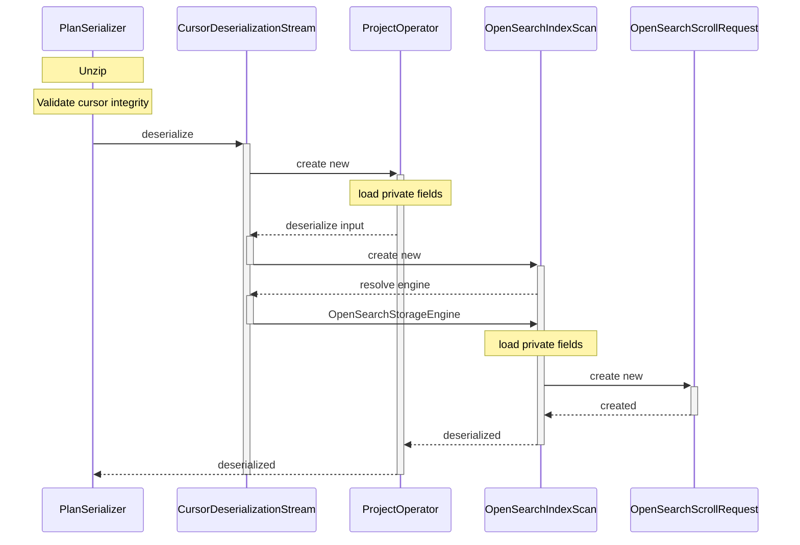

--------------------------------

### Configure OpenSearch SQL Slow Query Log Threshold

Source: https://github.com/opensearch-project/sql/blob/main/docs/user/admin/settings.rst

This example demonstrates how to dynamically update the `plugins.sql.slowlog` setting to define the time limit (in seconds) for queries to be considered "slow" and logged. This node-scoped setting defaults to `2` seconds.

```sh
curl -H 'Content-Type: application/json' -X PUT localhost:9200/_plugins/_query/settings -d '{
  "transient" : {
    "plugins.query.slowlog" : "10"
  }
}'
```

```json
{
  "acknowledged" : true,
  "persistent" : { },
  "transient" : {
    "plugins" : {
      "query" : {
        "slowlog" : "10"
      }
    }
  }
}
```

--------------------------------

### Verify Calcite Plugin Configuration in OpenSearch

Source: https://github.com/opensearch-project/sql/blob/main/docs/user/ppl/cmd/eventstats.rst

Illustrates the expected JSON response after successfully enabling the Calcite plugin in OpenSearch, confirming its activation.

```JSON
{
  "acknowledged": true,
  "persistent": {
    "plugins": {
      "calcite": {
        "enabled": "true"
      }
    }
  },
  "transient": {}
}
```

--------------------------------

### Implicit Type Conversion Examples in OpenSearch SQL

Source: https://github.com/opensearch-project/sql/blob/main/docs/user/general/datatypes.rst

Illustrates automatic type coercion in OpenSearch SQL queries. This snippet demonstrates how numerical, boolean, and date string comparisons are handled implicitly, resulting in boolean `True` outcomes.

```SQL
os> SELECT
...  1 = 1.0,
...  'True' = true,
...  DATE('2021-06-10') < '2021-06-11';
fetched rows / total rows = 1/1
+---------+---------------+-----------------------------------+
| 1 = 1.0 | 'True' = true | DATE('2021-06-10') < '2021-06-11' |
|---------+---------------+-----------------------------------|
| True    | True          | True                              |
+---------+---------------+-----------------------------------+
```

--------------------------------

### Order Results by Single Column in OpenSearch SQL

Source: https://github.com/opensearch-project/sql/blob/main/integ-test/src/test/resources/correctness/queries/orderby.txt

These queries demonstrate how to sort results by a single column (`FlightNum`) in ascending (ASC), descending (DESC), or default order using the `ORDER BY` clause in OpenSearch SQL. Case-insensitive keywords for `ASC` and `DESC` are also shown.

```SQL
SELECT FlightNum FROM opensearch_dashboards_sample_data_flights ORDER BY FlightNum
```

```SQL
SELECT FlightNum FROM opensearch_dashboards_sample_data_flights ORDER BY FlightNum ASC
```

```SQL
SELECT FlightNum FROM opensearch_dashboards_sample_data_flights ORDER BY FlightNum DESC
```

```SQL
SELECT FlightNum FROM opensearch_dashboards_sample_data_flights ORDER BY FlightNum asc
```

```SQL
SELECT FlightNum FROM opensearch_dashboards_sample_data_flights ORDER BY FlightNum desc
```

--------------------------------

### Customize Query String with Default Operator

Source: https://github.com/opensearch-project/sql/blob/main/docs/user/dql/functions.rst

This example shows how to use the `query_string` function with an optional parameter. It sets `default_operator` to 'AND' to refine the search for 'Pooh House' in the `title` field, ensuring both terms must be present.

```SQL
os> select id, title, author from books where query_string(['title'], 'Pooh House', default_operator='AND');
```

--------------------------------

### Java Interface: StorageEngine for Data Source Integration

Source: https://github.com/opensearch-project/sql/blob/main/docs/dev/datasource-prometheus.md

Defines the `StorageEngine` interface, a core component for integrating new data sources into the query engine. Implementations of this interface are responsible for providing `Table` instances based on a given name.

```Java
public interface StorageEngine {

  /**
   * Get {@link Table} from storage engine.
   */
  Table getTable(String name);
}
```

--------------------------------

### Filter Aggregate on an Expression in OpenSearch SQL

Source: https://github.com/opensearch-project/sql/blob/main/integ-test/src/test/resources/correctness/queries/filter.txt

This query demonstrates applying the FILTER clause to an aggregate function where the aggregated value itself is an expression (AvgTicketPrice + 1). The filter condition still applies to the 'Carrier' column.

```SQL
SELECT AVG(AvgTicketPrice + 1) FILTER(WHERE Carrier = 'OpenSearch Dashboards Airlines') AS filtered FROM opensearch_dashboards_sample_data_flights
```

--------------------------------

### Python OpenSearchIndex Logical to Physical Plan Transformation

Source: https://github.com/opensearch-project/sql/blob/main/docs/dev/query-optimizer-improvement.md

Illustrates the `OpenSearchIndex` class's `implement` method, which transforms a logical plan into a physical plan. It uses a `DefaultImplementor` to visit nodes, specifically converting `OpenSearchLogicalIndexScan` and `OpenSearchLogicalIndexAgg` into `OpenSearchIndexScan` physical operators.

```Python
class OpenSearchIndex:

  def implement(plan: LogicalPlan):
    return plan.accept(
      DefaultImplementor():
        def visitNode(node):
          if node is OpenSearchLogicalIndexScan:
            return OpenSearchIndexScan(...)
          else if node is OpenSearchLogicalIndexAgg:
            return OpenSearchIndexScan(...)
```

--------------------------------

### Get Sign of Number in OpenSearch SQL

Source: https://github.com/opensearch-project/sql/blob/main/docs/user/ppl/functions/math.rst

Returns the sign of a numerical argument as -1, 0, or 1, indicating whether the number is negative, zero, or positive. Supports INTEGER, LONG, FLOAT, and DOUBLE types.

```APIDOC
SIGN(x)
Description: Returns the sign of the argument as -1, 0, or 1, depending on whether the number is negative, zero, or positive
Argument type: INTEGER/LONG/FLOAT/DOUBLE
Return type: INTEGER
```

```OpenSearch SQL
os> source=people | eval `SIGN(1)` = SIGN(1), `SIGN(0)` = SIGN(0), `SIGN(-1.1)` = SIGN(-1.1) | fields `SIGN(1)`, `SIGN(0)`, `SIGN(-1.1)`
fetched rows / total rows = 1/1
+---------+---------+------------+
| SIGN(1) | SIGN(0) | SIGN(-1.1) |
|---------+---------+------------|
| 1       | 0       | -1         |
+---------+---------+------------+
```

--------------------------------

### Query Plan Processing Workflow Diagram

Source: https://github.com/opensearch-project/sql/blob/main/docs/dev/Pagination-v2.md

Illustrates the simplified workflow of query plan processing, showing the transformation from initial request to physical query plan through various stages like parsing, unresolved, abstract, logical, optimized, and physical plans.

```Mermaid
stateDiagram-v2
  state "Request" as NonPaged {
    direction LR
    state "Parse Tree" as Parse
    state "Unresolved Query Plan" as Unresolved
    state "Abstract Query Plan" as Abstract
    state "Logical Query Plan" as Logical
    state "Optimized Query Plan" as Optimized
    state "Physical Query Plan" as Physical

    [*] --> Parse : ANTLR
    Parse --> Unresolved : AstBuilder
    Unresolved --> Abstract : QueryPlanner
    Abstract --> Logical : Planner
    Logical --> Optimized : Optimizer
    Optimized --> Physical : Implementor
  }
```

--------------------------------

### Calculate Sample Standard Deviation of Ticket Price in OpenSearch SQL

Source: https://github.com/opensearch-project/sql/blob/main/integ-test/src/test/resources/correctness/queries/aggregation.txt

This query computes the sample standard deviation of 'AvgTicketPrice' for all records in the 'opensearch_dashboards_sample_data_flights' dataset. It uses the STDDEV_SAMP() aggregate function, appropriate for samples of a population.

```SQL
SELECT STDDEV_SAMP(AvgTicketPrice) FROM opensearch_dashboards_sample_data_flights
```

--------------------------------

### OpenSearch SQL Single-line Comments with # and --

Source: https://github.com/opensearch-project/sql/blob/main/docs/user/general/comments.rst

Demonstrates the use of single-line comments in OpenSearch SQL. Comments can start with '#' or '--', with the latter requiring at least one whitespace character following the dashes. All characters to the end of the line are ignored.

```SQL
os> #comments
... SELECT
... -- comments
... 123; -- comments
fetched rows / total rows = 1/1
+-----+
| 123 |
|-----|
| 123 |
+-----+
```

--------------------------------

### Detecting Anomalies in Non-Time-Series Data using AD Command (PPL)

Source: https://github.com/opensearch-project/sql/blob/main/docs/user/ppl/cmd/ad.rst

This example demonstrates how to train an RCF model and detect anomalies in non-time-series taxi ridership data using the `ad` command in PPL. It applies the batch RCF algorithm.

```PPL
> source=nyc_taxi | fields value | AD | where value=10844.0
fetched rows / total rows = 1/1
+---------+-------+-----------+
```

--------------------------------

### Enable Calcite Plugin for OpenSearch PPL

Source: https://github.com/opensearch-project/sql/blob/main/docs/user/ppl/cmd/appendcol.rst

Enables the Calcite plugin in OpenSearch, which is required for the `appendcol` command. This is done by sending a PUT request to the `_plugins/_query/settings` endpoint. The response confirms the successful enabling of the plugin.

```curl
curl -H 'Content-Type: application/json' -X PUT localhost:9200/_plugins/_query/settings -d '{
  "transient" : {
    "plugins.calcite.enabled" : true
  }
}'
```

```APIDOC
{
      "acknowledged": true,
      "persistent": {
        "plugins": {
          "calcite": {
            "enabled": "true"
          }
        }
      },
      "transient": {}
    }
```

--------------------------------

### Execute SQL Subquery with IN Clause

Source: https://github.com/opensearch-project/sql/blob/main/docs/user/dql/complex.rst

This example demonstrates a table subquery in OpenSearch SQL using the `IN` clause. It retrieves account details for users whose balance exceeds 10000, showcasing how a subquery can filter results based on another `SELECT` statement. The `Explain` output reveals how OpenSearch transforms this subquery into a `BlockHashJoin` for execution.

```JSON
POST /_plugins/_sql
{
  "query" : """
		SELECT a1.firstname, a1.lastname, a1.balance
		FROM accounts a1
		WHERE a1.account_number IN (
		  SELECT a2.account_number
		  FROM accounts a2
		  WHERE a2.balance > 10000
		)
		"""
}
```

```JSON
{
  "Physical Plan" : {
    "Project [ columns=[a1.balance, a1.firstname, a1.lastname] ]" : {
      "Top [ count=200 ]" : {
        "BlockHashJoin[ conditions=( a1.account_number = a2.account_number ), type=JOIN, blockSize=[FixedBlockSize with size=10000] ]" : {
          "Scroll [ accounts as a2, pageSize=10000 ]" : {
            "request" : {
              "size" : 200,
              "query" : {
                "bool" : {
                  "filter" : [
                    {
                      "bool" : {
                        "adjust_pure_negative" : true,
                        "must" : [
                          {
                            "bool" : {
                              "adjust_pure_negative" : true,
                              "must" : [
                                {
                                  "bool" : {
                                    "adjust_pure_negative" : true,
                                    "must_not" : [
                                      {
                                        "bool" : {
                                          "adjust_pure_negative" : true,
                                          "must_not" : [
                                            {
                                              "exists" : {
                                                "field" : "account_number",
                                                "boost" : 1
                                              }
                                            }
                                          ],
                                          "boost" : 1
                                        }
                                      }
                                    ],
                                    "boost" : 1
                                  }
                                },
                                {
                                  "range" : {
                                    "balance" : {
                                      "include_lower" : false,
                                      "include_upper" : true,
                                      "from" : 10000,
                                      "boost" : 1,
                                      "to" : null
                                    }
                                  }
                                }
                              ],
                              "boost" : 1
                            }
                          }
                        ],
                        "boost" : 1
                      }
                    }
                  ],
                  "adjust_pure_negative" : true,
                  "boost" : 1
                }
              },
              "from" : 0
            }
          },
          "Scroll [ accounts as a1, pageSize=10000 ]" : {
            "request" : {
              "size" : 200,
              "from" : 0,
              "_source" : {
                "excludes" : [ ],
                "includes" : [
                  "firstname",
                  "lastname",
                  "balance",
                  "account_number"
                ]
              }
            }
          },
          "useTermsFilterOptimization" : false
        }
      }
    }
  },
  "description" : "Hash Join algorithm builds hash table based on result of first query, and then probes hash table to find matched rows for each row returned by second query",
  "Logical Plan" : {
    "Project [ columns=[a1.balance, a1.firstname, a1.lastname] ]" : {
      "Top [ count=200 ]" : {
        "Join [ conditions=( a1.account_number = a2.account_number ) type=JOIN ]" : {
          "Group" : [
            {
              "Project [ columns=[a1.balance, a1.firstname, a1.lastname, a1.account_number] ]" : {
                "TableScan" : {

```

--------------------------------

### Sample CSV Data for OpenSearch Flight Records

Source: https://github.com/opensearch-project/sql/blob/main/docs/dev/testing-comparison-test.md

This CSV snippet provides an example of the test data format, including a header row with field names like `FlightNum`, `Origin`, `FlightDelay`, and `DistanceMiles`, followed by sample flight records. This data is used to populate OpenSearch indices for testing SQL queries.

```csv
FlightNum,Origin,FlightDelay,DistanceMiles,...,DestCityName
9HY9SWR,Frankfurt am Main Airport,false,10247.856675613455,...,Sydney
X98CCZO,Cape Town International Airport,false,5482.606664853586,...,Venice
......
```

--------------------------------

### DAYNAME Function API Reference and Usage in OpenSearch SQL

Source: https://github.com/opensearch-project/sql/blob/main/docs/user/ppl/functions/datetime.rst

API documentation for the DAYNAME function, which returns the name of the weekday for a given date. Includes argument types, return type, and an example demonstrating its usage.

```APIDOC
DAYNAME:
  Description: Returns the name of the weekday for date, including Monday, Tuesday, Wednesday, Thursday, Friday, Saturday and Sunday.
  Usage: dayname(date)
  Argument type: STRING/DATE/TIMESTAMP
  Return type: STRING
```

```SQL
os> source=people | eval `DAYNAME(DATE('2020-08-26'))` = DAYNAME(DATE('2020-08-26')) | fields `DAYNAME(DATE('2020-08-26'))`
```

--------------------------------

### Count Distinct Origins and Destinations in OpenSearch SQL

Source: https://github.com/opensearch-project/sql/blob/main/integ-test/src/test/resources/correctness/queries/aggregation.txt

This query counts the number of unique 'Origin' and 'Dest' values from the 'opensearch_dashboards_sample_data_flights' dataset in a single query. It demonstrates using COUNT(DISTINCT) for multiple columns simultaneously.

```SQL
SELECT COUNT(DISTINCT Origin), COUNT(DISTINCT Dest) FROM opensearch_dashboards_sample_data_flights
```

--------------------------------

### Add Sample Document to Bank Index (Full Data)

Source: https://github.com/opensearch-project/sql/blob/main/docs/dev/query-null-missing-value.md

Adds a sample document to the 'bank' index with both 'account_number' and 'age' fields populated. This document serves as a baseline for demonstrating query results.

```JSON
POST bank/_doc/1
{"account_number":1,"age":31}
```

--------------------------------

### Cast Values to Integer (INT/INTEGER) in OpenSearch SQL

Source: https://github.com/opensearch-project/sql/blob/main/integ-test/src/test/resources/correctness/expressions/cast.txt

Demonstrates casting various data types, including strings, numbers, and booleans, to integer (INT or INTEGER) in OpenSearch SQL. This shows how different source types are converted to their integer representations.

```SQL
cast('1' as int) as castInt
cast(1 as int) as castInt
cast(true as int) as castInt
cast(false as int) as castInt
cast('1' as integer) as castInteger
cast(2 as integer) as castInteger
cast(3.4 as integer) as castInteger
cast(true as integer) as castInteger
cast(false as integer) as castInteger
```

--------------------------------

### Aggregate Customer Data with Limit and Offset

Source: https://github.com/opensearch-project/sql/blob/main/integ-test/src/test/resources/correctness/bugfixes/441.txt

This SQL query aggregates customer data from the 'opensearch_dashboards_sample_data_ecommerce' index, counting orders per customer. It groups results by customer ID, orders them, and retrieves a specific range of 10 records starting from the 3rd record (offset 2).

```SQL
SELECT customer_id, count(*) AS label_value FROM opensearch_dashboards_sample_data_ecommerce GROUP BY customer_id ORDER BY customer_id LIMIT 10 OFFSET 2
```

--------------------------------

### Using Line Comments in PPL Queries

Source: https://github.com/opensearch-project/sql/blob/main/docs/user/ppl/general/comments.rst

Demonstrates how to use line comments in PPL queries. Line comments begin with `//` and extend to the end of the line, allowing for inline explanations of query parts.

```PPL
os> source=accounts | top gender // finds most common gender of all the accounts
```

--------------------------------

### DAYOFMONTH Function API Reference and Usage in OpenSearch SQL

Source: https://github.com/opensearch-project/sql/blob/main/docs/user/ppl/functions/datetime.rst

API documentation for the DAYOFMONTH function, which extracts the day of the month from a date. Includes argument types, return type, synonyms, and an example demonstrating its usage.

```APIDOC
DAYOFMONTH:
  Description: Extracts the day of the month for date, in the range 1 to 31.
  Usage: dayofmonth(date)
  Argument type: STRING/DATE/TIMESTAMP
  Return type: INTEGER
  Synonyms: DAY, DAY_OF_MONTH
```

```SQL
os> source=people | eval `DAYOFMONTH(DATE('2020-08-26'))` = DAYOFMONTH(DATE('2020-08-26')) | fields `DAYOFMONTH(DATE('2020-08-26'))`
```

--------------------------------

### SQL IFNULL Function Examples

Source: https://github.com/opensearch-project/sql/blob/main/integ-test/src/test/resources/correctness/expressions/conditionals.txt

Illustrates the usage of the SQL IFNULL function to handle NULL values, providing a default value when an expression evaluates to NULL. This is useful for ensuring data consistency and preventing errors from null propagation.

```SQL
IFNULL(null, AvgTicketPrice) from opensearch_dashboards_sample_data_flights
```

```SQL
IFNULL(AvgTicketPrice, 100) from opensearch_dashboards_sample_data_flights
```

```SQL
IFNULL(AvgTicketPrice, null) from opensearch_dashboards_sample_data_flights
```

--------------------------------

### Format Time with TIME_FORMAT Function in OpenSearch SQL

Source: https://github.com/opensearch-project/sql/blob/main/docs/user/ppl/functions/datetime.rst

Demonstrates how to use the TIME_FORMAT function to format a timestamp string according to a specified format string. The example shows various format specifiers for hours, minutes, seconds, and AM/PM.

```SQL
fetched rows / total rows = 1/1
+----------------------------------------------------------------------------+
| TIME_FORMAT('1998-01-31 13:14:15.012345', '%f %H %h %I %i %p %r %S %s %T') |
|----------------------------------------------------------------------------|
| 012345 13 01 01 14 PM 01:14:15 PM 15 15 13:14:15                           |
+----------------------------------------------------------------------------+
```

--------------------------------

### Clustering Iris Dataset with KMEANS in OpenSearch PPL

Source: https://github.com/opensearch-project/sql/blob/main/docs/user/ppl/cmd/ml.rst

This example illustrates how to apply the KMEANS algorithm to classify three Iris species (Iris setosa, Iris virginica, and Iris versicolor) based on sepal and petal measurements. It trains a KMEANS model with 3 centroids on the 'iris_data' dataset to group similar flower samples.

```PPL
os> source=iris_data | fields sepal_length_in_cm, sepal_width_in_cm, petal_length_in_cm, petal_width_in_cm | ml action='train' algorithm='kmeans' centroids=3
```

--------------------------------

### Detecting Categorized Anomalies in Time-Series Data using AD Command (PPL)

Source: https://github.com/opensearch-project/sql/blob/main/docs/user/ppl/cmd/ad.rst

This example shows how to use the `ad` command in PPL to detect anomalies in time-series taxi ridership data, independently for each category. It uses both 'timestamp' and 'category' fields.

```PPL
> source=nyc_taxi | fields category, value, timestamp | AD time_field='timestamp' category_field='category' | where value=10844.0 or value=6526.0
fetched rows / total rows = 2/2
+----------+---------+---------------------+-------+---------------+
| category | value   | timestamp           | score | anomaly_grade |
|----------+---------+---------------------+-------+---------------|
| night    | 10844.0 | 2014-07-01 00:00:00 | 0.0   | 0.0           |
| day      | 6526.0  | 2014-07-01 06:00:00 | 0.0   | 0.0           |
+----------+---------+---------------------+-------+---------------+
```

--------------------------------

### APIDOC: OpenSearch Relevance-Based Search Queries

Source: https://github.com/opensearch-project/sql/blob/main/docs/dev/opensearch-relevancy-search.md

This section documents various relevance-based search query types available in OpenSearch. For each query type, it lists advanced options for common parameters and provides a basic JSON query example, illustrating the structure and usage of these search functionalities.

```APIDOC
Query Type: Match query
  Advanced options for common parameter: enable synonyms, fuzziness options, max expansions, prefix length, lenient, operator, minimum should match, zero terms query
  Example of basic query: {"query": {"match": {"message": {"query": "this is a test"}}}}

Query Type: Match phrase query
  Advanced options for common parameter: zero terms query
  Example of basic query: {"query": {"match_phrase": {"message": "this is a test"}}}

Query Type: Match phrase prefix query
  Advanced options for common parameter: max expansions, slop, zero terms query
  Example of basic query: {"query": {"match_phrase_prefix": {"message": {"query": "quick brown f"}}}}

Query Type: Match boolean prefix query
  Advanced options for common parameter: fuzziness options, max expansions, prefix length, operator, minimum should match
  Example of basic query: {"query": {"match_bool_prefix" : {"message" : "quick brown f"}}}

Query Type: Multi match query
  Advanced options for common parameter: type (best fields, most fields, cross fields, phrase, phrase prefix, bool prefix)
  Example of basic query: {"query": {"multi_match" : {"query":      "brown fox","type":       "best_fields","fields":     [ "subject", "message" ],"tie_breaker": 0.3}}}

Query Type: Combined fields
  Advanced options for common parameter: enable synonyms, operator, minimum should match, zero terms query
  Example of basic query: {"query": {"combined_fields" : {"query":      "database systems","fields":     [ "title", "abstract", "body"],"operator":   "and"}}}

Query Type: Common terms query
  Advanced options for common parameter: minimum should match, low/high frequency operator, cutoff frequency, boost
  Example of basic query: {"query": {"common": {"body": {"query": "this is bonsai cool","cutoff_frequency": 0.001}}}}

Query Type: Query string
  Advanced options for common parameter: wildcard options, enable synonyms, boost, operator, enable position increments, fields (multi fields search), fuzziness options, lenient, max determined states, minimum should match, quote analyzer, phrase slop, quote field suffix, rewrite, time zone
  Example of basic query: {"query": {"query_string": {"query": "(new york city) OR (big apple)","default_field": "content"}}}

Query Type: Simple query string
  Advanced options for common parameter: operator, enable all fields search, analyze wildcard, enable synonyms, flags, fuzziness options, lenient, minimum should match, quote field suffix
  Example of basic query: {"query": {"simple_query_string" : {"query": "\"fried eggs\" +(eggplant | potato) -frittata","fields": ["title^5", "body"],"default_operator": "and"}}}}
```

--------------------------------

### Create New Field with eval Command in OpenSearch SQL

Source: https://github.com/opensearch-project/sql/blob/main/docs/user/ppl/cmd/eval.rst

This example demonstrates how to use the `eval` command to create a new field, `doubleAge`, by multiplying the `age` field by 2. The result is appended to the search results, showing both the original `age` and the newly created `doubleAge` fields.

```OpenSearch SQL
os> source=accounts | eval doubleAge = age * 2 | fields age, doubleAge ;
```

--------------------------------

### SQL Subquery with Grouping and Having Clause

Source: https://github.com/opensearch-project/sql/blob/main/integ-test/src/test/resources/correctness/queries/subqueries.txt

This query uses a `HAVING` clause to filter groups based on an aggregate condition. The inner subquery selects `Origin` and `AvgTicketPrice`, and the outer query groups by `Origin` and filters groups where the minimum `AvgTicketPrice` is greater than 500.

```SQL
SELECT Origin FROM (SELECT Origin, AvgTicketPrice FROM opensearch_dashboards_sample_data_flights) AS flights GROUP BY Origin HAVING MIN(AvgTicketPrice) > 500
```

--------------------------------

### Cast Values to Timestamp, Date, and Time in OpenSearch SQL

Source: https://github.com/opensearch-project/sql/blob/main/integ-test/src/test/resources/correctness/expressions/cast.txt

Shows how to convert string literals into specific date and time types: TIMESTAMP, DATE, and TIME. This is crucial for handling temporal data correctly in OpenSearch SQL queries.

```SQL
cast('2012-08-07 01:01:01' as timestamp) as castTimestamp
cast('2012-08-07' as date) as castDate
cast('01:01:01' as time) as castTime
```

--------------------------------

### Find Minimum Value with MIN() in OpenSearch PPL

Source: https://github.com/opensearch-project/sql/blob/main/docs/user/ppl/cmd/eventstats.rst

This snippet illustrates the use of the `MIN(expr)` aggregate function in OpenSearch PPL. It returns the lowest value of a specified numeric expression. The example calculates the minimum `age`, grouped by `gender` using the `eventstats` command.

```PPL
source=accounts | eventstats min(age) by gender;
```

--------------------------------

### Add New Catalog Configuration to OpenSearch Keystore

Source: https://github.com/opensearch-project/sql/blob/main/docs/dev/datasource-prometheus.md

Command-line instruction to securely add a new catalog configuration, stored in 'catalog.json', to the OpenSearch keystore. This method is used for sensitive data like credentials, ensuring they are not exposed directly in configuration files.

```Shell
bin/opensearch-keystore add-file plugins.query.federation.catalog.config catalog.json
```

--------------------------------

### Update OpenSearch SQL Cursor Keep-Alive Setting via cURL

Source: https://github.com/opensearch-project/sql/blob/main/docs/dev/opensearch-pagination.md

Demonstrates how to dynamically update the `plugins.sql.cursor.keep_alive` setting in an OpenSearch cluster using a cURL PUT request. The example sets the transient value to 200 seconds and shows the expected JSON response.

```shell
curl -H 'Content-Type: application/json' -X PUT localhost:9200/_cluster/settings -d '{
  "transient" : {
    "plugins.sql.cursor.keep_alive" : "200s"
  }
}'
```

```json
{
  "acknowledged" : true,
  "persistent" : { },
  "transient" : {
    "plugins" : {
      "sql" : {
        "cursor" : {
          "keep_alive" : "200s"
        }
      }
    }
  }
}
```

--------------------------------

### Aggregate Over Multiple Time Series

Source: https://github.com/opensearch-project/sql/blob/main/docs/dev/datasource-prometheus.md

Illustrates how to perform aggregation operations like `sum` on time series data using PromQL and PPL. Examples include basic summation, grouping by specific labels, and a note on the current lack of `without` support in PPL.

```PromQL
sum(node_filesystem_size_bytes)
```

```PPL
source = promcatalog.`node_filesystem_size_bytes `| stats sum(@value) by span(@timestamp, 5m)
```

```PromQL
sum by(job, instance) (node_filesystem_size_bytes)
```

```PPL
source = promcatalog.`node_filesystem_size_bytes `| stats sum(@value) by instance, job span(@timestamp, 5m)
```

```PromQL
sum without(instance, job) (node_filesystem_size_bytes)
```

```PPL
source = promcatalog.`node_filesystem_size_bytes `| stats sum(@value) without instance, job
```

--------------------------------

### Detecting Anomalies in Time-Series Data using AD Command (PPL)

Source: https://github.com/opensearch-project/sql/blob/main/docs/user/ppl/cmd/ad.rst

This example demonstrates how to train an RCF model and detect anomalies in time-series taxi ridership data using the `ad` command in PPL. It specifies 'timestamp' as the time field.

```PPL
> source=nyc_taxi | fields value, timestamp | AD time_field='timestamp' | where value=10844.0
fetched rows / total rows = 1/1
+---------+---------------------+-------+---------------+
| value   | timestamp           | score | anomaly_grade |
|---------+---------------------+-------+---------------|
| 10844.0 | 2014-07-01 00:00:00 | 0.0   | 0.0           |
+---------+---------------------+-------+---------------+
```

--------------------------------

### SQL Query for Flights with Origin AND Destination

Source: https://github.com/opensearch-project/sql/blob/main/integ-test/src/test/resources/correctness/bugfixes/237.txt

This SQL query selects flights where the origin is 'Munich Airport' AND the destination is 'Venice Marco Polo Airport'. It uses the AND logical operator to combine two conditions, returning a boolean result aliased as 'Calculation_462181953506873347' for each row.

```SQL
SELECT ((Origin = 'Munich Airport') AND (Dest = 'Venice Marco Polo Airport')) AS Calculation_462181953506873347 FROM opensearch_dashboards_sample_data_flights
```

--------------------------------

### Get Quarter of Year from Date in OpenSearch SQL

Source: https://github.com/opensearch-project/sql/blob/main/docs/user/ppl/functions/datetime.rst

The `QUARTER` function returns the quarter of the year (1-4) for a given date. It accepts STRING, DATE, or TIMESTAMP types as input and returns an INTEGER.

```APIDOC
QUARTER
  Description: Returns the quarter of the year for date, in the range 1 to 4.
  Usage: quarter(date)
  Argument type: STRING/DATE/TIMESTAMP
  Return type: INTEGER
```

```OpenSearch SQL
source=people | eval `QUARTER(DATE('2020-08-26'))` = QUARTER(DATE('2020-08-26')) | fields `QUARTER(DATE('2020-08-26'))`
```

--------------------------------

### Enable Calcite Engine for OpenSearch SQL Subqueries

Source: https://github.com/opensearch-project/sql/blob/main/docs/user/ppl/cmd/subquery.rst

This `cURL` command demonstrates how to enable the experimental Calcite engine in OpenSearch, which is a prerequisite for using subquery functionality. The setting is applied as a transient plugin configuration.

```cURL
curl -H 'Content-Type: application/json' -X PUT localhost:9200/_plugins/_query/settings -d '{
  "transient" : {
    "plugins.calcite.enabled" : true
  }
}'
```

--------------------------------

### SQL Query with Multiple SCORE Conditions and Boosts

Source: https://github.com/opensearch-project/sql/blob/main/docs/user/dql/functions.rst

Shows how to combine multiple SCORE() function calls within a single OpenSearch SQL query using logical operators. This example applies different boosts to documents matching 'Pooh House' and 'Winnie'.

```SQL
os> select id, title, author, _score from books where score(query('title:Pooh House', default_operator='AND'), 5.0) OR score(query('title:Winnie', default_operator='AND'), 1.5);
```

--------------------------------

### OpenSearch SQL: SELECT Statement Full Syntax

Source: https://github.com/opensearch-project/sql/blob/main/docs/user/dql/basics.rst

Defines the complete syntax for the SQL SELECT statement in OpenSearch, including optional clauses like WHERE, GROUP BY, HAVING, ORDER BY, and LIMIT, and notes on semicolon usage.

```APIDOC
SELECT [ALL | DISTINCT] (* | expression) [[AS] alias] [, ...]
FROM index_name
[WHERE predicates]
[GROUP BY expression [, ...]
   [HAVING predicates]]
[ORDER BY expression [ASC | DESC] [NULLS {FIRST | LAST}] [, ...]]
[LIMIT [offset, ] size]
```

--------------------------------

### Querying Cross-Cluster Indices in OpenSearch SQL

Source: https://github.com/opensearch-project/sql/blob/main/docs/user/ppl/general/identifiers.rst

Shows how to query an index located on a remote cluster using a cross-cluster index identifier, which prefixes the index name with the cluster identifier and a colon. This example queries the 'accounts' index on 'my_cluster'.

```OpenSearch SQL
source=my_cluster:accounts
```

--------------------------------

### Perform Vector Arithmetic Between Time Series

Source: https://github.com/opensearch-project/sql/blob/main/docs/dev/datasource-prometheus.md

Shows how to apply arithmetic operations (`+`, `-`, `*`, `/`, `%`, `^`) between time series using PromQL and PPL's `vector_op` command. Examples cover adding all equally-labelled series, matching on specific labels (`on`), ignoring specific labels (`ignoring`), and using `group_left` to include labels from the right side.

```PromQL
node_memory_MemFree_bytes + node_memory_Cached_bytes
```

```PPL
source = promcatalog.`node_memory_MemFree_bytes `| `vector_op`(+) promcatalog.`node_memory_Cached_bytes`
```

```PromQL
node_memory_MemFree_bytes + on(instance, job) node_memory_Cached_bytes
```

```PPL
source = promcatalog.`node_memory_MemFree_bytes `| `vector_op`(+) on(instance, job) promcatalog.`node_memory_Cached_bytes`
```

```PromQL
node_memory_MemFree_bytes + ignoring(instance, job) node_memory_Cached_bytes
```

```PPL
source = promcatalog.`node_memory_MemFree_bytes `| `vector_op`(+) ignoring(instance, job) promcatalog.`node_memory_Cached_bytes`
```

```PromQL
rate(demo_cpu_usage_seconds_total[1m]) / on(instance, job) group_left demo_num_cpus
```

```PPL
source = `rate(promcatalog.demo_cpu_usage_seconds_total[1m]) ` | `vector_op`(/) on(instance, job) group_left promcatalog.`node_memory_Cached_bytes`
```

```PromQL
node_filesystem_avail_bytes * on(instance, job) group_left(version) node_exporter_build_info
```

```PPL
source = promcatalog.`node_filesystem_avail_bytes` | `vector_op`(*) on(instance, job) group_left(version) promcatalog.`node_exporter_build_info`
```

--------------------------------

### Get Month Name from Date in OpenSearch SQL

Source: https://github.com/opensearch-project/sql/blob/main/docs/user/ppl/functions/datetime.rst

The `MONTHNAME` function returns the full name of the month for a given date. It accepts STRING, DATE, or TIMESTAMP types as input and returns a STRING.

```APIDOC
MONTHNAME
  Description: Returns the full name of the month for date.
  Usage: monthname(date)
  Argument type: STRING/DATE/TIMESTAMP
  Return type: STRING
```

```OpenSearch SQL
source=people | eval `MONTHNAME(DATE('2020-08-26'))` = MONTHNAME(DATE('2020-08-26')) | fields `MONTHNAME(DATE('2020-08-26'))`
```

--------------------------------

### OpenSearch SQL Queries for Flight Data Filtering

Source: https://github.com/opensearch-project/sql/blob/main/integ-test/src/test/resources/correctness/bugfixes/234.txt

These SQL queries illustrate how to filter data in OpenSearch using various conditions within the WHERE clause. The first query filters based on an arithmetic expression, while the second uses mathematical functions like ROUND and ABS.

```SQL
SELECT FlightNum FROM opensearch_dashboards_sample_data_flights where (AvgTicketPrice + 100) <= 1000
```

```SQL
SELECT FlightNum FROM opensearch_dashboards_sample_data_flights where ROUND(FlightTimeMin) > ABS(FlightDelayMin)
```

--------------------------------

### OpenSearch PPL String Data Type Definition

Source: https://github.com/opensearch-project/sql/blob/main/docs/user/ppl/general/datatypes.rst

Explains the String data type in OpenSearch PPL. It defines a string as a sequence of characters enclosed in either single or double quotes, providing examples of valid string literals.

```APIDOC
A string is a sequence of characters enclosed in either single or double quotes. For example, both 'text' and "text" will be treated as string literal.
```

--------------------------------

### Configure PPL Permissions Using Rest API

Source: https://github.com/opensearch-project/sql/blob/main/docs/user/ppl/admin/security.rst

This section demonstrates how to create a custom role ('ppl_role') with the necessary cluster and index permissions for the PPL plugin, and then map a specific user ('test_user') to this role using OpenSearch's Security Rest API. This allows 'test_user' to query the 'ppl-security-demo' index.

```sh
PUT _plugins/_security/api/roles/ppl_role
{
  "cluster_permissions": [
    "cluster:admin/opensearch/ppl"
  ],
  "index_permissions": [{
    "index_patterns": [
      "ppl-security-demo"
    ],
    "allowed_actions": [
      "indices:data/read/search*",
      "indices:admin/mappings/get",
      "indices:monitor/settings/get"
    ]
  }]
}
```

```sh
PUT _plugins/_security/api/rolesmapping/ppl_role
{
  "backend_roles" : [],
  "hosts" : [],
  "users" : ["test_user"]
}
```

--------------------------------

### Perform Match Query with Single Argument in OpenSearch SQL

Source: https://github.com/opensearch-project/sql/blob/main/docs/user/beyond/fulltext.rst

Illustrates an alternative syntax for `MATCH_QUERY` where the field is implicitly derived from the `WHERE` clause's left-hand side. This example searches the `address` field for 'Holmes' by assigning the `MATCH_QUERY` function's result to the field. The `Explain` output confirms the underlying OpenSearch `match` query is identical to the two-argument version.

```SQL
POST /_plugins/_sql
{
  "query" : """
		SELECT account_number, address
		FROM accounts
		WHERE address = MATCH_QUERY('Holmes')
		"""
}
```

```JSON
{
  "from" : 0,
  "size" : 200,
  "query" : {
    "bool" : {
      "filter" : [
        {
          "bool" : {
            "must" : [
              {
                "match" : {
                  "address" : {
                    "query" : "Holmes",
                    "operator" : "OR",
                    "prefix_length" : 0,
                    "max_expansions" : 50,
                    "fuzzy_transpositions" : true,
                    "lenient" : false,
                    "zero_terms_query" : "NONE",
                    "auto_generate_synonyms_phrase_query" : true,
                    "boost" : 1.0
                  }
                }
              }
            ],
            "adjust_pure_negative" : true,
            "boost" : 1.0
          }
        }
      ],
      "adjust_pure_negative" : true,
      "boost" : 1.0
    }
  },
  "_source" : {
    "includes" : [
      "account_number",
      "address"
    ],
    "excludes" : [ ]
  }
}
```

--------------------------------

### OpenSearch SQL Server-Side Cursor API Protocol

Source: https://github.com/opensearch-project/sql/blob/main/docs/dev/opensearch-pagination.md

This API documentation outlines the request-response protocol for managing server-side cursors in OpenSearch SQL. It demonstrates how to create a cursor with an initial query and fetch size, retrieve subsequent pages using the provided cursor ID, and explicitly clear the cursor's state to conserve server resources. The client only needs to manage the 'cursor' field to navigate through results, decoupling parsing logic.

```APIDOC
# 1.Creates a cursor
POST _plugins/_sql?format=jdbc
{
  "query": "SELECT * FROM accounts",
  "fetch_size": 5
}

# Response
{
  "status": 200,
  "total": 100,
  "size": 5,
  "schema": [...],
  "datarows": [...],
  "cursor": "cursorId"
}

# 2.Fetch next page by cursor provided in previous response
POST _plugins/_sql?format=jdbc
{
  "cursor": "cursorId"
}
# Response
{
  "datarows": [...],
  "cursor": "cursorId"
}

# No cursor in the last page
{
  "datarows": [...]
}


# 4.Clear the state forcibly earlier than last page be reached
POST _plugins/_sql/close
{
  "cursor": "cursorId"
}

# Response
{
    "succeeded" : true
}
```

--------------------------------

### Override Existing Field with eval Command in OpenSearch SQL

Source: https://github.com/opensearch-project/sql/blob/main/docs/user/ppl/cmd/eval.rst

This example illustrates how to use the `eval` command to override an existing field, `age`, by incrementing its value by 1. The modified `age` field is then displayed, showing the updated values.

```OpenSearch SQL
os> source=accounts | eval age = age + 1 | fields age ;
```

--------------------------------

### Retrieve OpenSearch SQL Query Results in CSV Format

Source: https://github.com/opensearch-project/sql/blob/main/docs/user/interfaces/protocol.rst

This example demonstrates how to retrieve query results from the OpenSearch SQL plugin in CSV format by appending `?format=csv` to the endpoint. The response is a plain text CSV string, suitable for direct download or parsing. The formatter applies sanitization rules for special characters and commas to ensure data integrity.

```sh
curl -H 'Content-Type: application/json' -X POST localhost:9200/_plugins/_sql?format=csv -d '{
  "query" : "SELECT firstname, lastname, age FROM accounts ORDER BY age"
}'
```

```csv
firstname,lastname,age
Nanette,Bates,28
Amber,Duke,32
Dale,Adams,33
Hattie,Bond,36
```

--------------------------------

### Querying Nested Documents with Cartesian Product in OpenSearch SQL

Source: https://github.com/opensearch-project/sql/blob/main/docs/user/beyond/partiql.rst

This example demonstrates how to query nested documents where the result set is a Cartesian product between parent and matched nested documents. It uses a LIKE predicate on a nested field and shows the corresponding OpenSearch 'explain' output, highlighting the 'nested' query structure.

```SQL
POST /_plugins/_sql
{
  "query" : """
		SELECT e.name AS employeeName,
		       p.name AS projectName
		FROM employees_nested AS e,
		     e.projects AS p
		WHERE p.name LIKE '%security%'
		"""
}
```

```JSON
{
  "from" : 0,
  "size" : 200,
  "query" : {
    "bool" : {
      "filter" : [
        {
          "bool" : {
            "must" : [
              {
                "nested" : {
                  "query" : {
                    "wildcard" : {
                      "projects.name" : {
                        "wildcard" : "*security*",
                        "boost" : 1.0
                      }
                    }
                  },
                  "path" : "projects",
                  "ignore_unmapped" : false,
                  "score_mode" : "none",
                  "boost" : 1.0,
                  "inner_hits" : {
                    "ignore_unmapped" : false,
                    "from" : 0,
                    "size" : 3,
                    "version" : false,
                    "seq_no_primary_term" : false,
                    "explain" : false,
                    "track_scores" : false,
                    "_source" : {
                      "includes" : [
                        "projects.name"
                      ],
                      "excludes" : [ ]
                    }
                  }
                }
              }
            ],
            "adjust_pure_negative" : true,
            "boost" : 1.0
          }
        }
      ],
      "adjust_pure_negative" : true,
      "boost" : 1.0
    }
  },
  "_source" : {
    "includes" : [
      "name"
    ],
    "excludes" : [ ]
  }
}
```

--------------------------------

### SQL Subquery with Inner and Outer Aliasing

Source: https://github.com/opensearch-project/sql/blob/main/integ-test/src/test/resources/correctness/queries/subqueries.txt

This query showcases both inner and outer aliasing. The inner subquery aliases the `Origin` column as `o`, and the subquery result itself is aliased as `f`. The outer query then selects the `o` column using the `f` alias.

```SQL
SELECT f.o FROM (SELECT Origin AS o FROM opensearch_dashboards_sample_data_flights) AS f
```

--------------------------------

### Java Physical Plan Generation from Logical Plan

Source: https://github.com/opensearch-project/sql/blob/main/docs/dev/query-optimizer-improvement.md

Presents a Java `plan` method that attempts to generate a physical plan from a logical plan. It first finds a `Table` within the logical plan and, if found, uses the table's `implement` method after optimizing the plan. This method highlights a limitation where only one table can perform the `implement` operation, blocking multi-table queries like JOINs or `INSERT ... SELECT`.

```Java
  public PhysicalPlan plan(LogicalPlan plan) {
    Table table = findTable(plan);
    if (table == null) {
      return plan.accept(new DefaultImplementor<>(), null);
    }
    return table.implement(
        table.optimize(optimize(plan)));
  }
```

--------------------------------

### OpenSearch SQL: Cast to Number Example

Source: https://github.com/opensearch-project/sql/blob/main/docs/user/ppl/functions/conversion.rst

Illustrates casting boolean and string values to an integer type using the `CAST` function in OpenSearch SQL. This snippet highlights how `true` converts to `1` and a string numeral converts to its integer equivalent.

```OpenSearch SQL
os> source=people | eval `cbool` = CAST(true as int), `cstring` = CAST('1' as int) | fields `cbool`, `cstring`
fetched rows / total rows = 1/1
+-------+---------+
| cbool | cstring |
|-------+---------|
| 1     | 1       |
+-------+---------+
```

--------------------------------

### Listing Views Associated with an S3 Table in OpenSearch SQL

Source: https://github.com/opensearch-project/sql/blob/main/docs/dev/datasource-query-s3.md

Demonstrates how to list all views associated with a specific S3-backed table (`s3.httpLog`), including both user-created and Maximus-generated transient views. The return example `httplog-tempView-xxxx` shows a typical output for a temporary view.

```SQL
LIST VIEW on `s3`.`httpLog`
```

--------------------------------

### Arithmetic Operation on Filtered Aggregate in OpenSearch SQL

Source: https://github.com/opensearch-project/sql/blob/main/integ-test/src/test/resources/correctness/queries/filter.txt

This snippet shows how to perform arithmetic operations on the result of an aggregate function that uses a FILTER clause. The average ticket price for filtered flights is calculated and then divided by 2.

```SQL
SELECT AVG(AvgTicketPrice) FILTER(WHERE Carrier = 'OpenSearch Dashboards Airlines') / 2 AS filtered FROM opensearch_dashboards_sample_data_flights
```

--------------------------------

### SQL Subquery with Inner Filtering and Aliasing

Source: https://github.com/opensearch-project/sql/blob/main/integ-test/src/test/resources/correctness/queries/subqueries.txt

This query filters data within the subquery based on `AvgTicketPrice > 100` and aliases `Origin` as `origin` and `AvgTicketPrice` as `price`. The outer query then selects the `origin` column from the filtered and aliased result set.

```SQL
SELECT origin FROM (SELECT Origin AS origin, AvgTicketPrice AS price FROM opensearch_dashboards_sample_data_flights WHERE AvgTicketPrice > 100) AS f
```

--------------------------------

### Submit Async Query in Session Mode

Source: https://github.com/opensearch-project/sql/blob/main/docs/user/interfaces/asyncqueryinterface.rst

Example `curl` request to submit an asynchronous SQL query, demonstrating session-based execution. If `plugins.query.executionengine.spark.session.enabled` is true, queries submitted to the same session will be executed in the same SparkContext. Sessions auto-close after 10 minutes of inactivity.

```sh
curl --location 'http://localhost:9200/_plugins/_async_query' \
--header 'Content-Type: application/json' \
--data '{
    "datasource" : "my_glue",
    "lang" : "sql",
    "query" : "select * from my_glue.default.http_logs limit 10"
}'
```

```json
{
  "queryId": "HlbM61kX6MDkAktO"
}
```

--------------------------------

### Detecting Anomalies with RCF in OpenSearch PPL

Source: https://github.com/opensearch-project/sql/blob/main/docs/user/ppl/cmd/ml.rst

This example demonstrates how to train an RCF (Random Cut Forest) model and use it to detect anomalies in non-time-series data with multiple category values. It specifically filters for values 10844.0 or 6526.0 after training the model on NYC taxi ridership data.

```PPL
os> source=nyc_taxi | fields category, value | ml action='train' algorithm='rcf' category_field='category' | where value=10844.0 or value=6526.0
```

--------------------------------

### Configure OpenSearch Streaming Job Housekeeper Interval

Source: https://github.com/opensearch-project/sql/blob/main/docs/user/admin/settings.rst

This setting controls the frequency at which the streaming job housekeeper runs to clean up jobs linked to deleted or disabled data sources. The default interval is 15 minutes, and this example demonstrates how to dynamically change it to 30 minutes using a `curl` command.

```APIDOC
plugins.query.executionengine.spark.streamingjobs.housekeeper.interval
Description
This setting specifies the interval at which the streaming job housekeeper runs to clean up streaming jobs associated with deleted and disabled data sources.
The default configuration executes this cleanup every 15 minutes.
* Default Value: 15 minutes
```

```sh
curl -sS -H 'Content-Type: application/json' -X PUT localhost:9200/_cluster/settings -d '{"transient":{"plugins.query.executionengine.spark.streamingjobs.housekeeper.interval":"30m"}}'
{
"acknowledged": true,
"persistent": {},
"transient": {
"plugins": {
"query": {
"executionengine": {
"spark": {
"streamingjobs": {
"housekeeper": {
"interval": "30m"
}
}
}
}
}
}
}
}
}
```

--------------------------------

### Find Maximum Value with MAX() in OpenSearch PPL

Source: https://github.com/opensearch-project/sql/blob/main/docs/user/ppl/cmd/eventstats.rst

This snippet demonstrates the `MAX(expr)` aggregate function in OpenSearch PPL. It returns the highest value of a specified numeric expression within a dataset. The example shows finding the maximum `age` across all accounts.

```PPL
source=accounts | eventstats max(age);
```

--------------------------------

### PPL Query for Extended Explain Mode

Source: https://github.com/opensearch-project/sql/blob/main/docs/user/ppl/cmd/explain.rst

A PPL (Pipe Processing Language) query demonstrating the use of `explain extended` to analyze its execution plan. This query filters data from `state_country` by 'USA' or 'England' and then counts records grouped by country.

```PPL
explain extended source=state_country | where country = 'USA' OR country = 'England' | stats count() by country
```

--------------------------------

### SQL Examples for Boolean Data Types and Casting

Source: https://github.com/opensearch-project/sql/blob/main/docs/user/general/datatypes.rst

This snippet showcases the representation of boolean values (`TRUE`, `FALSE`) in OpenSearch SQL. It also demonstrates how string representations (`'TRUE'`, `'false'`) can be explicitly cast to boolean types, highlighting implicit conversion capabilities.

```sql
SELECT
 true, FALSE,
 CAST('TRUE' AS boolean), CAST('false' AS boolean);
```

--------------------------------

### Update Spark Session Limit Setting

Source: https://github.com/opensearch-project/sql/blob/main/docs/user/admin/settings.rst

This setting controls the maximum number of concurrent Spark sessions. It is node-scoped and can be updated dynamically. The example demonstrates how to set the limit to 200 using a PUT request to the `_cluster/settings` endpoint.

```sh
sh$ curl -sS -H 'Content-Type: application/json' -X PUT localhost:9200/_cluster/settings \
 -d '{"transient":{"plugins.query.executionengine.spark.session.limit":200}}'
{
  "acknowledged": true,
  "persistent": {},
  "transient": {
    "plugins": {
      "query": {
        "executionengine": {
          "spark": {
            "session": {
              "limit": "200"
            }
          }
        }
      }
    }
  }
}
```

--------------------------------

### Run OpenSearch SQL Comparison Test with Specific Tested Database

Source: https://github.com/opensearch-project/sql/blob/main/docs/dev/testing-comparison-test.md

This Gradle command executes the OpenSearch SQL comparison integration test, directing it to use a specific JDBC URL for the database under test. The `-DdbUrl` argument overrides the default OpenSearch connection, allowing testing against other databases like SQLite.

```Shell
./gradlew :integ-test:comparisonTest -Dqueries=sanity_integration_tests.txt -DdbUrl=jdbc:sqlite::memory:
```

--------------------------------

### SQL Query with Custom Default Operator

Source: https://github.com/opensearch-project/sql/blob/main/docs/user/dql/functions.rst

Demonstrates how to use the query() function in OpenSearch SQL to search for documents, specifying a custom default_operator for the search expression. This example retrieves book details where the title contains 'Pooh House' with an 'AND' operator.

```SQL
os> select id, title, author from books where query('title:Pooh House', default_operator='AND');
```

--------------------------------

### Extract Year from Date in OpenSearch SQL

Source: https://github.com/opensearch-project/sql/blob/main/docs/user/ppl/functions/datetime.rst

The `YEAR` function extracts the year component from a given date. It returns an integer representing the year. The example demonstrates its usage with a specific date and shows the resulting year.

```OpenSearch SQL
os> source=people | eval `YEAR(DATE('2020-08-26'))` = YEAR(DATE('2020-08-26')) | fields `YEAR(DATE('2020-08-26'))`
fetched rows / total rows = 1/1
+--------------------------+
| YEAR(DATE('2020-08-26')) |
|--------------------------|
| 2020                     |
+--------------------------+
```

--------------------------------

### Ad-hoc Querying an S3 Table in OpenSearch PPL

Source: https://github.com/opensearch-project/sql/blob/main/docs/dev/datasource-query-s3.md

Example of an ad-hoc PPL query against an S3-backed table (`s3.httpLog`). Maximus creates a transient view at runtime to populate data. This query filters for non-200 status codes and counts occurrences by status and 5-minute spans.

```PPL
source=`s3`.`httpLog` status != 200 | status count() as cnt by span(5mins), status
```

--------------------------------

### OpenSearch DSL Explanation for SQL Query with SCORE

Source: https://github.com/opensearch-project/sql/blob/main/docs/user/beyond/fulltext.rst

This JSON object represents the OpenSearch DSL equivalent of the provided SQL query, obtained using the `EXPLAIN` command. It details how the `SCORE` and `MATCH_QUERY` functions are translated into `constant_score` and `match` queries within a `bool` clause, explicitly showing the applied boosts and the `_score` based sorting.

```JSON
{
  "from" : 0,
  "size" : 200,
  "query" : {
    "bool" : {
      "must" : [
        {
          "bool" : {
            "should" : [
              {
                "constant_score" : {
                  "filter" : {
                    "match" : {
                      "address" : {
                        "query" : "Lane",
                        "operator" : "OR",
                        "prefix_length" : 0,
                        "max_expansions" : 50,
                        "fuzzy_transpositions" : true,
                        "lenient" : false,
                        "zero_terms_query" : "NONE",
                        "auto_generate_synonyms_phrase_query" : true,
                        "boost" : 1.0
                      }
                    }
                  },
                  "boost" : 0.5
                }
              },
              {
                "constant_score" : {
                  "filter" : {
                    "match" : {
                      "address" : {
                        "query" : "Street",
                        "operator" : "OR",
                        "prefix_length" : 0,
                        "max_expansions" : 50,
                        "fuzzy_transpositions" : true,
                        "lenient" : false,
                        "zero_terms_query" : "NONE",
                        "auto_generate_synonyms_phrase_query" : true,
                        "boost" : 1.0
                      }
                    }
                  },
                  "boost" : 100.0
                }
              }
            ],
            "adjust_pure_negative" : true,
            "boost" : 1.0
          }
        }
      ],
      "adjust_pure_negative" : true,
      "boost" : 1.0
    }
  },
  "_source" : {
    "includes" : [
      "account_number",
      "address",
      "_score"
    ],
    "excludes" : [ ]
  },
  "sort" : [
    {
      "_score" : {
        "order" : "asc"
      }
    }
  ]
}
```

--------------------------------

### OpenSearch SQL: multi_match Query with Custom Operator and Analyzer

Source: https://github.com/opensearch-project/sql/blob/main/docs/user/dql/functions.rst

Demonstrates how to customize optional parameters for the `multi_match` function in OpenSearch SQL. This example sets the `operator` to 'AND' and the `analyzer` to 'default' when searching for 'Pooh House' in the 'title' field, resulting in a more restrictive match.

```SQL
os> select id, title, author from books where multi_match(['title'], 'Pooh House', operator='AND', analyzer=default);
fetched rows / total rows = 1/1
+----+--------------------------+----------------------+
| id | title                    | author               |
|----+--------------------------+----------------------|
| 1  | The House at Pooh Corner | Alan Alexander Milne |
+----+--------------------------+----------------------+
```

--------------------------------

### Calculate Count by Gender and Age Span in PPL

Source: https://github.com/opensearch-project/sql/blob/main/docs/user/ppl/cmd/stats.rst

Illustrates grouping data by both a categorical field ('gender') and a numerical span ('age') in PPL. The example also highlights a key behavior of the `span` function, demonstrating that it will always be treated as the primary grouping key regardless of its position in the `BY` clause.

```PPL
os> source=accounts | stats count() as cnt by span(age, 5) as age_span, gender
```

```PPL
os> source=accounts | stats count() as cnt by gender, span(age, 5) as age_span
```

--------------------------------

### OpenSearch PPL: Find Most Common Field Values

Source: https://github.com/opensearch-project/sql/blob/main/docs/user/ppl/cmd/top.rst

Demonstrates how to use the `top` command to find the most common values for a single field (gender) across all accounts.

```OpenSearch PPL
os> source=accounts | top gender;
```

--------------------------------

### Calculate Grouped Average of a Field (AVG by GROUP) in OpenSearch PPL

Source: https://github.com/opensearch-project/sql/blob/main/docs/user/ppl/cmd/stats.rst

This example shows how to calculate the average value of a field, like 'age', grouped by another field, such as 'gender'. This provides average values for distinct categories within the dataset.

```OpenSearch PPL
os> source=accounts | stats avg(age) by gender;
```

--------------------------------

### Update Data Sources Limit Setting

Source: https://github.com/opensearch-project/sql/blob/main/docs/user/admin/settings.rst

This setting controls the maximum number of data sources a cluster can have, with a default of 20. It is node-scoped and can be updated dynamically. The example demonstrates how to increase the limit to 25 using a PUT request to the `_cluster/settings` endpoint.

```sh
sh$ curl -sS -H 'Content-Type: application/json' -X PUT localhost:9200/_cluster/settings \
 -d '{"transient":{"plugins.query.datasources.limit":25}}'
{
  "acknowledged": true,
  "persistent": {},
  "transient": {
    "plugins": {
      "query": {
        "datasources": {
          "limit": "25"
        }
      }
    }
  }
}
```

--------------------------------

### UPPER String Function in OpenSearch SQL

Source: https://github.com/opensearch-project/sql/blob/main/docs/user/ppl/functions/string.rst

The UPPER function converts all characters in a string to uppercase. It takes a STRING argument and returns a STRING. The example demonstrates converting both lowercase and mixed-case strings to uppercase using the OpenSearch SQL CLI.

```OpenSearch SQL
os> source=people | eval `UPPER('helloworld')` = UPPER('helloworld'), `UPPER('HELLOWORLD')` = UPPER('HELLOWORLD') | fields `UPPER('helloworld')`, `UPPER('HELLOWORLD')`
```

--------------------------------

### TRIM String Function in OpenSearch SQL

Source: https://github.com/opensearch-project/sql/blob/main/docs/user/ppl/functions/string.rst

The TRIM function removes leading and/or trailing spaces from a string. It takes a STRING argument and returns a STRING. The example demonstrates trimming spaces from both ends of a string using the OpenSearch SQL CLI.

```OpenSearch SQL
os> source=people | eval `TRIM('   hello')` = TRIM('   hello'), `TRIM('hello   ')` = TRIM('hello   ') | fields `TRIM('   hello')`, `TRIM('hello   ')`
```

--------------------------------

### Enable Calcite for OpenSearch PPL Lookup Command

Source: https://github.com/opensearch-project/sql/blob/main/docs/user/ppl/cmd/lookup.rst

This command enables the Calcite engine, which is a prerequisite for using the experimental `LOOKUP` command in OpenSearch PPL. It sends a PUT request to the `_plugins/_query/settings` endpoint to update the transient settings, setting `plugins.calcite.enabled` to `true`.

```shell
curl -H 'Content-Type: application/json' -X PUT localhost:9200/_plugins/_query/settings -d '{
  "transient" : {
    "plugins.calcite.enabled" : true
  }
}'
```

```json
{
  "acknowledged": true,
  "persistent": {
    "plugins": {
      "calcite": {
        "enabled": "true"
      }
    }
  },
  "transient": {}
}
```

--------------------------------

### Calculate Average with AVG() in OpenSearch PPL

Source: https://github.com/opensearch-project/sql/blob/main/docs/user/ppl/cmd/eventstats.rst

This snippet illustrates the use of the `AVG(expr)` aggregate function in OpenSearch PPL. It computes the average value of a numeric expression across a set of rows. The example calculates the average `age`, grouped by `gender` using the `eventstats` command.

```PPL
source=accounts | eventstats avg(age) by gender;
```

--------------------------------

### Calculate Population Variance of Ticket Price in OpenSearch SQL

Source: https://github.com/opensearch-project/sql/blob/main/integ-test/src/test/resources/correctness/queries/aggregation.txt

This query computes the population variance of 'AvgTicketPrice' for all records in the 'opensearch_dashboards_sample_data_flights' dataset. It uses the VAR_POP() aggregate function to measure the spread of data assuming the entire population is present.

```SQL
SELECT VAR_POP(AvgTicketPrice) FROM opensearch_dashboards_sample_data_flights
```

--------------------------------

### Describe Tables and Columns with LIKE Filter in OpenSearch SQL

Source: https://github.com/opensearch-project/sql/blob/main/docs/user/dql/metadata.rst

Demonstrates how to use the `DESCRIBE TABLES` statement with `LIKE` clauses to filter both table names and column names. This allows users to inspect schema details for specific tables and columns matching a given pattern.

```SQL
os> DESCRIBE TABLES LIKE "accounts" COLUMNS LIKE "%name"
fetched rows / total rows = 2/2
+----------------+-------------+------------+-------------+-----------+-----------+-------------+---------------+----------------+----------------+----------+---------+------------+---------------+------------------+-------------------+------------------+-------------+---------------+--------------+-------------+------------------+------------------+--------------------+
| TABLE_CAT      | TABLE_SCHEM | TABLE_NAME | COLUMN_NAME | DATA_TYPE | TYPE_NAME | COLUMN_SIZE | BUFFER_LENGTH | DECIMAL_DIGITS | NUM_PREC_RADIX | NULLABLE | REMARKS | COLUMN_DEF | SQL_DATA_TYPE | SQL_DATETIME_SUB | CHAR_OCTET_LENGTH | ORDINAL_POSITION | IS_NULLABLE | SCOPE_CATALOG | SCOPE_SCHEMA | SCOPE_TABLE | SOURCE_DATA_TYPE | IS_AUTOINCREMENT | IS_GENERATEDCOLUMN |
|----------------+-------------+------------+-------------+-----------+-----------+-------------+---------------+----------------+----------------+----------+---------+------------+---------------+------------------+-------------------+------------------+-------------+---------------+--------------+-------------+------------------+------------------+--------------------|
| docTestCluster | null        | accounts   | firstname   | null      | text      | null        | null          | null           | 10             | 2        | null    | null       | null          | null             | null              | 1                |             | null          | null         | null        | null             | NO               |                    |
| docTestCluster | null        | accounts   | lastname    | null      | text      | null        | null          | null           | 10             | 2        | null    | null       | null          | null             | null              | 10               |             | null          | null         | null        | null             | NO               |                    |
+----------------+-------------+------------+-------------+-----------+-----------+-------------+---------------+----------------+----------------+----------+---------+------------+---------------+------------------+-------------------+------------------+-------------+---------------+--------------+-------------+------------------+------------------+--------------------+
```

--------------------------------

### Configure Prometheus Data Source with AWS SigV4 Authentication

Source: https://github.com/opensearch-project/sql/blob/main/docs/user/ppl/admin/connectors/prometheus_connector.rst

Example JSON configuration for connecting to a Prometheus instance using AWS Signature Version 4 authentication. This method requires AWS region, access key, and secret key for secure access to AWS-integrated Prometheus instances.

```JSON
[
    {
        "name" : "my_prometheus",
        "connector": "prometheus",
        "properties" : {
            "prometheus.uri" : "http://localhost:8080",
            "prometheus.auth.type" : "awssigv4",
            "prometheus.auth.region" : "us-east-1",
            "prometheus.auth.access_key" : "{{accessKey}}",
            "prometheus.auth.secret_key" : "{{secretKey}}"
        }
    }
]
```

--------------------------------

### Retrieve OpenSearch Meta-fields with SQL

Source: https://github.com/opensearch-project/sql/blob/main/docs/user/dql/basics.rst

Demonstrates how to explicitly select reserved meta-fields like _id, _index, _sort, and _routing from OpenSearch documents using SQL. Meta-fields are not included in wildcard selections and must be specified. The _routing field behaves differently in SELECT vs. WHERE clauses.

```JSON
POST /_plugins/_sql\n{\n  \"query\" : \"SELECT firstname, lastname, _id, _index, _sort, _routing FROM accounts WHERE _index = 'accounts'\"\n}
```

```JSON
{\n  \"from\" : 0,\n  \"size\" : 200,\n  \"_source\" : {\n    \"includes\" : [\n      \"firstname\",\n      \"_id\",\n      \"_index\",\n      \"_routing\",\n      \"_sort\",\n      \"lastname\"\n    ],\n    \"excludes\" : [ ]\n  }\n}
```

```text
os> SELECT firstname, lastname, _index, _sort FROM accounts;\nfetched rows / total rows = 4/4\n+-----------+----------+----------+-------+\n| firstname | lastname | _index   | _sort |\n|-----------+----------+----------+-------|\n| Amber     | Duke     | accounts | -2    |\n| Hattie    | Bond     | accounts | -2    |\n| Nanette   | Bates    | accounts | -2    |\n| Dale      | Adams    | accounts | -2    |\n+-----------+----------+----------+-------+
```

--------------------------------

### Calculate Count by Time/Value Span in PPL

Source: https://github.com/opensearch-project/sql/blob/main/docs/user/ppl/cmd/stats.rst

Shows how to group and count data by a specified numerical interval using the `span` function in PPL. This example calculates the count of 'age' values, grouping them into 10-year intervals to provide aggregated statistics across age ranges.

```PPL
os> source=accounts | stats count(age) by span(age, 10) as age_span
```

--------------------------------

### Count Distinct Origins from Subquery in OpenSearch SQL

Source: https://github.com/opensearch-project/sql/blob/main/integ-test/src/test/resources/correctness/queries/aggregation.txt

This query counts the number of unique 'Origin' values by first selecting all data into a subquery and then applying COUNT(DISTINCT) to the result. This demonstrates how aggregate functions can be used in conjunction with subqueries.

```SQL
SELECT COUNT(DISTINCT Origin) FROM (SELECT * FROM opensearch_dashboards_sample_data_flights) AS flights
```

--------------------------------

### DATE_SUB Function API Reference and Usage in OpenSearch SQL

Source: https://github.com/opensearch-project/sql/blob/main/docs/user/ppl/functions/datetime.rst

API documentation for the DATE_SUB function, which subtracts a specified interval from a date or timestamp. Includes argument types, return type, synonyms, and an example demonstrating its usage.

```APIDOC
DATE_SUB:
  Description: Subtracts the interval expr from date. If first argument is TIME, today's date is used; if first argument is DATE, time at midnight is used.
  Usage: date_sub(date, INTERVAL expr unit)
  Argument type: DATE/TIMESTAMP/TIME, INTERVAL
  Return type: TIMESTAMP
  Synonyms: SUBDATE
  Antonyms: DATE_ADD
```

```SQL
os> source=people | eval `'2008-01-02' - 31d` = DATE_SUB(DATE('2008-01-02'), INTERVAL 31 DAY), `ts '2020-08-26 01:01:01' + 1h` = DATE_SUB(TIMESTAMP('2020-08-26 01:01:01'), INTERVAL 1 HOUR) | fields `'2008-01-02' - 31d`, `ts '2020-08-26 01:01:01' + 1h`
```

--------------------------------

### Retrieve Flight Origins with Range Limit

Source: https://github.com/opensearch-project/sql/blob/main/integ-test/src/test/resources/correctness/bugfixes/441.txt

This SQL query selects unique flight origins from the 'opensearch_dashboards_sample_data_flights' index. It groups the results by origin, orders them, and retrieves 10 records starting from the 6th record (offset 5).

```SQL
SELECT Origin FROM opensearch_dashboards_sample_data_flights GROUP BY Origin ORDER BY Origin LIMIT 5, 10
```

--------------------------------

### OpenSearch SQL: Using HAVING with an Alias

Source: https://github.com/opensearch-project/sql/blob/main/docs/user/dql/aggregations.rst

This example demonstrates how to use an alias defined in the `SELECT` clause within the `HAVING` condition. Note that if an identifier is ambiguous (present as both a select alias and an index field), the alias takes precedence and will be replaced by the expression aliased in the `SELECT` clause.

```SQL
os> SELECT
...  gender, sum(age) AS s
... FROM accounts
... GROUP BY gender
... HAVING s > 100;
```

--------------------------------

### Sequence Diagram for Non-Paging SQL Query Request in OpenSearch

Source: https://github.com/opensearch-project/sql/blob/main/docs/dev/Pagination-v2.md

Illustrates the flow of a non-paging SQL query request, showing interactions between SQLService, QueryPlanFactory, QueryService, Planner, CreateTableScanBuilder, and OpenSearchExecutionEngine.

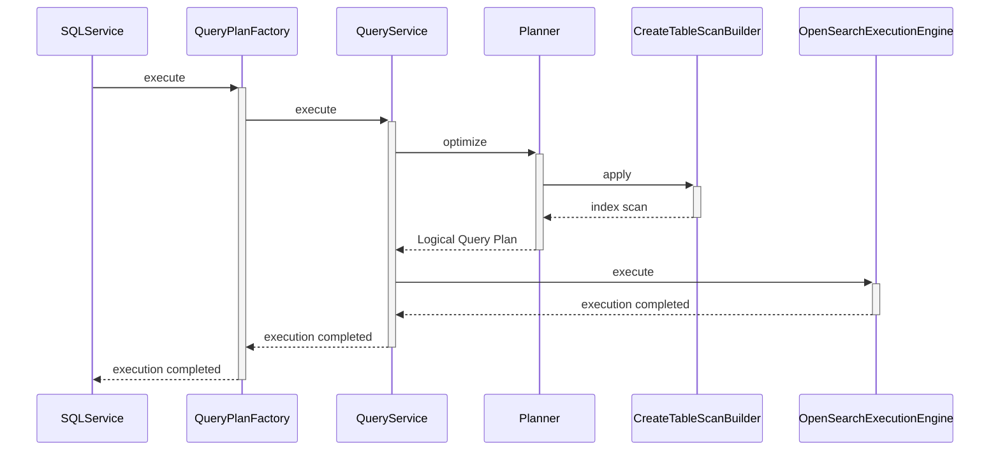

--------------------------------

### Find Average Ticket Price by Origin for Delayed Flights in OpenSearch SQL

Source: https://github.com/opensearch-project/sql/blob/main/integ-test/src/test/resources/correctness/bugfixes/550.txt

This SQL query retrieves the average ticket price for flights that experienced a delay, grouped by their origin. The results are ordered in descending order of the average price, demonstrating nested subqueries and conditional filtering.

```SQL
SELECT `b`.`Origin`, `b`.`avgPrice` FROM (SELECT `a`.`Origin` AS `Origin`, AVG(`AvgTicketPrice`) AS `avgPrice` FROM (SELECT `Origin`, `AvgTicketPrice` FROM `opensearch_dashboards_sample_data_flights` WHERE `FlightDelay` = True) AS `a` GROUP BY `a`.`Origin`) AS `b` ORDER BY `b`.`avgPrice` DESC
```

--------------------------------

### Example: SQL Plugin Error Response Format

Source: https://github.com/opensearch-project/sql/blob/main/docs/dev/Pagination-v2.md

Defines the standard JSON structure for error responses from the SQL plugin. It includes an `error` object with `details`, `reason`, and `type` string properties, along with a `status` integer representing the HTTP status code. This response is returned for server-side errors or expired cursors.

```json
{
    "error": {
        "details": "<string>",
        "reason": "<string>",
        "type": "<string>"
    },
    "status": <integer>
}
```

--------------------------------

### Calculate Logarithm of Max and Min Ticket Price Sum in OpenSearch SQL

Source: https://github.com/opensearch-project/sql/blob/main/integ-test/src/test/resources/correctness/queries/aggregation.txt

This query calculates the natural logarithm of the sum of the maximum and minimum 'AvgTicketPrice' from the 'opensearch_dashboards_sample_data_flights' dataset. It demonstrates combining aggregate functions (MAX, MIN) with a mathematical function (LOG).

```SQL
SELECT LOG(MAX(AvgTicketPrice) + MIN(AvgTicketPrice)) FROM opensearch_dashboards_sample_data_flights
```

--------------------------------

### OpenSearch SQL: Using match_query for Full-Text Search

Source: https://github.com/opensearch-project/sql/blob/main/docs/user/dql/functions.rst

Demonstrates how to use the `match_query` function in OpenSearch SQL to perform full-text searches. It supports specifying an operator and boost value, and also an alternative syntax where the field is on the left side of the equals sign for simpler queries.

```SQL
os> SELECT lastname FROM accounts WHERE match_query(firstname, 'Hattie', operator='AND', boost=2.0);
```

```SQL
os> SELECT firstname FROM accounts WHERE firstname = match_query('Hattie');
```

--------------------------------

### SQL: Select All from Subquery with Specific Columns

Source: https://github.com/opensearch-project/sql/blob/main/integ-test/src/test/resources/correctness/bugfixes/901.txt

This SQL query selects all columns from a subquery. The subquery itself selects 'Origin', 'Dest', and 'AvgTicketPrice' from the 'opensearch_dashboards_sample_data_flights' table, aliasing the result as 'flights'. This demonstrates how to use a subquery to pre-filter or select specific columns before the outer query operates on the result set.

```SQL
SELECT * FROM (SELECT Origin, Dest, AvgTicketPrice FROM opensearch_dashboards_sample_data_flights) AS flights
```

--------------------------------

### PPL fillnull Command Syntax Reference

Source: https://github.com/opensearch-project/sql/blob/main/docs/user/ppl/cmd/fillnull.rst

Provides the formal syntax for the `fillnull` command in OpenSearch PPL. It outlines two primary forms: `fillnull with <replacement> [in <field-list>]` for uniform replacement and `fillnull using <field> = <replacement> [, <field> = <replacement>]` for field-specific replacements. Key parameters like `replacement` and `field-list` are defined, noting the behavior change with Calcite enabled from version 3.1.0.

```PPL
fillnull with <replacement> [in <field-list>]

fillnull using <field> = <replacement> [, <field> = <replacement>]
```

--------------------------------

### Handle Error Responses in OpenSearch SQL JDBC Format

Source: https://github.com/opensearch-project/sql/blob/main/docs/user/interfaces/protocol.rst

This example illustrates how the OpenSearch SQL plugin returns error messages in JDBC format when an invalid SQL query is executed. The response includes an `error` object with details such as the `reason`, specific `details` about the error, and the `type` of exception, along with the HTTP `status` code.

```sh
curl -H 'Content-Type: application/json' -X POST localhost:9200/_plugins/_sql?format=jdbc -d '{
  "query" : "SELECT unknown FROM accounts"
}'
```

```json
{
  "error" : {
    "reason" : "Invalid SQL query",
    "details" : "Field [unknown] cannot be found or used here.",
    "type" : "SemanticAnalysisException"
  },
  "status" : 400
}
```

--------------------------------

### Order by Aggregate Function Result

Source: https://github.com/opensearch-project/sql/blob/main/integ-test/src/test/resources/correctness/bugfixes/123.txt

Demonstrates ordering a single aggregated result based on another aggregate function. When no `GROUP BY` clause is present, this query effectively orders a single row containing the overall average flight time based on the overall sum of flight times.

```SQL
SELECT AVG(FlightTimeMin) FROM opensearch_dashboards_sample_data_flights ORDER BY SUM(FlightTimeMin)
```

--------------------------------

### EXISTS Function (via ISNULL) in OpenSearch SQL

Source: https://github.com/opensearch-project/sql/blob/main/docs/user/ppl/functions/condition.rst

OpenSearch does not differentiate null and missing fields. The ISNULL/ISNOTNULL functions can be used to check for field existence. Example demonstrates checking for a missing email field using isnull.

```OpenSearch SQL
os> source=accounts | where isnull(email) | fields account_number, email
fetched rows / total rows = 1/1
+----------------+-------+
| account_number | email |
|----------------+-------|
| 13             | null  |
+----------------+-------+
```

--------------------------------

### SQL Query for Flights with Multiple Origins using OR

Source: https://github.com/opensearch-project/sql/blob/main/integ-test/src/test/resources/correctness/bugfixes/237.txt

This SQL query selects flights where the origin is either 'Munich Airport' OR 'Itami Airport'. It uses the OR logical operator to check if at least one of the specified conditions is true, returning a boolean result aliased as 'Calculation_462181953506873347'.

```SQL
SELECT ((Origin = 'Munich Airport') OR (Origin = 'Itami Airport')) AS Calculation_462181953506873347 FROM opensearch_dashboards_sample_data_flights
```

--------------------------------

### Calculate Population Standard Deviation of Ticket Price in OpenSearch SQL

Source: https://github.com/opensearch-project/sql/blob/main/integ-test/src/test/resources/correctness/queries/aggregation.txt

This query computes the population standard deviation of 'AvgTicketPrice' for all records in the 'opensearch_dashboards_sample_data_flights' dataset. It uses the STDDEV_POP() aggregate function to measure the dispersion of data for the entire population.

```SQL
SELECT STDDEV_POP(AvgTicketPrice) FROM opensearch_dashboards_sample_data_flights
```

--------------------------------

### Retrieve OpenSearch SQL Query Results in JDBC Format

Source: https://github.com/opensearch-project/sql/blob/main/docs/user/interfaces/protocol.rst

This example demonstrates a typical response from the OpenSearch SQL plugin when using the default JDBC format. The response includes a `schema` array detailing field names and types, and a `datarows` array containing the actual result set. This format is ideal for JDBC drivers and clients requiring structured schema information.

```sh
curl -H 'Content-Type: application/json' -X POST localhost:9200/_plugins/_sql -d '{
  "query" : "SELECT firstname, lastname, age FROM accounts ORDER BY age LIMIT 2"
}'
```

```json
{
  "schema" : [
    {
      "name" : "firstname",
      "type" : "text"
    },
    {
      "name" : "lastname",
      "type" : "text"
    },
    {
      "name" : "age",
      "type" : "long"
    }
  ],
  "total" : 4,
  "datarows" : [
    [
      "Nanette",
      "Bates",
      28
    ],
    [
      "Amber",
      "Duke",
      32
    ]
  ],
  "size" : 2,
  "status" : 200
}
```

--------------------------------

### Perform Multi-Match Query Across Multiple Fields in OpenSearch SQL

Source: https://github.com/opensearch-project/sql/blob/main/docs/user/beyond/fulltext.rst

Demonstrates how to use `MULTI_MATCH`, `MULTIMATCH`, or `MULTIMATCHQUERY` functions in OpenSearch SQL to search for a text (e.g., 'Dale') across multiple fields (e.g., `firstname`, `lastname`) using a field pattern (e.g., `*name`). The example includes the SQL query sent via a POST request and the corresponding OpenSearch `Explain` output showing the underlying `multi_match` query structure.

```SQL
POST /_plugins/_sql
{
  "query" : """
		SELECT firstname, lastname
		FROM accounts
		WHERE MULTI_MATCH('query'='Dale', 'fields'='*name')
		"""
}
```

```JSON
{
  "from" : 0,
  "size" : 200,
  "query" : {
    "bool" : {
      "filter" : [
        {
          "bool" : {
            "must" : [
              {
                "multi_match" : {
                  "query" : "Dale",
                  "fields" : [
                    "*name^1.0"
                  ],
                  "type" : "best_fields",
                  "operator" : "OR",
                  "slop" : 0
```

--------------------------------

### Calculate Percentile by Gender and Age Span in PPL

Source: https://github.com/opensearch-project/sql/blob/main/docs/user/ppl/cmd/stats.rst

Combines percentile calculation with grouping by both a categorical field ('gender') and a numerical span ('age') in PPL. This example calculates the 90th percentile of 'age' for accounts, grouped by 10-year age intervals and gender, providing granular percentile insights.

```PPL
os> source=accounts | stats percentile(age, 90) as p90 by span(age, 10) as age_span, gender
```

--------------------------------

### Calculate Population Variance with PPL VAR_POP

Source: https://github.com/opensearch-project/sql/blob/main/docs/user/ppl/cmd/eventstats.rst

This function calculates the population variance of a numeric expression. It accepts a single expression and returns its population variance. The example illustrates its application with the `eventstats` command to compute the population variance of the 'age' field for all records in the 'accounts' source.

```PPL
source=accounts | eventstats var_pop(age);
```

--------------------------------

### Delete OpenSearch SQL Datasource via REST API

Source: https://github.com/opensearch-project/sql/blob/main/docs/user/ppl/admin/datasources.rst

This snippet shows an example HTTP DELETE request to remove a configured datasource. It requires specifying the datasource name in the URL path and includes standard headers for content type and basic authentication.

```APIDOC
DELETE https://localhost:9200/_plugins/_query/_datasources/my_prometheus
content-type: application/json
Authorization: Basic {{username}} {{password}}
```

--------------------------------

### Python LogicalPlanOptimizer Class Definition

Source: https://github.com/opensearch-project/sql/blob/main/docs/dev/query-optimizer-improvement.md

Defines the `LogicalPlanOptimizer` class, which contains a list of optimization rules for OpenSearch. The `optimize` method iteratively applies these rules to a logical plan, transforming it into a more optimized form, potentially returning `OpenSearchLogicalIndexAgg` or `OpenSearchLogicalIndexScan`.

```Python
class LogicalPlanOptimizer:
  /*
   * OpenSearch rules include:
   *   MergeFilterAndRelation
   *   MergeAggAndIndexScan
   *   MergeAggAndRelation
   *   MergeSortAndRelation
   *   MergeSortAndIndexScan
   *   MergeSortAndIndexAgg
   *   MergeSortAndIndexScan
   *   MergeLimitAndRelation
   *   MergeLimitAndIndexScan
   *   PushProjectAndRelation
   *   PushProjectAndIndexScan
   *
   * that return *OpenSearchLogicalIndexAgg*
   *  or *OpenSearchLogicalIndexScan* finally
   */
  val rules: List<Rule>

  def optimize(plan: LogicalPlan):
    for rule in rules:
      if rule.match(plan):
        plan = rules.apply(plan)
    return plan.children().forEach(this::optimize)
```

--------------------------------

### Extract Log Patterns with Custom Regex in PPL

Source: https://github.com/opensearch-project/sql/blob/main/docs/user/ppl/cmd/patterns.rst

This example demonstrates how to extract specific punctuations (numbers in this case) from a raw log field using user-defined regular expression patterns within OpenSearch's Piped Processing Language (PPL). It shows how to define a new field 'no_numbers' and apply a regex pattern '[0-9]' to the 'message' field, then display the original message and the extracted pattern.

```PPL
os> source=apache | patterns new_field='no_numbers' pattern='[0-9]' message SIMPLE_PATTERN | fields message, no_numbers ;
```

--------------------------------

### Physical Query Plan States for Different Request Types

Source: https://github.com/opensearch-project/sql/blob/main/docs/dev/Pagination-v2.md

This state diagram illustrates the physical query plan for non-paged, initial paged, and subsequent paged requests. It shows how `OpenSearchIndexScan` and different request types (`OpenSearchQueryRequest`, `OpenSearchScrollRequest`) are integrated into the plan, detailing the execution flow for each scenario.

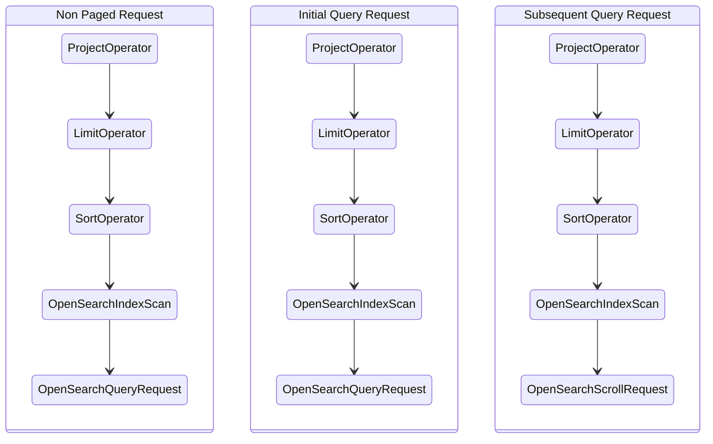

--------------------------------

### SQL: Select All from Subquery with Column Alias

Source: https://github.com/opensearch-project/sql/blob/main/integ-test/src/test/resources/correctness/bugfixes/901.txt

This SQL query selects all columns from a subquery. The subquery selects the 'Origin' column from 'opensearch_dashboards_sample_data_flights' and renames it to 'origin' using an alias. The outer query then selects all columns from this aliased subquery, demonstrating column aliasing within a subquery.

```SQL
SELECT * FROM (SELECT Origin AS origin FROM opensearch_dashboards_sample_data_flights) AS flights
```

--------------------------------

### patterns Command Brain Algorithm Syntax and Parameters

Source: https://github.com/opensearch-project/sql/blob/main/docs/user/ppl/cmd/patterns.rst

Outlines the syntax for the `brain` algorithm, which offers advanced log grouping. It includes optional parameters for variable count threshold and frequency threshold percentage to fine-tune the algorithm's behavior. The `field` parameter is mandatory and must be a text field. `BRAIN` explicitly selects this method.

```APIDOC
patterns [new_field=<new-field-name>] [variable_count_threshold=<variable_count_threshold>] [frequency_threshold_percentage=<frequency_threshold_percentage>] <field> BRAIN

Parameters:
  new-field-name: optional string. The name of the new field for extracted patterns, default is `patterns_field`. If the name already exists, it will replace the original field.
  variable_count_threshold: optional integer. Number of tokens in the group per position as variable threshold in case of word tokens appear rarely.
  frequency_threshold_percentage: optional double. To select longest word combination frequency, it needs a lower bound of frequency. The representative frequency of longest word combination should be >= highest token frequency of log * threshold percentage
  field: mandatory. The field must be a text field.
  BRAIN: Specify pattern method to be brain.
```

--------------------------------

### Filter Data with SQL LIKE Clause in OpenSearch

Source: https://github.com/opensearch-project/sql/blob/main/integ-test/src/test/resources/correctness/bugfixes/368.txt

These SQL queries demonstrate how to use the LIKE clause with wildcards (%) to perform pattern matching on string fields in OpenSearch Dashboards sample data. The first query filters origins starting with 'London Hea', and the second filters origins containing 'International'.

```SQL
SELECT Origin FROM opensearch_dashboards_sample_data_flights WHERE Origin LIKE 'London Hea%'
```

```SQL
SELECT Origin FROM opensearch_dashboards_sample_data_flights WHERE Origin LIKE '%International%'
```

--------------------------------

### TableScanBuilder Class Hierarchy

Source: https://github.com/opensearch-project/sql/blob/main/docs/dev/query-optimizer-improvement.md

This diagram illustrates the `TableScanBuilder` abstraction, its inheritance from `LogicalPlan`, and its specialized implementations like `OpenSearchIndexScanBuilder` and `OpenSearchIndexScanQueryBuilder`. It highlights the various push-down methods available for logical plan optimization.

```APIDOC
classDiagram
%% Mermaid fails to render `LogicalPlanNodeVisitor~R, C~` https://github.com/mermaid-js/mermaid/issues/3188, using `&lt;R, C>` as a workaround
  class LogicalPlan {
    -List~LogicalPlan~ childPlans
    +LogicalPlan(List~LogicalPlan~)
    +accept(LogicalPlanNodeVisitor&lt;R, C>, C)* R
    +replaceChildPlans(List~LogicalPlan~ childPlans) LogicalPlan
  }
  class TableScanBuilder {
    +TableScanBuilder()
    +build()* TableScanOperator
    +pushDownFilter(LogicalFilter) boolean
    +pushDownAggregation(LogicalAggregation) boolean
    +pushDownSort(LogicalSort) boolean
    +pushDownLimit(LogicalLimit) boolean
    +pushDownPageSize(LogicalPaginate) boolean
    +pushDownProject(LogicalProject) boolean
    +pushDownHighlight(LogicalHighlight) boolean
    +pushDownNested(LogicalNested) boolean
    +accept(LogicalPlanNodeVisitor&lt;R, C>, C) R
  }
  class OpenSearchIndexScanQueryBuilder {
    OpenSearchIndexScanQueryBuilder(OpenSearchIndexScan)
    +build() TableScanOperator
    +pushDownFilter(LogicalFilter) boolean
    +pushDownAggregation(LogicalAggregation) boolean
    +pushDownSort(LogicalSort) boolean
    +pushDownLimit(LogicalLimit) boolean
    +pushDownPageSize(LogicalPaginate) boolean
    +pushDownProject(LogicalProject) boolean
    +pushDownHighlight(LogicalHighlight) boolean
    +pushDownNested(LogicalNested) boolean
    +findReferenceExpression(NamedExpression)$ List~ReferenceExpression~
    +findReferenceExpressions(List~NamedExpression~)$ Set~ReferenceExpression~
  }
  class OpenSearchIndexScanBuilder {
    -TableScanBuilder delegate
    -boolean isLimitPushedDown
    +OpenSearchIndexScanBuilder(OpenSearchIndexScan)
    OpenSearchIndexScanBuilder(TableScanBuilder)
    +build() TableScanOperator
    +pushDownFilter(LogicalFilter) boolean
    +pushDownAggregation(LogicalAggregation) boolean
    +pushDownSort(LogicalSort) boolean
    +pushDownLimit(LogicalLimit) boolean
    +pushDownProject(LogicalProject) boolean
    +pushDownHighlight(LogicalHighlight) boolean
    +pushDownNested(LogicalNested) boolean
    -sortByFieldsOnly(LogicalSort) boolean
  }

  LogicalPlan <|-- TableScanBuilder
  TableScanBuilder <|-- OpenSearchIndexScanQueryBuilder
  TableScanBuilder <|-- OpenSearchIndexScanBuilder
  OpenSearchIndexScanBuilder *-- "1" TableScanBuilder : delegate
  OpenSearchIndexScanBuilder <.. OpenSearchIndexScanQueryBuilder : creates
```

--------------------------------

### Qualifying Field Identifiers by Full Table Name in OpenSearch SQL

Source: https://github.com/opensearch-project/sql/blob/main/docs/user/general/identifiers.rst

This example demonstrates qualifying a field name ('age') with its full table name ('accounts') to avoid ambiguity. The qualifier is optional if no ambiguity exists, but it ensures the field is correctly associated with its source.

```SQL
os> SELECT city, accounts.age, ABS(accounts.balance) FROM accounts WHERE accounts.age < 30;
```

--------------------------------

### SQL Subquery with Outer Ordering by Aliased Column

Source: https://github.com/opensearch-project/sql/blob/main/integ-test/src/test/resources/correctness/queries/subqueries.txt

This query orders the results of a subquery. The inner query aliases `Origin` as `origin` and `AvgTicketPrice` as `price`. The outer query then orders the results by the aliased `price` column, explicitly using the subquery alias `f`.

```SQL
SELECT origin FROM (SELECT Origin AS origin, AvgTicketPrice AS price FROM opensearch_dashboards_sample_data_flights) AS f ORDER BY f.price
```

--------------------------------

### DATEDIFF Function API Reference and Usage in OpenSearch SQL

Source: https://github.com/opensearch-project/sql/blob/main/docs/user/ppl/functions/datetime.rst

API documentation for the DATEDIFF function, which calculates the difference between date parts of two given values. Includes argument types, return type, and an example demonstrating its usage.

```APIDOC
DATEDIFF:
  Description: Calculates the difference of date parts of given values. If the first argument is time, today's date is used.
  Usage: DATEDIFF(date1, date2)
  Argument type: DATE/TIMESTAMP/TIME, DATE/TIMESTAMP/TIME
  Return type: LONG
```

```SQL
os> source=people | eval `'2000-01-02' - '2000-01-01'` = DATEDIFF(TIMESTAMP('2000-01-02 00:00:00'), TIMESTAMP('2000-01-01 23:59:59')), `'2001-02-01' - '2004-01-01'` = DATEDIFF(DATE('2001-02-01'), TIMESTAMP('2004-01-01 00:00:00')), `today - today` = DATEDIFF(TIME('23:59:59'), TIME('00:00:00')) | fields `'2000-01-02' - '2000-01-01'`, `'2001-02-01' - '2004-01-01'`, `today - today`
```

--------------------------------

### Extract Semantic Log Patterns using Brain Algorithm in PPL

Source: https://github.com/opensearch-project/sql/blob/main/docs/user/ppl/cmd/patterns.rst

This example illustrates how to extract semantically meaningful log patterns from a raw log field using the 'BRAIN' algorithm in OpenSearch's Piped Processing Language (PPL). The 'BRAIN' algorithm automatically identifies variable parts of log messages and replaces them with generic placeholders like <*IP*> or <*>. The default variable count threshold for pattern extraction is 5.

```PPL
os> source=apache | patterns message BRAIN | fields message, patterns_field ;
```

--------------------------------

### PPL fillnull: Replace Nulls in a Single Field

Source: https://github.com/opensearch-project/sql/blob/main/docs/user/ppl/cmd/fillnull.rst

An example demonstrating the `fillnull` command to replace null values in a specific field (`email`) with a custom string ('<not found>'). The query selects `email` and `employer` fields from `accounts` and then applies the `fillnull` operation only to the `email` field.

```PPL
os> source=accounts | fields email, employer | fillnull with '<not found>' in email;
```

--------------------------------

### Calculate Time Difference in Intervals with TIMESTAMPDIFF

Source: https://github.com/opensearch-project/sql/blob/main/docs/user/ppl/functions/datetime.rst

Calculates the difference between two date/time expressions (start and end) and returns the result in specified interval units. If a TIME is provided, it's converted to a TIMESTAMP using the current date.

```APIDOC
Usage: TIMESTAMPDIFF(interval, start, end)
Argument type: INTERVAL, DATE/TIME/TIMESTAMP/STRING, DATE/TIME/TIMESTAMP/STRING
INTERVAL must be one of the following tokens: [MICROSECOND, SECOND, MINUTE, HOUR, DAY, WEEK, MONTH, QUARTER, YEAR]
```

--------------------------------

### OpenSearch Bank Index Mapping Definition

Source: https://github.com/opensearch-project/sql/blob/main/docs/dev/query-null-missing-value.md

Defines the schema for the 'bank' index in OpenSearch, specifying 'account_number' as a long and 'age' as an integer type. This mapping is used to illustrate data handling in subsequent examples.

```JSON
    "mappings" : {
      "properties" : {
        "account_number" : {
          "type" : "long"
        },
        "age" : {
          "type" : "integer"
        }
      }
    }
```

--------------------------------

### Get Month of Year from Date in OpenSearch SQL

Source: https://github.com/opensearch-project/sql/blob/main/docs/user/ppl/functions/datetime.rst

The `MONTH_OF_YEAR` function extracts the month (1-12) from a given date. It accepts STRING, DATE, or TIMESTAMP types as input and returns an INTEGER. It is synonymous with the `MONTH` function.

```APIDOC
MONTH_OF_YEAR
  Description: Returns the month for date, in the range 1 to 12 for January to December.
  Usage: month_of_year(date)
  Argument type: STRING/DATE/TIMESTAMP
  Return type: INTEGER
  Synonyms: MONTH
```

```OpenSearch SQL
source=people | eval `MONTH_OF_YEAR(DATE('2020-08-26'))` =  MONTH_OF_YEAR(DATE('2020-08-26')) | fields `MONTH_OF_YEAR(DATE('2020-08-26'))`
```

--------------------------------

### Disable OpenSearch SQL Datasource via PATCH API

Source: https://github.com/opensearch-project/sql/blob/main/docs/user/ppl/admin/datasources.rst

This example demonstrates how to disable an existing datasource, 'my_prometheus', using an HTTP PATCH request. The request body specifies the datasource name and sets its `status` to 'disabled', effectively blocking new queries to it.

```APIDOC
PATCH https://localhost:9200/_plugins/_query/_datasources
content-type: application/json
Authorization: Basic {{username}} {{password}}

{
    "name" : "my_prometheus",
    "status" : "disabled"
}
```

--------------------------------

### Query Prometheus Datasource with OpenSearch PPL

Source: https://github.com/opensearch-project/sql/blob/main/docs/user/ppl/admin/datasources.rst

This PPL (Pipe Processing Language) command demonstrates how to query a configured Prometheus datasource named 'my_prometheus'. It accesses a specific metric, 'prometheus_http_requests_total', and applies a statistical aggregation to calculate the average value grouped by job.

```PPL
>> source = my_prometheus.prometheus_http_requests_total | stats avg(@value) by job;
```

--------------------------------

### SQL Subquery with Outer Filtering on Aliased Column

Source: https://github.com/opensearch-project/sql/blob/main/integ-test/src/test/resources/correctness/queries/subqueries.txt

This query demonstrates filtering in the outer query using an alias from the subquery. The inner query aliases `Origin` as `origin` and `AvgTicketPrice` as `price`. The outer query then filters the results where the aliased `price` is greater than 100.

```SQL
SELECT origin FROM (SELECT Origin AS origin, AvgTicketPrice AS price FROM opensearch_dashboards_sample_data_flights) AS f WHERE f.price > 100
```

--------------------------------

### SQL Subquery with Inner Grouping, Filtering, and Outer Filtering/Ordering

Source: https://github.com/opensearch-project/sql/blob/main/integ-test/src/test/resources/correctness/queries/subqueries.txt

This complex query combines inner grouping and filtering with outer filtering and ordering. The inner subquery filters and groups, and the outer query applies additional filters and orders the final result set.

```SQL
SELECT Origin, Dest FROM (SELECT * FROM opensearch_dashboards_sample_data_flights WHERE AvgTicketPrice > 100 GROUP BY Origin, Dest, AvgTicketPrice) AS flights WHERE AvgTicketPrice < 1000 ORDER BY AvgTicketPrice
```

--------------------------------

### Example of a complex OpenSearch PPL query that may fail

Source: https://github.com/opensearch-project/sql/blob/main/docs/user/ppl/functions/relevance.rst

This OpenSearch PPL query demonstrates a complex structure where a 'where match' clause (a relevance function) is placed late in the pipeline. Such placement can make the query difficult to translate into OpenSearch DSL, potentially leading to execution failures.

```OpenSearch PPL
search source = people | rename firstname as name | dedup account_number | fields name, account_number, balance, employer | where match(employer, 'Open Search') | stats count() by city
```

--------------------------------

### Filter Aggregate with Function in Condition in OpenSearch SQL

Source: https://github.com/opensearch-project/sql/blob/main/integ-test/src/test/resources/correctness/queries/filter.txt

This query uses a function (ABS) within the FILTER clause's WHERE condition. It calculates the average ticket price for flights where the absolute value of the ticket price is less than 10000.

```SQL
SELECT AVG(AvgTicketPrice) FILTER(WHERE ABS(AvgTicketPrice) < 10000) AS filtered FROM opensearch_dashboards_sample_data_flights
```

--------------------------------

### QueryPlan Class Structure for Initial Requests

Source: https://github.com/opensearch-project/sql/blob/main/docs/dev/Pagination-v2.md

Defines the `QueryPlan` class, introducing an optional `pageSize` field to support initial paginated query requests. It shows the relationship between `QueryPlan` and `UnresolvedQueryPlan`.

```Mermaid
classDiagram
  direction LR
  class QueryPlan {
    <<AbstractPlan>>
    -Optional~int~ pageSize
    -UnresolvedPlan plan
    -QueryService queryService
  }
  class UnresolvedQueryPlan {
    <<UnresolvedPlan>>
  }
  QueryPlan --* UnresolvedQueryPlan
```

--------------------------------

### SQL Query for Flights NOT from a Specific Origin

Source: https://github.com/opensearch-project/sql/blob/main/integ-test/src/test/resources/correctness/bugfixes/237.txt

This SQL query selects flights where the origin is NOT 'Munich Airport'. It uses the NOT logical operator to negate a condition, effectively returning true for all flights that do not originate from 'Munich Airport', with the result aliased as 'Calculation_462181953506873347'.

```SQL
SELECT NOT (Origin = 'Munich Airport') AS Calculation_462181953506873347 FROM opensearch_dashboards_sample_data_flights
```

--------------------------------

### NOW Function in OpenSearch SQL

Source: https://github.com/opensearch-project/sql/blob/main/docs/user/dql/functions.rst

The NOW function returns the current date and time as a TIMESTAMP value in 'YYYY-MM-DD hh:mm:ss' format, based on the cluster's time zone. It provides a constant timestamp for the statement's execution start time, differing from SYSDATE().

```APIDOC
NOW()
  Returns: TIMESTAMP (format 'YYYY-MM-DD hh:mm:ss')
  Notes:
    - Value is expressed in the cluster time zone.
    - Returns a constant time indicating the statement's execution start.
    - Differs from SYSDATE(), which returns the exact execution time.
```

```SQL
SELECT NOW()
```

--------------------------------

### Set OpenSearch SQL Cursor Keep-Alive Duration

Source: https://github.com/opensearch-project/sql/blob/main/docs/user/admin/settings.rst

This example shows how to dynamically update the `plugins.sql.cursor.keep_alive` setting, which controls how long a cursor context remains open. A lower value is recommended due to the resource-intensive nature of cursor contexts. This node-scoped setting defaults to `1m`.

```sh
curl -H 'Content-Type: application/json' -X PUT localhost:9200/_plugins/_query/settings -d '{
  "transient" : {
    "plugins.sql.cursor.keep_alive" : "5m"
  }
}'
```

```json
{
  "acknowledged" : true,
  "persistent" : { },
  "transient" : {
    "plugins" : {
      "sql" : {
        "cursor" : {
          "keep_alive" : "5m"
        }
      }
    }
  }
}
```

--------------------------------

### OpenSearch PPL: Find Most Common Values Grouped by Field

Source: https://github.com/opensearch-project/sql/blob/main/docs/user/ppl/cmd/top.rst

Shows how to use the `top` command with a `by-clause` to find the most common age for accounts, grouped by gender.

```OpenSearch PPL
os> source=accounts | top 1 age by gender;
```

--------------------------------

### Query Data in Visualization (Viz) Format (Pretty JSON)

Source: https://github.com/opensearch-project/sql/blob/main/docs/user/interfaces/protocol.rst

Shows how to obtain the 'viz' format response in a pretty-printed JSON format by adding the 'pretty=true' parameter to the request. This improves readability for debugging or display.

```curl
>> curl -H 'Content-Type: application/json -X POST localhost:9200/_plugins/_ppl?format=viz&pretty' -d '{
  "query": "source=accounts"
}'

Result set::

    {
      "data": {
        "account_number": [
          1,
          6,
          13,
          18
        ],
        "firstname": [

```

--------------------------------

### Manage OpenSearch Data Source Enablement

Source: https://github.com/opensearch-project/sql/blob/main/docs/user/admin/settings.rst

This setting determines whether data sources are active within OpenSearch, with a default value of `true`. It is node-scoped and can be updated dynamically. The examples demonstrate disabling data sources, the resulting error when attempting API calls, and re-enabling them.

```APIDOC
plugins.query.datasources.enabled
Description
This setting controls whether datasources are enabled.
1. The default value is true
2. This setting is node scope
3. This setting can be updated dynamically
```

```sh
curl -sS -H 'Content-Type: application/json' -X PUT 'localhost:9200/_cluster/settings?pretty' -d '{"transient":{"plugins.query.datasources.enabled":"false"}}'
{
  "acknowledged": true,
  "persistent": {},
  "transient": {
    "plugins": {
      "query": {
        "datasources": {
          "enabled": "false"
        }
      }
    }
  }
}
```

```sh
curl -sS -H 'Content-Type: application/json' -X GET 'localhost:9200/_plugins/_query/_datasources'
{
  "status": 400,
  "error": {
    "type": "OpenSearchStatusException",
    "reason": "Invalid Request",
    "details": "plugins.query.datasources.enabled setting is false"
  }
}
```

```sh
curl -sS -H 'Content-Type: application/json' -X POST 'localhost:9200/_plugins/_ppl' -d '{"query":"show datasources"}'
{
  "schema": [
    {
      "name": "DATASOURCE_NAME",
      "type": "string"
    },
    {
      "name": "CONNECTOR_TYPE",
      "type": "string"
    }
  ],
  "datarows": [],
  "total": 0,
  "size": 0
}
```

```sh
curl -sS -H 'Content-Type: application/json' -X PUT 'localhost:9200/_cluster/settings?pretty' -d '{"transient":{"plugins.query.datasources.enabled":"true"}}'
{
  "acknowledged": true,
  "persistent": {},
  "transient": {
    "plugins": {
      "query": {
        "datasources": {
          "enabled": "true"
        }
      }
    }
  }
}
```

--------------------------------

### Calculate Sample Variance with VAR_SAMP in OpenSearch SQL

Source: https://github.com/opensearch-project/sql/blob/main/docs/user/dql/window.rst

Shows how to apply the `VAR_SAMP` window function to determine the sample variance of the `balance` for each `gender` partition. The `OVER` clause defines the window for the calculation.

```OpenSearch SQL
os> SELECT
...   gender, balance,
...   VAR_SAMP(balance) OVER(
...     PARTITION BY gender ORDER BY balance
... ) AS val
... FROM accounts;
```

--------------------------------

### Calculate Sample Variance with PPL VAR_SAMP

Source: https://github.com/opensearch-project/sql/blob/main/docs/user/ppl/cmd/eventstats.rst

This function computes the sample variance of a numeric expression. It takes a single expression as input and returns its sample variance. The provided example demonstrates how to use `VAR_SAMP` with the `eventstats` command to add the sample variance of the 'age' field to each row in the 'accounts' source.

```PPL
source=accounts | eventstats var_samp(age);
```

--------------------------------

### Execute PPL Query via HTTP POST

Source: https://github.com/opensearch-project/sql/blob/main/docs/user/ppl/interfaces/endpoint.rst

Demonstrates how to send an HTTP POST request to the `_plugins/_ppl` endpoint with a PPL query in the request body. This method is used for executing PPL queries and retrieving results, supporting various parameters and avoiding length limitations.

```sh
sh$ curl -sS -H 'Content-Type: application/json' \
 -X POST localhost:9200/_plugins/_ppl \
 -d '{"query" : "source=accounts | fields firstname, lastname"}'
{
  "schema": [
    {
      "name": "firstname",
      "type": "string"
    },
    {
      "name": "lastname",
      "type": "string"
    }
  ],
  "datarows": [
    [
      "Amber",
      "Duke"
    ],
    [
      "Hattie",
      "Bond"
    ],
    [
      "Nanette",
      "Bates"
    ],
    [
      "Dale",
      "Adams"
    ]
  ],
  "total": 4,
  "size": 4
}
```

--------------------------------

### patterns Command General Syntax

Source: https://github.com/opensearch-project/sql/blob/main/docs/user/ppl/cmd/patterns.rst

Defines the overall syntax for the `patterns` command, including optional new field naming, algorithm-specific parameters, the mandatory field to process, and the pattern method to apply.

```APIDOC
patterns [new_field=<new-field-name>] (algorithm parameters...) <field> <pattern_method>
```

--------------------------------

### Subtracting Time Values with SUBTIME in OpenSearch SQL

Source: https://github.com/opensearch-project/sql/blob/main/docs/user/ppl/functions/datetime.rst

Demonstrates the `SUBTIME` function in OpenSearch SQL to subtract one time or timestamp value from another. Examples include subtracting dates, times, and timestamps to calculate time differences.

```SQL
source=people | eval `'2004-01-01' - '23:59:59'` = SUBTIME(DATE('2004-01-01'), TIME('23:59:59')) | fields `'2004-01-01' - '23:59:59'`
```

```SQL
source=people | eval `'10:20:30' - '00:05:42'` = SUBTIME(TIME('10:20:30'), TIME('00:05:42')) | fields `'10:20:30' - '00:05:42'`
```

```SQL
source=people | eval `'2007-03-01 10:20:30' - '20:40:50'` = SUBTIME(TIMESTAMP('2007-03-01 10:20:30'), TIMESTAMP('2002-03-04 20:40:50')) | fields `'2007-03-01 10:20:30' - '20:40:50'`
```

--------------------------------

### Unnesting Nested Collections with Existential Subquery in OpenSearch SQL

Source: https://github.com/opensearch-project/sql/blob/main/docs/user/beyond/partiql.rst

This example provides an alternative approach to unnest nested collections using an existential subquery. This method checks if a nested document satisfies a condition without producing a Cartesian product, focusing on the parent document. The corresponding OpenSearch 'explain' output illustrates the underlying query structure.

```SQL
POST /_plugins/_sql
{
  "query" : """
		SELECT e.name AS employeeName
		FROM employees_nested AS e
		WHERE EXISTS (
		  SELECT *
		  FROM e.projects AS p
		  WHERE p.name LIKE '%security%'
		)
		"""
}
```

```JSON
{
  "from" : 0,
  "size" : 200,
  "query" : {
    "bool" : {
      "filter" : [
        {
          "bool" : {
            "must" : [
              {
                "nested" : {
                  "query" : {
                    "bool" : {
                      "must" : [
                        {
                          "bool" : {
                            "must" : [
                              {
                                "bool" : {
                                  "must_not" : [
                                    {
                                      "bool" : {
                                        "must_not" : [
                                          {
                                            "exists" : {
                                              "field" : "projects",
                                              "boost" : 1.0
                                            }
                                          }
                                        ],
                                        "adjust_pure_negative" : true,
                                        "boost" : 1.0
                                      }
                                    }
                                  ],
                                  "adjust_pure_negative" : true,
                                  "boost" : 1.0
                                }
                              },
                              {
                                "wildcard" : {
                                  "projects.name" : {
                                    "wildcard" : "*security*",
                                    "boost" : 1.0
                                  }
                                }
                              }
                            ],
                            "adjust_pure_negative" : true,
                            "boost" : 1.0
                          }
                        }
                      ]
                    }
                  }
                }
              }
            ]
          }
        }
      ]
    }
  }
}
```

--------------------------------

### Calcite Enumerable Extended Query Plan (Java)

Source: https://github.com/opensearch-project/sql/blob/main/docs/user/interfaces/endpoint.rst

Java code demonstrating the extended execution plan, binding data context, and iterating through results using Calcite's `Enumerable` and `Enumerator` interfaces, specifically for OpenSearch SQL.

```Java
public org.apache.calcite.linq4j.Enumerable bind(final org.apache.calcite.DataContext root) {
      final org.opensearch.sql.opensearch.storage.scan.CalciteEnumerableIndexScan v1stashed = (org.opensearch.sql.opensearch.storage.scan.CalciteEnumerableIndexScan) root.get("v1stashed");
      final org.apache.calcite.linq4j.Enumerable _inputEnumerable = v1stashed.scan();
      return new org.apache.calcite.linq4j.AbstractEnumerable(){
          public org.apache.calcite.linq4j.Enumerator enumerator() {
            return new org.apache.calcite.linq4j.Enumerator(){
                public final org.apache.calcite.linq4j.Enumerator inputEnumerator = _inputEnumerable.enumerator();
                public void reset() {
                  inputEnumerator.reset();
                }

                public boolean moveNext() {
                  return inputEnumerator.moveNext();
                }

                public void close() {
                  inputEnumerator.close();
                }

                public Object current() {
                  final Object[] current = (Object[]) inputEnumerator.current();
                  final Object input_value = current[1];
                  final Object input_value0 = current[0];
                  return new Object[] {
                      input_value,
                      input_value0};
                }

              };
          }

        };
    }


    public Class getElementType() {
      return java.lang.Object[].class;
    }
```

--------------------------------

### OpenSearch SQL Query Response Structure Example

Source: https://github.com/opensearch-project/sql/blob/main/docs/user/interfaces/protocol.rst

This snippet illustrates a typical JSON structure for an OpenSearch SQL query response. It defines the 'fields' array, where each object specifies a field's 'name' (e.g., account_number, firstname) and its 'type' (e.g., long, text). Additionally, it includes top-level metadata such as 'size' indicating the number of results and 'status' for the HTTP response code.

```JSON
      "fields": [
        {
          "name": "account_number",
          "type": "long"
        },
        {
          "name": "firstname",
          "type": "text"
        },
        {
          "name": "address",
          "type": "text"
        },
        {
          "name": "balance",
          "type": "long"
        },
        {
          "name": "gender",
          "type": "text"
        },
        {
          "name": "city",
          "type": "text"
        },
        {
          "name": "employer",
          "type": "text"
        },
        {
          "name": "state",
          "type": "text"
        },
        {
          "name": "age",
          "type": "long"
        },
        {
          "name": "email",
          "type": "text"
        },
        {
          "name": "lastname",
          "type": "text"
        }
      ],
      "size": 4,
      "status": 200
    }
```

--------------------------------

### Calculate Sum with SUM() in OpenSearch PPL

Source: https://github.com/opensearch-project/sql/blob/main/docs/user/ppl/cmd/eventstats.rst

This snippet demonstrates the `SUM(expr)` aggregate function in OpenSearch's Piped Processing Language (PPL). It calculates the total sum of a specified numeric expression. The example shows summing the `age` field, grouped by `gender` using the `eventstats` command.

```PPL
source=accounts | eventstats sum(age) by gender;
```

--------------------------------

### Sequence Diagram for Initial Paging SQL Query Request in OpenSearch

Source: https://github.com/opensearch-project/sql/blob/main/docs/dev/Pagination-v2.md

Details the processing of an initial SQL query request that supports paging. It includes query validation with `CanPaginateVisitor` and serialization by `PlanSerializer` to create a cursor for subsequent pages.

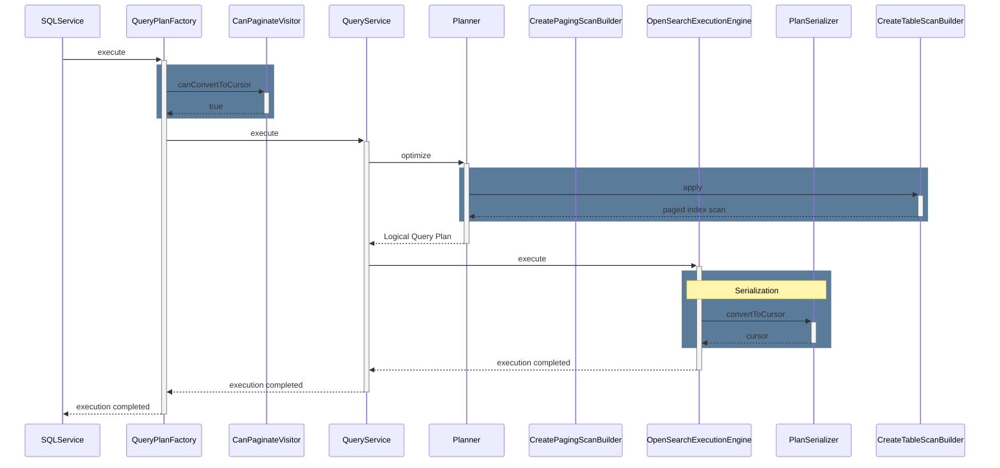

--------------------------------

### OpenSearch SQL MATCH Function for Relevance Search

Source: https://github.com/opensearch-project/sql/blob/main/docs/user/dql/functions.rst

Documents the `match` function in OpenSearch SQL, which maps to the search engine's match query. It allows searching documents by relevance based on text, number, date, or boolean values in a given field. Includes API signature, available parameters, and SQL usage examples.

```APIDOC
match(field_expression, query_expression[, option=<option_value>]*) Parameters:
- analyzer: (string) Specifies the analyzer to use for the query string.
- auto_generate_synonyms_phrase: (boolean) If true, phrases are automatically generated for synonyms.
- fuzziness: (string) Allows for fuzzy matching based on edit distance.
- max_expansions: (integer) The maximum number of terms to which the query will expand.
- prefix_length: (integer) The number of initial characters that will not be matched fuzzily.
- fuzzy_transpositions: (boolean) If true, allows for transpositions (e.g., 'ab' vs 'ba') in fuzzy matching.
- fuzzy_rewrite: (string) Method used to rewrite the query when fuzzy matching.
- lenient: (boolean) If true, ignores malformed syntax errors.
- operator: (string) Default boolean logic used when combining terms (e.g., 'AND', 'OR').
- minimum_should_match: (string) The minimum number of optional clauses that must match.
- zero_terms_query: (string) Specifies how to handle queries that resolve to no terms (e.g., 'none', 'all').
- boost: (float) Multiplier for the relevance score.
```

```SQL
SELECT lastname, address FROM accounts WHERE match(address, 'Street');
```

```SQL
SELECT lastname FROM accounts WHERE match(firstname, 'Hattie', operator='AND', boost=2.0);
```

--------------------------------

### OpenSearch SQL: Using FILTER Clause with GROUP BY

Source: https://github.com/opensearch-project/sql/blob/main/docs/user/dql/aggregations.rst

This example shows how to use a `FILTER` clause within an aggregation function when combined with `GROUP BY`. The `FILTER` clause allows setting specific conditions for each aggregation bucket, ensuring that only rows satisfying the condition are fed to the aggregate function.

```SQL
os> SELECT avg(age) FILTER(WHERE balance > 10000) AS filtered, gender FROM accounts GROUP BY gender
```

--------------------------------

### Aggregating over time: Count samples over 5-minute period

Source: https://github.com/opensearch-project/sql/blob/main/docs/dev/datasource-prometheus.md

Count the number of samples for each series over a 5-minute period:

```PromQL
count_over_time(process_resident_memory_bytes[5m])
```

```PPL
source = promcatalog.`process_resident_memory_bytes` | eval k = `count_over_time`(@value, 5m)
```

--------------------------------

### OpenSearch SQL: Using FILTER with DISTINCT COUNT Aggregate

Source: https://github.com/opensearch-project/sql/blob/main/docs/user/dql/aggregations.rst

This example illustrates how the `FILTER` clause can be used with a `COUNT(DISTINCT ...)` aggregation. The `FILTER` clause applies the specified condition to the data before the distinct values are counted, ensuring accurate filtered distinct counts.

```SQL
os> SELECT COUNT(DISTINCT firstname) FILTER(WHERE age > 30) AS distinct_count FROM accounts
```

--------------------------------

### Nested Query with OpenSearch DSL Output (Single Path)

Source: https://github.com/opensearch-project/sql/blob/main/docs/dev/sql-nested-function-select-clause.md

This example shows a basic `nested` function call in the SELECT clause and its corresponding OpenSearch DSL output. It queries a specific nested object and its inner field, illustrating how the SQL query translates into a `nested` query within the OpenSearch DSL for execution.

```SQL
SELECT nested(message.info, message) FROM nested_objects;
```

```JSON
{
    "query": {
        "bool": {
            "filter": [
                {
                    "bool": {
                        "must": [
                            {
                                "nested": {
                                    "query": {
                                        "match_all": {
                                            "boost": 1.0
                                        }
                                    },
                                    "path": "message",
                                    "...": "...",
                                    "boost": 1.0,
                                    "inner_hits": {
                                        "...": "...",
                                        "_source": {
                                            "includes": [
                                                "message.info"
                                            ],
                                            "excludes": []
                                        }
                                    }
                                }
                            }
                        ]
                    }
                }
            ]
        }
    },
    "...": "..."
}
```

--------------------------------

### OpenSearch SQL stats Command Syntax and Parameters

Source: https://github.com/opensearch-project/sql/blob/main/docs/user/ppl/cmd/stats.rst

Defines the syntax for the `stats` command, including mandatory aggregation functions, optional `by-clause` for grouping, and `span-expression` for interval-based bucketing. Details how NULL/MISSING values are handled by common aggregation functions.

```APIDOC
stats <aggregation>... [by-clause]

Parameters:
  aggregation (mandatory): A aggregation function. The argument of aggregation must be field.
  by-clause (optional):
    Syntax: by [span-expression,] [field,]...
    Description: The by clause could be fields and expressions (scalar functions, aggregation functions). If not specified, returns one row for the entire result set.
  span-expression (optional, at most one):
    Syntax: span(field_expr, interval_expr)
    Description: Splits a field into buckets in the same interval.
    Available time units for interval_expr:
      millisecond (ms)
      second (s)
      minute (m, case sensitive)
      hour (h)
      day (d)
      week (w)
      month (M, case sensitive)
      quarter (q)
      year (y)

NULL/MISSING Value Handling:
  Function | NULL        | MISSING
  ---------|-------------|-------------
  COUNT    | Not counted | Not counted
  SUM      | Ignore      | Ignore
  AVG      | Ignore      | Ignore
  MAX      | Ignore      | Ignore
  MIN      | Ignore
```

--------------------------------

### OpenSearch SQL: Calculate Week of Year with WEEK_OF_YEAR Function

Source: https://github.com/opensearch-project/sql/blob/main/docs/user/ppl/functions/datetime.rst

Demonstrates the use of the `WEEK_OF_YEAR()` function in OpenSearch SQL, which is a synonym for `WEEK()`. The example shows how to calculate the week number for a date with and without the `mode` argument, yielding results identical to the `WEEK()` function.

```OpenSearch SQL
os> source=people | eval `WEEK_OF_YEAR(DATE('2008-02-20'))` = WEEK(DATE('2008-02-20')), `WEEK_OF_YEAR(DATE('2008-02-20'), 1)` = WEEK_OF_YEAR(DATE('2008-02-20'), 1) | fields `WEEK_OF_YEAR(DATE('2008-02-20'))`, `WEEK_OF_YEAR(DATE('2008-02-20'), 1)`
fetched rows / total rows = 1/1
+----------------------------------+-------------------------------------+
| WEEK_OF_YEAR(DATE('2008-02-20')) | WEEK_OF_YEAR(DATE('2008-02-20'), 1) |
|----------------------------------+-------------------------------------|
| 7                                | 8                                   |
+----------------------------------+-------------------------------------+
```

--------------------------------

### Enable Calcite Plugin for OpenSearch PPL

Source: https://github.com/opensearch-project/sql/blob/main/docs/user/ppl/cmd/eventstats.rst

Shows the cURL command to enable the Calcite plugin in OpenSearch, which is required for certain PPL commands like `STDDEV_POP` and `eventstats`.

```cURL
curl -H 'Content-Type: application/json' -X PUT localhost:9200/_plugins/_query/settings -d '{
  "transient" : {
    "plugins.calcite.enabled" : true
  }
}'
```

--------------------------------

### SQL/PPL Type Precedence: Incorrect Boolean-String Conversion

Source: https://github.com/opensearch-project/sql/blob/main/docs/dev/query-type-conversion.md

This conceptual example demonstrates an initial, semantically incorrect approach to implicit type conversion between boolean and string, where STRING is considered 'wider' than BOOL, leading to an erroneous evaluation result at runtime.

```SQL/PPL (Conceptual)
Compiling time:
 Expression: false = 'FALSE'
 Unresolved signature: equal(BOOL, STRING)
 Resovled signature: equal(STRING, STRING)
 Function builder: returns equal(STRING, STRING) impl

Runtime:
 Function impl: String.value(false).equals('FALSE')
 Evaluation result: *false*
```

--------------------------------

### SQL Subquery with Outer Ordering (Implicit Alias, Descending)

Source: https://github.com/opensearch-project/sql/blob/main/integ-test/src/test/resources/correctness/queries/subqueries.txt

This query orders the results of a subquery in descending order. It demonstrates that the alias `price` from the subquery can be used directly in the `ORDER BY` clause of the outer query without explicitly referencing the subquery's alias `f`.

```SQL
SELECT origin FROM (SELECT Origin AS origin, AvgTicketPrice AS price FROM opensearch_dashboards_sample_data_flights) AS f ORDER BY price DESC
```

--------------------------------

### OpenSearch SQL Left Outer Join Example

Source: https://github.com/opensearch-project/sql/blob/main/docs/user/dql/complex.rst

Illustrates a Left Outer Join in OpenSearch SQL, which retains all documents from the left (first) index, even if they do not satisfy the join predicate. Currently, only `LEFT OUTER JOIN` is supported, and the `OUTER` keyword is optional.

```SQL
POST /_plugins/_sql
{
  "query" : """
		SELECT
		  a.account_number, a.firstname, a.lastname,
		  e.id, e.name
		FROM accounts a
		LEFT JOIN employees_nested e
		 ON a.account_number = e.id
		"""
}
```

--------------------------------

### Enable Calcite for OpenSearch SQL Join

Source: https://github.com/opensearch-project/sql/blob/main/docs/user/ppl/cmd/join.rst

This command enables the Calcite engine, which is required for the `join` command in OpenSearch SQL. It sets the `plugins.calcite.enabled` setting to true transiently.

```Shell
curl -H 'Content-Type: application/json' -X PUT localhost:9200/_plugins/_query/settings -d '{
  "transient" : {
    "plugins.calcite.enabled" : true
  }
}'
```

```JSON
{
  "acknowledged": true,
  "persistent": {
    "plugins": {
      "calcite": {
        "enabled": "true"
      }
    }
  },
  "transient": {}
}
```

--------------------------------

### Configure Spark Auto Index Management

Source: https://github.com/opensearch-project/sql/blob/main/docs/user/admin/settings.rst

This setting controls the automatic management and deletion of outdated request and result index documents for each data source. It is enabled by default. The example demonstrates how to disable this feature using a PUT request to the `_cluster/settings` endpoint.

```sh
sh$ curl -sS -H 'Content-Type: application/json' -X PUT localhost:9200/_cluster/settings \
 -d '{"transient":{"plugins.query.executionengine.spark.auto_index_management.enabled":false}}'
{
    "acknowledged": true,
    "persistent": {},
    "transient": {
        "plugins": {
            "query": {
                "executionengine": {
                    "spark": {
                        "auto_index_management": {
                            "enabled": "false"
                        }
                    }
                }
            }
        }
    }
}
```

--------------------------------

### Get Day of Week Index in OpenSearch SQL

Source: https://github.com/opensearch-project/sql/blob/main/docs/user/dql/functions.rst

The `dayofweek(date)` function returns the weekday index for a given date, where 1 represents Sunday and 7 represents Saturday. It accepts STRING, DATE, or TIMESTAMP and returns an INTEGER. `day_of_week` is an alias for this function.

```APIDOC
Function: dayofweek(date)
Description: Returns the weekday index for date (1 = Sunday, 2 = Monday, ..., 7 = Saturday).
Argument type: STRING/DATE/TIMESTAMP
Return type: INTEGER
Alias: day_of_week
```

```SQL
SELECT DAYOFWEEK('2020-08-26'), DAY_OF_WEEK('2020-08-26')
fetched rows / total rows = 1/1
+-------------------------+---------------------------+
| DAYOFWEEK('2020-08-26') | DAY_OF_WEEK('2020-08-26') |
|-------------------------+---------------------------|
| 4                       | 4                         |
+-------------------------+---------------------------+
```

--------------------------------

### Filter and Select Data with PPL

Source: https://github.com/opensearch-project/sql/blob/main/docs/user/ppl/index.rst

This PPL query demonstrates how to filter documents from the 'accounts' source where the 'age' field is greater than 18, and then select only the 'firstname' and 'lastname' fields from the filtered results. It showcases the basic `source`, `where`, and `fields` commands, illustrating a common data extraction pattern.

```PPL
source=accounts
| where age > 18
| fields firstname, lastname
```

--------------------------------

### Demonstrating Case Sensitivity in OpenSearch SQL Identifiers

Source: https://github.com/opensearch-project/sql/blob/main/docs/user/general/identifiers.rst

Unlike SQL-92, OpenSearch SQL treats identifiers as case-sensitive. This example shows a query that would fail if the actual index name is in a different case (e.g., lowercase 'accounts' instead of 'ACCOUNTS'), highlighting the need for exact matching.

```SQL
os> SELECT * FROM ACCOUNTS
```

--------------------------------

### Configure Default patterns Method for PPL

Source: https://github.com/opensearch-project/sql/blob/main/docs/user/ppl/cmd/patterns.rst

Demonstrates how to globally override the default pattern method for the PPL `patterns` command. This is achieved by updating the cluster settings to set `plugins.ppl.default.pattern.method` to a desired algorithm, such as `BRAIN`.

```cURL
PUT _cluster/settings
{
  "transient": {
    "plugins.ppl.default.pattern.method": "BRAIN"
  }
}
```

--------------------------------

### OpenSearch PPL Function: CASE Conditional Logic

Source: https://github.com/opensearch-project/sql/blob/main/docs/user/ppl/functions/condition.rst

Provides API documentation and examples for the `CASE` function in OpenSearch PPL. This function allows for conditional evaluation, returning a specific expression based on the first true condition. If no conditions are met, it returns the value of the `ELSE` clause or `NULL` if `ELSE` is not defined.

```APIDOC
Usage: case(condition1, expr1, condition2, expr2, ... conditionN, exprN else default) return expr1 if condition1 is true, or return expr2 if condition2 is true, ... if no condition is true, then return the value of ELSE clause. If the ELSE clause is not defined, it returns NULL.

Argument type: all the supported data type, (NOTE : there is no comma before "else")

Return type: any
```

```OpenSearch PPL
os> source=accounts | eval result = case(age > 35, firstname, age < 30, lastname else employer) | fields result, firstname, lastname, age, employer
```

```OpenSearch PPL
os> source=accounts | eval result = case(age > 35, firstname, age < 30, lastname) | fields result, firstname, lastname, age
```

```OpenSearch PPL
os> source=accounts | where true = case(age > 35, false, age < 30, false else true) | fields firstname, lastname, age
```

--------------------------------

### SQL Query Object Tree Diagram

Source: https://github.com/opensearch-project/sql/blob/main/docs/dev/sql-nested-function-where-clause.md

Illustrates the object tree built from an example SQL query: `SELECT * FROM nested_objects WHERE nested(message.info) = 'a' OR nested(message.info) = 'b' AND nested(message.dayOfWeek) > 4;`. It shows how boolean logic and nested functions are structured within the tree.

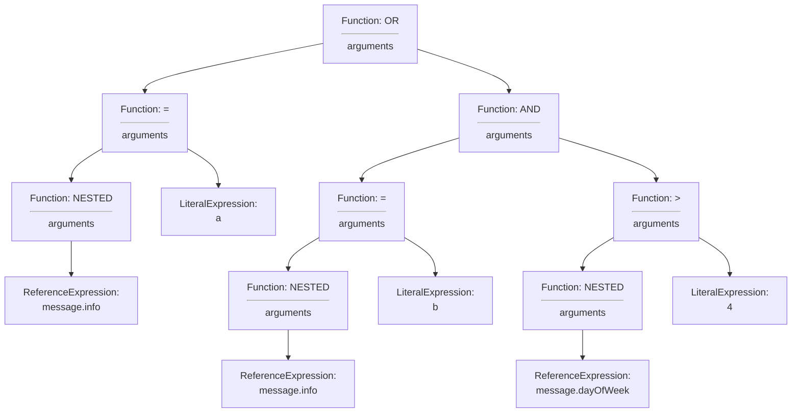

--------------------------------

### Configure CloudWatch Metrics for Spark Execution Engine

Source: https://github.com/opensearch-project/sql/blob/main/docs/user/interfaces/asyncqueryinterface.rst

Example JSON request to update cluster settings for enabling AWS CloudWatch as an external metrics sink for the Spark execution engine. This configuration includes specific Spark properties for CloudWatch sink class, namespace, regex for metrics, and Flint metric source class, applicable from Flint 0.1.1.

```json
PUT _cluster/settings
{
  "persistent": {
    "plugins.query.executionengine.spark.config": "{\"applicationId\":\"xxxxx\",\"executionRoleARN\":\"arn:aws:iam::xxxxx:role/emr-job-execution-role\",\"region\":\"us-east-1\",\"sparkSubmitParameters\":\"--conf spark.dynamicAllocation.enabled=false --conf spark.metrics.conf.*.sink.cloudwatch.class=org.apache.spark.metrics.sink.CloudWatchSink --conf spark.metrics.conf.*.sink.cloudwatch.namespace=OpenSearchSQLSpark --conf spark.metrics.conf.*.sink.cloudwatch.regex=(opensearch|numberAllExecutors).* --conf spark.metrics.conf.*.source.cloudwatch.class=org.apache.spark.metrics.source.FlintMetricSource \"}"
  }
}
```

--------------------------------

### Paginating OpenSearch Results with Composite Aggregations and After Parameter

Source: https://github.com/opensearch-project/sql/blob/main/docs/dev/opensearch-pagination.md

This snippet demonstrates how to paginate search results in OpenSearch using composite aggregations and the 'after' parameter. It allows for stateless pagination by providing the last seen values for composite keys, enabling retrieval of the next page of aggregated buckets.

```curl
curl -X GET "localhost:9200/_search?pretty" -H 'Content-Type: application/json' -d'
{
    "aggs" : {
        "my_buckets": {
            "composite" : {
                "size": 2,
                 "sources" : [
                    { "date": { "date_histogram": { "field": "timestamp", "calendar_interval": "1d", "order": "desc" } } },
                    { "product": { "terms": {"field": "product", "order": "asc" } } }
                ],
                "after": { "date": 1494288000000, "product": "mad max" } 
            }
        }
    }
}
'
```

--------------------------------

### Conditional Filtering with SQL CASE in WHERE Clause

Source: https://github.com/opensearch-project/sql/blob/main/integ-test/src/test/resources/correctness/bugfixes/877.txt

Demonstrates using both searched and simple CASE expressions within the WHERE clause to conditionally filter results based on the FlightDelay status. Examples include cases with and without an ELSE clause to define the default comparison value.

```SQL
SELECT FlightNum FROM opensearch_dashboards_sample_data_flights WHERE FlightDelayMin >= CASE WHEN FlightDelay = true THEN 200 END
```

```SQL
SELECT FlightNum FROM opensearch_dashboards_sample_data_flights WHERE FlightDelayMin >= CASE WHEN FlightDelay = true THEN 200 ELSE 0 END
```

```SQL
SELECT FlightNum FROM opensearch_dashboards_sample_data_flights WHERE FlightDelayMin >= CASE FlightDelay WHEN true THEN 200 END
```

```SQL
SELECT FlightNum FROM opensearch_dashboards_sample_data_flights WHERE FlightDelayMin >= CASE FlightDelay WHEN true THEN 200 ELSE 0 END
```

--------------------------------

### OpenSearch SQL Correctness Integration Test Log Output

Source: https://github.com/opensearch-project/sql/blob/main/docs/dev/testing-comparison-test.md

This log output captures the execution flow of a correctness integration test within the OpenSearch SQL project. It details key stages such as loading test data, verifying queries, saving the test report to disk, and cleaning up test data upon completion.

```Log
[2020-01-06T11:37:57,996][INFO ][c.a.o.s.c.CorrectnessIT  ] [performComparisonTest] Loading test data set...
[2020-01-06T11:38:06,308][INFO ][c.a.o.s.c.CorrectnessIT  ] [performComparisonTest] Verifying test queries...
[2020-01-06T11:38:21,180][INFO ][c.a.o.s.c.CorrectnessIT  ] [performComparisonTest] Saving test report to disk...
[2020-01-06T11:38:21,202][INFO ][c.a.o.s.c.CorrectnessIT  ] [performComparisonTest] Report file location is /Users/xxx/Workspace/sql/reports/report_2020-01-06-19.json
[2020-01-06T11:38:21,204][INFO ][c.a.o.s.c.CorrectnessIT  ] [performComparisonTest] Cleaning up test data...
[2020-01-06T11:38:21,849][INFO ][c.a.o.s.c.CorrectnessIT  ] [performComparisonTest] Completed comparison test.
```

--------------------------------

### Using Delimited Identifiers in OpenSearch SQL

Source: https://github.com/opensearch-project/sql/blob/main/docs/user/ppl/general/identifiers.rst

Illustrates the use of back ticks (`) to delimit identifiers, which allows for names containing reserved keywords or special characters. This example queries the 'accounts' index using a delimited index name and selects a delimited field name, displaying the output.

```OpenSearch SQL
os> source=`accounts` | fields `account_number`;
fetched rows / total rows = 4/4
+----------------+
| account_number |
|----------------|
| 1              |
| 6              |
| 13             |
| 18             |
+----------------+
```

--------------------------------

### OpenSearch SQL: Extract Date from Timestamp with DATE()

Source: https://github.com/opensearch-project/sql/blob/main/docs/user/ppl/functions/datetime.rst

Demonstrates how to use the DATE() function in OpenSearch SQL to extract only the date part from a given timestamp string. The example shows the function's usage within an eval command to display the extracted date.

```SQL
os> source=people | eval `DATE('2020-08-26 13:49')` = DATE('2020-08-26 13:49') | fields `DATE('2020-08-26 13:49')`
```

--------------------------------

### Select Deeper Nested Field Values in OpenSearch SQL

Source: https://github.com/opensearch-project/sql/blob/main/docs/user/beyond/partiql.rst

Illustrates how to access and retrieve inner field values from deeper levels within object fields. For example, 'city.location' returns a nested object, while 'city.location.latitude' extracts a scalar value.

```OpenSearch SQL
SELECT city.location, city.location.latitude FROM people;
```

--------------------------------

### Sequence Diagram for Subsequent Paging SQL Query Request in OpenSearch

Source: https://github.com/opensearch-project/sql/blob/main/docs/dev/Pagination-v2.md

Describes the workflow for processing subsequent pages of a SQL query. Key steps include deserialization of the physical plan tree from the cursor by `PlanSerializer` and skipping tree processing steps, followed by re-serialization for the next page.

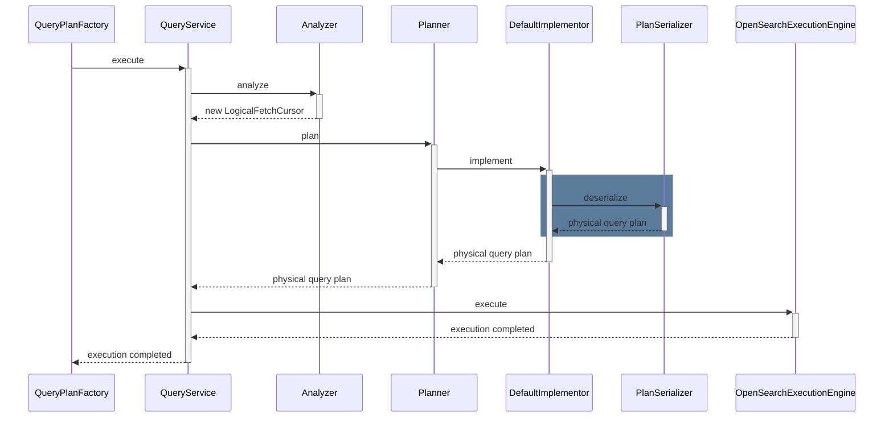

--------------------------------

### Conditional Aggregation and Grouping with SQL CASE

Source: https://github.com/opensearch-project/sql/blob/main/integ-test/src/test/resources/correctness/bugfixes/877.txt

Illustrates how to use CASE expressions in both the SELECT list and GROUP BY clause to perform conditional aggregation. Examples show transforming boolean values to integers or strings for grouping and calculating maximum flight delay based on the transformed values.

```SQL
SELECT CASE WHEN FlightDelay = true THEN 1 ELSE 0 END AS bool, MAX(FlightDelayMin) FROM opensearch_dashboards_sample_data_flights GROUP BY CASE WHEN FlightDelay = true THEN 1 ELSE 0 END
```

```SQL
SELECT CASE FlightDelay WHEN true THEN 1 WHEN false THEN 0 END AS bool, MAX(FlightDelayMin) FROM opensearch_dashboards_sample_data_flights GROUP BY CASE FlightDelay WHEN true THEN 1 WHEN false THEN 0 END
```

```SQL
SELECT CASE WHEN FlightDelay = true THEN 'delayed' ELSE NULL END AS delay, MAX(FlightDelayMin) FROM opensearch_dashboards_sample_data_flights GROUP BY CASE WHEN FlightDelay = true THEN 'delayed' ELSE NULL END
```

--------------------------------

### Get Data Type with TYPEOF Function in OpenSearch SQL

Source: https://github.com/opensearch-project/sql/blob/main/docs/user/ppl/functions/system.rst

The `typeof(expr)` function returns the name of the data type of the value passed to it. This function accepts any argument type and returns a STRING, making it helpful for troubleshooting or dynamically constructing SQL queries.

```OpenSearch SQL
os> source=people | eval `typeof(date)` = typeof(DATE('2008-04-14')), `typeof(int)` = typeof(1), `typeof(now())` = typeof(now()), `typeof(column)` = typeof(accounts) | fields `typeof(date)`, `typeof(int)`, `typeof(now())`, `typeof(column)`
fetched rows / total rows = 1/1
+--------------+-------------+---------------+----------------+
| typeof(date) | typeof(int) | typeof(now()) | typeof(column) |
|--------------+-------------+---------------+----------------|
| DATE         | INTEGER     | TIMESTAMP     | OBJECT         |
+--------------+-------------+---------------+----------------+
```

--------------------------------

### PPL Function Signature for Native PromQL Passthrough

Source: https://github.com/opensearch-project/sql/blob/main/docs/dev/datasource-prometheus.md

Documents the PPL function signature for executing native PromQL commands directly through a Prometheus connector. It allows specifying time range parameters (`startTime`, `endTime`) and resolution (`step`) for the PromQL query.

```APIDOC
source = ``promcatalog.nativeQuery(`promQLCommand`, startTime = "{{startTime}}", endTime="{{endTime}}", step="{{resolution}}")``
```

--------------------------------

### Querying OpenSearch SQL for NULL and MISSING values

Source: https://github.com/opensearch-project/sql/blob/main/docs/user/general/values.rst

Demonstrates how OpenSearch SQL distinguishes between a field explicitly set to NULL and a field that is entirely absent (MISSING) in query results. The example shows a user with a NULL employer and another user without an email field, which translates to NULL in table format.

```OpenSearch SQL
SELECT firstname, employer, email FROM accounts;
```

--------------------------------

### Conceptual Iterative Calculation for Aggregate Window Functions

Source: https://github.com/opensearch-project/sql/blob/main/docs/dev/sql-aggregate-window-function.md

Provides a step-by-step conceptual trace of how an aggregate window function calculates the running total, demonstrating the logic for handling new partitions and duplicate sort keys by loading and accumulating values iteratively.

```Text
+-----+-------+------+---------+---------------+
| no. | state | age  | balance | running total |
+-----+-------+------+---------+---------------+
|   1 | WA    |   10 |     100 |           100 | <- load 100, return 100 as sum
|   2 | WA    |   20 |     200 |           350 | <- load 200 and 50, return 350
|   3 | WA    |   20 |      50 |           350 | <- load nothing, return 350 again
|   4 | WA    |   35 |     150 |           500 | <- load 150, return 500
|   5 | CA    |   18 |     150 |           250 | <- new partition, reset and load 100 and 150
|   6 | CA    |   18 |     100 |           250 | <- load nothing, return 250 again
|   7 | CA    |   30 |     200 |           450 | <- load 200, return 450
+-----+-------+------+---------+---------------+
```

--------------------------------

### Get Weekday Index for Date in OpenSearch SQL

Source: https://github.com/opensearch-project/sql/blob/main/docs/user/dql/functions.rst

Returns the weekday index for a given date (0 = Monday, 1 = Tuesday, ..., 6 = Sunday). It is similar to the `dayofweek` function, but returns different indexes for each day. Argument type: STRING/DATE/TIME/TIMESTAMP. Return type: INTEGER.

```SQL
SELECT weekday('2020-08-26'), weekday('2020-08-27')
```

--------------------------------

### CSV Sanitization Rule for Pipe Characters

Source: https://github.com/opensearch-project/sql/blob/main/docs/user/interfaces/protocol.rst

Demonstrates the CSV formatter's sanitization rule: if a cell contains one or more pipe ('|') characters, the sanitizer will quote the entire cell with double quotes. This example first indexes a document with a pipe in the address, then queries it in CSV format.

```curl
>> curl -H 'Content-Type: application/json' -X PUT localhost:9200/userdata/_doc/1?refresh=true -d '{
  "+firstname": "-Hattie",
  "=lastname": "@Bond",
  "address": "671 Bristol Street|, Dente, TN"
}'
>> curl -H 'Content-Type: application/json' -X POST localhost:9200/_plugins/_sql?format=csv -d '{
  "query" : "SELECT firstname, lastname, address FROM userdata"
}'

Result set::

    '+firstname|'=lastname|address
    'Hattie|@Bond|"671 Bristol Street|, Dente, TN"
```

--------------------------------

### Create Multiple New Fields with Chained eval Expressions in OpenSearch SQL

Source: https://github.com/opensearch-project/sql/blob/main/docs/user/ppl/cmd/eval.rst

This example shows how to create multiple new fields within a single `eval` command. It defines `doubleAge` as `age * 2` and then uses the newly defined `doubleAge` to define `ddAge` as `doubleAge * 2`, demonstrating chained evaluation within the same command.

```OpenSearch SQL
os> source=accounts | eval doubleAge = age * 2, ddAge = doubleAge * 2 | fields age, doubleAge, ddAge ;
```

--------------------------------

### Glue Connector Properties

Source: https://github.com/opensearch-project/sql/blob/main/docs/user/ppl/admin/connectors/security_lake_connector.rst

Details the configurable properties for the OpenSearch Security Lake Glue connector, including authentication, OpenSearch index store settings, and Lake Formation session tagging.

```APIDOC
resultIndex: string (optional)
  description: Stores the results of queries executed on the data source. Defaults to .query_execution_result.

glue.auth.type: string (required)
  description: Authentication type for the execution engine to connect to Glue.
  supported_values: ["iam_role"]
  
  glue.auth.role_arn: string (required, if glue.auth.type is iam_role)
    description: The IAM role ARN for authentication.

glue.indexstore.opensearch.*: object (required)
  description: OpenSearch domain host information for the Glue connector, used for writing index data.

  glue.indexstore.opensearch.uri: string (required)
    description: The URI of the OpenSearch domain.

  glue.indexstore.opensearch.auth: string (required)
    description: Authentication method for OpenSearch.
    accepted_values: ["noauth", "basicauth", "awssigv4"]

    glue.indexstore.opensearch.auth.username: string (required, if basicauth)
      description: Username for basic authentication.

    glue.indexstore.opensearch.auth.password: string (required, if basicauth)
      description: Password for basic authentication.

    glue.indexstore.opensearch.auth.region: string (required, if awssigv4)
      description: AWS region for AWSSigV4 authentication.

  glue.indexstore.opensearch.region: string (required, if awssigv4 auth)
    description: AWS region for OpenSearch.

glue.lakeformation.session_tag: string (required)
  description: The session tag to use when assuming the data source role for Lake Formation.
```

--------------------------------

### Optimized Logical Query Plan States for Non-Paged Requests

Source: https://github.com/opensearch-project/sql/blob/main/docs/dev/Pagination-v2.md

This state diagram shows the optimized logical query plan for non-paged requests. It illustrates the flow from `LogicalProject` through `LogicalLimit` and `LogicalSort` to `OpenSearchIndexScanQueryBuilder`, demonstrating the push-down optimization for non-paged queries.

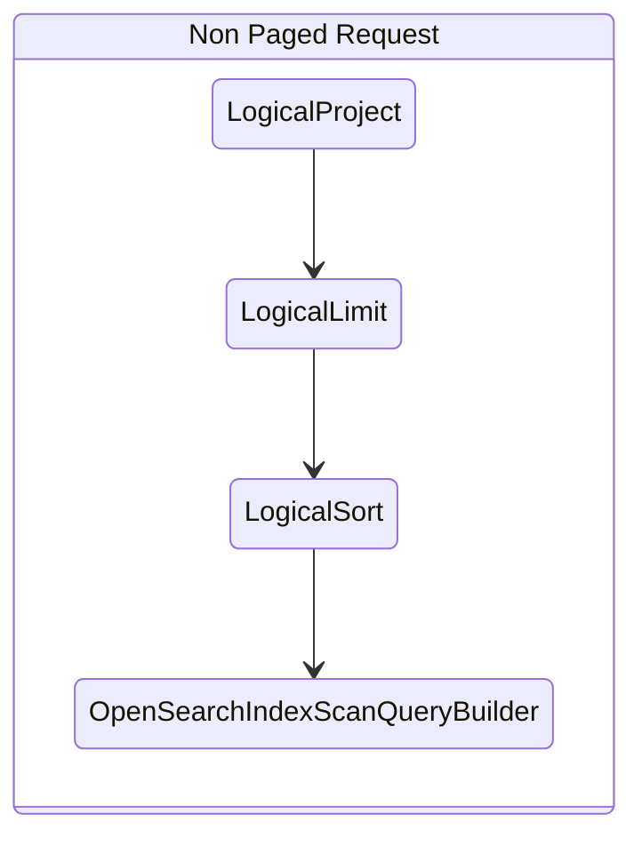

--------------------------------

### OpenSearch SQL Cross Join Example

Source: https://github.com/opensearch-project/sql/blob/main/docs/user/dql/complex.rst

Demonstrates a Cross Join (Cartesian join) in OpenSearch SQL, which combines every document from the first index with every document from the second. This join type is similar to an inner join without an `ON` clause. A significant caveat is that cross joins can be resource-intensive and may trigger circuit breakers on medium-sized indices due to potential out-of-memory issues.

```SQL
POST /_plugins/_sql
{
  "query" : """
		SELECT
		  a.account_number, a.firstname, a.lastname,
		  e.id, e.name
		FROM accounts a
		JOIN employees_nested e
		"""
}
```

--------------------------------

### OpenSearch SQL: Calculate Week Number with WEEK Function

Source: https://github.com/opensearch-project/sql/blob/main/docs/user/ppl/functions/datetime.rst

Illustrates the usage of the `WEEK()` function in OpenSearch SQL to determine the week number of a specific date. The example shows calculations with and without the `mode` argument, demonstrating how different modes affect the result.

```OpenSearch SQL
os> source=people | eval `WEEK(DATE('2008-02-20'))` = WEEK(DATE('2008-02-20')), `WEEK(DATE('2008-02-20'), 1)` = WEEK(DATE('2008-02-20'), 1) | fields `WEEK(DATE('2008-02-20'))`, `WEEK(DATE('2008-02-20'), 1)`
fetched rows / total rows = 1/1
+--------------------------+-----------------------------+
| WEEK(DATE('2008-02-20')) | WEEK(DATE('2008-02-20'), 1) |
|--------------------------+-----------------------------|
| 7                        | 8                           |
+--------------------------+-----------------------------+
```

--------------------------------

### PPL Query for Join with Subquery

Source: https://github.com/opensearch-project/sql/blob/main/docs/user/ppl/cmd/join.rst

Illustrates a `left join` where the right dataset is a subquery. The subquery filters and sorts data from the `occupation` index before joining with `state_country`.

```Shell
curl -H 'Content-Type: application/json' -X POST localhost:9200/_plugins/_ppl -d '{
  "query" : """
          source = state_country as a
          | where country = 'USA' OR country = 'England'
          | left join ON a.name = b.name [
              source = occupation
              | where salary > 0
              | fields name, country, salary
              | sort salary
              | head 3
            ] as b
          | stats avg(salary) by span(age, 10) as age_span, b.country
	  """
}'
```

```JSON
{
      "schema": [
        {
          "name": "avg(salary)",
          "type": "double"
        },
        {
          "name": "age_span",
          "type": "integer"
        },
        {
          "name": "b.country",
          "type": "string"
        }
      ],
      "datarows": [
        [
          null,
          40,
          null
        ],
        [
          70000.0,
          30,
          "USA"
        ],
        [
          100000.0,
          70,
          "England"
        ]
      ]
}
```

--------------------------------

### Update Spark Refresh Job Limit Setting

Source: https://github.com/opensearch-project/sql/blob/main/docs/user/admin/settings.rst

This setting defines the maximum number of concurrent Spark refresh jobs, with a default of 5. It is node-scoped and can be updated dynamically. The example shows how to increase the limit to 200 using a PUT request to the `_cluster/settings` endpoint.

```sh
sh$ curl -sS -H 'Content-Type: application/json' -X PUT localhost:9200/_cluster/settings \
 -d '{"transient":{"plugins.query.executionengine.spark.refresh_job.limit":200}}'
{
  "acknowledged": true,
  "persistent": {},
  "transient": {
    "plugins": {
      "query": {
        "executionengine": {
          "spark": {
            "refresh_job": {
              "limit": "200"
            }
          }
        }
      }
    }
  }
}
```

--------------------------------

### Select Specified Fields from Search Results (PPL)

Source: https://github.com/opensearch-project/sql/blob/main/docs/user/ppl/cmd/fields.rst

Demonstrates how to use the 'fields' command to select and display only specific fields (account_number, firstname, lastname) from the 'accounts' source in an OpenSearch PPL query.

```PPL
os> source=accounts | fields account_number, firstname, lastname;
```

--------------------------------

### Define RCF Model Training for Non-time-series Data (Batch)

Source: https://github.com/opensearch-project/sql/blob/main/docs/user/ppl/cmd/ml.rst

Describes the `ml` command for training RCF models on non-time-series data, including parameters like `number_of_trees`, `sample_size`, `training_data_size`, and `anomaly_score_threshold`. This syntax is for batch RCF.

```APIDOC
ml action='train' algorithm='rcf' (Batch RCF):
  Parameters:
    number_of_trees (integer, optional): Number of trees in the forest. Default: 30.
    sample_size (integer, optional): Number of random samples given to each tree from the training data set. Default: 256.
    output_after (integer, optional): The number of points required by stream samplers before results are returned. Default: 32.
    training_data_size (integer, optional): Default: the size of your training data set.
    anomaly_score_threshold (double, optional): The threshold of anomaly score. Default: 1.0.
    category_field (string, optional): Specifies the category field used to group inputs. Each category will be independently predicted.
```

--------------------------------

### OpenSearch SQL Explain Plan for Inner Join

Source: https://github.com/opensearch-project/sql/blob/main/docs/user/dql/complex.rst

This JSON represents the explain plan for an OpenSearch SQL inner join query. It shows the physical plan, including Project, Top, BlockHashJoin, and Scroll operations for both joined indices, detailing how the join is executed.

```JSON
{
  "Physical Plan" : {
    "Project [ columns=[a.account_number, a.firstname, a.lastname, e.name, e.id] ]" : {
      "Top [ count=200 ]" : {
        "BlockHashJoin[ conditions=( a.account_number = e.id ), type=JOIN, blockSize=[FixedBlockSize with size=10000] ]" : {
          "Scroll [ employees_nested as e, pageSize=10000 ]" : {
            "request" : {
              "size" : 200,
              "from" : 0,
              "_source" : {
                "excludes" : [ ],
                "includes" : [
                  "id",
                  "name"
                ]
              }
            }
          },
          "Scroll [ accounts as a, pageSize=10000 ]" : {
            "request" : {
              "size" : 200,
              "from" : 0,
              "_source" : {
                "excludes" : [ ],
                "includes" : [
                  "account_number",
                  "firstname",
                  "lastname"
                ]
              }
            }
          }
        }
      }
    }
  }
}
```

--------------------------------

### OpenSearch SQL Query Plan Node Serialization Process

Source: https://github.com/opensearch-project/sql/blob/main/docs/dev/Pagination-v2.md

Details the serialization process for OpenSearch SQL query plan nodes, requiring them to implement the `SerializablePlan` interface. It explains how specific nodes can be skipped from serialization and how OpenSearch search request objects are handled by extracting their search context rather than full serialization.

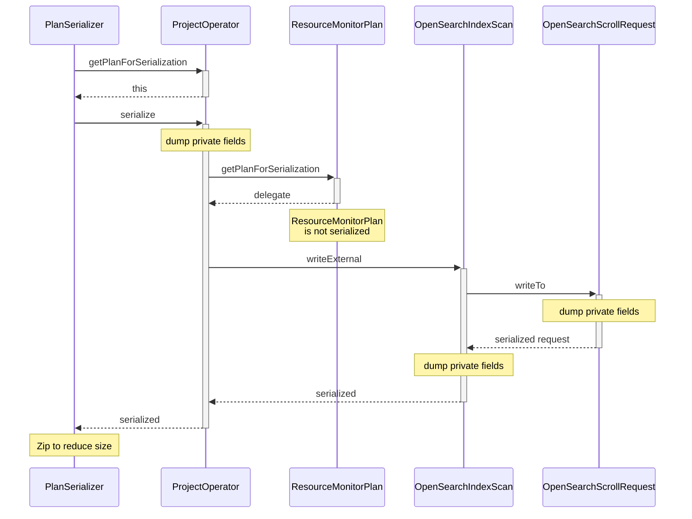

--------------------------------

### SQL/PPL Type Precedence: Correct Boolean-String Conversion

Source: https://github.com/opensearch-project/sql/blob/main/docs/dev/query-type-conversion.md

This conceptual example illustrates the revised, semantically correct approach to implicit type conversion between boolean and string. By making BOOLEAN the parent of STRING in the type hierarchy, the compiler correctly resolves the expression to equal(BOOL, BOOL), ensuring accurate evaluation at runtime.

```SQL/PPL (Conceptual)
Compiling time:
 Expression: false = 'FALSE'
 Unresolved signature: equal(BOOL, STRING)
 Resovled signature: equal(BOOL, BOOL)
 Function builder: 1) returns equal(BOOL, cast_to_bool(STRING)) impl
                   2) returns equal(BOOL, BOOL) impl
Runtime:
 equal impl: false.equals(cast_to_bool('FALSE'))
 cast_to_bool impl: Boolean.valueOf('FALSE')
 Evaluation result: *true*
```

--------------------------------

### Calculate Ceiling Value in OpenSearch SQL

Source: https://github.com/opensearch-project/sql/blob/main/integ-test/src/test/resources/correctness/expressions/mathematical_functions.txt

Illustrates the `ceil()` function, which returns the smallest integer greater than or equal to the given number. Examples include casting the result to INT for compatibility with H2 and SQLite, as these databases expect integer return types for ceiling operations.

```SQL
CAST(ceil(1) AS INT)
CAST(ceil(-1) AS INT)
CAST(ceil(0.0) AS INT)
CAST(ceil(0.4999) AS INT)
CAST(ceil(abs(1)) AS INT)
```

--------------------------------

### Reset OpenSearch PPL Plugin Enabled Setting

Source: https://github.com/opensearch-project/sql/blob/main/docs/user/ppl/admin/settings.rst

Illustrates how to reset the `plugins.ppl.enabled` setting to its default value (`true`) by sending a PUT request with `null` for the transient setting. This re-enables the PPL plugin.

```sh
curl -sS -H 'Content-Type: application/json' \
-X PUT localhost:9200/_plugins/_query/settings \
-d '{"transient" : {"plugins.ppl.enabled" : null}}'
{
  "acknowledged": true,
  "persistent": {},
  "transient": {}
}
```

--------------------------------

### Get Current Date and Time in OpenSearch SQL

Source: https://github.com/opensearch-project/sql/blob/main/docs/user/ppl/functions/datetime.rst

The `NOW()` function returns the current date and time in 'YYYY-MM-DD hh:mm:ss' format, expressed in the cluster time zone. Unlike `SYSDATE()`, `NOW()` returns a constant time indicating when the statement began execution.

```APIDOC
NOW
  Description: Returns the current date and time as a value in 'YYYY-MM-DD hh:mm:ss' format. The value is expressed in the cluster time zone.
  Specification: NOW() -> TIMESTAMP
  Return type: TIMESTAMP
```

```OpenSearch SQL
source=people | eval `value_1` = NOW(), `value_2` = NOW() | fields `value_1`, `value_2`
```

--------------------------------

### Control OpenSearch Field Type Tolerance for Arrays

Source: https://github.com/opensearch-project/sql/blob/main/docs/user/admin/settings.rst

This setting dictates whether array values are preserved or collapsed to their first non-array element. By default, arrays are preserved. The examples illustrate querying an array field with tolerance enabled and disabled, showing the difference in returned data.

```APIDOC
plugins.query.field_type_tolerance
Description
This setting controls whether preserve arrays. If this setting is set to false, then an array is reduced
to the first non array value of any level of nesting.
1. The default value is true (preserve arrays)
2. This setting is node scope
3. This setting can be updated dynamically
```

```SQL
SELECT accounts FROM people;
fetched rows / total rows = 1/1
+-----------------------+
| accounts              |
+-----------------------+
| [{'id': 1},{'id': 2}] |
+-----------------------+
```

```sh
curl -H 'Content-Type: application/json' -X PUT localhost:9200/_plugins/_query/settings -d '{
	    "transient" : {
	      "plugins.query.field_type_tolerance" : false
	    }
	  }'
```

```SQL
SELECT accounts FROM people;
fetched rows / total rows = 1/1
+-----------+
| accounts  |
+-----------+
| {'id': 1} |
+-----------+
```

```sh
curl -H 'Content-Type: application/json' -X PUT localhost:9200/_plugins/_query/settings -d '{
	    "transient" : {
	      "plugins.query.field_type_tolerance" : true
	    }
	  }'
```

--------------------------------

### Verify PPL Plugin Disabled State with Query

Source: https://github.com/opensearch-project/sql/blob/main/docs/user/ppl/admin/settings.rst

Shows the error response received when attempting to execute a PPL query after the `plugins.ppl.enabled` setting has been set to `false`, indicating the plugin is disabled. The error details specify `IllegalAccessException`.

```sh
curl -sS -H 'Content-Type: application/json' \
-X POST localhost:9200/_plugins/_ppl \
-d '{"query": "source=my_prometheus"}'
{
  "error": {
    "reason": "Invalid Query",
    "details": "Either plugins.ppl.enabled or rest.action.multi.allow_explicit_index setting is false",
    "type": "IllegalAccessException"
  },
  "status": 400
}
```

--------------------------------

### SQL Subquery with Nested Grouping by Ordinal Position

Source: https://github.com/opensearch-project/sql/blob/main/integ-test/src/test/resources/correctness/queries/subqueries.txt

This query demonstrates nested grouping using ordinal positions instead of column names in the `GROUP BY` clause. The inner subquery groups by the 1st, 2nd, and 3rd selected columns, and the outer query groups by the 1st and 2nd columns from the subquery's result.

```SQL
SELECT origin, price FROM (SELECT Origin AS origin, Dest AS dest, AvgTicketPrice AS price FROM opensearch_dashboards_sample_data_flights GROUP BY 1, 2, 3) AS f GROUP BY 1, 2
```

--------------------------------

### OpenSearch SQL Hash Join Execution Plan

Source: https://github.com/opensearch-project/sql/blob/main/docs/user/dql/complex.rst

This snippet illustrates the execution plan and description for a Hash Join algorithm in OpenSearch SQL. The Hash Join builds a hash table from the first query's result and probes it with the second query's rows to find matches. The logical plan details the projection, top-N, and join operations on 'accounts' and 'employees_nested' tables.

```JSON
{
  "description" : "Hash Join algorithm builds hash table based on result of first query, and then probes hash table to find matched rows for each row returned by second query",
  "Logical Plan" : {
    "Project [ columns=[a.account_number, a.firstname, a.lastname, e.name, e.id] ]" : {
      "Top [ count=200 ]" : {
        "Join [ conditions=( a.account_number = e.id ) type=JOIN ]" : {
          "Group" : [
            {
              "Project [ columns=[a.account_number, a.firstname, a.lastname] ]" : {
                "TableScan" : {
                  "tableAlias" : "a",
                  "tableName" : "accounts"
                }
              }
            },
            {
              "Project [ columns=[e.name, e.id] ]" : {
                "TableScan" : {
                  "tableAlias" : "e",
                  "tableName" : "employees_nested"
                }
              }
            }
          ]
        }
      }
    }
  }
}
```

--------------------------------

### SQL SELECT Statement Syntax

Source: https://github.com/opensearch-project/sql/blob/main/integ-test/src/test/resources/doctest/templates/dql/basics.rst

This snippet outlines the complete syntax for the SQL `SELECT` statement in OpenSearch, detailing all available clauses such as `DISTINCT`, `FROM`, `WHERE`, `GROUP BY`, `HAVING`, `ORDER BY`, and `LIMIT`. It also notes that while batch queries are not supported, ending a statement with a semicolon is allowed for compatibility with other tools.

```SQL
SELECT [DISTINCT] (* | expression) [[AS] alias] [, ...]
FROM index_name
[WHERE predicates]
[GROUP BY expression [, ...]
 [HAVING predicates]]
[ORDER BY expression [IS [NOT] NULL] [ASC | DESC] [, ...]]
[LIMIT [offset, ] size]
```

--------------------------------

### OpenSearch SQL stats with VAR_SAMP() Aggregation

Source: https://github.com/opensearch-project/sql/blob/main/docs/user/ppl/cmd/stats.rst

Illustrates how to use the `VAR_SAMP()` aggregation function with the `stats` command to calculate the sample variance of a field.

```OpenSearch SQL
source=accounts | stats var_samp(age);
```

--------------------------------

### Filter Aggregate Function by Carrier in OpenSearch SQL

Source: https://github.com/opensearch-project/sql/blob/main/integ-test/src/test/resources/correctness/queries/filter.txt

This query calculates the average ticket price for flights operated by 'OpenSearch Dashboards Airlines' using the FILTER clause. The FILTER clause applies a condition to the rows *before* the aggregate function is applied, effectively filtering the input to the aggregation.

```SQL
SELECT AVG(AvgTicketPrice) FILTER(WHERE Carrier = 'OpenSearch Dashboards Airlines') AS filtered FROM opensearch_dashboards_sample_data_flights
```

--------------------------------

### Nested Query with Multiple Fields Having Differing Paths

Source: https://github.com/opensearch-project/sql/blob/main/docs/dev/sql-nested-function-select-clause.md

This example showcases an OpenSearch SQL query with multiple `nested` function calls, each referencing a different path. It highlights how the SQL plugin generates separate `nested` queries within the OpenSearch DSL for each distinct path specified in the SQL query, ensuring correct data retrieval from different nested structures.

```SQL
SELECT nested(message.info, message), nested(comment.data, comment) FROM nested_objects;
```

```JSON
{
    "query": {
        "bool": {
            "filter": [
                {
                    "bool": {
                        "must": [
                            {
                                "nested": {
                                    "query": {
                                        "match_all": {
                                            "boost": 1.0
                                        }
                                    },
                                    "path": "comment",
                                    "...": "...",
                                    "inner_hits": {
                                        "...": "...",
                                        "_source": {
                                            "includes": [
                                                "comment.data"
                                            ],
                                            "excludes": []
                                        }
                                    }
                                }
                            }
                        ]
                    }
                }
            ]
        }
    },
    "...": "..."
}
```

--------------------------------

### Explain SQL Sort Operator Merging into OpenSearch Query DSL

Source: https://github.com/opensearch-project/sql/blob/main/docs/user/optimization/optimization.rst

Demonstrates how a simple SQL ORDER BY clause on a field is optimized by merging directly into the OpenSearch Query DSL's sort parameter, resulting in an OpenSearchIndexScan operator.

```shell
sh$ curl -sS -H 'Content-Type: application/json' \
... -X POST localhost:9200/_plugins/_sql/_explain \
... -d '{"query" : "SELECT age FROM accounts ORDER BY age"}'
```

```json
{
  "root": {
    "name": "ProjectOperator",
    "description": {
      "fields": "[age]"
    },
    "children": [
      {
        "name": "OpenSearchIndexScan",
        "description": {
          "request": "OpenSearchQueryRequest(indexName=accounts, sourceBuilder={\"from\":0,\"size\":10000,\"timeout\":\"1m\",\"_source\":{\"includes\":[\"age\"],\"excludes\":[]},\"sort\":[{\"age\":{\"order\":\"asc\",\"missing\":\"_first\"}}]}, searchDone=false)"
        },
        "children": []
      }
    ]
  }
}
```

--------------------------------

### Join Metric Data in PPL using Vector Operations

Source: https://github.com/opensearch-project/sql/blob/main/docs/dev/datasource-prometheus.md

Describes the proposed PPL grammar for joining metric data, primarily for vector arithmetic. This syntax uses `vector_op` with `on` or `ignoring` clauses and `group_left` or `group_right` for label matching.

```PPL
source=leftTable | vector_op(operator) on|ignoring  group_left|group_right rightTable
```

--------------------------------

### Qualifying Field Identifiers by Table Alias in OpenSearch SQL

Source: https://github.com/opensearch-project/sql/blob/main/docs/user/general/identifiers.rst

This example shows qualifying a field name ('age') using a table alias ('acc') defined in the FROM clause. Similar to full table name qualification, the alias qualifier is optional if there's no ambiguity, providing a shorter way to reference fields.

```SQL
os> SELECT city, acc.age, ABS(acc.balance) FROM accounts AS acc WHERE acc.age > 30;
```

--------------------------------

### SQL: Nested Subquery Selection

Source: https://github.com/opensearch-project/sql/blob/main/integ-test/src/test/resources/correctness/bugfixes/901.txt

This SQL query demonstrates the use of nested subqueries. The innermost subquery selects 'Origin' from 'opensearch_dashboards_sample_data_flights'. The middle subquery then selects all from the result of the innermost one, aliased as 'flights'. Finally, the outermost query selects all from the result of the middle subquery, aliased as 'f', illustrating multiple levels of subquery nesting.

```SQL
SELECT * FROM (SELECT * FROM (SELECT Origin FROM opensearch_dashboards_sample_data_flights) AS flights) AS f
```

--------------------------------

### Calculate Floor Value in OpenSearch SQL

Source: https://github.com/opensearch-project/sql/blob/main/integ-test/src/test/resources/correctness/expressions/mathematical_functions.txt

Demonstrates the `floor()` function, which returns the largest integer less than or equal to the given number. Examples include casting the result to INT for compatibility with H2 and SQLite, as these databases expect integer return types for floor operations.

```SQL
CAST(floor(1) AS INT)
CAST(floor(-1) AS INT)
CAST(floor(0.0) AS INT)
CAST(floor(0.4999) AS INT)
CAST(floor(abs(-1)) AS INT)
```

--------------------------------

### Calculate Sample Standard Deviation with PPL STDDEV_SAMP

Source: https://github.com/opensearch-project/sql/blob/main/docs/user/ppl/cmd/eventstats.rst

This function determines the sample standard deviation of a numeric expression. It takes a single expression as input and returns its sample standard deviation. The example shows how to use `STDDEV_SAMP` in conjunction with the `eventstats` command to add the sample standard deviation of the 'age' field to each row from the 'accounts' source.

```PPL
source=accounts | eventstats stddev_samp(age);
```

--------------------------------

### Convert Timezone in OpenSearch SQL: Positive to Positive (Null Result)

Source: https://github.com/opensearch-project/sql/blob/main/docs/user/ppl/functions/datetime.rst

Demonstrates a `convert_tz` operation from a positive timezone to another positive timezone. This specific example, converting from +00:00 to +15:00, unexpectedly results in a `null` value, possibly indicating an invalid target timezone or an edge case not fully supported.

```OpenSearch SQL
os> source=people | eval \`convert_tz('2008-05-15 12:00:00','+00:00','+15:00')\` = convert_tz('2008-05-15 12:00:00','+00:00','+15:00')| fields \`convert_tz('2008-05-15 12:00:00','+00:00','+15:00')\`
fetched rows / total rows = 1/1
+-----------------------------------------------------+
| convert_tz('2008-05-15 12:00:00','+00:00','+15:00') |
|-----------------------------------------------------|
| null                                                |
+-----------------------------------------------------+
```

--------------------------------

### Select string literals with different escaping in OpenSearch SQL

Source: https://github.com/opensearch-project/sql/blob/main/docs/user/dql/expressions.rst

Illustrates different methods for defining and escaping string literals in OpenSearch SQL. It shows the use of single and double quotes, as well as escaping single quotes by doubling them (e.g., 'It''s') or using a backslash (e.g., 'It\'s'), and escaping double quotes by doubling them (e.g., "It""s"). It also includes an example of backslash escaping for special characters like tab and backslash itself.

```SQL
os> SELECT "Hello", 'Hello', "It""s", 'It''s', "It's", '"Its"', 'It\'s', 'It\\\'s', "\I\t\s"
```

--------------------------------

### QueryPlan with Paginate Root Unresolved Plan

Source: https://github.com/opensearch-project/sql/blob/main/docs/dev/Pagination-v2.md

Illustrates how `QueryPlanFactory.create` adds a `Paginate` unresolved plan as the root for initial query requests, setting the `pageSize` parameter in `QueryPlan`. It shows the relationship between `QueryPlan`, `Paginate`, and `UnresolvedQueryPlan`.

```Mermaid
classDiagram
  direction LR
  class QueryPlan {
    <<AbstractPlan>>
    -Optional~int~ pageSize
    -UnresolvedPlan plan
    -QueryService queryService
  }
  class Paginate {
    <<UnresolvedPlan>>
    -int pageSize
    -UnresolvedPlan child
  }
  class UnresolvedQueryPlan {
    <<UnresolvedPlan>>
  }
  QueryPlan --* Paginate
  Paginate --* UnresolvedQueryPlan
```

--------------------------------

### SQL: Select Specific Column from Subquery of All Columns

Source: https://github.com/opensearch-project/sql/blob/main/integ-test/src/test/resources/correctness/bugfixes/901.txt

This SQL query selects only the 'Origin' column from a subquery. The subquery itself selects all columns from the 'opensearch_dashboards_sample_data_flights' table, aliased as 'flights'. This pattern is useful when you need to apply an operation or filter on the full dataset within a subquery, but only require a subset of columns in the final result.

```SQL
SELECT Origin FROM (SELECT * FROM opensearch_dashboards_sample_data_flights) AS flights
```

--------------------------------

### eventstats Command Syntax and Parameters

Source: https://github.com/opensearch-project/sql/blob/main/docs/user/ppl/cmd/eventstats.rst

This section details the syntax for the `eventstats` command, including mandatory functions, optional `by-clause` for grouping, and `span-expression` for time-based bucketing. It also lists available time units for `span-expression`.

```APIDOC
eventstats <function>... [by-clause]

Parameters:
- function: mandatory. A aggregation function or window function.

- by-clause: optional.
    Syntax: by [span-expression,] [field,]...
    Description: The by clause could be the fields and expressions like scalar functions and aggregation functions. Besides, the span clause can be used to split specific field into buckets in the same interval, the stats then does the aggregation by these span buckets.
    Default: If no <by-clause> is specified, the stats command returns only one row, which is the aggregation over the entire result set.

- span-expression: optional, at most one.
    Syntax: span(field_expr, interval_expr)
    Description: The unit of the interval expression is the natural unit by default. If the field is a date and time type field, and the interval is in date/time units, you will need to specify the unit in the interval expression. For example, to split the field "age" into buckets by 10 years, it looks like "span(age, 10)". And here is another example of time span, the span to split a "timestamp" field into hourly intervals, it looks like "span(timestamp, 1h)".

Available Span Interval Units:
- millisecond (ms)
- second (s)
- minute (m, case sensitive)
- hour (h)
- day (d)
- week (w)
- month (M, case sensitive)
- quarter (q)
- year (y)
```

--------------------------------

### Group Flights by Delay, Origin Country, and City

Source: https://github.com/opensearch-project/sql/blob/main/integ-test/src/test/resources/correctness/bugfixes/674.txt

This SQL query selects flight data, grouping it by flight delay status, origin country, and origin city. The results are ordered first by origin city name in descending order, then by origin country.

```SQL
SELECT FlightDelay, OriginCountry, OriginCityName FROM opensearch_dashboards_sample_data_flights GROUP BY FlightDelay, OriginCountry, OriginCityName ORDER BY OriginCityName DESC, OriginCountry
```

--------------------------------

### OpenSearch SQL Query Plan States for Cursor Operations

Source: https://github.com/opensearch-project/sql/blob/main/docs/dev/Pagination-v2.md

Depicts the transitions between different query plan states (Abstract, Logical, Optimized, Physical) for cursor-related operations like CloseCursor and FetchCursor, showing how a query evolves through the planning stages.

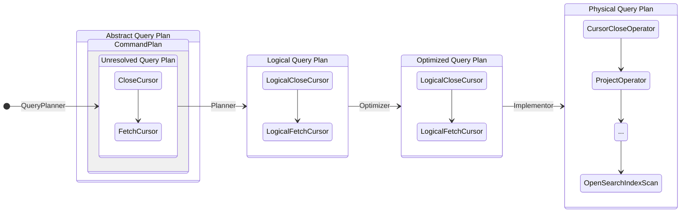

--------------------------------

### Calculate Sample Standard Deviation with STDDEV_SAMP in OpenSearch SQL

Source: https://github.com/opensearch-project/sql/blob/main/docs/user/dql/window.rst

Demonstrates how to use the `STDDEV_SAMP` window function to calculate the sample standard deviation of the `balance` for each `gender` partition. The `OVER` clause defines the window, partitioning by `gender` and ordering by `balance`.

```OpenSearch SQL
os> SELECT
...   gender, balance,
...   STDDEV_SAMP(balance) OVER(
...     PARTITION BY gender ORDER BY balance
... ) AS val
... FROM accounts;
```

--------------------------------

### API: POST /_plugins/_sql - Initial Paged Query

Source: https://github.com/opensearch-project/sql/blob/main/docs/dev/Pagination-v2.md

Documents the REST API endpoint for initiating a paged SQL query. It specifies the request body parameters (`query`, `fetch_size`), the structure of the successful response (including `cursor`, `datarows`, `schema`), and common error conditions.

```APIDOC
POST /_plugins/_sql
  Request Body:
    query: string (DQL statement)
    fetch_size: integer (positive, number of rows per page)
  Response:
    cursor: string (cursor_id for next page, absent on last page)
    datarows: array (current page data)
    schema: array (schema information)
  Errors:
    - fetch_size not positive integer
    - query results in server-side error
    - fetch_size > max_window_size
```

--------------------------------

### OpenSearch SQL Pagination Query Request

Source: https://github.com/opensearch-project/sql/blob/main/docs/user/limitations/limitations.rst

This HTTP request demonstrates how to initiate a basic pagination query using the OpenSearch SQL plugin. The `fetch_size` parameter controls the number of results per page, and the query returns a cursor ID for subsequent requests to fetch more data.

```HTTP Request
POST _plugins/_sql/
{
  "fetch_size" : 5,
  "query" : "SELECT OriginCountry, DestCountry FROM opensearch_dashboards_sample_data_flights ORDER BY OriginCountry ASC"
}
```

--------------------------------

### Apply New Expression System Functions in OpenSearch SQL

Source: https://github.com/opensearch-project/sql/blob/main/docs/presentations/20201116-sql-demo.md

Demonstrates the new expression system by using string manipulation (SUBSTRING) and mathematical functions (ABS, AVG) within a query, showcasing enhanced capabilities for data transformation.

```SQL
SELECT
  SUBSTRING(Carrier, 1, 2) AS sub,
  AVG(ABS(FlightDelayMin * -10))
FROM kibana_sample_data_flights
WHERE OriginWeather = 'Sunny' 
GROUP BY sub
```

--------------------------------

### Describe OpenSearch Index Fields with SQL

Source: https://github.com/opensearch-project/sql/blob/main/docs/user/dql/metadata.rst

This snippet demonstrates how to use the `DESCRIBE TABLES` SQL statement to list all fields and their properties for indices matching a specified pattern in OpenSearch. It provides detailed metadata for each column, including data type, nullability, and ordinal position.

```SQL
os> DESCRIBE TABLES LIKE 'accounts'
fetched rows / total rows = 11/11
+----------------+-------------+------------+----------------+-----------+-----------+-------------+---------------+----------------+----------------+----------+---------+------------+---------------+------------------+-------------------+------------------+-------------+---------------+--------------+-------------+------------------+------------------+--------------------+
| TABLE_CAT      | TABLE_SCHEM | TABLE_NAME | COLUMN_NAME    | DATA_TYPE | TYPE_NAME | COLUMN_SIZE | BUFFER_LENGTH | DECIMAL_DIGITS | NUM_PREC_RADIX | NULLABLE | REMARKS | COLUMN_DEF | SQL_DATA_TYPE | SQL_DATETIME_SUB | CHAR_OCTET_LENGTH | ORDINAL_POSITION | IS_NULLABLE | SCOPE_CATALOG | SCOPE_SCHEMA | SCOPE_TABLE | SOURCE_DATA_TYPE | IS_AUTOINCREMENT | IS_GENERATEDCOLUMN |
|----------------+-------------+------------+----------------+-----------+-----------+-------------+---------------+----------------+----------------+----------+---------+------------+---------------+------------------+-------------------+------------------+-------------+---------------+--------------+-------------+------------------+------------------+--------------------|
| docTestCluster | null        | accounts   | account_number | null      | long      | null        | null          | null           | 10             | 2        | null    | null       | null          | null             | null              | 0                |             | null          | null         | null        | null             | NO               |                    |
| docTestCluster | null        | accounts   | firstname      | null      | text      | null        | null          | null           | 10             | 2        | null    | null       | null          | null             | null              | 1                |             | null          | null         | null        | null             | NO               |                    |
| docTestCluster | null        | accounts   | address        | null      | text      | null        | null          | null           | 10             | 2        | null    | null       | null          | null             | null              | 2                |             | null          | null         | null        | null             | NO               |                    |
| docTestCluster | null        | accounts   | balance        | null      | long      | null        | null          | null           | 10             | 2        | null    | null       | null          | null             | null              | 3                |             | null          | null         | null        | null             | NO               |                    |
| docTestCluster | null        | accounts   | gender         | null      | text      | null        | null          | null           | 10             | 2        | null    | null       | null          | null             | null              | 4                |             | null          | null         | null        | null             | NO               |                    |
| docTestCluster | null        | accounts   | city           | null      | text      | null        | null          | null           | 10             | 2        | null    | null       | null          | null             | null              | 5                |             | null          | null         | null        | null             | NO               |                    |
| docTestCluster | null        | accounts   | employer       | null      | text      | null        | null          | null           | 10             | 2        | null    | null       | null          | null             | null              | 6                |             | null          | null         | null        | null             | NO               |                    |
| docTestCluster | null        | accounts   | state          | null      | text      | null        | null          | null           | 10             | 2        | null    | null       | null          | null             | null              | 7                |             | null          | null         | null        | null             | NO               |                    |
```

--------------------------------

### Example Nested Employee Data Structure in JSON

Source: https://github.com/opensearch-project/sql/blob/main/docs/dev/opensearch-nested-field-subquery.md

This JSON snippet illustrates a complex data model for employees, where each employee can have nested arrays of projects (with their own nested addresses) and comments. It demonstrates how to represent hierarchical data in a single JSON object, suitable for database indexing or API responses.

```json
{
  "employeesNest": [
    {
      "id": 3,
      "name": "Bob Smith",
      "title": null,
      "projects": [
        {
          "name": "AWS Redshift Spectrum querying",
          "started_year": 1990,
          "address": [
            {
              "city": "Seattle",
              "state": "WA"
            },
            {
              "city": "Boston",
              "state": "MA"
            }
          ]
        },
        {
          "name": "AWS Redshift security",
          "started_year": 1999,
          "address": [
            {
              "city": "Chicago",
              "state": "IL"
            }
          ]
        },
        {
          "name": "AWS Aurora security",
          "started_year": 2015
        }
      ],
      "comments": [
        {
          "date": "2018-06-23",
          "message": "I love New york",
          "likes": 56
        },
        {
          "date": "2017-10-25",
          "message": "Today is good weather",
          "likes": 22
        }
      ]
    },
    {
      "id": 4,
      "name": "Susan Smith",
      "title": "Dev Mgr",
      "projects": [],
      "comments": [
        {
          "date": "2018-06-23",
          "message": "comment_2_1",
          "likes": 56
        },
        {
          "date": "2017-10-25",
          "message": "comment_2_2",
          "likes": 22
        }
      ]
    },
    {
      "id": 6,
      "name": "Jane Smith",
      "title": "Software Eng 2",
      "projects": [
        {
          "name": "AWS Redshift security",
          "started_year": 1998
        },
        {
          "name": "AWS Hello security",
          "started_year": 2015,
          "address": [
            {
              "city": "Dallas",
              "state": "TX"
            }
          ]
        }
      ],
      "comments": [
        {
          "date": "2018-06-23",
          "message": "comment_3_1",
          "likes": 24
        },
        {
          "date": "2017-10-25",
          "message": "comment_3_2",
          "likes": 42
        }
      ]
    }
  ]
}
```

--------------------------------

### Calculate Year and Week from Date in OpenSearch SQL

Source: https://github.com/opensearch-project/sql/blob/main/docs/user/ppl/functions/datetime.rst

The `YEARWEEK` function returns the year and week number for a given date as an integer. It supports an optional `mode` argument, similar to the `WEEK` function, to specify the week calculation logic. The example shows usage with and without the mode argument.

```OpenSearch SQL
os> source=people | eval `YEARWEEK('2020-08-26')` = YEARWEEK('2020-08-26') | eval `YEARWEEK('2019-01-05', 1)` = YEARWEEK('2019-01-05', 1) | fields `YEARWEEK('2020-08-26')`, `YEARWEEK('2019-01-05', 1)`
fetched rows / total rows = 1/1
+------------------------+---------------------------+
| YEARWEEK('2020-08-26') | YEARWEEK('2019-01-05', 1) |
|------------------------+---------------------------|
| 202034                 | 201901                    |
+------------------------+---------------------------+
```

--------------------------------

### OpenSearch SQL HIGHLIGHT Function API Reference

Source: https://github.com/opensearch-project/sql/blob/main/docs/user/dql/functions.rst

API documentation for the highlight() function in OpenSearch SQL, which maps to the search engine's highlight function to return highlighted fields for a given search query.

```APIDOC
highlight(field_expression)

Parameters:
  field_expression: string - The field to highlight. Can be specified with or without quotes.
```

--------------------------------

### Calculate Running Minimum with MIN Window Function (SQL)

Source: https://github.com/opensearch-project/sql/blob/main/docs/user/dql/window.rst

Illustrates the use of the MIN aggregate window function to find the running minimum balance within each gender partition, ordered by balance. The minimum value is cumulative within the partition.

```SQL
SELECT
  gender, balance,
  MIN(balance) OVER(
    PARTITION BY gender ORDER BY balance
) AS cnt
FROM accounts;
```

--------------------------------

### Show Specific Indices Information by Prefix in SQL

Source: https://github.com/opensearch-project/sql/blob/main/docs/user/dql/metadata.rst

Illustrates how to search metadata for indices prefixed by 'acc' using the SHOW TABLES statement. This command also supports searching by index alias, providing the same results as querying by index name.

```SQL
os> SHOW TABLES LIKE "acc%"
fetched rows / total rows = 2/2
+----------------+-------------+------------+------------+---------+----------+------------+-----------+---------------------------+----------------+
| TABLE_CAT      | TABLE_SCHEM | TABLE_NAME | TABLE_TYPE | REMARKS | TYPE_CAT | TYPE_SCHEM | TYPE_NAME | SELF_REFERENCING_COL_NAME | REF_GENERATION |
|----------------+-------------+------------+------------+---------+----------+------------+-----------+---------------------------+----------------|
```

--------------------------------

### OpenSearch SQL Plugin Node Statistics Response Fields

Source: https://github.com/opensearch-project/sql/blob/main/docs/user/admin/monitoring.rst

This section details the meaning of each field returned by the `_plugins/_sql/stats` endpoint, providing insights into the plugin's operational metrics at the node level.

```APIDOC
NodeStatsResponse:
  request_total: integer
    Description: Total count of request
  request_count: integer
    Description: Total count of request within the interval
  default_cursor_request_total: integer
    Description: Total count of simple cursor request
  default_cursor_request_count: integer
    Description: Total count of simple cursor request within the interval
  failed_request_count_syserr: integer
    Description: Count of failed request due to system error within the interval
  failed_request_count_cuserr: integer
    Description: Count of failed request due to bad request within the interval
  failed_request_count_cb: integer
    Description: Indicate if plugin is being circuit broken within the interval
```

--------------------------------

### PPL `match` Function Usage with `eval` and `where`

Source: https://github.com/opensearch-project/sql/blob/main/docs/dev/opensearch-relevancy-search.md

Illustrates the use of the `match` function in OpenSearch's Pipe-delimited Language (PPL), showing how it can be applied with the `eval` command to create a new field or with the `where` command for filtering.

```PPL
search source=my_index | eval f=match(message, "this is a test")
search source=my_index | where match(message, "this is a test") | fields message
```

--------------------------------

### SQL JSON_ARRAY_LENGTH Function: Get JSON Array Size

Source: https://github.com/opensearch-project/sql/blob/main/docs/user/ppl/functions/json.rst

The `json_array_length(value)` function parses a string as a JSON array and returns its size. If the input is not a valid JSON array (e.g., a JSON object, scalar, null, or invalid JSON), it returns null. This function is available from version 3.1.0 and requires `plugins.calcite.enabled=true`.

```APIDOC
json_array_length(value)
  Version: 3.1.0
  Limitation: Only works when plugins.calcite.enabled=true
  Usage: parse the string to json array and return size,, null is returned in case of any other valid JSON string, null or an invalid JSON.
  Argument type: value: A JSON STRING
  Return type: INTEGER
```

```SQL
source=json_test | eval array_length = json_array_length("[1,2,3]") | head 1 | fields array_length
```

```SQL
source=json_test | eval array_length = json_array_length("{\"1\": 2}") | head 1 | fields array_length
```

--------------------------------

### Define RCF Model Training for Time-series Data (Fixed In Time)

Source: https://github.com/opensearch-project/sql/blob/main/docs/user/ppl/cmd/ml.rst

Describes the `ml` command for training RCF models on time-series data, including parameters like `number_of_trees`, `shingle_size`, `time_field`, and `category_field`. This syntax is for fixed-in-time RCF.

```APIDOC
ml action='train' algorithm='rcf' (Time-series RCF):
  Parameters:
    number_of_trees (integer, optional): Number of trees in the forest. Default: 30.
    shingle_size (integer, optional): A shingle is a consecutive sequence of the most recent records. Default: 8.
    sample_size (integer, optional): The sample size used by stream samplers in this forest. Default: 256.
    output_after (integer, optional): The number of points required by stream samplers before results are returned. Default: 32.
    time_decay (double, optional): The decay factor used by stream samplers in this forest. Default: 0.0001.
    anomaly_rate (double, optional): The anomaly rate. Default: 0.005.
    time_field (string, mandatory): Specifies the time field for RCF to use as time-series data.
    date_format (string, optional): Used for formatting time_field field. Default: "yyyy-MM-dd HH:mm:ss".
    time_zone (string, optional): Used for setting time zone for time_field field. Default: UTC.
    category_field (string, optional): Specifies the category field used to group inputs. Each category will be independently predicted.
```

--------------------------------

### PPL Query: Basic LOOKUP with APPEND

Source: https://github.com/opensearch-project/sql/blob/main/docs/user/ppl/cmd/lookup.rst

Demonstrates a fundamental PPL `LOOKUP` operation to enrich `worker` data with `department` information from `work_information` by matching `uid` to `id`. This query appends the `department` field to the result.

```PPL
source = worker
| LOOKUP work_information uid AS id APPEND department
| fields id, name, occupation, country, salary, department
```

--------------------------------

### OpenSearch PPL Search Command Syntax

Source: https://github.com/opensearch-project/sql/blob/main/docs/user/ppl/cmd/search.rst

Defines the syntax for the `search` command in OpenSearch PPL. It specifies that `source` is mandatory, followed by the index name (which can be prefixed for cross-cluster search), and an optional boolean expression for filtering. The `search` command must always be the first command in a PPL query.

```APIDOC
Syntax:
search source=[<remote-cluster>:]<index> [boolean-expression]

Parameters:
* search: Optional keyword, can be ignored.
* index: Mandatory. Specifies the index to query from. Can be prefixed by "<cluster name>:" for cross-cluster search.
* bool-expression: Optional. Any expression that evaluates to a boolean value.
```

--------------------------------

### New SQL Functions Supported in Engine V2

Source: https://github.com/opensearch-project/sql/blob/main/docs/dev/intro-v2-engine.md

Lists new date and time functions supported by the SQL Engine V2, enhancing temporal data manipulation capabilities.

```SQL
`ADDDATE`, `DATE_ADD`, `DATE_SUB`, `DAY`, `DAYNAME`, `DAYOFMONTH`, `DAYOFWEEK`, `DAYOFYEAR`, `FROM_DAYS`, `HOUR`, `MICROSECOND`, `MINUTE`, `QUARTER`, `SECOND`, `SUBDATE`, `TIME`, `TIME_TO_SEC`, `TO_DAYS`, `WEEK`
```

--------------------------------

### Query Multiple OpenSearch Indices with SQL

Source: https://github.com/opensearch-project/sql/blob/main/docs/user/ppl/general/identifiers.rst

Demonstrates how to query data from multiple OpenSearch indices by providing a comma-separated list of index names to the `source` command in OpenSearch SQL.

```SQL
source=`accounts,account2` | stats count();
```

--------------------------------

### Update Spark Session Inactivity Timeout

Source: https://github.com/opensearch-project/sql/blob/main/docs/user/admin/settings.rst

This setting determines the duration after which a Spark session is considered stale if there's no activity. The default timeout is 3 minutes (180,000 milliseconds). It is node-scoped and can be updated dynamically. The example shows how to set the timeout to 10 minutes (600,000 milliseconds) using a PUT request to the `_cluster/settings` endpoint.

```sh
sh$ curl -sS -H 'Content-Type: application/json' -X PUT localhost:9200/_cluster/settings \
 -d '{"transient":{"plugins.query.executionengine.spark.session_inactivity_timeout_millis":600000}}'
{
    "acknowledged": true,
    "persistent": {},
    "transient": {
        "plugins": {
            "query": {
                "executionengine": {
                    "spark": {
                        "session_inactivity_timeout_millis": "600000"
                    }
                }
            }
        }
    }
}
```

--------------------------------

### Legacy Engine Fallback Mechanism in OpenSearch SQL

Source: https://github.com/opensearch-project/sql/blob/main/docs/dev/Pagination-v2.md

Describes the fallback mechanism implemented in the OpenSearch SQL engine to ensure continued support for V1 engine features when V2 pagination does not support certain SQL commands. This involves an `UnsupportedCursorRequestException` that triggers processing by the legacy engine.

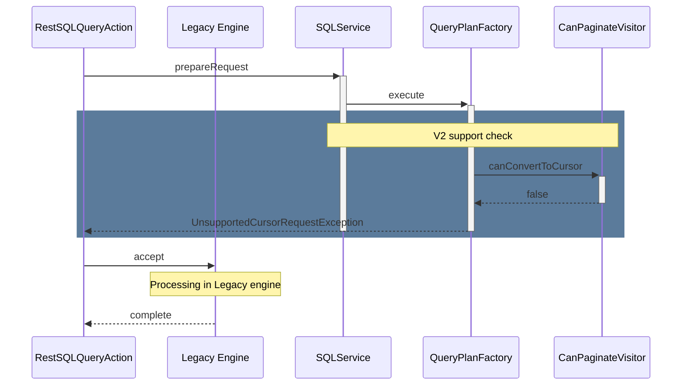

--------------------------------

### Parse Apache Logs with Grok in PPL

Source: https://github.com/opensearch-project/sql/blob/main/docs/user/ppl/cmd/grok.rst

Shows how to apply the `grok` command with a predefined `COMMONAPACHELOG` pattern to parse raw Apache log messages. This extracts relevant fields such as `timestamp`, `response`, and `bytes` from the `message` field, demonstrating `grok`'s utility for log analysis.

```PPL
os> source=apache | grok message '%{COMMONAPACHELOG}' | fields COMMONAPACHELOG, timestamp, response, bytes ;
fetched rows / total rows = 4/4
+-----------------------------------------------------------------------------------------------------------------------------+----------------------------+----------+-------+
| COMMONAPACHELOG                                                                                                             | timestamp                  | response | bytes |
|-----------------------------------------------------------------------------------------------------------------------------+----------------------------+----------+-------|
| 177.95.8.74 - upton5450 [28/Sep/2022:10:15:57 -0700] "HEAD /e-business/mindshare HTTP/1.0" 404 19927                        | 28/Sep/2022:10:15:57 -0700 | 404      | 19927 |
| 127.45.152.6 - pouros8756 [28/Sep/2022:10:15:57 -0700] "GET /architectures/convergence/niches/mindshare HTTP/1.0" 100 28722 | 28/Sep/2022:10:15:57 -0700 | 100      | 28722 |
| 118.223.210.105 - - [28/Sep/2022:10:15:57 -0700] "PATCH /strategize/out-of-the-box HTTP/1.0" 401 27439                      | 28/Sep/2022:10:15:57 -0700 | 401      | 27439 |
| 210.204.15.104 - - [28/Sep/2022:10:15:57 -0700] "POST /users HTTP/1.1" 301 9481                                             | 210.204.15.104 - - [28/Sep/2022:10:15:57 -0700] | 301      | 9481  |
+-----------------------------------------------------------------------------------------------------------------------------+----------------------------+----------+-------+
```

--------------------------------

### Optimized OpenSearch PPL query for relevance functions

Source: https://github.com/opensearch-project/sql/blob/main/docs/user/ppl/functions/relevance.rst

This OpenSearch PPL query illustrates the recommended structure for using relevance functions. By moving the 'where match' clause closer to the 'search' command, the query is optimized for successful translation and efficient execution in OpenSearch DSL, ensuring the relevance functions are pushed down effectively.

```OpenSearch PPL
search source = people | where match(employer, 'Open Search') | rename firstname as name | dedup account_number | fields name, account_number, balance, employer | stats count() by city
```

--------------------------------

### OpenSearch SQL stats with MIN() Aggregation

Source: https://github.com/opensearch-project/sql/blob/main/docs/user/ppl/cmd/stats.rst

Demonstrates using the `MIN()` aggregation function with the `stats` command to find the minimum value of a field. `MIN()` ignores NULL and MISSING values.

```OpenSearch SQL
source=accounts | stats min(age);
```

--------------------------------

### S3Glue Connector Configuration Properties

Source: https://github.com/opensearch-project/sql/blob/main/docs/user/ppl/admin/connectors/s3glue_connector.rst

Details the various properties available for configuring the S3Glue connector, including authentication, OpenSearch index store settings, and Iceberg/Lake Formation integration. These properties define how the connector interacts with AWS Glue, S3, and OpenSearch.

```APIDOC
S3Glue Connector Properties:
  resultIndex: string
    Description: Stores the results of queries executed on the data source. Defaults to .query_execution_result if unavailable.
  glue.auth.type: string [Required]
    Description: Provides the authentication type information required for the execution engine to connect to Glue.
    Supported values: "iam_role"
    Required for "iam_role": glue.auth.role_arn
  glue.auth.role_arn: string
    Description: The IAM role ARN to use for authentication with Glue.
  glue.indexstore.opensearch.*: object [Required]
    Description: Provides the OpenSearch domain host information for the Glue connector. This OpenSearch instance is used for writing index data back.
    glue.indexstore.opensearch.uri: string [Required]
      Description: The URI of the OpenSearch domain.
    glue.indexstore.opensearch.auth: string [Required]
      Description: Authentication method for OpenSearch.
      Accepted values: ["noauth", "basicauth", "awssigv4"]
      Required for "basicauth": glue.indexstore.opensearch.auth.username, glue.indexstore.opensearch.auth.password
      Required for "awssigv4": glue.indexstore.opensearch.auth.region, glue.auth.role_arn
    glue.indexstore.opensearch.region: string [Required for awssigv4 auth]
      Description: The AWS region for AWSSigV4 authentication with OpenSearch.
    glue.indexstore.opensearch.auth.username: string
      Description: Username for basic authentication with OpenSearch.
    glue.indexstore.opensearch.auth.password: string
      Description: Password for basic authentication with OpenSearch.
  glue.iceberg.enabled: boolean
    Description: Determines whether to enable Iceberg for the session.
    Default value: "false"
  glue.lakeformation.enabled: boolean
    Description: Determines whether to enable Lake Formation for queries when Iceberg is also enabled. Has no effect if Iceberg is not enabled.
    Default value: "false"
  glue.lakeformation.session_tag: string
    Description: The session tag to use when assuming the data source role. Required when both Iceberg and Lake Formation are enabled.
```

--------------------------------

### Aggregate Flight Data by Origin and Destination using SQL

Source: https://github.com/opensearch-project/sql/blob/main/integ-test/src/test/resources/correctness/bugfixes/430.txt

These SQL queries demonstrate how to perform aggregation functions (SUM, AVG) and group data by specific columns (Origin, Dest) from the `opensearch_dashboards_sample_data_flights` dataset. This allows for analysis of total ticket prices by origin and average flight times by destination.

```SQL
SELECT Origin, SUM(AvgTicketPrice) FROM opensearch_dashboards_sample_data_flights GROUP BY Origin
```

```SQL
SELECT Dest, AVG(FlightTimeMin) FROM opensearch_dashboards_sample_data_flights GROUP BY Dest
```

--------------------------------

### OpenSearch Join Context Strategy: Reroute to Node with Context

Source: https://github.com/opensearch-project/sql/blob/main/docs/dev/opensearch-pagination.md

This approach for join context management involves rerouting requests within OpenSearch to the specific stateful node holding the context. It is lightweight as only one node maintains the context but introduces an extra hop, potential workload skew, and concurrency control challenges.

```APIDOC
Pros:
- Lightweight: only 1 node maintains the context with small footprint in memory.
Cons:
- One more hop: to pass the result from stateful node to “coordinator” node.
- Workload skew.
- Concurrency control.
```

--------------------------------

### Logical Query Plan: Subsequent Query Request with LogicalFetchCursor

Source: https://github.com/opensearch-project/sql/blob/main/docs/dev/Pagination-v2.md

This diagram depicts the logical query plan for subsequent paging requests. `LogicalFetchCursor` is introduced, connected to `LogicalQueryPlan`, and contains a `cursorId` field to fetch the next set of results based on a previously issued cursor.

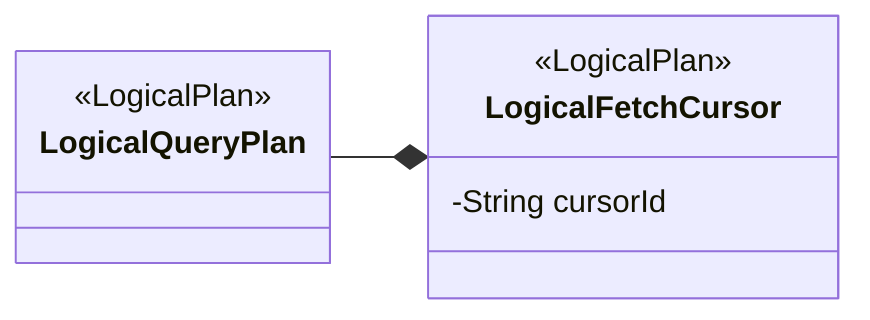

--------------------------------

### APIDOC: SQL ADD Function Specification

Source: https://github.com/opensearch-project/sql/blob/main/docs/user/dql/functions.rst

Formal specification for the SQL ADD function, which performs addition. It details the accepted argument types, return type, and lists synonyms.

```APIDOC
ADD(x, y)
  Description: Calculates x plus y.
  Argument Type: BYTE, SHORT, INTEGER, LONG, FLOAT, DOUBLE
  Return Type: Wider number between x and y
  Synonyms: Addition Symbol (+)
```

--------------------------------

### OpenSearch Join Context Strategy: Context Rebuild

Source: https://github.com/opensearch-project/sql/blob/main/docs/dev/opensearch-pagination.md

This solution focuses on rebuilding the join context on the fly rather than maintaining it. It involves serializing the unfinished physical plan and scroll IDs into a cursor ID, allowing subsequent requests to retrieve the next page by decoding this ID. This approach is stateless and has fixed space complexity but may send more data rows than initially requested.

```APIDOC
Example Join Query:
{
    "query": "SELECT a.name, b.name FROM A as a JOIN B as B on a.name = b.name"
    "fetch_size": 10
}

Pros:
- Stateless implementation.
- Fixed Space Complexity.
- No need to maintain the context.
Cons:
- We will be sending extra datarows to the client than initially requested by the client using fetch_size but this can be handled transparently by the JDBC driver which is our major use case.
```

--------------------------------

### patterns Command Simple Pattern Syntax and Parameters

Source: https://github.com/opensearch-project/sql/blob/main/docs/user/ppl/cmd/patterns.rst

Specifies the syntax for using the `simple_pattern` algorithm. It allows defining a new field name and an optional regex pattern for filtering characters. The `field` parameter is mandatory and must be a text field. `SIMPLE_PATTERN` explicitly selects this method.

```APIDOC
patterns [new_field=<new-field-name>] [pattern=<pattern>] <field>
or
patterns [new_field=<new-field-name>] [pattern=<pattern>] <field> SIMPLE_PATTERN

Parameters:
  new-field-name: optional string. The name of the new field for extracted patterns, default is `patterns_field`. If the name already exists, it will replace the original field.
  pattern: optional string. The regex pattern of characters that should be filtered out from the text field. If absent, the default pattern is alphanumeric characters (`[a-zA-Z\d]`).
  field: mandatory. The field must be a text field.
  SIMPLE_PATTERN: Specify pattern method to be simple_pattern.
```

--------------------------------

### Explain SQL Aggregation Operator Merging into OpenSearch Aggregation

Source: https://github.com/opensearch-project/sql/blob/main/docs/user/optimization/optimization.rst

Illustrates how a SQL GROUP BY clause with an aggregate function (e.g., avg(age)) is optimized by merging into OpenSearch's native aggregation framework.

```shell
sh$ curl -sS -H 'Content-Type: application/json' \
... -X POST localhost:9200/_plugins/_sql/_explain \
... -d '{"query" : "SELECT gender, avg(age) FROM accounts GROUP BY gender"}'
```

```json
{
  "root": {
    "name": "ProjectOperator",
    "description": {
      "fields": "[gender, avg(age)]"
    },
    "children": [
      {
        "name": "OpenSearchIndexScan",
        "description": {

```

--------------------------------

### Group Flights by Origin Country and City

Source: https://github.com/opensearch-project/sql/blob/main/integ-test/src/test/resources/correctness/bugfixes/674.txt

This SQL query retrieves flight data, grouping it by the origin country and city. The results are then ordered in descending order based on the origin city name.

```SQL
SELECT OriginCountry, OriginCityName FROM opensearch_dashboards_sample_data_flights GROUP BY OriginCountry, OriginCityName ORDER BY OriginCityName DESC
```

--------------------------------

### OpenSearch SQL Datasource API Authorization Actions

Source: https://github.com/opensearch-project/sql/blob/main/docs/user/ppl/admin/datasources.rst

This section outlines the specific cluster-level administrative actions required for managing OpenSearch SQL datasources. Each action corresponds to a particular REST API operation (Create, Read, Update, Patch, Delete) and defines the necessary permissions for users.

```APIDOC
cluster:admin/opensearch/datasources/create [Create POST API]
cluster:admin/opensearch/datasources/read   [Get GET API]
cluster:admin/opensearch/datasources/update [Update PUT API]
cluster:admin/opensearch/datasources/patch [Update PATCH API]
cluster:admin/opensearch/datasources/delete [Delete DELETE API]
```

--------------------------------

### Breaking Change: Explain Output and Response Format

Source: https://github.com/opensearch-project/sql/blob/main/docs/dev/intro-v2-engine.md

Details changes in the `EXPLAIN` output format and the default query response structure in SQL Engine V2. Specifically, the `total` field in the response now always matches the `size` field due to internal post-processing.

```APIDOC
Default Response Format Changes:
  - `total` field: Previously indicated total matched documents. Now, this field always matches the `size` field due to post-processing on DSL response in the new query engine.
```

--------------------------------

### Combine CONCAT, UPPER, and SUBSTRING in OpenSearch SQL

Source: https://github.com/opensearch-project/sql/blob/main/integ-test/src/test/resources/correctness/bugfixes/899.txt

This snippet showcases a combination of string functions: `UPPER` to capitalize, `CONCAT` to join strings, and `SUBSTRING` to extract a portion of the resulting string. It demonstrates complex string manipulation in OpenSearch SQL.

```SQL
SELECT SUBSTRING(CONCAT(UPPER('hello'), 'world'), 1, 6) AS `literal` FROM opensearch_dashboards_sample_data_flights HAVING (COUNT(1) > 0)
```

--------------------------------

### OpenSearch SQL Explain: Sort Merge into Aggregation

Source: https://github.com/opensearch-project/sql/blob/main/docs/user/optimization/optimization.rst

Demonstrates how a SQL query with `GROUP BY` and `ORDER BY` on a grouped field is optimized by merging the sort operation directly into OpenSearch's composite aggregation. The `_explain` API output shows the `OpenSearchIndexScan` operator handling the aggregation and sorting.

```sh
sh$ curl -sS -H 'Content-Type: application/json' \
... -X POST localhost:9200/_plugins/_sql/_explain \
... -d '{"query" : "SELECT gender, avg(age) FROM accounts GROUP BY gender ORDER BY gender DESC NULLS LAST"}'
```

```JSON
{
  "root": {
    "name": "ProjectOperator",
    "description": {
      "fields": "[gender, avg(age)]"
    },
    "children": [
      {
        "name": "OpenSearchIndexScan",
        "description": {
          "request": "OpenSearchQueryRequest(indexName=accounts, sourceBuilder={\"from\":0,\"size\":0,\"timeout\":\"1m\",\"aggregations\":{\"composite_buckets\":{\"composite\":{\"size\":1000,\"sources\":[{\"gender\":{\"terms\":{\"field\":\"gender.keyword\",\"missing_bucket\":true,\"missing_order\":\"last\",\"order\":\"desc\"}}}]},\"aggregations\":{\"avg(age)\":{\"avg\":{\"field\":\"age\"}}}}}}, searchDone=false)"
        },
        "children": []
      }
    ]
  }
}
```

--------------------------------

### OpenSearch SQL Close Cursor Execution Flow

Source: https://github.com/opensearch-project/sql/blob/main/docs/dev/Pagination-v2.md

Illustrates the sequence of interactions between different components (SQLService, QueryPlanFactory, QueryService, Analyzer, Planner, DefaultImplementor, PlanSerializer, OpenSearchExecutionEngine) during the execution of a close cursor operation.

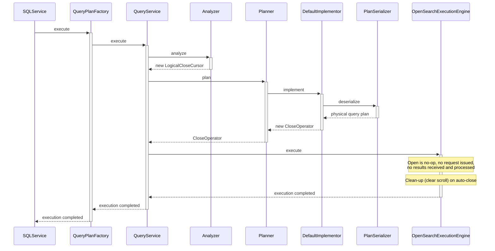

--------------------------------

### OpenSearch PPL Parse Command Syntax

Source: https://github.com/opensearch-project/sql/blob/main/docs/user/ppl/cmd/parse.rst

Defines the syntax for the `parse` command, requiring a text field and a regular expression pattern. New fields extracted will replace existing ones if names conflict.

```APIDOC
parse <field> <pattern>

* field: mandatory. The field must be a text field.
* pattern: mandatory string. The regular expression pattern used to extract new fields from the given text field. If a new field name already exists, it will replace the original field.
```

--------------------------------

### OpenSearch Index Mapping for People Data

Source: https://github.com/opensearch-project/sql/blob/main/docs/user/beyond/partiql.rst

Defines the OpenSearch index mapping for the 'people' test index, demonstrating deep nested object fields ('city'), object fields with array values ('account'), and nested fields ('projects').

```JSON
{
  "mappings": {
    "properties": {
      "city": {
        "properties": {
          "name": {
            "type": "keyword"
          },
          "location": {
            "properties": {
              "latitude": {
                "type": "double"
              }
            }
          }
        }
      },
      "account": {
        "properties": {
          "id": {
            "type": "keyword"
          }
        }
      },
      "projects": {
        "type": "nested",
        "properties": {
          "name": {
            "type": "keyword"
          }
        }
      }
    }
  }
}
```

--------------------------------

### API Reference for OpenSearch SQL query_string Function

Source: https://github.com/opensearch-project/sql/blob/main/docs/user/dql/functions.rst

This section provides the API documentation for the `query_string` function in OpenSearch SQL. It outlines the function signature, its purpose of mapping to the search engine's `query_string` query, and lists all available parameters for advanced search customization, including field boosting and various query options. The `^` symbol allows boosting fields, and fields can be specified with or without quotes.

```APIDOC
query_string([field_expression+], query_expression[, option=<option_value>]*) 
The query_string function maps to the query_string query used in search engine, to return the documents that match a provided text, number, date or boolean value with a given field or fields. 
The ^ lets you boost certain fields. Boosts are multipliers that weigh matches in one field more heavily than matches in other fields. The syntax allows to specify the fields in double quotes, single quotes, backticks or without any wrap. All fields search using star "`*`" is also available (star symbol should be wrapped). The weight is optional and should be specified after the field name, it could be delimeted by the caret character or by whitespace. Please refer to examples below: 
`query_string(["Tags" ^ 2, 'Title' 3.4, `Body`, Comments ^ 0.3], ...)` 
`query_string(["*"], ...)` 
Available parameters include: 
- analyzer 
- escape 
- allow_leading_wildcard 
- analyze_wildcard 
- auto_generate_synonyms_phrase_query 
- boost 
- default_operator 
- enable_position_increments 
- fuzziness 
- fuzzy_max_expansions 
- fuzzy_prefix_length 
- fuzzy_transpositions 
- fuzzy_rewrite 
- tie_breaker 
- lenient 
- type 
- max_determinized_states 
- minimum_should_match 
- quote_analyzer 
- phrase_slop 
- quote_field_suffix 
- rewrite 
- time_zone
```

--------------------------------

### SQL Query: Avg Flight Time and Sum Delay by Origin Weather

Source: https://github.com/opensearch-project/sql/blob/main/integ-test/src/test/resources/correctness/bugfixes/277.txt

This query calculates the average flight time and total flight delay for each origin weather condition, ordering by both aggregated values.

```SQL
SELECT OriginWeather, AVG(FlightTimeMin), SUM(FlightDelayMin) FROM opensearch_dashboards_sample_data_flights GROUP BY OriginWeather ORDER BY AVG(FlightTimeMin), SUM(FlightDelayMin)
```

--------------------------------

### OpenSearch Calcite Configuration Success Response

Source: https://github.com/opensearch-project/sql/blob/main/docs/user/ppl/cmd/subquery.rst

This JSON object represents the expected successful response from OpenSearch after enabling the Calcite engine. It confirms the `plugins.calcite.enabled` setting is acknowledged and persistent.

```JSON
{
  "acknowledged": true,
  "persistent": {
    "plugins": {
      "calcite": {
        "enabled": "true"
      }
    }
  },
  "transient": {}
}
```

--------------------------------

### Using Block Comments in PPL Queries

Source: https://github.com/opensearch-project/sql/blob/main/docs/user/ppl/general/comments.rst

Illustrates the use of block comments in PPL queries. Block comments begin with `/*` and end with `*/`, enabling multi-line comments or commenting out larger sections of a query.

```PPL
os> source=accounts | dedup 2 gender /* dedup the document with gender field keep 2 duplication */ | fields account_number, gender
```

--------------------------------

### Extract Log Patterns using PPL `patterns` command

Source: https://github.com/opensearch-project/sql/blob/main/docs/user/ppl/cmd/patterns.rst

This PPL query uses the `patterns` command with the `BRAIN` algorithm to identify common patterns in the `message` field of Apache logs. The `variable_count_threshold=2` parameter helps define the granularity of pattern extraction. The query outputs the original `message` and the extracted `patterns_field`. Note that the `patterns` command currently processes log patterns only on the coordinator node, not pushed down to data nodes.

```PPL
os> source=apache | patterns variable_count_threshold=2 message BRAIN | fields message, patterns_field ;
```

--------------------------------

### PPL Query for Joining Two Indices

Source: https://github.com/opensearch-project/sql/blob/main/docs/user/ppl/cmd/join.rst

Demonstrates an `inner join` operation between two OpenSearch indices (`state_country` and `occupation`) based on a common field (`name`), followed by aggregation using `stats`.

```Shell
curl -H 'Content-Type: application/json' -X POST localhost:9200/_plugins/_ppl -d '{
  "query" : """
  source = state_country
  | inner join left=a right=b ON a.name = b.name occupation
  | stats avg(salary) by span(age, 10) as age_span, b.country
  """
}'
```

```JSON
{
  "schema": [
    {
      "name": "avg(salary)",
      "type": "double"
    },
    {
      "name": "age_span",
      "type": "integer"
    },
    {
      "name": "b.country",
      "type": "string"
    }
  ],
  "datarows": [
    [
      120000.0,
      40,
      "USA"
    ],
    [
      105000.0,
      20,
      "Canada"
    ],
    [
      0.0,
      40,
      "Canada"
    ],
    [
      70000.0,
      30,
      "USA"
    ],
    [
      100000.0,
      70,
      "England"
    ]
  ],
  "total": 5,
  "size": 5
}
```

--------------------------------

### Selecting Distinct Fields and Expressions in OpenSearch SQL

Source: https://github.com/opensearch-project/sql/blob/main/docs/user/dql/basics.rst

Demonstrates using the DISTINCT keyword to de-duplicate results and retrieve unique field values. It also shows how to apply DISTINCT to expressions, such as substrings.

```JSON
POST /_plugins/_sql\n{\n  \"query\" : \"SELECT DISTINCT age FROM accounts\"\n}
```

```JSON
{\n  \"from\" : 0,\n  \"size\" : 0,\n  \"_source\" : {\n    \"includes\" : [\n      \"age\"\n    ],\n    \"excludes\" : [ ]\n  },\n  \"stored_fields\" : \"age\",\n  \"aggregations\" : {\n    \"age\" : {\n      \"terms\" : {\n        \"field\" : \"age\",\n        \"size\" : 200,\n        \"min_doc_count\" : 1,\n        \"shard_min_doc_count\" : 0,\n        \"show_term_doc_count_error\" : false,\n        \"order\" : [\n          {\n            \"_count\" : \"desc\"\n          },\n          {\n            \"_key\" : \"asc\"\n          }\n        ]\n      }\n    }\n  }\n}
```

```text

```

--------------------------------

### Create OpenSearch SQL Async Query

Source: https://github.com/opensearch-project/sql/blob/main/docs/user/interfaces/asyncqueryinterface.rst

Initiates an asynchronous SQL query. The 'sessionId' parameter can be reused to associate multiple queries with the same session.

```curl
curl --location 'http://localhost:9200/_plugins/_async_query' \
--header 'Content-Type: application/json' \
--data '{
    "datasource" : "my_glue",
    "lang" : "sql",
    "query" : "select * from my_glue.default.http_logs limit 10",
    "sessionId" : "1Giy65ZnzNlmsPAm"
}'
```

--------------------------------

### Calculate Running Sum with SUM Window Function (SQL)

Source: https://github.com/opensearch-project/sql/blob/main/docs/user/dql/window.rst

Demonstrates the application of the SUM aggregate window function to calculate the running sum of balances within each gender partition, ordered by balance. The sum is cumulative within the partition.

```SQL
SELECT
  gender, balance,
  SUM(balance) OVER(
    PARTITION BY gender ORDER BY balance
) AS cnt
FROM accounts;
```

--------------------------------

### Querying all Prometheus metrics

Source: https://github.com/opensearch-project/sql/blob/main/docs/user/ppl/admin/connectors/prometheus_connector.rst

This query retrieves all available data from the `prometheus_http_requests_total` metric, showing raw values, timestamps, and various dimensions like handler, code, instance, and job.

```PPL
source = my_prometheus.prometheus_http_requests_total
```

--------------------------------

### PPL fillnull: Replace Nulls in All Fields (Calcite Enabled)

Source: https://github.com/opensearch-project/sql/blob/main/docs/user/ppl/cmd/fillnull.rst

Illustrates the `fillnull` command's behavior when `plugins.calcite.enabled` is true (from version 3.1.0). In this scenario, if no specific fields are provided, the replacement value ('<not found>') is applied to all fields in the search result that contain nulls.

```PPL
PPL> source=accounts | fields email, employer | fillnull with '<not found>';
```

--------------------------------

### PPL Query: LOOKUP with Field Replacement (REPLACE AS) and Result

Source: https://github.com/opensearch-project/sql/blob/main/docs/user/ppl/cmd/lookup.rst

Demonstrates the PPL `LOOKUP` command's `REPLACE` clause to rename and replace an existing field (`occupation`) with a new one (`new_col`) based on data from `work_information`. This snippet includes the cURL command and the resulting JSON output, highlighting the `new_col` created by the `REPLACE` clause.

```cURL
curl -H 'Content-Type: application/json' -X POST localhost:9200/_plugins/_ppl -d '{
  "query" : """
  source = worker
  | LOOKUP work_information name REPLACE occupation AS new_col
  | fields id, name, occupation, country, salary, new_col
  """
}'
```

```JSON
{
      "schema": [
        {
          "name": "id",
          "type": "integer"
        },
        {
          "name": "name",
          "type": "string"
        },
        {
          "name": "occupation",
          "type": "string"
        },
        {
          "name": "country",
          "type": "string"
        },
        {
          "name": "salary",
          "type": "integer"
        },
        {
          "name": "new_col",
          "type": "string"
        }
      ],
      "datarows": [
        [
          1003,
          "David",
          "Doctor",
          null,
          120000,
          "Doctor"
        ],
        [
          1004,
          "David",
          null,
          "Canada",
          0,
          "Doctor"
        ],
        [
          1001,
          "Hello",
          "Artist",
          "USA",
          70000,
          null
        ],
        [
          1000,
          "Jake",
          "Engineer",
          "England",
          100000,
          "Engineer"
        ],
        [
          1005,
          "Jane",
          "Scientist",
          "Canada",
          90000,
          "Engineer"
        ],
        [
          1002,
          "John",
          "Doctor",
          "Canada",
          120000,
          "Scientist"
        ]
      ],
      "total": 6,
      "size": 6
    }
```

--------------------------------

### Configure plugins.calcite.pushdown.enabled for Calcite Pushdown Optimization

Source: https://github.com/opensearch-project/sql/blob/main/docs/user/admin/settings.rst

Introduced in 3.0.0-beta, this setting determines whether operator pushdown optimization is enabled for the v3 engine when Calcite is active. It is a node-scoped setting and can be updated dynamically.

```APIDOC
Setting: plugins.calcite.pushdown.enabled
Description: Enable operator pushdown optimization for v3 engine when Calcite is enabled.
Default Value (3.0.0-beta): true
Scope: Node
Dynamic Update: Yes
```

--------------------------------

### Calculate Running Maximum with MAX Window Function (SQL)

Source: https://github.com/opensearch-project/sql/blob/main/docs/user/dql/window.rst

Shows how to apply the MAX aggregate window function to determine the running maximum balance within each gender partition, ordered by balance. The maximum value is cumulative within the partition.

```SQL
SELECT
  gender, balance,
  MAX(balance) OVER(
    PARTITION BY gender ORDER BY balance
) AS cnt
FROM accounts;
```

--------------------------------

### OpenSearch PPL: Find Top N Most Common Field Values

Source: https://github.com/opensearch-project/sql/blob/main/docs/user/ppl/cmd/top.rst

Illustrates how to use the `top` command with a specified number (N) to return only the single most common gender from accounts.

```OpenSearch PPL
os> source=accounts | top 1 gender;
```

--------------------------------

### Group Data by Multiple Fields using SQL GROUP BY in OpenSearch

Source: https://github.com/opensearch-project/sql/blob/main/integ-test/src/test/resources/correctness/queries/groupby.txt

Demonstrates how to group aggregated results by multiple fields (e.g., 'OriginCountry', 'OriginCityName') using the 'GROUP BY' clause in OpenSearch SQL. This allows for more granular aggregation across combinations of field values.

```SQL
SELECT COUNT(*), AVG(FlightDelayMin), SUM(FlightDelayMin) FROM opensearch_dashboards_sample_data_flights GROUP BY OriginCountry, OriginCityName
```

```SQL
SELECT OriginCountry, COUNT(*), AVG(FlightDelayMin), SUM(FlightDelayMin) FROM opensearch_dashboards_sample_data_flights GROUP BY OriginCountry, OriginCityName
```

```SQL
SELECT OriginCountry, OriginCityName, COUNT(*) FROM opensearch_dashboards_sample_data_flights GROUP BY OriginCountry, OriginCityName
```

```SQL
SELECT OriginCountry, OriginCityName, AVG(FlightDelayMin) FROM opensearch_dashboards_sample_data_flights GROUP BY OriginCountry, OriginCityName
```

```SQL
SELECT OriginCountry, OriginCityName, SUM(FlightDelayMin) FROM opensearch_dashboards_sample_data_flights GROUP BY OriginCountry, OriginCityName
```

--------------------------------

### Calculate Running Count with COUNT Window Function (SQL)

Source: https://github.com/opensearch-project/sql/blob/main/docs/user/dql/window.rst

Demonstrates how to use the COUNT aggregate window function to calculate a running count of balances partitioned by gender and ordered by balance. The count resets for each gender group.

```SQL
SELECT
  gender, balance,
  COUNT(balance) OVER(
    PARTITION BY gender ORDER BY balance
) AS cnt
FROM accounts;
```

--------------------------------

### OpenSearch Join Context Strategy: Connect to Same Node

Source: https://github.com/opensearch-project/sql/blob/main/docs/dev/opensearch-pagination.md

This strategy for managing join context involves consistently connecting to the same data node from the client side. It simplifies query plan execution but introduces dependencies on load balancer configurations (e.g., session sticky, keep-alive HTTP) and can lead to workload skew.

```APIDOC
Pros:
- Easy: to implement and understand because query plan execution is identical as before.
Cons:
- Dependency: on configuration of load balancer.
- Workload skew: because of no load balance any more.
```

--------------------------------

### Select Top-Level Object and Array Fields in OpenSearch SQL

Source: https://github.com/opensearch-project/sql/blob/main/docs/user/beyond/partiql.rst

Demonstrates selecting top-level object fields (e.g., 'city'), object fields with array values (e.g., 'accounts'), and nested fields (e.g., 'projects'). The query returns the original JSON object or array for each selected field.

```OpenSearch SQL
SELECT city, accounts, projects FROM people;
```

--------------------------------

### Resolving SQL Plugin Syntax Errors by Quoting Identifiers

Source: https://github.com/opensearch-project/sql/blob/main/docs/user/dql/troubleshooting.rst

Provides a workaround for `SyntaxCheckException` when identifiers (like index names) contain special characters. It demonstrates how to properly quote such identifiers using backticks in an SQL query.

```JSON
POST /_plugins/_sql
{
  "query" : "SELECT * FROM `sample:data`"
}
```

--------------------------------

### Dynamically Update OpenSearch SQL Pagination API Setting

Source: https://github.com/opensearch-project/sql/blob/main/docs/dev/opensearch-pagination.md

This `curl` command demonstrates how to dynamically update the `plugins.sql.pagination.api` setting on an OpenSearch cluster. It uses a PUT request to the `_cluster/settings` endpoint, specifying the new value for the `plugins.sql.pagination.api` setting within the `transient` block, which allows for immediate, non-persistent changes.

```shell
>> curl -H 'Content-Type: application/json' -X PUT localhost:9200/_cluster/settings -d '{
  "transient" : {
    "plugins.sql.pagination.api" : "true"
  }
}'
```

--------------------------------

### SQL LOCALTIMESTAMP Function

Source: https://github.com/opensearch-project/sql/blob/main/docs/user/dql/functions.rst

A synonym for the `NOW()` function, returning the current local date and time.

```SQL
> SELECT LOCALTIMESTAMP();
fetched rows / total rows = 1/1
+---------------------+
| LOCALTIMESTAMP()    |
|---------------------|
| 2022-08-02 15:54:19 |
+---------------------+
```

--------------------------------

### Query Data in RAW Format with OpenSearch SQL

Source: https://github.com/opensearch-project/sql/blob/main/docs/user/interfaces/protocol.rst

Shows how to retrieve query results in a raw format, where fields are delimited by a pipe ('|') character. This format is suitable for piping to other command-line tools.

```curl
>> curl -H 'Content-Type: application/json' -X POST localhost:9200/_plugins/_sql?format=raw -d '{
  "query" : "SELECT firstname, lastname, age FROM accounts ORDER BY age"
}'

Result set::

    firstname|lastname|age
    Nanette|Bates|28
    Amber|Duke|32
    Dale|Adams|33
    Hattie|Bond|36
```

--------------------------------

### API Reference for OpenSearch SQL query Function

Source: https://github.com/opensearch-project/sql/blob/main/docs/user/dql/functions.rst

This section provides the API documentation for the `query` function in OpenSearch SQL. It outlines the function signature, its purpose as an alternative to `query_string` using Lucene query string syntax, and lists all available parameters for advanced search customization.

```APIDOC
query("query_expression" [, option=<option_value>]*) 
The query function is an alternative syntax to the query_string_ function. It maps to the query_string query used in search engine, to return the documents that match a provided text, number, date or boolean value with a given query expression. 
`query_expression` must be a string provided in Lucene query string syntax. Please refer to examples below: 
`query('Tags:taste OR Body:taste', ...)` 
`query("Tags:taste AND Body:taste", ...)` 
Available parameters include: 
- analyzer 
- escape 
- allow_leading_wildcard 
- analyze_wildcard 
- auto_generate_synonyms_phrase_query 
- boost 
- default_operator 
- enable_position_increments 
- fuzziness 
- fuzzy_max_expansions 
- fuzzy_prefix_length 
- fuzzy_transpositions 
- fuzzy_rewrite 
- tie_breaker 
- lenient 
- type 
- max_determinized_states 
- minimum_should_match 
- quote_analyzer 
- phrase_slop 
- quote_field_suffix 
- rewrite 
- time_zone
```

--------------------------------

### SQL Query: Count Flights by Delay and Order by Count

Source: https://github.com/opensearch-project/sql/blob/main/integ-test/src/test/resources/correctness/bugfixes/277.txt

This query counts the number of flights for each flight delay status and orders the results by the count of flights in ascending order.

```SQL
SELECT COUNT(FlightNum) FROM opensearch_dashboards_sample_data_flights GROUP BY FlightDelay ORDER BY COUNT(FlightNum)
```

--------------------------------

### Tabular Result Set from Query Execution

Source: https://github.com/opensearch-project/sql/blob/main/docs/user/beyond/partiql.rst

This snippet displays a simple tabular result set, which is the output of executing a query (like the OpenSearch DSL query provided) against a data source. It shows a list of 'employeeName' values, formatted as a console-style table.

```Text
Result set:

+------------+
|employeeName|
+============+
|   Bob Smith|
+------------+
|  Jane Smith|
+------------+
```

--------------------------------

### Developer's Certificate of Origin (DCO) 1.1 Text

Source: https://github.com/opensearch-project/sql/blob/main/CONTRIBUTING.md

The complete text of the Developer's Certificate of Origin version 1.1, which contributors implicitly agree to by adding a 'Signed-off-by' line to their commits. This declaration ensures that contributions are properly licensed and attributed.

```Plain Text
Developer's Certificate of Origin 1.1

By making a contribution to this project, I certify that:

(a) The contribution was created in whole or in part by me and I
    have the right to submit it under the open source license
    indicated in the file; or

(b) The contribution is based upon previous work that, to the
    best of my knowledge, is covered under an appropriate open
    source license and I have the right under that license to
    submit that work with modifications, whether created in whole
    or in part by me, under the same open source license (unless
    I am permitted to submit under a different license), as
    Indicated in the file; or

(c) The contribution was provided directly to me by some other
    person who certified (a), (b) or (c) and I have not modified
    it.

(d) I understand and agree that this project and the contribution
    are public and that a record of the contribution (including
    all personal information I submit with it, including my
    sign-off) is maintained indefinitely and may be redistributed
    consistent with this project or the open source license(s)
    involved.
```

--------------------------------

### Changes in gauges: Per-second derivative

Source: https://github.com/opensearch-project/sql/blob/main/docs/dev/datasource-prometheus.md

Per-second derivative using linear regression:

```PromQL
deriv(demo_disk_usage_bytes[1h])
```

```PPL
source = promcatalog.`demo_disk_usage_bytes` | eval x = deriv(@value, 1h)
```

--------------------------------

### OpenSearch, PPL, and SQL Data Type Mapping

Source: https://github.com/opensearch-project/sql/blob/main/docs/user/ppl/general/datatypes.rst

Provides a comprehensive mapping between OpenSearch, PPL, and SQL data types, illustrating how different data representations correspond across these systems for interoperability and query translation.

```APIDOC
Mapping:
  OpenSearch Type | PPL Type    | SQL Type
  ----------------|-------------|-----------
  boolean         | boolean     | BOOLEAN
  byte            | tinyint     | TINYINT
  short           | smallint    | SMALLINT
  integer         | int         | INTEGER
  long            | bigint      | BIGINT
  float           | float       | REAL
  half_float      | float       | FLOAT
  scaled_float    | float       | DOUBLE
  double          | double      | DOUBLE
  keyword         | string      | VARCHAR
  text            | string      | VARCHAR
  match_only_text | string      | VARCHAR
  date            | timestamp   | TIMESTAMP
  ip              | ip          | VARCHAR
  binary          | binary      | VARBINARY
  object          | struct      | STRUCT
  nested          | array       | STRUCT
```

--------------------------------

### Perform Full-Text Search and Nested Field Queries in OpenSearch SQL

Source: https://github.com/opensearch-project/sql/blob/main/docs/presentations/20201116-sql-demo.md

Illustrates how to use OpenSearch-specific functions like MATCH_QUERY for full-text search on a field and how to query nested fields within documents using dot notation to access properties of nested objects.

```SQL
SELECT customer_full_name
FROM kibana_sample_data_ecommerce
WHERE MATCH_QUERY(customer_full_name, 'King')

SELECT * FROM employees LIMIT 10

SELECT p.name, p.started_year
FROM employees e,
    e.projects p
WHERE p.name LIKE '%Redshift%'
```

--------------------------------

### SQL Query: Avg Flight Time (Aliased) and Sum Delay by Origin Weather

Source: https://github.com/opensearch-project/sql/blob/main/integ-test/src/test/resources/correctness/bugfixes/277.txt

This query calculates average flight time (aliased as 'a') and total flight delay for each origin weather, ordering by the aliased average time and the sum.

```SQL
SELECT OriginWeather, AVG(FlightTimeMin) AS a, SUM(FlightDelayMin) FROM opensearch_dashboards_sample_data_flights GROUP BY OriginWeather ORDER BY a, SUM(FlightDelayMin)
```

--------------------------------

### Java Interface: Table for Data Operations and Plan Implementation

Source: https://github.com/opensearch-project/sql/blob/main/docs/dev/datasource-prometheus.md

Defines the `Table` interface, representing a data table within a storage engine. It provides methods to retrieve field types, implement logical query plans into physical plans, and optionally optimize logical plans before execution.

```Java
public interface Table {

  /**
   * Get the {@link ExprType} for each field in the table.
   */
  Map<String, ExprType> getFieldTypes();

  /**
   * Implement a {@link LogicalPlan} by {@link PhysicalPlan} in storage engine.
   *
   * @param plan logical plan
   * @return physical plan
   */
  PhysicalPlan implement(LogicalPlan plan);

  /**
   * Optimize the {@link LogicalPlan} by storage engine rule.
   * The default optimize solution is no optimization.
   *
   * @param plan logical plan.
   * @return logical plan.
   */
  default LogicalPlan optimize(LogicalPlan plan) {
    return plan;
  }

}
```

--------------------------------

### Modify Datasource (PUT API)

Source: https://github.com/opensearch-project/sql/blob/main/docs/user/ppl/admin/datasources.rst

This API call illustrates how to modify an existing datasource configuration using a PUT request to the `_plugins/_query/_datasources` endpoint. The request body should contain the complete updated datasource definition, similar to creation. It requires Basic authentication for secure domains.

```APIDOC
PUT https://localhost:9200/_plugins/_query/_datasources
content-type: application/json
Authorization: Basic {{username}} {{password}}

{
    "name" : "my_prometheus",
    "connector": "prometheus",
    "properties" : {
        "prometheus.uri" : "http://localhost:8080",
        "prometheus.auth.type" : "basicauth",
        "prometheus.auth.username" : "admin",
        "prometheus.auth.password" : "admin"
    },
    "allowedRoles" : ["prometheus_access"]
}
```

--------------------------------

### PPL Field Command Syntax

Source: https://github.com/opensearch-project/sql/blob/main/docs/user/ppl/cmd/fields.rst

Defines the syntax for the 'field' command in OpenSearch PPL, detailing the optional operator for inclusion/exclusion and the mandatory field list.

```APIDOC
field [+|-] <field-list>

Parameters:
* [+|-]: Optional operator. If '+' is used (default), only the fields specified in the field list will be kept. If '-' is used, all the fields specified in the field list will be removed.
* <field-list>: Mandatory. A comma-delimited list of fields to keep or remove.
```

--------------------------------

### OpenSearch SQL: ADDTIME Function Reference

Source: https://github.com/opensearch-project/sql/blob/main/docs/user/dql/functions.rst

Provides the API documentation for the `ADDTIME` function in OpenSearch SQL, detailing its usage, accepted argument types (DATE, TIMESTAMP, TIME), and the resulting return types based on input combinations. It also notes its antonym, `SUBTIME`.

```APIDOC
Usage: addtime(expr1, expr2) adds expr2 to expr1 and returns the result. If argument is TIME, today's date is used; if argument is DATE, time at midnight is used.

Argument type: DATE/TIMESTAMP/TIME, DATE/TIMESTAMP/TIME

Return type map:

(DATE/TIMESTAMP, DATE/TIMESTAMP/TIME) -> TIMESTAMP

(TIME, DATE/TIMESTAMP/TIME) -> TIME

Antonyms: `SUBTIME`_
```

--------------------------------

### OpenSearch GROUP BY Aggregation for Pagination

Source: https://github.com/opensearch-project/sql/blob/main/docs/dev/opensearch-pagination.md

This section explains how to handle pagination for GROUP BY queries in OpenSearch, contrasting the limitations of 'terms' aggregation with the capabilities of 'composite' aggregation. It highlights 'composite' aggregation as the preferred method for efficiently streaming all buckets from multi-level aggregations.

```APIDOC
OpenSearch GROUP BY Aggregation for Pagination:

Terms Aggregation:
  Purpose: Meant to return the top terms.
  Limitation: Does not allow pagination. To retrieve all terms or combinations, 'size' must be greater than the cardinality of the field, which is inefficient.

Composite Aggregation:
  Purpose: Allows pagination over all possible terms, including multi-level aggregations.
  Advantage: Efficiently streams all buckets of a specific aggregation, similar to how 'scroll' works for documents.
  Usage: Provides an 'after_key' in the response to paginate subsequent requests.
```

--------------------------------

### Mermaid Sequence Diagram for Nested SELECT Query Push Down

Source: https://github.com/opensearch-project/sql/blob/main/docs/dev/sql-nested-function-select-clause.md

This Mermaid sequence diagram details the query execution flow for nested SELECT clause queries, from initial parsing by `SQLService` to OpenSearch DSL push down. It highlights the interactions between components like `ParserBaseRoot`, `AstExpressionBuilder`, `Analyzer`, `Planner`, and `OpenSearchRequestBuilder`, showing how `LogicalNested` is retained in the plan tree.

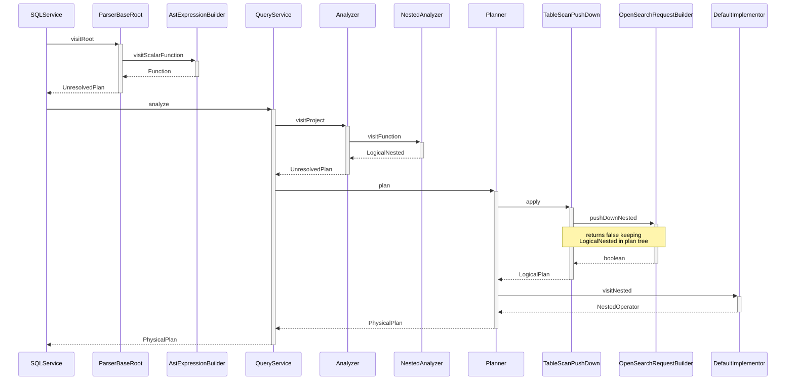

--------------------------------

### OpenSearch SQL Async Query Creation Response

Source: https://github.com/opensearch-project/sql/blob/main/docs/user/interfaces/asyncqueryinterface.rst

Sample response received after successfully submitting an asynchronous SQL query, containing the unique 'queryId' and the 'sessionId'.

```json
{
  "queryId": "7GC4mHhftiTejvxN",
  "sessionId": "1Giy65ZnzNlmsPAm"
}
```

--------------------------------

### Java: Handling Custom Query Parameters in OpenSearch SQL

Source: https://github.com/opensearch-project/sql/blob/main/docs/dev/opensearch-relevancy-search.md

This Java snippet illustrates how custom query parameters, such as 'analyzer', are recognized and applied within the OpenSearch SQL query engine. It defines a BiFunction for parameter actions and demonstrates their application to a MatchQueryBuilder, treating parameter values as string expressions resolved at the optimizer layer.

```Java
// define the analyzer action
private final BiFunction<MatchQueryBuilder, ExprValue, MatchQueryBuilder> analyzer =
    (b, v) -> b.analyzer(v.stringValue());

...

ImmutableMap<Object, Object> argAction = ImmutableMap.builder()
    .put("analyzer", analyzer)
    .put(...)
    .build();

...

// build match query
while (iterator.hasNext()) {
  NamedArgumentExpression arg = (NamedArgumentExpression) iterator.next();
  if (!argAction.containsKey(arg.getArgName())) {
    throw new SemanticCheckException(String
        .format("Parameter %s is invalid for match function.", arg.getArgName()));
  }
  ((BiFunction<MatchQueryBuilder, ExprValue, MatchQueryBuilder>) argAction
      .get(arg.getArgName()))
      .apply(queryBuilder, arg.getValue().valueOf(null));
}
```

--------------------------------

### KMEANS Algorithm API Reference in OpenSearch PPL

Source: https://github.com/opensearch-project/sql/blob/main/docs/user/ppl/cmd/ml.rst

This section provides the API syntax and optional parameters for the KMEANS clustering algorithm in OpenSearch PPL. It details the 'centroids', 'iterations', and 'distance_type' parameters, along with their default values and accepted types for configuring the clustering process.

```APIDOC
ml action='train' algorithm='kmeans' <centroids> <iterations> <distance_type>

* centroids: optional. The number of clusters you want to group your data points into. The default value is 2.
* iterations: optional. Number of iterations. The default value is 10.
* distance_type: optional. The distance type can be COSINE, L1, or EUCLIDEAN, The default type is EUCLIDEAN.
```

--------------------------------

### Retrieve OpenSearch SQL Plugin Node Statistics

Source: https://github.com/opensearch-project/sql/blob/main/docs/user/admin/monitoring.rst

This snippet demonstrates how to query the OpenSearch SQL plugin's stats endpoint to retrieve node-level metrics. The endpoint provides details such as total requests, requests within the interval, cursor requests, and counts of failed requests due to system errors, bad requests, or circuit breakers.

```sh
curl -H 'Content-Type: application/json' -X GET localhost:9200/_plugins/_sql/stats
```

```json
{
  "failed_request_count_cb" : 0,
  "default_cursor_request_count" : 10,
  "default_cursor_request_total" : 3,
  "failed_request_count_cuserr" : 0,
  "circuit_breaker" : 0,
  "request_total" : 70,
  "request_count" : 0,
  "failed_request_count_syserr" : 0
}
```

--------------------------------

### Fetch Prometheus Exemplars using OpenSearch SQL `query_exemplars`

Source: https://github.com/opensearch-project/sql/blob/main/docs/user/ppl/admin/connectors/prometheus_connector.rst

The `query_exemplars` table function retrieves exemplars for a given Prometheus query within a specified time range. It supports both positional and named arguments, consistent with the Prometheus query exemplars API. The function returns a JSON structure containing series labels and their associated exemplars.

```SQL
source=my_prometheus.query_exemplars('prometheus_http_requests_total', 1686694425, 1686700130)
```

```SQL
source=my_prometheus.query_exemplars(query='prometheus_http_requests_total', starttime=1686694425, endtime=1686700130)
```

```JSON
      "schema": [
        {
          "name": "seriesLabels",
          "type": "struct"
        },
        {
          "name": "exemplars",
          "type": "array"
        }
      ],
      "datarows": [
        [
          {
            "instance": "localhost:8090",
            "__name__": "test_exemplar_metric_total",
            "service": "bar",
            "job": "prometheus"
          },
          [
            {
              "labels": {
                "traceID": "EpTxMJ40fUus7aGY"
              },
              "timestamp": "2020-09-14 15:22:25.479",
              "value": 6.0
            }
          ]
        ],
        [
          {
            "instance": "localhost:8090",
            "__name__": "test_exemplar_metric_total",
            "service": "foo",
            "job": "prometheus"
          },
          [
            {
              "labels": {
                "traceID": "Olp9XHlq763ccsfa"
              },
              "timestamp": "2020-09-14 15:22:35.479",
              "value": 19.0
            },
            {
              "labels": {
                "traceID": "hCtjygkIHwAN9vs4"
              },
              "timestamp": "2020-09-14 15:22:45.489",
              "value": 20.0
            }
          ]
        ]
      ]
```

--------------------------------

### Setting Search Mode via OpenSearch SQL Endpoint

Source: https://github.com/opensearch-project/sql/blob/main/docs/dev/opensearch-relevancy-search.md

Demonstrates how to specify the `dfs_query_then_fetch` search mode for a specific SQL query by sending a POST request to the OpenSearch SQL plugin endpoint. This allows overriding the default search behavior for a query.

```HTTP
POST _plugins/_sql?type=dfs_query_then_fetch
{
  "query": "SELECT message FROM my_index WHERE match(message, 'this is a test')"
}
```

--------------------------------

### Query Prometheus Metric as a Table using PPL

Source: https://github.com/opensearch-project/sql/blob/main/docs/user/ppl/admin/connectors/prometheus_connector.rst

Demonstrates how to query a Prometheus metric, `prometheus_http_requests_total`, using PPL. The Prometheus connector abstracts each metric as a table, allowing PPL queries similar to OpenSearch indices. Columns include `@value`, `@timestamp`, and metric labels.

```PPL
> source = my_prometheus.prometheus_http_requests_total;

+--------+-----------------------+--------------+------+------------+------------+
| @value | @timestamp            | handler      | code | instance   | job        |
|--------+-----------------------+--------------+------+------------+------------|
| 5      | "2022-11-03 07:18:14" | "/-/ready"   | 200  | 192.15.1.1 | prometheus |
| 3      | "2022-11-03 07:18:24" | "/-/ready"   | 200  | 192.15.1.1 | prometheus |
| 7      | "2022-11-03 07:18:34" | "/-/ready"   | 200  | 192.15.1.1 | prometheus |
| 2      | "2022-11-03 07:18:44" | "/-/ready"   | 400  | 192.15.2.1 | prometheus |
| 9      | "2022-11-03 07:18:54" | "/-/promql"  | 400  | 192.15.2.1 | prometheus |
| 11     | "2022-11-03 07:18:64" | "/-/metrics" | 500  | 192.15.2.1 | prometheus |
+--------+-----------------------+--------------+------+------------+------------+
```

--------------------------------

### SQL Query: Average Flight Time by Origin Weather

Source: https://github.com/opensearch-project/sql/blob/main/integ-test/src/test/resources/correctness/bugfixes/277.txt

This query calculates the average flight time for each origin weather condition and orders the results by the average flight time.

```SQL
SELECT OriginWeather, AVG(FlightTimeMin) FROM opensearch_dashboards_sample_data_flights GROUP BY OriginWeather ORDER BY AVG(FlightTimeMin)
```

--------------------------------

### SQL LIKE Operator

Source: https://github.com/opensearch-project/sql/blob/main/docs/user/dql/expressions.rst

Demonstrates the `LIKE` operator for string pattern matching, including the use of `%` for wildcard and `_` for single character match. It also shows `NOT LIKE` and highlights case-insensitivity.

```SQL
SELECT 'axyzb' LIKE 'a%b', 'acb' LIKE 'A_B', 'axyzb' NOT LIKE 'a%b', 'acb' NOT LIKE 'a_b';
```

--------------------------------

### Grok Command Syntax

Source: https://github.com/opensearch-project/sql/blob/main/docs/user/ppl/cmd/grok.rst

Defines the syntax for the `grok` command, including mandatory parameters: `field` (a text field to parse) and `pattern` (the grok pattern to apply). If a new field name extracted by the pattern already exists, it will replace the original field.

```APIDOC
grok <field> <pattern>

* field: mandatory. The field must be a text field.
* pattern: mandatory string. The grok pattern used to extract new fields from the given text field. If a new field name already exists, it will replace the original field.
```

--------------------------------

### Send SQL Query via HTTP POST to OpenSearch SQL Plugin

Source: https://github.com/opensearch-project/sql/blob/main/docs/user/interfaces/endpoint.rst

This section demonstrates how to submit an SQL query to the OpenSearch SQL plugin using an HTTP POST request. This method is preferred as it bypasses URL length limitations and supports additional parameters, such as those for prepared statements.

```sh
curl -H 'Content-Type: application/json' -X POST localhost:9200/_plugins/_sql -d '{
  "query" : "SELECT * FROM accounts"
}'
```

--------------------------------

### OpenSearch Mapping Definition for Flight Data

Source: https://github.com/opensearch-project/sql/blob/main/docs/dev/testing-comparison-test.md

This JSON snippet defines the mapping for the `_doc` type within OpenSearch, specifying the properties and their data types (e.g., `AvgTicketPrice` as float, `Cancelled` as boolean, `Carrier` as keyword, `dayOfWeek` as integer) for the sample flight data used in testing.

```json
{
  "_doc": {
    "properties": {
      "AvgTicketPrice": {
        "type": "float"
      },
      "Cancelled": {
        "type": "boolean"
      },
      "Carrier": {
        "type": "keyword"
      },
      ...
      ...
      "dayOfWeek": {
        "type": "integer"
      }
    }
  }
}
```

--------------------------------

### Aggregating over time: Average over 5-minute period

Source: https://github.com/opensearch-project/sql/blob/main/docs/dev/datasource-prometheus.md

Average within each series over a 5-minute period:

```PromQL
avg_over_time(go_goroutines[5m])
```

```PPL
source = promcatalog.`go_goroutines` | eval k = `avg_over_time`(@value, 5m)
```

--------------------------------

### SQL Query: Avg Flight Time and Sum Delay with Alias by Origin Weather

Source: https://github.com/opensearch-project/sql/blob/main/integ-test/src/test/resources/correctness/bugfixes/277.txt

This query calculates average flight time and total flight delay (aliased as 's') for each origin weather, ordering by average time and the aliased sum.

```SQL
SELECT OriginWeather, AVG(FlightTimeMin), SUM(FlightDelayMin) AS s FROM opensearch_dashboards_sample_data_flights GROUP BY OriginWeather ORDER BY AVG(FlightTimeMin), s
```

--------------------------------

### Mermaid State Diagram for Nested Query Execution Plan Trees

Source: https://github.com/opensearch-project/sql/blob/main/docs/dev/sql-nested-function-select-clause.md

This Mermaid state diagram visualizes the composite states involved in the SQL plugin's push-down execution for nested queries. It illustrates the transformation from a Logical Plan Tree through an Optimized Logical Plan Tree to a Physical Plan Tree, showing how the `LogicalNested` operator persists for post-processing flattening.

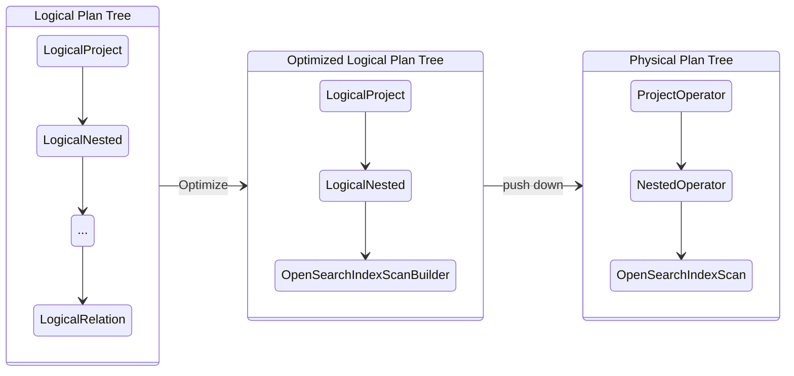

--------------------------------

### OpenSearch SQL Data Type Mappings

Source: https://github.com/opensearch-project/sql/blob/main/docs/user/general/datatypes.rst

Provides a comprehensive mapping between OpenSearch native types, OpenSearch SQL types, and their corresponding standard SQL types. Includes notes on specific type behaviors and conversions.

```APIDOC
OpenSearch Type | OpenSearch SQL Type | SQL Type
----------------|---------------------|-----------
boolean         | boolean             | BOOLEAN
byte            | byte                | TINYINT
short           | byte                | SMALLINT
integer         | integer             | INTEGER
long            | long                | BIGINT
float           | float               | REAL
half_float      | float               | FLOAT
scaled_float    | float               | DOUBLE
double          | double              | DOUBLE
keyword         | keyword             | VARCHAR
text            | text                | VARCHAR
date*           | timestamp           | TIMESTAMP
date_nanos      | timestamp           | TIMESTAMP
ip              | ip                  | VARCHAR
binary          | binary              | VARBINARY
object          | struct              | STRUCT
nested          | array               | STRUCT

Notes:
* Not all the OpenSearch SQL Type has correspond OpenSearch Type. e.g. data and time. To use function which required such data type, user should explicitly convert the data type.
* date*: Maps to `timestamp` by default. Based on the "format" property `date` can map to `date` or `time`. See list of supported named formats `here <https://opensearch.org/docs/latest/field-types/supported-field-types/date/>`_.
For example, `basic_date` will map to a `date` type, and `basic_time` will map to a `time` type.
```

--------------------------------

### Configure plugins.calcite.enabled setting for Calcite Engine

Source: https://github.com/opensearch-project/sql/blob/main/docs/user/admin/settings.rst

This setting, available from 3.0.0-beta, allows enabling Calcite as the new query optimizer and execution engine for all incoming requests in OpenSearch SQL/PPL. It is a node-scoped setting and can be updated dynamically.

```APIDOC
Setting: plugins.calcite.enabled
Description: Enable Calcite as new query optimizer and execution engine.
Default Value (3.0.0-beta): false
Scope: Node
Dynamic Update: Yes
```

--------------------------------

### OpenSearch SQL simple_query_string Function API Reference

Source: https://github.com/opensearch-project/sql/blob/main/docs/user/ppl/functions/relevance.rst

Documents the `simple_query_string` function, which maps to the `simple_query_string` query in search engines. It explains how to use field expressions, query expressions, and optional parameters to return documents matching specific values in given fields, including field boosting.

```APIDOC
Function Signature:
  simple_query_string([field_expression+], query_expression[, option=<option_value>]*) 

Field Boosting Syntax Examples:
  simple_query_string(["Tags" ^ 2, 'Title' 3.4, `Body`, Comments ^ 0.3], ...)
  simple_query_string(["*"], ...)

Available Parameters:
  - analyze_wildcard
  - analyzer
  - auto_generate_synonyms_phrase
  - flags
  - fuzziness
  - fuzzy_max_expansions
  - fuzzy_prefix_length
  - fuzzy_transpositions
  - lenient
  - default_operator
  - minimum_should_match
  - quote_field_suffix
  - boost
```

--------------------------------

### SQL Query: Count Flights and Order by Column Position

Source: https://github.com/opensearch-project/sql/blob/main/integ-test/src/test/resources/correctness/bugfixes/277.txt

This query counts flights by delay and orders the results by the first selected column (the count of flights) using its positional index.

```SQL
SELECT COUNT(FlightNum) FROM opensearch_dashboards_sample_data_flights GROUP BY FlightDelay ORDER BY 1
```

--------------------------------

### PPL Date and Time Data Types Overview

Source: https://github.com/opensearch-project/sql/blob/main/docs/user/ppl/general/datatypes.rst

Introduces the temporal data types supported by PPL, including DATE, TIME, TIMESTAMP, and INTERVAL, and notes their relationship with OpenSearch's date type and usage in datetime functions.

```APIDOC
The date and time data types are the types that represent temporal values and PPL plugin supports types including DATE, TIME, TIMESTAMP and INTERVAL. By default, the OpenSearch DSL uses date type as the only date and time related type, which has contained all information about an absolute time point. To integrate with PPL language, each of the types other than timestamp is holding part of temporal or timezone information, and the usage to explicitly clarify the date and time types is reflected in the datetime functions (see `Functions <functions.rst>`_ for details), where some functions might have restrictions in the input argument type.
```

--------------------------------

### Quantiles from histograms: 90th percentile by path and method

Source: https://github.com/opensearch-project/sql/blob/main/docs/dev/datasource-prometheus.md

90th percentile request latency over last 5 minutes, for only the `path` and `method` dimensions.

```PromQL
histogram_quantile(0.9,sum by(le, path, method) (rate(demo_api_request_duration_seconds_bucket[5m])))
```

```PPL
source = promcatalog.`demo_api_request_duration_seconds_bucket` | eval x= `rate`(@value, 5m) | stats `sum(x)` by (le,path,method)
```

--------------------------------

### OpenSearch Index Mapping for Employees Nested Data

Source: https://github.com/opensearch-project/sql/blob/main/docs/user/beyond/partiql.rst

Defines the OpenSearch index mapping for the 'employees_nested' test index, highlighting the 'projects' field as a nested type.

```JSON
{
  "mappings": {
    "properties": {
      "id": {
        "type": "long"
      },
      "name": {
        "type": "text",
        "fields": {
          "keyword": {
            "type": "keyword",
            "ignore_above": 256
          }
        }
      },
      "projects": {
        "type": "nested",
        "properties": {
          "name": {
            "type": "text",
            "fields": {
              "keyword": {
                "type": "keyword"
              }
            },
            "fielddata": true
          },
          "started_year": {
            "type": "long"
          }
        }
      },
      "title": {
        "type": "text",
        "fields": {
          "keyword": {
            "type": "keyword",
            "ignore_above": 256
          }
        }
      }
    }
  }
}
```

--------------------------------

### Apply Aliases and Positional Grouping in OpenSearch SQL

Source: https://github.com/opensearch-project/sql/blob/main/integ-test/src/test/resources/correctness/queries/groupby.txt

Explains how to use column aliases in 'SELECT' statements and refer to them in 'GROUP BY' clauses, including positional grouping (e.g., 'GROUP BY 1, 2') and table aliases for clarity in complex queries.

```SQL
SELECT OriginCountry, OriginCityName, AVG(FlightDelayMin) FROM opensearch_dashboards_sample_data_flights GROUP BY 1, 2
```

```SQL
SELECT OriginCountry, OriginCityName, AVG(FlightDelayMin) FROM opensearch_dashboards_sample_data_flights GROUP BY OriginCountry, 2
```

```SQL
SELECT OriginCountry, OriginCityName, AVG(FlightDelayMin) FROM opensearch_dashboards_sample_data_flights GROUP BY 1, OriginCityName
```

```SQL
SELECT ABS(FlightDelayMin) FROM opensearch_dashboards_sample_data_flights GROUP BY 1
```

```SQL
SELECT OriginCountry AS country, AVG(FlightDelayMin) FROM opensearch_dashboards_sample_data_flights GROUP BY country
```

```SQL
SELECT OriginCountry AS country, OriginCityName, AVG(FlightDelayMin) FROM opensearch_dashboards_sample_data_flights GROUP BY country, 2
```

```SQL
SELECT OriginCountry AS country, OriginCityName AS city, AVG(FlightDelayMin) FROM opensearch_dashboards_sample_data_flights GROUP BY country, city
```

```SQL
SELECT ABS(FlightDelayMin) AS delay FROM opensearch_dashboards_sample_data_flights GROUP BY delay
```

```SQL
SELECT flights.OriginCountry, AVG(FlightDelayMin) FROM opensearch_dashboards_sample_data_flights AS flights GROUP BY flights.OriginCountry
```

```SQL
SELECT flights.OriginCountry, flights.OriginCityName, SUM(FlightDelayMin) FROM opensearch_dashboards_sample_data_flights AS flights GROUP BY flights.OriginCountry, flights.OriginCityName
```

```SQL
SELECT flights.OriginCountry, flights.OriginCityName, SUM(FlightDelayMin) FROM opensearch_dashboards_sample_data_flights AS flights GROUP BY 1, 2
```

--------------------------------

### Disabling Strict Query Analysis in OpenSearch SQL Plugin

Source: https://github.com/opensearch-project/sql/blob/main/docs/user/dql/troubleshooting.rst

Describes a workaround for persistent syntax exceptions by disabling strict query analysis in the OpenSearch SQL plugin. It includes `curl` commands to update cluster settings and then verify if a query passes.

```shell
#Disable query analysis
curl -H 'Content-Type: application/json' -X PUT localhost:9200/_cluster/settings -d '{
  "persistent" : {
    "opensearch.sql.query.analysis.enabled" : false
  }
}'
```

```shell
#Verify if the query can pass the verification now
curl -H 'Content-Type: application/json' -X POST localhost:9200/_plugins/_sql -d '{
  "query" : "SELECT * FROM ..."
}'
```

--------------------------------

### Understanding JSON Path Syntax in OpenSearch SQL

Source: https://github.com/opensearch-project/sql/blob/main/docs/user/ppl/functions/json.rst

Explains the syntax for JSON paths used in OpenSearch SQL functions. Paths follow a key-index format, where `{<index>}` specifies an array element and `{}` acts as a wildcard for all elements. This syntax is crucial for functions like `json_extract`.

```SQL
a{2}.b{0}
```

--------------------------------

### Querying an Existing Materialized View in OpenSearch PPL

Source: https://github.com/opensearch-project/sql/blob/main/docs/dev/datasource-query-s3.md

Demonstrates how to query an existing materialized view named `failEventsMetrics` using OpenSearch's PPL, filtering data for the last 7 days. The view's status can be `INIT`, `IN_PROGRESS`, or `READY`.

```PPL
source=failEventsMetrics time in last 7 days
```

--------------------------------

### SQL Query for Flight Data Aggregation in OpenSearch

Source: https://github.com/opensearch-project/sql/blob/main/integ-test/src/test/resources/correctness/bugfixes/765.txt

This SQL query retrieves flight data from the `opensearch_dashboards_sample_data_flights` index. It counts the number of flights per carrier, aliases the carrier name as 'c' and the count as 'count', groups the results by carrier, and orders them alphabetically by carrier.

```SQL
SELECT Carrier AS c, COUNT(*) AS count FROM opensearch_dashboards_sample_data_flights GROUP BY Carrier ORDER BY Carrier
```

--------------------------------

### OpenSearch SQL: Order by Nulls Last with NULLS LAST Clause

Source: https://github.com/opensearch-project/sql/blob/main/docs/user/dql/basics.rst

Illustrates the use of `NULLS LAST` in the `ORDER BY` clause to explicitly place null values at the end of the sorted result set, adhering to SQL standard behavior.

```SQL
SELECT employer FROM accounts ORDER BY employer ASC NULLS LAST;
```

--------------------------------

### Execute Simple Query String in OpenSearch SQL

Source: https://github.com/opensearch-project/sql/blob/main/docs/user/dql/functions.rst

This SQL query demonstrates the basic usage of the `simple_query_string` function to search for a phrase within a specified field. It retrieves `id`, `title`, and `author` from the `books` table where the `title` field contains 'Pooh House'.

```SQL
os> select id, title, author from books where simple_query_string(['title'], 'Pooh House');
```

--------------------------------

### Calculate Population Variance with VAR_POP in OpenSearch SQL

Source: https://github.com/opensearch-project/sql/blob/main/docs/user/dql/window.rst

Illustrates the usage of the `VAR_POP` window function to compute the population variance of the `balance` within each `gender` partition. The `OVER` clause specifies the window definition.

```OpenSearch SQL
os> SELECT
...   gender, balance,
...   VAR_POP(balance) OVER(
...     PARTITION BY gender ORDER BY balance
... ) AS val
... FROM accounts;
```

--------------------------------

### PPL Query to Fetch Specific Table Metadata from Prometheus

Source: https://github.com/opensearch-project/sql/blob/main/docs/user/ppl/cmd/information_schema.rst

Demonstrates how to fetch metadata for a specific table, prometheus_http_requests_total, from a Prometheus datasource. It uses a WHERE clause to filter results based on the TABLE_NAME.

```PPL
os> source = my_prometheus.information_schema.tables | where TABLE_NAME='prometheus_http_requests_total'
```